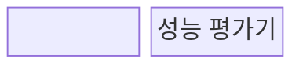
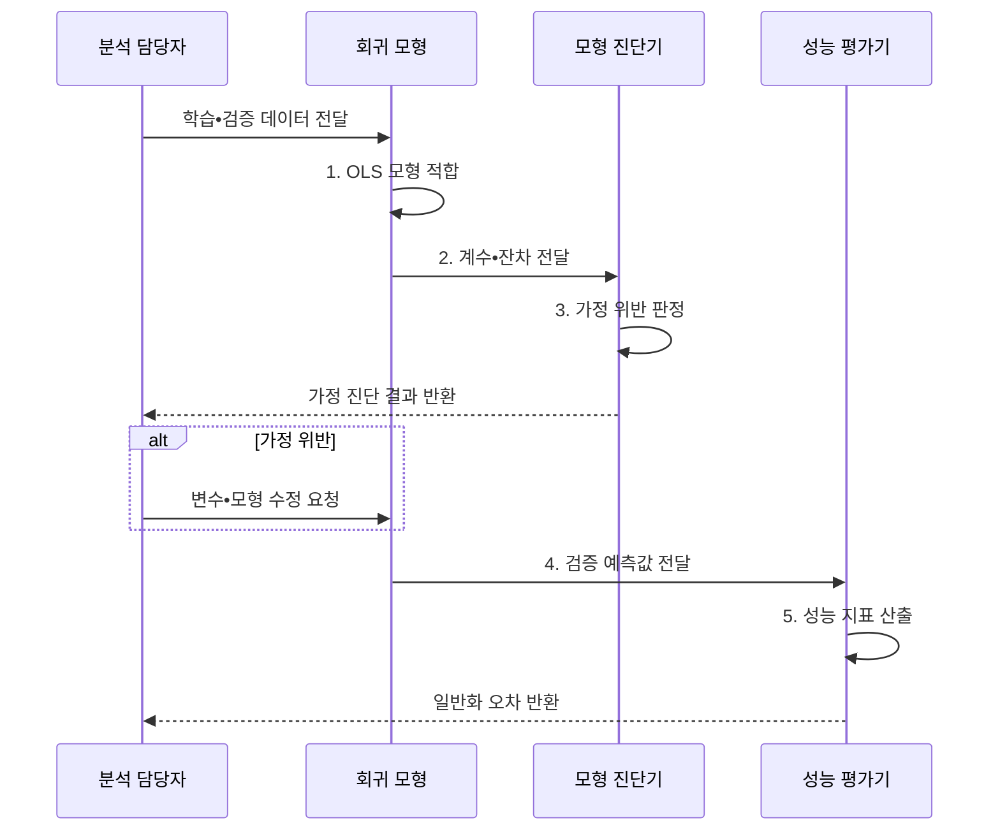

---
sidebar:
  order: 34
  label: "034. 회귀 분석 (Regression Analysis)"
  badge:
    text: "기출 • 30%"
    variant: note
title: "회귀 분석 (Regression Analysis)"
date: "2026-08-02T10:02:00+09:00"
tags:
  - "notes-basic-theory"
weight: 34
extra:
  question_no: "034"
  source_status: "기출"
  source_history: "120회"
  priority: 30
  priority_note: "기출 간격은 길지만 잔차 진단은 실무적"
---

## Ⅰ. 개요

핵심 용어

- **회귀 분석**: 입력과 연속형 결과의 조건부 관계를 모형화해 영향력을 추정하고 값을 예측하는 기법
- **독립•종속 변수**: 결과를 설명하는 입력과 예측하려는 결과 변수

- 정의/개념: 입력과 결과의 **조건부 관계**를 추정하는 분석 기법
- 배경/필요성: 관측값 나열만으로는 미관측 값•**변수별 영향력** 산출 불가

### 쉽게 이해하기 (학습용)

- 집 넓이•연식으로 가격표를 맞추듯, 회귀는 연속값을 예측하고 각 입력 계수로 변화량을 설명한다.

## Ⅱ. 특징

핵심 용어

- **잔차**: 관측값에서 회귀 모형의 예측값을 뺀 차이
- **등분산성**: 입력이나 예측 구간이 달라도 잔차가 흩어진 폭이 일정한 성질
- **조건부 평균**: 특정 입력값이 주어졌을 때 결과 변수의 평균
- **인과관계**: 한 변수의 변화가 다른 변수의 변화를 실제로 일으키는 관계

- 독립•종속 변수 간 **조건부 관계**의 함수 모형화
- **잔차 분석** 기반 선형성•독립성•**등분산성** 검증
- 관측된 **조건부 평균** 추정만으로 인과관계 미보장

### 쉽게 이해하기 (학습용)

- 예측선 주변의 점이 한쪽으로 휘거나 부채꼴로 벌어지면 선형성•등분산성 가정이 깨진 것이며, 선이 맞아도 원인 관계까지 증명한 것은 아니다.

## Ⅲ. 구조 및 구성요소

핵심 용어

- **회귀 계수**: 다른 입력이 같을 때 입력 한 단위 변화에 따른 예측값의 변화 방향과 크기
- **VIF**: 입력 변수 간 연관성이 회귀 계수 분산을 키운 정도를 나타내는 지표
- **RMSE•MAE**: 큰 오차에 민감한 제곱 기반 지표와 이상치 영향이 작은 절댓값 기반 지표

| 구성요소 | 책임 |
|:---|:---|
| 회귀 모형 | **회귀식•계수** 추정과 예측값 산출 |
| 모형 진단기 | 잔차•**VIF**로 가정 위반 판정 |
| 성능 평가기 | 검증 자료의 **RMSE•MAE** 산출 |

### 쉽게 이해하기 (학습용)

- 회귀 모형이 계수와 예측값을 만들고, 진단기와 평가기가 잔차 가정과 새 데이터 오차를 각각 확인한다.

## Ⅳ. 흐름도

핵심 용어

- **OLS**: 잔차 제곱합이 가장 작아지는 회귀 계수를 추정하는 최소제곱법
- **일반화 오차**: 학습에 사용하지 않은 새 데이터에서 발생하는 예측 오차
- **모형 진단**: 잔차와 공선성 지표로 회귀 가정 위반 여부를 확인하는 과정

### 동작 원리

- **1. OLS 모형 적합**: 최소제곱 계수와 오차 산출
- **2. 계수•잔차 전달**: 모형 진단 입력 제공
- **3. 가정 위반 판정**: 잔차•VIF 조건 판정
- **4. 검증 예측값 전달**: 미사용 입력의 예측값 제공
- **5. 성능 지표 산출**: RMSE•MAE로 일반화 성능 판단

### 쉽게 이해하기 (학습용)

- 모형이 학습선과 계수를 만들면 진단기는 잔차 무늬와 VIF를 보고, 평가기는 보지 않은 데이터의 RMSE•MAE로 새 입력 성능을 확인한다.

## Ⅴ. 종류 및 비교

핵심 용어

- **회귀 분석**: 예측식과 계수로 특정 입력의 결과와 변수별 조건부 관계를 추정하는 분석
- **상관 분석**: 두 변수의 공동 변화 방향과 강도를 측정하지만 예측식이나 인과 방향은 주지 않는 분석
- **다중공선성**: 입력 변수끼리 강하게 연관돼 개별 회귀 계수 추정이 불안정한 상태
- **외삽**: 학습 입력 범위 밖에서도 같은 관계가 이어진다고 가정해 값을 예측하는 일

| 변수 간 관계 분석 | 회귀 분석 | 상관 분석 |
|:---|:---|:---|
| 적용 기준 | 특정 입력의 **예측값**이 필요할 때 | **연관 방향**•강도만 확인할 때 |
| 핵심 특징 | **회귀식** 계수로 변수별 영향력 산출 | 두 변수의 **공동 변화** 정도 측정 |
| 한계 | **다중공선성**•외삽 시 오차 급증 | **인과관계•예측식** 미제공 |

> 요약: 예측값이 필요하면 **회귀 분석**, 연관 확인이면 **상관 분석**

### 쉽게 이해하기 (학습용)

- 집값 예측식과 넓이 한 단위의 조건부 변화를 알고 싶으면 회귀, 넓이와 가격이 함께 움직이는 정도만 알고 싶으면 상관 분석을 쓴다.

## Ⅵ. 실무 고려사항 및 대책

핵심 용어

- **이분산성**: 입력 구간에 따라 잔차 분산이 달라지는 상태
- **강건 표준오차**: 이분산성이 있어도 계수 불확실성을 타당하게 추정하도록 보정한 표준오차
- **릿지 회귀**: 계수 제곱합에 벌점을 부여해 다중공선성에 따른 계수 변동을 줄이는 회귀
- **입력 분포 변화**: 운영 입력의 범위와 빈도가 학습 데이터와 달라지는 현상

| 문제 | 대책 | 효과 |
|:---|:---|:---|
| 비선형•**이분산 잔차** 패턴 | 변수 변환•비선형항•강건 표준오차 적용 | **가정 위반 영향** 완화 |
| **다중공선성**으로 계수 불안정 | VIF 점검•변수 축소•릿지 회귀 적용 | **계수 분산** 감소 |
| 학습 범위 밖 **외삽** | 입력 범위 감시•예측 거부 정책 | 근거 없는 **예측 방지** |
| 운영 **입력 분포 변화** | 잔차•오차 감시와 재학습 | **일반화 성능** 유지 |
| 오토스케일링의 **CPU 사용률** 예측 | 요청량별 예측구간으로 증설 임계값 설정 | 임계 도달 전 **용량 확보** |

### 쉽게 이해하기 (학습용)

- 평균 오차가 작아도 잔차가 부채꼴이거나 운영 입력이 학습 범위 밖이면 예측을 멈추고, 예측구간 상단으로 서버 증설 시점을 잡는다.

## Ⅶ. 결론

핵심 용어

- **검증 오차**: 학습에 쓰지 않은 데이터로 측정한 예측 오차
- **입력 범위**: 회귀 모형이 관계를 학습해 예측 근거를 갖는 독립 변수의 관측 구간

- 잔차 가정•검증 오차를 통과한 **입력 범위**에서만 예측

### 쉽게 이해하기 (학습용)

- 검증 오차와 잔차 무늬가 안정된 입력 범위에서만 회귀값을 쓰고, 운영 분포가 범위를 벗어나면 재학습 전까지 예측을 거부한다.
