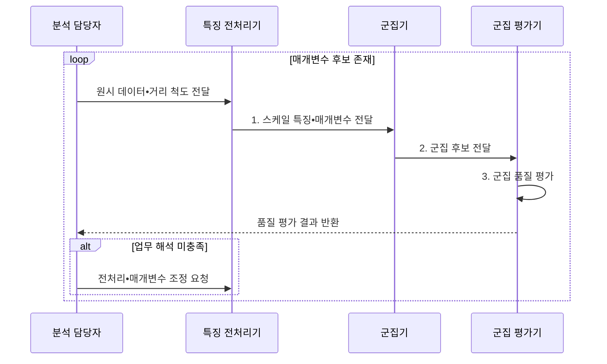

---
sidebar:
  order: 35
  label: "035. 클러스터링: K-Means•DBSCAN (Clustering)"
  badge:
    text: "미출 • 50%"
    variant: note
title: "클러스터링: K-Means•DBSCAN (Clustering)"
date: "2026-07-31T09:39:49+09:00"
tags:
  - "notes-basic-theory"
weight: 35
extra:
  question_no: "035"
  source_status: "미출"
  source_history: ""
  priority: 50
  priority_note: "군집 형태•밀도에 따른 알고리즘 선택 기준"
---

## 미리 알고가기

- **클러스터링(Clustering)**: 정답 없이 거리•밀도•연결성이 비슷한 표본을 묶어 집단 구조를 찾는 비지도 학습
- **비지도 학습(Unsupervised Learning)**: 정답 레이블 없이 데이터 자체의 구조•분포•유사성을 찾는 학습 방식
- **레이블(Label)**: 지도 학습에서 각 표본에 붙이는 정답 범주 또는 목표값
- **K-평균(K-Means)**: 가까운 중심에 표본을 배정하고 군집 평균으로 중심을 갱신해 군집 내 분산을 줄이는 알고리즘
- **잡음 포함 밀도 기반 군집화(Density-Based Spatial Clustering of Applications with Noise, DBSCAN)**: 고밀도 이웃을 연결해 임의 형태의 군집과 저밀도 잡음을 구분하는 알고리즘
- **반경($\varepsilon$)**: $\varepsilon$은 ‘엡실론’으로 읽고 작은 양의 허용 오차•반경에 관례적으로 쓰는 그리스 문자이며, DBSCAN에서 두 점을 이웃으로 인정할 최대 거리를 가리킨다.
- **최소 점 개수(Minimum Number of Points, MinPts)**: 핵심점 판정에 필요한 $\varepsilon$ 반경 안의 최소 표본 수
- **핵심점(Core Point)**: $\varepsilon$ 이웃이 MinPts 이상이어서 군집을 확장할 수 있는 점
- **경계점(Border Point)**: 핵심점 이웃에 속하지만 자체 밀도는 낮아 군집을 확장하지 못하는 점
- **잡음점(Noise Point)**: 어느 핵심점 이웃에도 속하지 않아 군집에서 제외되는 점
- **밀도 도달•연결(Density-Reachable•Connected)**: 핵심점의 이웃 사슬로 도달하거나 같은 사슬에 연결되는 관계
- **거리 척도•특징 스케일링(Distance Metric•Feature Scaling)**: 점의 차이를 재는 규칙과 특징별 값 범위를 맞추는 처리
- **실루엣 계수(Silhouette Coefficient)**: 군집 내 응집도와 가장 가까운 다른 군집과의 분리도를 $-1$부터 $1$ 사이로 나타내며, 값이 클수록 군집 품질이 높다.
- **군집 기호 $n$•$k$•$x_i$•$c_i$•$\mu_j$**: 데이터 수•군집 수•각 점•소속 군집•각 군집 중심
- **거리 기호 $p$•$q$•$d(p,q)$**: 기준점•후보점•두 점 사이 거리
- **매개변수 범위 $1\le k\le n$•$\varepsilon>0$**: 군집 수와 양수 이웃 반경의 유효 범위
- **지역 최솟값(Local Minimum)**: 주변 해보다 목적값이 작지만 전체 최솟값은 아닐 수 있는 해
- **특징 공간(Feature Space)**: 데이터의 각 특징을 좌표축으로 표현한 공간으로, 군집화는 이 공간에서 표본 간 거리나 밀도를 기준으로 그룹을 구분한다.
- **비볼록 군집(Non-convex Cluster)**: 군집 내부의 두 점을 잇는 선분 일부가 군집 밖을 지나는 형태로, 중심 거리 기반 K-Means로는 정확히 구분하기 어렵다.
- **표준화(Standardization)**: 특징별 평균을 빼고 표준편차로 나눠 거리 계산의 단위 영향을 줄이는 변환
- **K-Means++**: 서로 먼 점을 초기 중심으로 뽑을 가능성을 높여 지역 최솟값 위험을 줄이는 초기화
- **엘보 방법(Elbow Method)**: 군집 수 증가에 따른 내부 오차 감소가 둔화되는 지점을 찾는 방법
- **k-distance 도표**: 각 점의 k번째 최근접 거리를 정렬해 DBSCAN 반경 후보를 찾는 도표
- **계층적 밀도 군집화(HDBSCAN)**: 여러 밀도의 연결 구조를 계층화해 밀도가 다른 군집을 찾는 방법

## Ⅰ. 개요

- 정의/개념: 레이블 없이 거리•**밀도**로 집단 구조를 찾는 비지도 학습
- 배경/필요성: 레이블 부재로 지도학습의 **집단 경계 산출 불가**

### 쉽게 이해하기 (학습용)
- 이름표 없는 점 지도에서 가까이 모이거나 촘촘히 이어진 점을 같은 색으로 묶어, 데이터가 스스로 만드는 집단 구조를 찾는다.

## Ⅱ. 특징

- 거리•**밀도 연결성** 기반 **비지도** 집단 형성
- **거리 척도**•특징 **스케일링**에 따라 달라지는 군집 경계
- 정답 레이블 부재로 **실루엣 계수**•업무 해석 검증 의존

### 쉽게 이해하기 (학습용)
- 키는 cm, 몸무게는 kg인 좌표를 그대로 재면 숫자 폭이 큰 특징이 자를 독점하므로, 단위와 거리 척도를 맞춘 뒤 군집 경계를 그린다.

## Ⅲ. 구조 및 구성요소

| 구성요소 | 책임 |
|:---|:---|
| 특징 전처리기 | **스케일링•거리 척도** 적용 |
| K-Means 군집기 | 중심까지 **제곱거리 합** 최소화 |
| DBSCAN 군집기 | **ε•MinPts**로 밀도•잡음 판정 |
| 군집 평가기 | **실루엣 계수•업무 해석** 평가 |

### 쉽게 이해하기 (학습용)

- 전처리기가 거리 단위를 맞추고, 선택한 군집기가 점을 묶으면 평가기가 분리도와 업무 활용성을 확인한다.

## Ⅳ. 흐름도

### 동작 원리

- **1. 스케일 특징•매개변수 전달**: 거리 비교가 가능한 입력 생성
- **2. 군집 후보 전달**: 표본을 군집•잡음으로 배정
- **3. 군집 품질 평가**: 응집도•분리도 판정

### 쉽게 이해하기 (학습용)
- K-Means는 가까운 깃발로 점을 모으고, DBSCAN은 이웃이 빽빽한 점에서 군집을 넓힌다.

## Ⅴ. 종류 및 비교

| 군집화 알고리즘 | K-Means | DBSCAN |
|:---|:---|:---|
| 적용 기준 | **군집 수** 사전 지정•유사 크기 구형 | 군집 수 미상의 **임의 형상**•유사 밀도 |
| 핵심 특징 | 최근접 **중심 할당**•평균 갱신 반복 | **밀도 연결** 확장과 **잡음점** 분리 |
| 한계 | **비볼록 군집** 분리 실패•초기 중심 의존 | **ε** 단일값이라 밀도 차 군집에 취약 |

> 요약: **군집 형태**와 밀도 균질성을 기준으로 알고리즘 선택

### 쉽게 이해하기 (학습용)
- 둥근 점 덩어리 수를 미리 알면 중심 깃발을 세우는 K-Means, 구불구불한 덩어리와 외딴 점을 가르면 밀도 사슬을 잇는 DBSCAN이 맞다.

## Ⅵ. 실무 고려사항 및 대책

| 고려사항 | 대책 | 효과 |
|:---|:---|:---|
| 단위 차이의 **거리 지배** | 표준화•업무 목적별 거리 척도 적용 | 의미 있는 **군집 경계** 확보 |
| K-Means 초기 중심의 **지역 최솟값** | K-Means++•다중 초기화 | **결과 변동성** 감소 |
| 군집 수•밀도 **매개변수** 오설정 | 실루엣•엘보•k-distance•업무 해석 병행 | **선택 근거** 확보 |
| DBSCAN의 **밀도 차이** 분리 실패 | 계층적 밀도 군집화 검토 | **이질적 밀도** 대응 |

### 쉽게 이해하기 (학습용)
- 같은 점 지도라도 자의 단위•첫 깃발•이웃 반경에 따라 색칠이 달라지므로, 여러 설정을 비교하고 업무 의미가 붙는 군집만 채택한다.

## Ⅶ. 결론

- 구형•k 확정은 **K-Means**, 임의 형상•잡음은 **DBSCAN** 선택

### 쉽게 이해하기 (학습용)
- 둥근 군집과 정해진 개수면 K-Means, 임의 형상과 잡음 분리가 필요하고 밀도가 비슷하면 DBSCAN을 선택한다.
