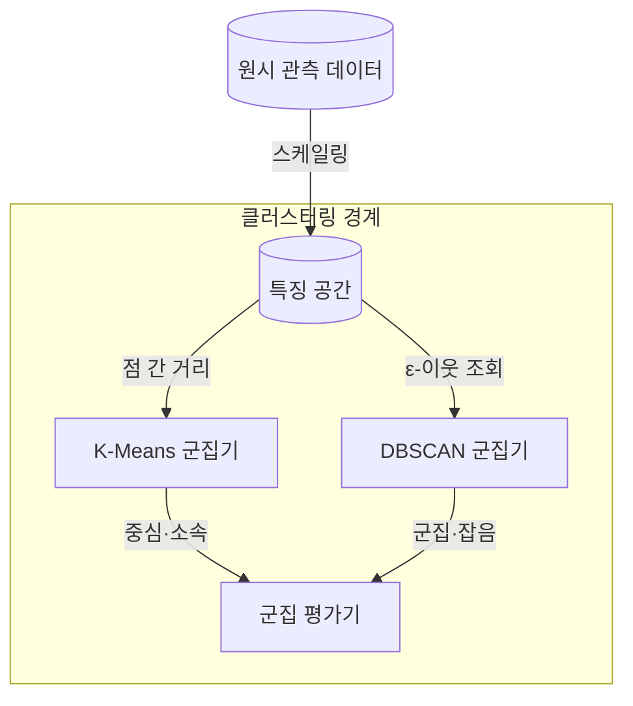
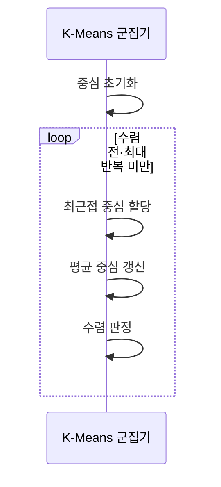
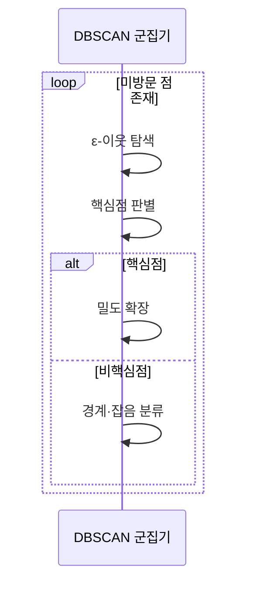

---
sidebar:
  order: 35
  label: "035. 클러스터링 — K-Means·DBSCAN (Clustering)"
  badge:
    text: "미출제 · 50%"
    variant: note
title: "클러스터링 — K-Means·DBSCAN (Clustering)"
date: "2026-07-26T22:16:20+09:00"
tags:
  - "notes-basic-theory"
weight: 35
extra:
  question_no: "035"
  source_status: "미출제"
  source_history: ""
  priority: 50
  priority_note: "군집 형태·밀도가 알고리즘 선택을 좌우"
---

## 미리 알고가기

- **클러스터링(Clustering)**: 이름표 없는 사람들이 흩어져 있는 운동장에서 가까이 붙어 선 사람끼리 자연스레 한 무리로 보이는 장면을 떠올리면 되며, 정답 레이블 없이 거리와 밀도만으로 비슷한 데이터를 묶어 숨은 집단 구조를 찾는 비지도 학습이다.
- **K-평균(K-Means)**: ‘케이 민즈’로 읽고 K는 미리 정하는 군집 수, Means는 각 군집의 평균 중심을 뜻하며, 모든 점을 가장 가까운 중심에 배정하고 그 평균으로 중심을 다시 옮기기를 반복해 군집 내 분산을 줄이는 알고리즘이다.
- **잡음 포함 밀도 기반 군집화(Density-Based Spatial Clustering of Applications with Noise, DBSCAN)**: ‘디비스캔’으로 읽고 영문 머리글자를 단어처럼 만든 약어이며, 점이 촘촘히 모인 곳에서 이웃을 타고 연쇄로 뻗어 나가 굽거나 갈라진 임의 형상의 군집을 만들고 어디에도 닿지 않은 점은 잡음으로 떼어 내는 알고리즘이다.
- **반경($\varepsilon$)**: $\varepsilon$은 ‘엡실론’으로 읽고 작은 양의 허용 오차·반경에 관례적으로 쓰는 그리스 문자이며, DBSCAN에서 두 점을 이웃으로 인정할 최대 거리를 가리킨다.
- **최소 점 개수(Minimum Number of Points, MinPts)**: ‘민 포인츠’로 읽고 영문을 줄인 공식 매개변수명이며, 어떤 점을 촘촘한 곳에 있다고 인정하려면 자신을 포함한 $\varepsilon$-이웃이 최소 몇 개여야 하는지를 정하는 값이다.
- **핵심점(Core Point)**: 자신을 포함한 $\varepsilon$-이웃 개수가 MinPts 이상이어서 주변이 충분히 촘촘하다고 인정된 점이며, 군집을 뻗어 나가는 출발점 역할을 한다.
- **경계점(Border Point)**: 어떤 핵심점의 $\varepsilon$-이웃 안에는 있지만 자기 주변은 촘촘하지 않은 점이며, 군집에 포함되되 거기서 더 확장하지는 못하는 가장자리다.
- **잡음점(Noise Point)**: 어느 핵심점의 $\varepsilon$-이웃에도 들어가지 못한 점이며, DBSCAN이 어떤 군집에도 넣지 않고 이상 후보로 남겨 두는 대상이다.
- **밀도 도달·연결(Density-Reachable·Connected)**: 핵심점에서 이웃을 타고 연쇄로 닿을 수 있으면 밀도 도달이고, 서로 직접 닿지 않아도 같은 핵심점 사슬에 함께 걸려 있으면 밀도 연결이며, 이 두 관계가 DBSCAN 군집의 경계를 정한다.
- **거리 척도·특징 스케일링(Distance Metric·Feature Scaling)**: 거리 척도는 두 점이 얼마나 다른지 재는 계산 규칙이고, 특징 스케일링은 초 단위와 바이트 단위처럼 크기가 제각각인 특징의 폭을 맞추는 처리이며, 이를 맞추지 않으면 숫자가 큰 특징 하나가 거리 계산을 독차지한다.
- **실루엣 계수(Silhouette Coefficient)**: 한 점이 자기 군집 안에서 얼마나 가깝고 이웃 군집과는 얼마나 먼지를 $-1$부터 $1$ 사이 값으로 나타내는 지표이며, 값이 클수록 군집이 잘 뭉치고 잘 갈렸다는 뜻이다.
- **군집 기호 $n$·$k$·$x_i$·$c_i$·$\mu_j$**: 각각 ‘엔·케이·엑스 아이·시 아이·뮤 제이’로 읽고 $n$·$k$는 개수, 아래첨자는 항목 번호, $\mu$는 평균에 관례적으로 쓰는 표기이며, 데이터 수·군집 수·각 점·소속 군집·각 군집 중심을 가리킨다.
- **거리 기호 $p$·$q$·$d(p,q)$**: 각각 ‘피·큐·디 오브 피 콤마 큐’로 읽고 $p$·$q$는 두 점, $d$는 distance의 머리글자를 쓴 관례이며, 기준점·후보점·두 점 사이 거리를 가리킨다.
- **매개변수 범위 $1\le k\le n$·$\varepsilon>0$**: 각각 ‘일 이상 엔 이하의 케이·엡실론은 영보다 큼’으로 읽고 $\le$·$>$는 크기 관계를 나타내는 수학 관례이며, 군집 수가 데이터 수를 넘지 않고 이웃 반경이 양수여야 함을 정한다.
- **지역 최솟값(Local Minimum)**: 주변의 어떤 해보다도 목적함수 값이 작지만 전체를 통틀어 가장 작다는 보장은 없는 해이며, K-Means가 초기 중심을 잘못 잡으면 여기서 멈춘다.
- **특징 공간(Feature Space)**: 각 데이터의 측정값을 좌표축으로 삼아 점 하나씩 찍어 놓은 공간이며, 클러스터링은 이 공간에 놓인 점들 간 거리를 바탕으로 무리를 나눈다.
- **비볼록 군집(Non-convex Cluster)**: 초승달이나 갈래진 뱀처럼 굽어 있어 군집 안 두 점을 이은 선분이 군집 밖을 지나가는 형태이며, 중심에서 가까운 순으로 묶는 K-Means는 이런 모양을 한 무리로 잡아내지 못한다.
- **표준화(Standardization)**: 특징마다 평균을 빼고 표준편차로 나눠 단위가 다른 값들의 폭을 같은 크기로 맞추는 변환이며, 이 변환을 거쳐야 값이 큰 특징 하나가 거리 계산을 지배하지 않는다.
- **중앙 처리 장치(Central Processing Unit, CPU)**: ‘시피유’로 읽고 영문 머리글자를 딴 약어이며, 서버의 명령 실행과 연산을 담당하는 장치로 실무 사례에서는 그 사용률이 군집화의 입력 특징이 된다.
- **워크로드(Workload)**: 서버가 처리하는 요청·연산의 양과 그에 따라 나타나는 자원 사용 패턴이며, 실무 사례에서 서버를 유형별로 묶는 기준이 된다.

## Ⅰ. 개요

- 정의/개념: 레이블 없이 거리·**밀도**로 군집을 찾는 **비지도 학습**
- 기존 한계: **레이블**이 없으면 지도 분류로 **집단 구조** 파악 불가

### 쉽게 이해하기 (학습용)
- 답안이 기존 한계에 `레이블 없음`을 굳이 든 이유는, 정답표가 있으면 사람을 학년별로 줄 세우듯 분류 모델을 학습시키면 그만이지만 이름표가 하나도 없는 운동장에서는 누가 가까이 서 있는지만 보고 무리를 추측하는 수밖에 없어서, 거리와 밀도가 유일한 단서가 되기 때문이다.

## Ⅱ. 특징

- 거리·**밀도 연결성** 기반 **비지도** 집단 형성
- **거리 척도**·특징 **스케일링**에 좌우되는 군집 경계
- 정답 레이블 부재로 **실루엣 계수**·업무 해석 검증 의존

### 쉽게 이해하기 (학습용)
- 답안이 `거리 척도에 좌우되는 군집 경계`라고 못 박은 이유는, 같은 서버들을 초 단위 응답시간과 바이트 단위 메모리로 나란히 놓으면 숫자가 큰 메모리 축이 거리 계산을 통째로 삼켜 응답시간 차이는 없는 셈이 되고, 그러면 무리의 경계 자체가 알고리즘이 아니라 단위 선택으로 정해져 버리기 때문이다.

## Ⅲ. 아키텍처 및 구성요소

| 설계 요소 | 설명 |
|:---|:---|
| 특징 공간 | **스케일링**된 좌표와 **거리 척도** 보유 |
| K-Means 군집기 | 중심까지 **제곱거리 합** 최소화 갱신 |
| DBSCAN 군집기 | **ε**·**MinPts** 기반 밀도 연결·잡음 판정 |
| 군집 평가기 | **실루엣 계수**·업무 해석 기반 품질 판정 |

> 요약: 같은 **특징 공간**에서 **중심 기준**과 밀도 기준으로 구분

### 쉽게 이해하기 (학습용)
- 답안이 두 알고리즘 위에 특징 공간을 따로 세운 이유는, 운동장 자체가 어떻게 그려졌는지에 따라 무리가 달라지기 때문인데 K-Means는 그 운동장에 깃발 몇 개를 꽂고 가장 가까운 깃발로 사람을 모으고, DBSCAN은 깃발 없이 어깨가 닿는 사람끼리 손을 잡고 늘어서게 두며, 둘 다 같은 운동장의 거리 눈금을 그대로 쓴다.

## Ⅳ. 원리 및 절차 흐름도

**K-Means**

| 절차 | 설명 |
|:---|:---|
| 중심 초기화 | k개 초기 중심 선택으로 **초기값 의존** 발생 |
| 최근접 중심 할당 | 각 점을 최소 **거리** 중심에 배정 |
| 평균 중심 갱신 | 군집 **평균 좌표**로 중심 재계산 |
| 수렴 판정 | 중심 **이동 허용치**·최대 반복 도달 시 종료 |

**DBSCAN**

| 절차 | 설명 |
|:---|:---|
| ε-이웃 탐색 | 반경 **ε** 안의 점 집합 수집 |
| 핵심점 판별 | 자신 포함 이웃 수와 **MinPts** 비교 |
| 밀도 확장 | 새 **핵심점** 이웃까지 **밀도 연결** 전파 |
| 경계·잡음 분류 | 핵심점 연결 여부로 **경계점**·**잡음점** 구분 |

> 요약: K-Means는 **중심 수렴**으로, DBSCAN은 **밀도 확장** 완료로 종료

### 쉽게 이해하기 (학습용)
- 답안이 K-Means에는 `수렴 판정`을, DBSCAN에는 종료 판정 대신 `밀도 확장`을 둔 이유는, 깃발을 옮기는 쪽은 깃발이 더 이상 움직이지 않을 때까지 몇 번이고 다시 돌아야 끝나지만 손을 잡고 늘어서는 쪽은 더 잡을 손이 없으면 그 무리가 그대로 완성돼 되돌아갈 일이 없기 때문이다.

## Ⅴ. 종류 및 비교

| 군집화 알고리즘 | K-Means | DBSCAN |
|:---|:---|:---|
| 적용 기준 | **군집 수** 사전 지정·유사 크기 구형 | 군집 수 미상의 **임의 형상**·유사 밀도 |
| 핵심 특징 | 최근접 **중심 할당**·평균 갱신 반복 | **밀도 연결** 확장과 **잡음점** 분리 |
| 한계 | **비볼록 군집** 분리 실패·초기 중심 의존 | **ε** 단일값이라 밀도 차 군집에 취약 |

> 요약: **군집 형태**와 밀도 균질성을 기준으로 알고리즘 선택

### 쉽게 이해하기 (학습용)
- 답안이 두 방식을 우열이 아니라 조건으로 갈라 적은 이유는, 운동장에 깃발 몇 개를 꽂고 가까운 깃발로 모이라 하면 사람들이 깃발 둘레에 둥글게 뭉치므로 무리 수를 알고 모양이 둥글 때만 맞는 반면, 뱀처럼 길게 굽은 줄에서는 그 깃발이 줄을 토막 내 버려서 어깨가 닿는 사람끼리 손을 잡고 늘어서게 두는 방식이라야 굽은 줄이 통째로 한 무리로 남기 때문이다.

## Ⅵ. 실무 사례

1. 서버 **워크로드** 유형화에 **표준화** 후 K-Means 군집

### 쉽게 이해하기 (학습용)
- CPU 사용률은 백분율이라 기껏해야 100이고 메모리는 기가바이트라 수십에서 수백까지 벌어지는데 이 둘을 그대로 두고 거리를 재면 숫자가 큰 메모리 축이 무리를 통째로 갈라 버리므로, 두 축의 눈금 폭을 먼저 맞춘 뒤에야 K-Means가 낮에만 바쁜 서버와 밤새 꾸준한 서버를 실제 유형별로 묶어 준다.

## Ⅶ. 결론

- **군집 형태**·밀도 균질성으로 K-Means·**DBSCAN** 선택

### 쉽게 이해하기 (학습용)
- 알고리즘을 고르는 일은 성능표를 견주는 게 아니라 내가 찾으려는 무리가 깃발 둘레에 둥글게 모인 모양인지 손을 잡고 길게 늘어선 모양인지를 먼저 그려 보는 일이며, 그림이 둥글면 K-Means가, 굽거나 갈라졌고 밀도가 고르면 DBSCAN이 남는다.
