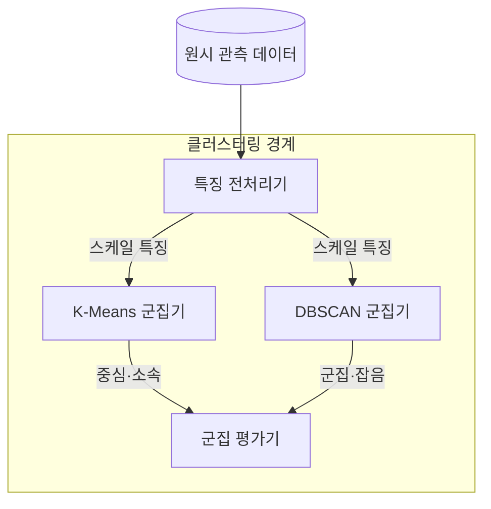
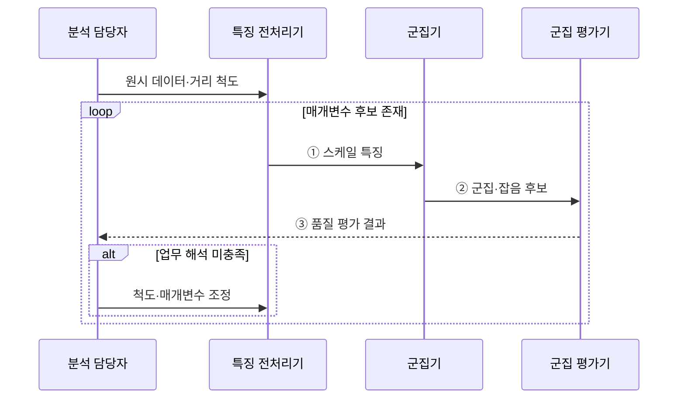

---
sidebar:
  order: 35
  label: "035. 클러스터링 — K-Means·DBSCAN (Clustering)"
  badge:
    text: "미출 · 50%"
    variant: note
title: "클러스터링 — K-Means·DBSCAN (Clustering)"
date: "2026-07-29T00:08:00+09:00"
tags:
  - "notes-basic-theory"
weight: 35
extra:
  question_no: "035"
  source_status: "미출"
  source_history: ""
  priority: 50
  priority_note: "군집 형태·밀도가 알고리즘 선택을 좌우"
---

## 미리 알고가기

- **클러스터링(Clustering)**: 정답 레이블 없이 데이터 간 거리·밀도·연결성을 기준으로 유사한 표본을 묶어 집단 구조를 찾는 비지도 학습이다.
- **K-평균(K-Means)**: 각 데이터를 가장 가까운 중심에 배정하고 군집 평균으로 중심을 반복 갱신하여 군집 내 분산을 최소화하는 알고리즘이다.
- **잡음 포함 밀도 기반 군집화(Density-Based Spatial Clustering of Applications with Noise, DBSCAN)**: 고밀도 영역을 연결하여 임의 형태의 군집을 찾고 저밀도 영역의 표본을 잡음으로 분류하는 알고리즘이다.
- **반경($\varepsilon$)**: $\varepsilon$은 ‘엡실론’으로 읽고 작은 양의 허용 오차·반경에 관례적으로 쓰는 그리스 문자이며, DBSCAN에서 두 점을 이웃으로 인정할 최대 거리를 가리킨다.
- **최소 점 개수(Minimum Number of Points, MinPts)**: 한 점을 핵심점으로 판정하기 위해 $\varepsilon$ 반경 안에 있어야 하는 최소 표본 수다.
- **핵심점(Core Point)**: 자신을 포함한 $\varepsilon$-이웃 개수가 MinPts 이상이어서 주변이 충분히 촘촘하다고 인정된 점이며, 군집을 뻗어 나가는 출발점 역할을 한다.
- **경계점(Border Point)**: 어떤 핵심점의 $\varepsilon$-이웃 안에는 있지만 자기 주변은 촘촘하지 않은 점이며, 군집에 포함되되 거기서 더 확장하지는 못하는 가장자리다.
- **잡음점(Noise Point)**: 어느 핵심점의 $\varepsilon$-이웃에도 들어가지 못한 점이며, DBSCAN이 어떤 군집에도 넣지 않고 이상 후보로 남겨 두는 대상이다.
- **밀도 도달·연결(Density-Reachable·Connected)**: 핵심점의 이웃 사슬로 도달하거나 같은 사슬에 연결되는 관계
- **거리 척도·특징 스케일링(Distance Metric·Feature Scaling)**: 점의 차이를 재는 규칙과 특징별 값 범위를 맞추는 처리
- **실루엣 계수(Silhouette Coefficient)**: 군집 내 응집도와 가장 가까운 다른 군집과의 분리도를 $-1$부터 $1$ 사이로 나타내며, 값이 클수록 군집 품질이 높다.
- **군집 기호 $n$·$k$·$x_i$·$c_i$·$\mu_j$**: 데이터 수·군집 수·각 점·소속 군집·각 군집 중심
- **거리 기호 $p$·$q$·$d(p,q)$**: 기준점·후보점·두 점 사이 거리
- **매개변수 범위 $1\le k\le n$·$\varepsilon>0$**: 군집 수와 양수 이웃 반경의 유효 범위
- **지역 최솟값(Local Minimum)**: 주변의 어떤 해보다도 목적함수 값이 작지만 전체를 통틀어 가장 작다는 보장은 없는 해이며, K-Means가 초기 중심을 잘못 잡으면 여기서 멈춘다.
- **특징 공간(Feature Space)**: 데이터의 각 특징을 좌표축으로 표현한 공간으로, 군집화는 이 공간에서 표본 간 거리나 밀도를 기준으로 그룹을 구분한다.
- **비볼록 군집(Non-convex Cluster)**: 군집 내부의 두 점을 잇는 선분 일부가 군집 밖을 지나는 형태로, 중심 거리 기반 K-Means로는 정확히 구분하기 어렵다.
- **표준화(Standardization)**: 특징마다 평균을 빼고 표준편차로 나눠 단위가 다른 값들의 폭을 같은 크기로 맞추는 변환이며, 이 변환을 거쳐야 값이 큰 특징 하나가 거리 계산을 지배하지 않는다.
- **중앙 처리 장치(Central Processing Unit, CPU)**: 명령어 실행과 연산을 담당하는 처리 장치로, 실무 사례에서는 사용률이 군집화의 입력 특징이 된다.
- **워크로드(Workload)**: 서버가 처리하는 요청·연산의 양과 그에 따라 나타나는 자원 사용 패턴이며, 실무 사례에서 서버를 유형별로 묶는 기준이 된다.
- **K-Means++**: 서로 먼 점이 초기 중심으로 선택될 확률을 높여 지역 최솟값 위험을 줄이는 초기화 방법이다.
- **엘보 방법(Elbow Method)**: 군집 수 증가에 따른 군집 내 오차 감소가 둔화되는 지점을 선택하는 방법이다.
- **k-distance 도표**: 각 점의 k번째 최근접 이웃 거리를 정렬해 DBSCAN의 반경 후보를 찾는 도표다.
- **계층적 밀도 군집화(HDBSCAN)**: 여러 밀도 수준의 연결 구조를 계층화해 밀도가 다른 군집을 찾는 방법이다.

## Ⅰ. 개요

- 정의/개념: 레이블 없이 거리·**밀도**로 군집을 찾는 **비지도 학습**
- 기존 한계: **레이블**이 없으면 지도 분류로 **집단 구조** 파악 불가

### 쉽게 이해하기 (학습용)
- 정답 레이블이 없으므로 거리·밀도·연결성을 이용해 데이터의 집단 구조를 찾는다.

## Ⅱ. 특징

- 거리·**밀도 연결성** 기반 **비지도** 집단 형성
- **거리 척도**·특징 **스케일링**에 좌우되는 군집 경계
- 정답 레이블 부재로 **실루엣 계수**·업무 해석 검증 의존

### 쉽게 이해하기 (학습용)
- 특징 단위와 거리 척도를 잘못 정하면 큰 값의 특징이 군집 경계를 지배한다.

## Ⅲ. 아키텍처

**도표안 A — 구조도**

**도표안 B — sequenceDiagram**

| 구성요소 | 책임 |
|:---|:---|
| 특징 전처리기 | **스케일링**·거리 척도 적용 |
| K-Means 군집기 | 중심까지 **제곱거리 합** 최소화 갱신 |
| DBSCAN 군집기 | **ε**·**MinPts** 기반 밀도 연결·잡음 판정 |
| 군집 평가기 | **실루엣 계수**·업무 해석 기반 품질 판정 |

**동작 원리**

- **① 스케일 특징**: 단위 차이 제거 결과 전달
- **② 군집·잡음 후보**: 거리·밀도 기반 표본 배정
- **③ 품질 평가 결과**: 실루엣·업무 해석 판정

### 쉽게 이해하기 (학습용)
- 같은 특징 공간에서 K-Means는 중심 거리, DBSCAN은 이웃 밀도로 군집을 만든다.

## Ⅳ. 종류 및 비교

| 군집화 알고리즘 | K-Means | DBSCAN |
|:---|:---|:---|
| 적용 기준 | **군집 수** 사전 지정·유사 크기 구형 | 군집 수 미상의 **임의 형상**·유사 밀도 |
| 핵심 특징 | 최근접 **중심 할당**·평균 갱신 반복 | **밀도 연결** 확장과 **잡음점** 분리 |
| 한계 | **비볼록 군집** 분리 실패·초기 중심 의존 | **ε** 단일값이라 밀도 차 군집에 취약 |

> 요약: **군집 형태**와 밀도 균질성을 기준으로 알고리즘 선택

### 쉽게 이해하기 (학습용)
- 군집 수를 알고 구형이면 K-Means, 임의 형상과 잡음 분리가 필요하면 DBSCAN이 적합하다.

## Ⅴ. 실무 고려사항 및 대책

| 고려사항 | 대책 | 효과 |
|:---|:---|:---|
| 단위 차이의 **거리 지배** | 표준화·업무 목적별 거리 척도 적용 | 의미 있는 **군집 경계** 확보 |
| K-Means 초기 중심의 **지역 최솟값** | K-Means++·다중 초기화 | **결과 변동성** 감소 |
| 군집 수·밀도 **매개변수** 오설정 | 실루엣·엘보·k-distance·업무 해석 병행 | **선택 근거** 확보 |
| DBSCAN의 **밀도 차이** 분리 실패 | 계층적 밀도 군집화 검토 | **이질적 밀도** 대응 |

### 쉽게 이해하기 (학습용)
- 스케일·초기값·매개변수 민감도를 검증하고 업무에서 설명 가능한 군집만 사용한다.

## Ⅵ. 결론

- **군집 형태**·밀도 균질성으로 K-Means·**DBSCAN** 선택

### 쉽게 이해하기 (학습용)
- 군집 형태와 밀도 균질성, 잡음 분리 요구에 따라 알고리즘을 선택한다.
