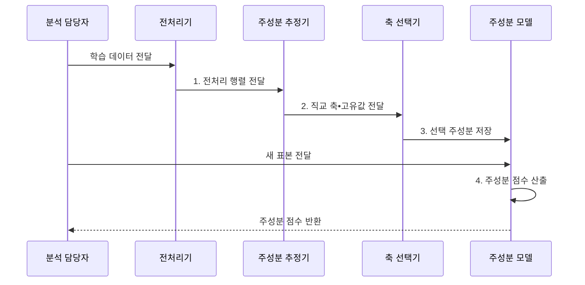

---
sidebar:
  order: 36
  label: "036. 주성분 분석 (PCA)"
  badge:
    text: "미출 • 50%"
    variant: note
title: "주성분 분석 (PCA)"
date: "2026-08-02T17:06:00+09:00"
tags:
  - "notes-basic-theory"
weight: 36
extra:
  question_no: "036"
  source_status: "미출"
  source_history: ""
  priority: 50
  priority_note: "분산 보존 차원 축소의 전처리 활용"
---

## Ⅰ. 개요

핵심 용어

- **주성분 분석(Principal Component Analysis, PCA)**: 분산을 최대한 보존하는 직교 축에 데이터를 투영해 차원을 줄이는 선형 차원 축소 기법
- **차원 축소**: 원래 변수의 핵심 정보를 보존하면서 더 적은 좌표로 변환하는 처리

- 정의/개념: 데이터를 분산 보존 **직교 축**에 투영해 변수 수를 줄이는 선형 차원 축소 기법
- 배경/필요성: 상관 변수를 원본대로 유지하면 **차원•연산량 증가**

### 쉽게 이해하기 (학습용)

- 비스듬히 늘어진 점 구름에 가장 긴 자를 놓고 그 위에 그림자를 내리듯, 가장 넓게 퍼진 방향부터 남겨 적은 좌표로 모양을 보존한다.

## Ⅱ. 특징

핵심 용어

- **공분산 행렬**: 모든 변수 쌍의 공동 변화량을 모아 데이터가 퍼진 방향을 나타내는 행렬
- **고유벡터•고유값**: 주성분 축의 방향과 그 축이 담는 분산 크기
- **직교**: 두 축이 직각을 이뤄 같은 방향 정보를 중복하지 않는 관계

- **공분산 행렬** 고유벡터 기반 **직교 주성분** 구성
- **고유값** 내림차순 축 선택으로 **분산 최대 보존**
- 축이 원변수의 **선형 결합**이라 **변수별 기여** 식별 불가

> 요약: **설명 분산•업무 성능**으로 축 수 결정

### 쉽게 이해하기 (학습용)

- 첫 자가 점 구름의 가장 긴 방향을 담으면 다음 자는 직각 방향 중 가장 넓은 곳을 골라, 이미 담은 퍼짐을 중복하지 않는다.

## Ⅲ. 구조 및 구성요소

핵심 용어

- **표준화•평균 중심화**: 변수 단위를 맞추고 학습 평균을 빼 데이터 중심을 원점으로 옮기는 전처리
- **SVD**: 데이터 행렬을 특이벡터와 특이값으로 분해해 주성분 축을 구하는 방법
- **누적 설명 분산**: 선택한 첫 주성분부터 현재 주성분까지 설명 분산 비율을 합한 값

| 구성요소 | 책임 |
|:---|:---|
| 전처리기 | 학습 기준 **표준화•평균 중심화** |
| 주성분 추정기 | 고유분해•**SVD**로 축•고유값 산출 |
| 축 선택기 | 누적 설명 분산으로 **축 수** 결정 |
| 주성분 모델 | 학습 전처리와 **선택 축** 보관•투영 |

### 쉽게 이해하기 (학습용)

- 전처리기가 변수 단위를 맞추고 추정기가 분산 축을 찾으면, 선택기와 모델이 남길 축과 새 표본 좌표를 결정한다.

## Ⅳ. 흐름도

핵심 용어

- **투영**: 데이터 점을 선택한 주성분 축의 좌표로 바꾸는 변환
- **주성분 점수**: 원래 표본을 선택한 주성분 축에 투영해 얻은 축소 좌표
- **주성분 모델**: 학습 전처리 값과 선택한 축을 보관해 새 표본에 동일 변환을 적용하는 모델

### 동작 원리

- **1. 전처리 행렬 전달**: 학습 평균•척도로 표준화
- **2. 직교 축•고유값 전달**: 분산 방향•크기 산출
- **3. 선택 주성분 저장**: 기준을 만족한 축과 전처리 값 보존
- **4. 주성분 점수 산출**: 동일 전처리 후 선택 축에 투영

### 쉽게 이해하기 (학습용)

- 전처리기가 축마다 단위를 맞추고 추정기가 점 구름의 긴 방향을 찾으면, 모델은 새 점에도 같은 평균•척도와 자를 대어 축소 좌표를 만든다.

## Ⅴ. 종류 및 비교

핵심 용어

- **PCA**: 레이블 없이 전체 분산을 최대한 보존하는 선형 차원 축소
- **LDA**: 클래스 간 분산은 키우고 클래스 내 분산은 줄이는 지도 차원 축소
- **t-SNE**: 고차원 데이터의 국소 이웃 관계를 저차원에 표현하는 비선형 임베딩
- **전역 거리 왜곡**: 저차원 그림의 군집 간 거리가 원래 공간의 거리를 보존하지 않는 현상

| 차원 축소 기법 | PCA | LDA | t-SNE |
|:---|:---|:---|:---|
| 적용 기준 | 레이블 없는 **상관 변수** 압축 | **클래스 레이블** 보유 분류 전처리 | 고차원 **군집 구조** 시각화 |
| 핵심 특징 | **분산 최대** 직교 축 투영 | **클래스 간 분리** 최대 축 투영 | **이웃 확률** 보존 비선형 임베딩 |
| 한계 | **저분산 신호** 손실 | 축 수 **클래스 수** 미만 제한 | **전역 거리** 왜곡으로 군집 간격 오독 |

> 요약: **분산•클래스•이웃** 보존 기준 선택

### 쉽게 이해하기 (학습용)

- 점 구름의 퍼짐을 남기면 PCA, 색깔 레이블 사이 간격을 벌리면 LDA, 가까운 이웃 배치를 2차원 그림으로 옮기면 t-SNE다.

## Ⅵ. 실무 고려사항 및 대책

핵심 용어

- **데이터 누출**: 평가 데이터 정보가 학습 전처리나 축 추정에 섞여 성능을 과대평가하는 문제
- **재구성 오차**: 축소 좌표에서 복원한 값과 원본 사이의 차이
- **저분산 중요 신호**: 전체 분산은 작지만 업무 예측에 중요한 변수 방향
- **분포 변화**: 운영 데이터의 통계적 분포가 학습 데이터와 달라지는 현상

| 문제 | 대책 | 효과 |
|:---|:---|:---|
| 변수 단위의 **주성분 지배** | 학습 데이터 기준 표준화 | **척도 편향** 방지 |
| 평가 데이터로 평균•축 계산 | 학습 구간에서만 전처리•축 추정 | **데이터 누출** 방지 |
| **저분산 중요 신호** 손실 | 업무 성능•재구성 오차 함께 검증 | 분산 외 **정보 보존** |
| 운영 **분포 변화**로 축 의미 변동 | 설명 분산•재구성 오차 감시 | **재학습 시점** 탐지 |

### 쉽게 이해하기 (학습용)
- 시험 점까지 섞으면 누출이므로 학습 점만으로 PCA 축을 고정하고 검증 성능으로 축 수를 정한다.

## Ⅶ. 결론

핵심 용어

- **분산•클래스•이웃 보존**: PCA•LDA•t-SNE가 각각 우선 유지하는 정보 기준
- **축 수**: 축소 뒤 남겨 사용할 주성분의 개수

- 분산은 **PCA**, 클래스는 **LDA**, 이웃 시각화는 t-SNE 선택

### 쉽게 이해하기 (학습용)

- 변수 단위를 맞춘 점 구름에서 큰 분산 축부터 더하되, 작은 분산에 중요한 신호가 없는지 업무 성능으로 확인한 뒤 축 수를 확정한다.
