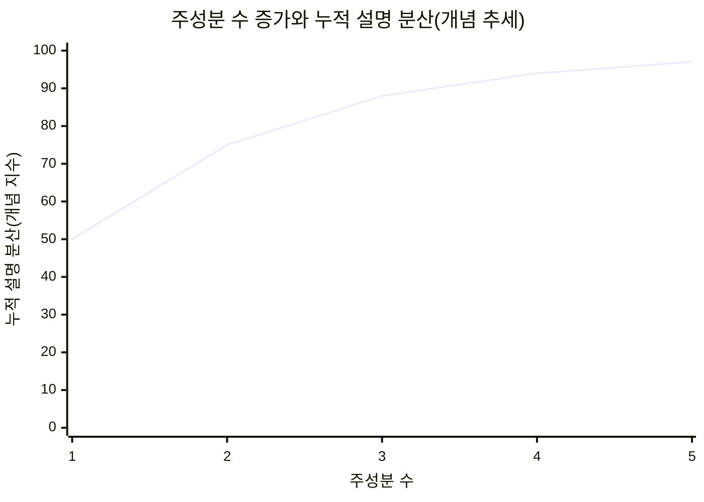
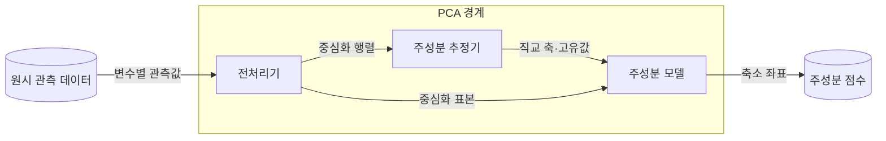
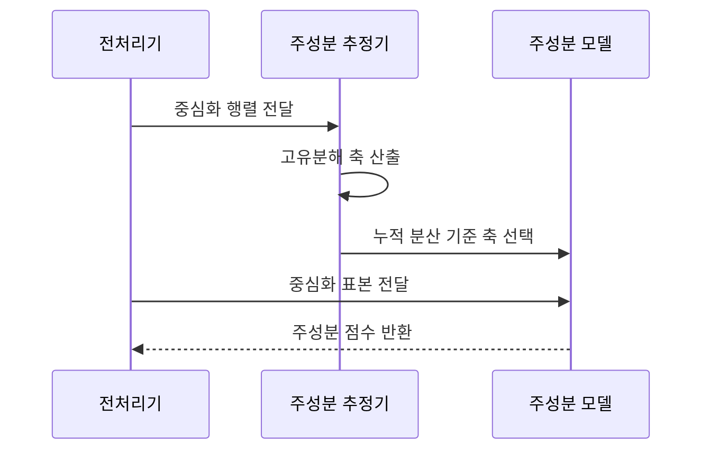

---
sidebar:
  order: 36
  label: "036. 주성분 분석 (PCA)"
  badge:
    text: "미출제 · 50%"
    variant: note
title: "주성분 분석 (PCA)"
date: "2026-07-26T22:16:20+09:00"
tags:
  - "notes-basic-theory"
weight: 36
extra:
  question_no: "036"
  source_status: "미출제"
  source_history: ""
  priority: 50
  priority_note: "분산 보존 차원 축소의 전처리 활용"
---

## 미리 알고가기

- **주성분 분석(Principal Component Analysis, PCA)**: 입체 물체를 벽에 비출 때 물체가 가장 길고 넓게 보이는 각도를 골라 그림자 한 장으로 남기는 장면을 떠올리면 되며, ‘피시에이’로 읽고 영문 머리글자를 딴 약어로 데이터가 가장 넓게 퍼진 직교 축에 투영해 정보 손실을 줄이면서 차원을 낮추는 선형 기법이다.
- **공분산 행렬(Covariance Matrix)**: 변수를 두 개씩 짝지어 함께 커지고 함께 작아지는 정도를 모두 모아 놓은 정사각 표이며, PCA는 이 표에서 데이터가 가장 넓게 퍼진 방향을 찾아낸다.
- **고유값(Eigenvalue)**: 해당 주성분 축 방향으로 데이터가 얼마나 넓게 퍼져 있는지를 나타내는 수이며, 이 값이 큰 축부터 남겨야 원래 모양이 많이 보존된다.
- **고유벡터(Eigenvector)**: 주성분 축이 가리키는 방향을 나타내는 벡터이며, 원변수들을 어떤 비율로 섞어 그 축을 만드는지도 이 벡터의 성분이 알려 준다.
- **설명 분산 비율(Explained Variance Ratio)**: 데이터 전체 퍼짐 가운데 그 주성분 하나가 담아낸 몫을 백분율로 나타낸 값이며, 큰 축부터 이 값을 더해 가며 어디까지 남길지 정한다.
- **주성분 점수(Principal Component Score)**: 원래 표본을 선택한 주성분 축 위로 옮겨 찍었을 때의 새 좌표이며, 뒤따르는 학습이나 시각화는 이 축소 좌표를 입력으로 쓴다.
- **표준화(Standardization)**: 변수마다 평균을 빼고 표준편차로 나눠 평균 0·분산 1로 눈금을 맞추는 변환이며, 단위가 큰 변수 하나가 첫 주성분을 독차지하지 않게 한다.
- **특이값 분해(Singular Value Decomposition, SVD)**: ‘에스브이디’로 읽고 영문 머리글자를 딴 약어이며, 중심화한 데이터 행렬을 직교 방향과 그 크기로 곧바로 나누는 계산으로 공분산 행렬을 따로 만들지 않고도 같은 주성분 축을 얻는다.
- **선형 판별 분석(Linear Discriminant Analysis, LDA)**: ‘엘디에이’로 읽고 영문 머리글자를 딴 약어이며, 클래스끼리 가장 잘 갈리는 방향으로 투영하는 기법으로 정답 레이블이 있어야 쓸 수 있다는 점에서 PCA와 갈린다.
- **t-분포 확률적 이웃 임베딩(t-distributed Stochastic Neighbor Embedding, t-SNE)**: ‘티스니’로 읽고 t-분포와 영문 머리글자를 결합한 약어이며, 가까운 이웃일 확률을 보존하며 2·3차원으로 옮기는 비선형 임베딩으로 무리 모양은 잘 드러내지만 무리 사이 거리는 그대로 믿을 수 없다.
- **재구성 오차(Reconstruction Error)**: 축소한 좌표에서 원래 차원으로 되돌려 그린 값과 진짜 원본의 차이이며, 이 차이가 크다는 것은 남긴 축으로 설명되지 않는 패턴이 들어왔다는 뜻이다.
- **직교(Orthogonal)**: 두 축이 직각을 이루어 서로 같은 방향 정보를 중복해 담지 않는 관계
- **투영(Projection)**: 데이터 점을 선택한 축 위로 수직으로 내려 그 축의 좌표로 바꾸는 변환이며, 차원이 실제로 줄어드는 동작이 이 단계에서 일어난다.
- **평균 중심화(Mean Centering)**: 각 변수에서 학습 평균을 빼 데이터 중심을 원점으로 옮기는 전처리
- **고유분해(Eigendecomposition)**: 정방행렬을 고유값과 고유벡터로 나눠 주요 축과 크기를 구하는 계산
- **부분공간(Subspace)**: 원래 공간의 축 일부만으로 만들어지는 더 낮은 차원의 공간이며, PCA가 남긴 주성분 축들이 이루는 공간이 바로 여기에 해당한다.
- **선형·비선형 투영**: 선형 투영은 직선 결합으로 좌표를 바꾸고 비선형 투영은 굽은 관계까지 반영함
- **지도 분류(Supervised Classification)**: 정답 클래스가 붙은 데이터로 새 표본의 클래스를 예측하는 학습
- **이상 탐지(Anomaly Detection)**: 정상 패턴에서 크게 벗어난 데이터를 찾아 이상 후보로 표시하는 처리

## Ⅰ. 개요

- 정의/개념: **직교 축** 투영으로 분산을 최대 보존하는 **차원 축소** 기법
- 기존 한계: **상관 변수**가 겹쳐 있어 변수를 그냥 버리면 **분산 정보** 손실

### 쉽게 이해하기 (학습용)

- 답안이 정의에 `분산을 최대 보존`을 못 박은 이유는, 입체 물체를 벽에 비출 때 옆에서 비추면 납작한 막대 그림자만 남아 원래 모양을 알아볼 수 없지만 물체가 가장 넓게 보이는 각도에서 비추면 그림자 한 장만으로도 원본을 거의 알아볼 수 있듯, 차원을 줄이면서도 잃는 정보를 가장 적게 만드는 방향이 곧 퍼짐이 가장 큰 방향이기 때문이다.

## Ⅱ. 특징

- **공분산 행렬** 고유벡터 기반 **직교 주성분** 구성
- **고유값** 내림차순 축 선택으로 **분산 최대 보존**
- 축이 원변수의 **선형 결합**이라 **변수별 기여** 식별 불가

> 요약: **누적 설명 분산**의 증가폭이 둔화되는 지점에서 주성분 수 결정

### 쉽게 이해하기 (학습용)

- 답안이 `직교`를 조건으로 못 박은 이유는, 흩어진 사람 무리를 사진으로 남길 때 가장 길게 늘어선 방향으로 한 장을 찍고 나면 다음 장은 그 방향과 직각인 쪽에서 찍어야 앞 장에 이미 담긴 정보를 두 번 담지 않기 때문이며, 그렇게 직각 방향을 퍼짐이 큰 순서로 고르다 보면 뒤쪽 사진일수록 새로 보이는 것이 급격히 줄어든다.

## Ⅲ. 아키텍처 및 구성요소

| 설계 요소 | 설명 |
|:---|:---|
| 전처리기 | 학습 구간 기준 **표준화**·**평균 중심화** |
| 주성분 추정기 | **고유분해**·**SVD**로 직교 축·고유값 산출 |
| 주성분 모델 | 학습 평균·선택 **주성분 축** 보관과 **투영** |

> 요약: 추정 축과 **학습 평균** 보관으로 신규 표본 **동일 투영**

### 쉽게 이해하기 (학습용)

- 답안이 공분산 행렬이나 설명 분산 같은 값을 구성요소에서 빼고 세 덩어리만 남긴 이유는, 그 값들은 계산 도중 스쳐 가는 눈금일 뿐이고 실제로 일하는 주체는 자를 대기 전에 데이터의 중심과 눈금을 맞추는 전처리기, 가장 넓게 퍼진 직각 방향들을 찾아내는 주성분 추정기, 그렇게 고른 축과 학습 평균을 적어 두었다가 새 데이터에도 똑같이 들이대는 주성분 모델 셋뿐이기 때문이다.

## Ⅳ. 원리 및 절차 흐름도

| 절차 | 설명 |
|:---|:---|
| 중심화 행렬 전달 | 학습 구간 평균 기준 변수별 **중심화** |
| 고유분해 축 산출 | **공분산 고유분해**·**SVD** 기반 직교 축 |
| 누적 분산 기준 축 선택 | 목표 **설명 분산 비율** 충족 축 수 확정 |
| 중심화 표본 전달 | **학습 평균** 재사용으로 좌표 기준 고정 |
| 주성분 점수 반환 | 선택 축 좌표의 **저차원 표현** 산출 |

> 요약: 축 확정 후 **동일 기준 투영**으로 좌표계 일관성 유지

### 쉽게 이해하기 (학습용)

- 답안이 투영 단계에서 굳이 `학습 평균`을 다시 쓴다고 적은 이유는, 새로 들어온 데이터의 평균으로 중심을 다시 잡아 버리면 자를 대는 원점이 매번 달라져 어제 찍은 좌표와 오늘 찍은 좌표를 같은 지도 위에 놓을 수 없기 때문이며, 학습 때 정한 원점과 축을 그대로 들이대야만 두 시점의 주성분 점수를 나란히 견줄 수 있다.

## Ⅴ. 종류 및 비교

| 차원 축소 기법 | PCA | LDA | t-SNE |
|:---|:---|:---|:---|
| 적용 기준 | 레이블 없는 **상관 변수** 압축 | **클래스 레이블** 보유 분류 전처리 | 고차원 **군집 구조** 시각화 |
| 핵심 특징 | **분산 최대** 직교 축 투영 | **클래스 간 분리** 최대 축 투영 | **이웃 확률** 보존 비선형 임베딩 |
| 한계 | **저분산 신호** 손실 | 축 수 **클래스 수** 미만 제한 | **전역 거리** 왜곡으로 군집 간격 오독 |

> 요약: PCA는 **분산**, LDA는 **클래스 분리**, t-SNE는 이웃 보존

### 쉽게 이해하기 (학습용)

- 답안이 세 방법을 나란히 둔 이유는 셋이 서로 다른 것을 아까워하기 때문인데, PCA는 사람들이 가장 넓게 흩어진 방향을 아까워해 그 방향부터 남기고, LDA는 반팔 조와 긴팔 조가 가장 잘 갈리는 방향만 아까워해 이름표가 없으면 아예 쓸 수 없으며, t-SNE는 옆 사람과의 거리만 아까워해 무리 모양은 살리지만 무리끼리 얼마나 떨어졌는지는 믿을 수 없게 만든다.

## Ⅵ. 실무 사례

1. 서버 성능 지표 압축 시 **학습 구간**만으로 **주성분 축** 산출
2. 서버 센서 **이상 탐지**에 **재구성 오차** 임계 초과 판정

### 쉽게 이해하기 (학습용)

- 축을 학습 구간만 보고 정해야 하는 이유는, 아직 오지 않은 기간의 지표까지 넣어 평균과 축을 구하면 미래에 터질 장애 시점의 값이 축을 미리 기울여 놓아서 평가할 때는 잘 맞는 것처럼 보이지만 실제 운영에서는 그렇게 기울어진 축이 존재하지 않기 때문이다.
- PCA는 남긴 축만으로 원래 지표를 되그려 볼 수 있어서, 평소와 같은 서버 센서 값이면 되그린 그림이 원본과 거의 겹치지만 냉각팬 이상처럼 평소에 없던 조합이 들어오면 그림이 크게 어긋나므로 이 어긋난 폭이 임계값을 넘는 순간을 이상 후보로 잡는다.

## Ⅶ. 결론

- **척도 표준화** 후 **누적 설명 분산**으로 축 수 결정

### 쉽게 이해하기 (학습용)

- PCA는 퍼진 폭이 큰 방향을 고르는 방법이라 바이트처럼 숫자가 큰 지표가 섞여 있으면 그 지표 혼자 첫 축을 차지해 버리므로 눈금부터 맞춰야 하고, 그다음 판단은 원래 퍼짐의 몇 퍼센트까지 안고 갈 것인가 하나로 좁혀서 그 비율을 채우는 지점까지만 축을 세는 일이다.
