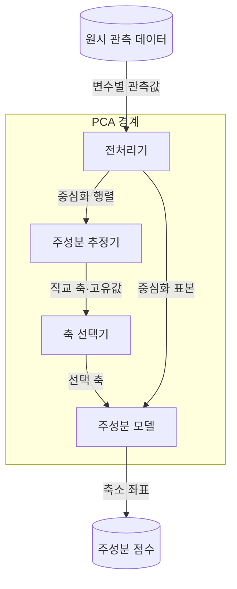
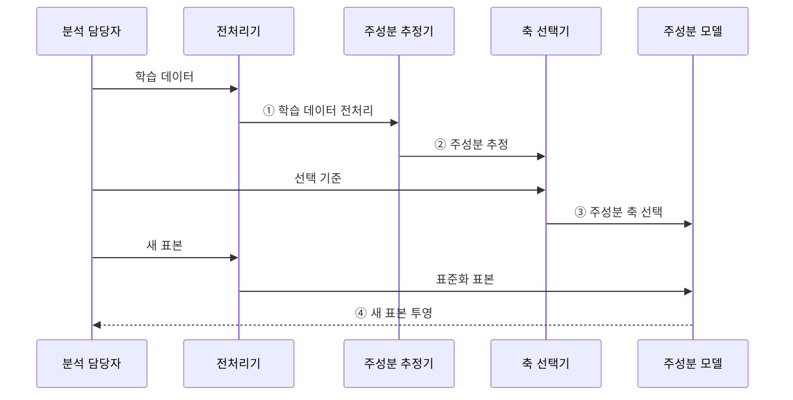

---
sidebar:
  order: 36
  label: "036. 주성분 분석 (PCA)"
  badge:
    text: "미출 · 50%"
    variant: note
title: "주성분 분석 (PCA)"
date: "2026-07-29T00:14:00+09:00"
tags:
  - "notes-basic-theory"
weight: 36
extra:
  question_no: "036"
  source_status: "미출"
  source_history: ""
  priority: 50
  priority_note: "분산 보존 차원 축소의 전처리 활용"
---

## 미리 알고가기

- **주성분 분석(Principal Component Analysis, PCA)**: 분산을 최대한 보존하는 직교 축에 데이터를 투영해 차원을 줄이는 선형 기법
- **차원 축소(Dimensionality Reduction)**: 원래 변수의 핵심 정보를 가능한 한 보존하면서 더 적은 수의 변수나 좌표로 변환하는 처리
- **공분산 행렬(Covariance Matrix)**: 모든 변수 쌍의 공동 변화량을 모아 데이터가 퍼진 방향을 나타내는 정사각 행렬
- **고유값(Eigenvalue)**: 해당 주성분 축이 담는 데이터 분산의 크기
- **고유벡터(Eigenvector)**: 원변수를 어떤 비율로 결합해 주성분 축 방향을 만드는지 나타내는 벡터
- **설명 분산 비율(Explained Variance Ratio)**: 전체 분산 중 한 주성분이 담는 비율
- **누적 설명 분산(Cumulative Explained Variance)**: 선택한 첫 주성분부터 현재 주성분까지의 설명 분산 비율을 합한 값
- **주성분 점수(Principal Component Score)**: 원래 표본을 선택한 주성분 축에 투영해 얻은 축소 좌표
- **표준화(Standardization)**: 각 변수에서 평균을 빼고 표준편차로 나누어 평균 0·분산 1로 변환하며, 변수의 측정 단위가 주성분에 미치는 영향을 줄인다.
- **특이값 분해(Singular Value Decomposition, SVD)**: 데이터 행렬을 특이벡터·특이값으로 분해해 주성분 축을 구하는 방법
- **선형 판별 분석(Linear Discriminant Analysis, LDA)**: 클래스 간 분산은 키우고 클래스 내 분산은 줄이는 방향으로 데이터를 투영하는 지도학습 기반 차원 축소 기법이다.
- **t-분포 확률적 이웃 임베딩(t-distributed Stochastic Neighbor Embedding, t-SNE)**: 고차원 데이터의 국소 이웃 관계를 보존하여 2·3차원에 표현하는 비선형 차원 축소 기법으로, 군집 간 전역 거리는 보존하지 않는다.
- **재구성 오차(Reconstruction Error)**: 축소한 좌표에서 원래 차원으로 되돌려 그린 값과 진짜 원본의 차이이며, 이 차이가 크다는 것은 남긴 축으로 설명되지 않는 패턴이 들어왔다는 뜻이다.
- **직교(Orthogonal)**: 두 축이 직각을 이루어 서로 같은 방향 정보를 중복해 담지 않는 관계
- **투영(Projection)**: 데이터 점을 선택한 축 위로 수직으로 내려 그 축의 좌표로 바꾸는 변환이며, 차원이 실제로 줄어드는 동작이 이 단계에서 일어난다.
- **평균 중심화(Mean Centering)**: 각 변수에서 학습 평균을 빼 데이터 중심을 원점으로 옮기는 전처리
- **고유분해(Eigendecomposition)**: 정방행렬을 고유값과 고유벡터로 나눠 주요 축과 크기를 구하는 계산
- **부분공간(Subspace)**: 원래 공간의 축 일부만으로 만들어지는 더 낮은 차원의 공간이며, PCA가 남긴 주성분 축들이 이루는 공간이 바로 여기에 해당한다.
- **선형·비선형 투영**: 선형 투영은 직선 결합으로 좌표를 바꾸고 비선형 투영은 굽은 관계까지 반영함
- **지도 분류(Supervised Classification)**: 정답 클래스가 붙은 데이터로 새 표본의 클래스를 예측하는 학습
- **이상 탐지(Anomaly Detection)**: 정상 패턴에서 크게 벗어난 데이터를 찾아 이상 후보로 표시하는 처리
- **데이터 누출(Data Leakage)**: 평가·운영 시점의 정보가 학습 전처리나 모델 추정에 섞여 성능을 과대평가하는 문제
- **분포 변화(Distribution Shift)**: 운영 데이터의 통계적 분포가 학습 데이터와 달라지는 현상

## Ⅰ. 개요

- 정의/개념: **직교 축** 투영으로 분산을 최대 보존하는 **차원 축소** 기법
- 기존 한계: **상관 변수**가 겹쳐 있어 변수를 그냥 버리면 **분산 정보** 손실

### 쉽게 이해하기 (학습용)

- 비스듬히 늘어진 점 구름에 가장 긴 자를 놓고 그 위에 그림자를 내리듯, 가장 넓게 퍼진 방향부터 남겨 적은 좌표로 모양을 보존한다.

## Ⅱ. 특징

- **공분산 행렬** 고유벡터 기반 **직교 주성분** 구성
- **고유값** 내림차순 축 선택으로 **분산 최대 보존**
- 축이 원변수의 **선형 결합**이라 **변수별 기여** 식별 불가

> 요약: **누적 설명 분산**과 재구성 오차·업무 성능을 함께 확인해 주성분 수 결정

### 쉽게 이해하기 (학습용)

- 첫 자가 점 구름의 가장 긴 방향을 담으면 다음 자는 직각 방향 중 가장 넓은 곳을 골라, 이미 담은 퍼짐을 중복하지 않는다.

## Ⅲ. 아키텍처

**도표안 A — 구조도**

**도표안 B — sequenceDiagram**

| 구성요소 | 책임 |
|:---|:---|
| 전처리기 | 학습 구간 기준 **표준화**·**평균 중심화** |
| 주성분 추정기 | **고유분해**·**SVD**로 직교 축·고유값 산출 |
| 축 선택기 | 누적 설명 분산으로 **축 수** 결정 |
| 주성분 모델 | 학습 평균·선택 **주성분 축** 보관과 **투영** |

**동작 원리**

- **① 학습 데이터 전처리**: 학습 데이터의 평균·척도를 계산해 중심화·표준화 행렬 생성
- **② 주성분 추정**: 고유분해 또는 SVD로 분산 방향인 직교 축과 크기인 고유값 산출
- **③ 주성분 축 선택**: 누적 설명 분산과 업무 성능 기준을 만족하는 축을 모델에 저장
- **④ 새 표본 투영**: 학습 시점의 평균·척도를 적용한 표본을 선택 축에 투영해 주성분 점수 반환

### 쉽게 이해하기 (학습용)

- 전처리기가 축마다 단위를 맞추고 추정기가 점 구름의 긴 방향을 찾으면, 모델은 새 점에도 같은 평균·척도와 자를 대어 축소 좌표를 만든다.

## Ⅳ. 종류 및 비교

| 차원 축소 기법 | PCA | LDA | t-SNE |
|:---|:---|:---|:---|
| 적용 기준 | 레이블 없는 **상관 변수** 압축 | **클래스 레이블** 보유 분류 전처리 | 고차원 **군집 구조** 시각화 |
| 핵심 특징 | **분산 최대** 직교 축 투영 | **클래스 간 분리** 최대 축 투영 | **이웃 확률** 보존 비선형 임베딩 |
| 한계 | **저분산 신호** 손실 | 축 수 **클래스 수** 미만 제한 | **전역 거리** 왜곡으로 군집 간격 오독 |

> 요약: PCA는 **분산**, LDA는 **클래스 분리**, t-SNE는 이웃 보존

### 쉽게 이해하기 (학습용)

- 점 구름의 퍼짐을 남기면 PCA, 색깔 레이블 사이 간격을 벌리면 LDA, 가까운 이웃 배치를 2차원 그림으로 옮기면 t-SNE다.

## Ⅴ. 실무 고려사항 및 대책

| 고려사항 | 대책 | 효과 |
|:---|:---|:---|
| 변수 단위의 **주성분 지배** | 학습 데이터 기준 표준화 | **척도 편향** 방지 |
| 평가 데이터로 평균·축 계산 | 학습 구간에서만 전처리·축 추정 | **데이터 누출** 방지 |
| **저분산 중요 신호** 손실 | 업무 성능·재구성 오차 함께 검증 | 분산 외 **정보 보존** |
| 운영 **분포 변화**로 축 의미 변동 | 설명 분산·재구성 오차 감시 | **재학습 시점** 탐지 |

### 쉽게 이해하기 (학습용)
- 시험 점까지 섞어 자의 방향을 정하면 누출이므로 학습 점만으로 평균·척도·축을 고정하고, 원래 모양 복원 오차와 업무 성능으로 자 수를 정한다.

## Ⅵ. 결론

- **척도 표준화** 후 **누적 설명 분산**으로 축 수 결정

### 쉽게 이해하기 (학습용)

- 변수 단위를 맞춘 점 구름에서 큰 분산 축부터 더하되, 작은 분산에 중요한 신호가 없는지 업무 성능으로 확인한 뒤 축 수를 확정한다.
