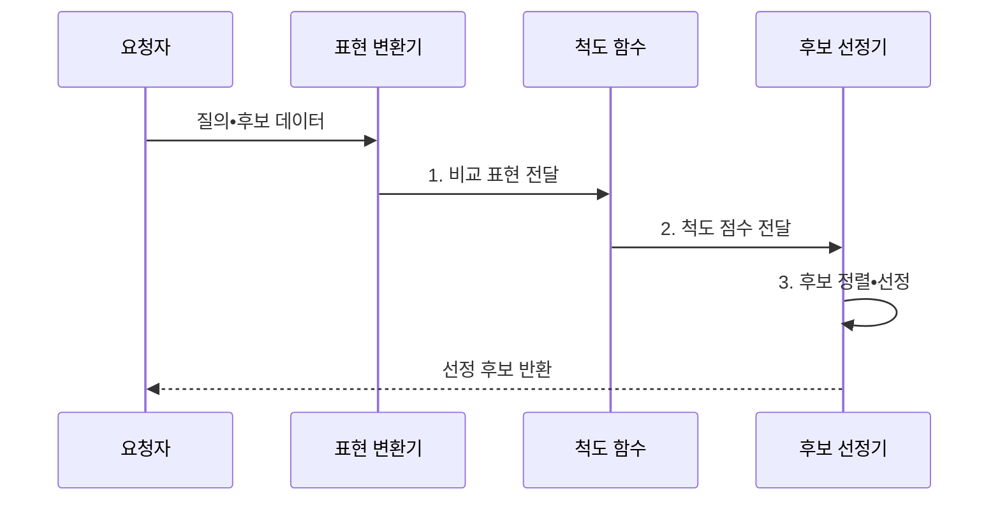

---
sidebar:
  order: 37
  label: "037. 유사도 측정: 코사인•자카드•유클리드 (Similarity Measures)"
  badge:
    text: "기출 • 50%"
    variant: note
title: "유사도 측정: 코사인•자카드•유클리드 (Similarity Measures)"
date: "2026-08-02T10:05:00+09:00"
tags:
  - "notes-basic-theory"
weight: 37
extra:
  question_no: "037"
  source_status: "기출"
  source_history: "128회"
  priority: 50
  priority_note: "거리•유사도 척도 선택의 높은 재사용성"
---

## Ⅰ. 개요

핵심 용어

- **유사도 측정**: 거리•방향•집합 중첩 중 데이터에 맞는 기준으로 두 대상의 근접도를 재는 척도
- **특징 벡터**: 비교 대상의 속성을 같은 순서의 숫자 좌표로 나타낸 목록

- 정의/개념: 거리•각도•**집합 중첩**으로 유사성을 재는 척도
- 배경/필요성: 표현별 근접 기준 차이로 **검색•추천 순위 변동**

### 쉽게 이해하기 (학습용)
- 사람을 키와 취미 중 무엇으로 비교할지 정하듯, 검색•추천도 데이터 표현에 맞는 유사도를 골라야 한다.

## Ⅱ. 특징

핵심 용어

- **정규화**: 벡터 길이나 변수 범위를 맞춰 크기 차이가 근접도 순위를 지배하지 않게 하는 처리
- **이웃 순위**: 선택한 척도 점수에 따라 질의와 가까운 후보를 나열한 순서
- **거리•유사도**: 값이 작을수록 가깝거나 값이 클수록 비슷하다고 해석하는 상반된 근접도 표현

- 척도별 **유사도 정의** 차이로 동일 데이터 **순위 역전**
- **특징 표현**•**정규화** 방식에 따라 달라지는 이웃 순위
- 거리는 **최솟값**, 유사도는 **최댓값** 기준 근접 판정

### 쉽게 이해하기 (학습용)
- 같은 사람 목록도 키 차이•취미 각도•보유 항목 겹침 중 어떤 자를 쓰고 단위를 맞추는지에 따라 가장 가까운 이웃이 달라진다.

## Ⅲ. 구조 및 구성요소

핵심 용어

- **표현 변환기**: 원시 속성을 같은 순서의 벡터나 원소 집합으로 바꾸는 구성요소
- **척도 함수**: 두 표현의 거리•각도•교집합 비율을 계산하는 함수
- **임계값•상위 $k$개**: 점수 경계를 넘거나 정렬 순위가 높은 후보를 선택하는 기준

| 구성요소 | 책임 |
|:---|:---|
| 표현 변환기 | 속성을 **벡터•집합**으로 변환•정규화 |
| 척도 함수 | 거리•각도•**교집합 비율** 산출 |
| 후보 선정기 | **임계값•상위 k개**로 후보 확정 |

### 쉽게 이해하기 (학습용)

- 변환기가 질의와 후보를 같은 표현으로 맞추고, 척도 함수의 점수를 후보 선정기가 정렬한다.

## Ⅳ. 흐름도

핵심 용어

- **질의(Query)**: 검색 시스템에서 다른 후보와 비교하는 기준 입력
- **비교 표현**: 질의와 후보를 동일한 벡터나 집합 형식으로 맞춘 데이터
- **척도 점수**: 선택한 유사도나 거리 함수가 두 대상을 비교해 산출한 값

### 동작 원리

- **1. 비교 표현 전달**: 벡터•집합 변환과 정규화
- **2. 척도 점수 전달**: 표현에 맞는 근접도 산출
- **3. 후보 정렬•선정**: 방향에 맞춰 기준 적용

### 쉽게 이해하기 (학습용)
- 질문과 후보를 같은 좌표표나 집합표에 놓고 거리를 재면, 유사도는 큰 점수부터 거리값은 작은 값부터 줄을 세운다.

## Ⅴ. 종류 및 비교

핵심 용어

- **코사인 유사도**: 벡터 크기를 제거하고 두 방향의 일치도를 내적으로 재는 척도
- **자카드 유사도**: 합집합 중 교집합이 차지하는 비율로 두 집합의 겹침을 재는 척도
- **유클리드 거리**: 좌표 차이 제곱합의 제곱근으로 두 점의 직선거리를 재는 척도
- **노름**: 벡터의 크기를 나타내며 코사인 유사도의 정규화에 쓰는 값

| 유사도 척도 | 코사인 유사도 | 자카드 유사도 | 유클리드 거리 |
|:---|:---|:---|:---|
| 적용 기준 | 길이 편차 큰 **희소 벡터** | **원소 포함 여부**만 있는 집합 | 단위 통일된 **연속 좌표** |
| 핵심 특징 | 크기 무관 **방향 일치도** | **교집합** 대비 합집합 비율 | 좌표 간 **직선거리** |
| 한계 | **노름** 정보 소실로 크기 구분 불가 | **출현 빈도** 무시•이진 표현 한정 | 단위 큰 변수의 **거리 지배** |

> 요약: 표현이 **벡터**•집합 중 무엇인지가 척도 선택의 1차 분기

### 쉽게 이해하기 (학습용)
- 문서 길이와 무관한 단어 방향은 코사인, 두 장바구니 품목 겹침은 자카드, 같은 단위 지도 좌표의 직선거리는 유클리드가 맞다.

## Ⅵ. 실무 고려사항 및 대책

핵심 용어

- **표준화•가중 거리**: 변수 단위를 맞추거나 중요도에 따라 좌표 차이에 가중치를 적용하는 처리
- **영벡터**: 모든 원소가 0이라 노름이 0이고 코사인 유사도를 정의할 수 없는 벡터
- **가중 자카드**: 원소 보유 여부뿐 아니라 원소별 크기나 빈도도 반영하는 집합 유사도
- **온라인 지표**: 실제 사용자 상호작용으로 검색•추천 품질을 측정하는 운영 지표

| 문제 | 대책 | 효과 |
|:---|:---|:---|
| 변수 단위의 **유클리드 거리 지배** | 표준화•가중 거리 적용 | 좌표별 **영향 균형** |
| 영벡터의 **코사인 분모 0** | 영벡터 별도 처리•최소 노름 검사 | **계산 오류** 방지 |
| 자카드의 **빈도 정보 손실** | 가중 자카드•코사인과 업무 성능 비교 | **표현 정보** 보존 |
| 오프라인 척도와 **실제 관련성** 불일치 | 정답 쌍•온라인 지표로 임계값•$k$ 검증 | **검색•추천 품질** 확보 |
| 컨테이너 이미지 **중복 탐지** | 패키지 집합의 자카드 임계값 적용 | **중복 저장 후보** 식별 |

### 쉽게 이해하기 (학습용)
- 센티미터와 원 단위를 그대로 섞지 말고 영벡터를 따로 처리한 뒤, 사람이 관련 있다고 표시한 쌍으로 점수 문턱과 상위 후보 수를 맞춘다.

## Ⅶ. 결론

핵심 용어

- **벡터 방향•집합 중첩•연속 좌표**: 코사인•자카드•유클리드 척도가 각각 비교하는 데이터 관계

- 벡터 방향은 **코사인**, 집합은 **자카드**, 연속 좌표는 유클리드 선택

### 쉽게 이해하기 (학습용)
- 길이 차를 지운 벡터 방향은 코사인, 포함 항목 집합은 자카드, 단위를 맞춘 연속 좌표는 유클리드로 비교한다.
