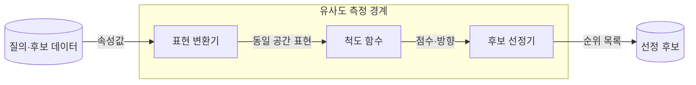

---
sidebar:
  order: 37
  label: "037. 유사도 측정 — 코사인·자카드·유클리드 (Similarity Measures)"
  badge:
    text: "기출 · 50%"
    variant: note
title: "유사도 측정 — 코사인·자카드·유클리드 (Similarity Measures)"
date: "2026-07-28T12:10:39+09:00"
tags:
  - "notes-basic-theory"
weight: 37
extra:
  question_no: "037"
  source_status: "기출"
  source_history: "128회"
  priority: 50
  priority_note: "거리·유사도 척도 선택의 높은 재사용성"
---

## 미리 알고가기

- **유사도 측정(Similarity Measure)**: 거리·방향·집합 중첩 등 데이터 특성에 적합한 기준으로 두 대상의 유사한 정도를 정량화하는 척도다.
- **특징 벡터(Feature Vector)**: 비교 대상의 속성을 정해진 순서대로 숫자로 늘어놓은 목록이며, 이 목록이 있어야 두 대상 간 거리나 각도를 계산할 수 있다.
- **정규화(Normalization)**: 벡터의 길이를 1로 맞추거나 변수마다 값의 폭을 같은 크기로 조정하는 처리이며, 이 처리를 하느냐에 따라 같은 데이터에서도 가장 가까운 이웃이 바뀐다.
- **희소 벡터(Sparse Vector)**: 원소 대부분이 0이고 일부만 값을 가지는 벡터이며, 문서를 단어 등장 횟수로 표현하면 문서 길이에 따라 벡터의 크기가 크게 벌어진다.
- **선정 기준(Threshold·Top-$k$)**: 점수 경계를 넘는 후보 또는 상위 $k$개 후보를 선택하는 기준
- **코사인 유사도(Cosine Similarity)**: 두 벡터의 내적을 각 벡터의 크기로 정규화하여 벡터 방향의 유사성을 측정하는 척도다.
- **자카드 유사도(Jaccard Similarity)**: 두 집합이 함께 가진 원소 수를 둘을 합친 원소 수로 나눠 겹침 비율을 재는 척도이며, 값의 크기가 아니라 원소를 가졌는지 여부만 본다.
- **유클리드 거리(Euclidean Distance)**: 각 좌표 차이를 제곱해 더한 뒤 제곱근을 취해 두 점 사이의 곧은 직선거리를 재는 척도이며, 값이 작을수록 가깝다는 뜻이라 유사도와 방향이 반대다.
- **노름(Norm)**: 벡터의 크기를 나타내는 값으로, 코사인 유사도에서는 각 벡터를 노름으로 나누어 크기의 영향을 제거한다.
- **질의(Query)**: 검색 시스템에 입력해 관련 후보를 찾게 하는 단어나 벡터이며, 유사도 계산에서 나머지 후보와 견주는 기준점이 된다.
- **컨테이너 이미지(Container Image)**: 프로그램과 실행에 필요한 파일·패키지를 함께 묶은 읽기 전용 실행 틀이며, 어떤 패키지를 담았는지가 곧 비교할 집합이 된다.

## Ⅰ. 개요

- 정의/개념: 거리·각도·**교집합 비율**로 근접도를 정량화하는 **척도**
- 기존 한계: **순위 산정** 기준 없이는 검색·군집·추천 후보 정렬 불가

### 쉽게 이해하기 (학습용)
- 검색·추천 후보를 정렬하려면 데이터 표현에 맞는 근접도 기준이 필요하다.

## Ⅱ. 특징

- 척도별 **유사도 정의** 차이로 동일 데이터 **순위 역전**
- **특징 표현**·**정규화** 방식에 좌우되는 이웃 순위
- 거리는 **최솟값**, 유사도는 **최댓값** 기준 근접 판정

### 쉽게 이해하기 (학습용)
- 같은 데이터도 척도와 정규화가 달라지면 이웃 순위가 바뀔 수 있다.

## Ⅲ. 측정 구성

| 설계 요소 | 설명 |
|:---|:---|
| 표현 변환기 | 속성을 **특징 벡터**·집합으로 변환·척도 조정 |
| 척도 함수 | 거리·각도·**교집합 비율** 산출 |
| 후보 선정기 | **임계값**·상위 $k$개 기준 후보 확정 |

> 요약: **표현 방식**과 척도 선택에 따라 달라지는 **후보 순위**

### 쉽게 이해하기 (학습용)
- 질의와 후보를 같은 표현 공간으로 바꾼 뒤 척도 점수와 방향으로 순위를 정한다.

## Ⅳ. 운영 고려사항

| 고려사항 | 대응 방안 | 기대 효과 |
|:---|:---|:---|
| 변수 단위가 유클리드 거리를 지배 | 표준화·가중 거리 적용 | 좌표별 영향 균형 |
| 영벡터의 코사인 분모 0 | 영벡터 별도 처리·최소 노름 검사 | 계산 오류 방지 |
| 자카드가 빈도 정보를 손실 | 가중 자카드·코사인과 업무 성능 비교 | 표현 정보 보존 |
| 오프라인 척도와 실제 관련성 불일치 | 정답 쌍·온라인 지표로 임계값과 $k$ 검증 | 검색·추천 품질 확보 |

### 쉽게 이해하기 (학습용)
- 표현·척도·점수 방향·선정 기준을 함께 고정하고 실제 관련성으로 검증한다.

## Ⅴ. 종류 및 비교

| 유사도 척도 | 코사인 유사도 | 자카드 유사도 | 유클리드 거리 |
|:---|:---|:---|:---|
| 적용 기준 | 길이 편차 큰 **희소 벡터** | **원소 포함 여부**만 있는 집합 | 단위 통일된 **연속 좌표** |
| 핵심 특징 | 크기 무관 **방향 일치도** | **교집합** 대비 합집합 비율 | 좌표 간 **직선거리** |
| 한계 | **노름** 정보 소실로 크기 구분 불가 | **출현 빈도** 무시·이진 표현 한정 | 단위 큰 변수의 **거리 지배** |

> 요약: 표현이 **벡터**·집합 중 무엇인지가 척도 선택의 1차 분기

### 쉽게 이해하기 (학습용)
- 방향 유사성은 코사인, 집합 중첩은 자카드, 좌표 거리는 유클리드가 적합하다.

## Ⅵ. 실무 사례

1. **컨테이너 이미지** 패키지 집합의 **자카드** 중복 탐지

### 쉽게 이해하기 (학습용)
- 이미지별 패키지 집합의 자카드 유사도로 중복 후보를 찾는다.

## Ⅶ. 결론

- 객체 비교를 위해 표현·척도를 검토하여 **유사도** 활용

### 쉽게 이해하기 (학습용)
- 데이터가 벡터인지 집합인지와 변수 척도에 따라 유사도 함수를 선택한다.
