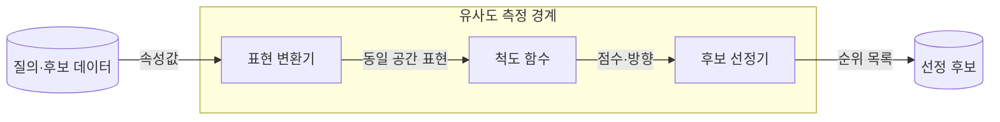
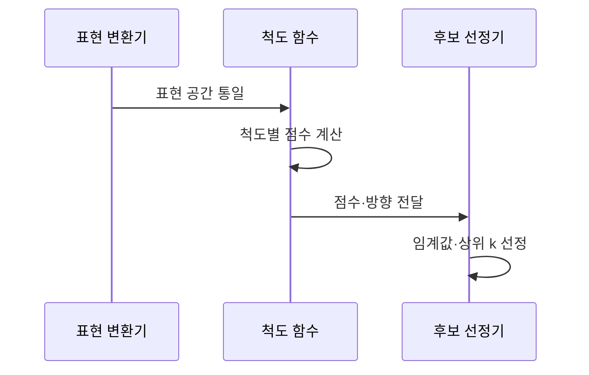

---
sidebar:
  order: 37
  label: "037. 유사도 측정 — 코사인·자카드·유클리드 (Similarity Measures)"
  badge:
    text: "기출 · 50%"
    variant: note
title: "유사도 측정 — 코사인·자카드·유클리드 (Similarity Measures)"
date: "2026-07-27T22:26:00+09:00"
tags:
  - "notes-basic-theory"
weight: 37
extra:
  question_no: "037"
  source_status: "기출"
  source_history: "128회"
  priority: 50
  priority_note: "거리·유사도 척도 선택의 높은 재사용성"
---

## 미리 알고가기

- **유사도 측정(Similarity Measure)**: 거리·방향·집합 중첩 등 데이터 특성에 적합한 기준으로 두 대상의 유사한 정도를 정량화하는 척도다.
- **특징 벡터(Feature Vector)**: 비교 대상의 속성을 정해진 순서대로 숫자로 늘어놓은 목록이며, 이 목록이 있어야 두 대상 간 거리나 각도를 계산할 수 있다.
- **정규화(Normalization)**: 벡터의 길이를 1로 맞추거나 변수마다 값의 폭을 같은 크기로 조정하는 처리이며, 이 처리를 하느냐에 따라 같은 데이터에서도 가장 가까운 이웃이 바뀐다.
- **희소 벡터(Sparse Vector)**: 원소 대부분이 0이고 일부만 값을 가지는 벡터이며, 문서를 단어 등장 횟수로 표현하면 문서 길이에 따라 벡터의 크기가 크게 벌어진다.
- **선정 기준(Threshold·Top-$k$)**: ‘스레시홀드·톱 케이’로 읽고 $k$는 선택할 개수에 관례적으로 쓰는 변수이며, 점수 경계를 넘는 후보 또는 점수가 높은 상위 $k$개 후보를 결과로 정한다.
- **코사인 유사도(Cosine Similarity)**: 두 벡터의 내적을 각 벡터의 크기로 정규화하여 벡터 방향의 유사성을 측정하는 척도다.
- **자카드 유사도(Jaccard Similarity)**: 두 집합이 함께 가진 원소 수를 둘을 합친 원소 수로 나눠 겹침 비율을 재는 척도이며, 값의 크기가 아니라 원소를 가졌는지 여부만 본다.
- **유클리드 거리(Euclidean Distance)**: 각 좌표 차이를 제곱해 더한 뒤 제곱근을 취해 두 점 사이의 곧은 직선거리를 재는 척도이며, 값이 작을수록 가깝다는 뜻이라 유사도와 방향이 반대다.
- **노름(Norm)**: 벡터의 크기를 나타내는 값으로, 코사인 유사도에서는 각 벡터를 노름으로 나누어 크기의 영향을 제거한다.
- **질의(Query)**: 검색 시스템에 입력해 관련 후보를 찾게 하는 단어나 벡터이며, 유사도 계산에서 나머지 후보와 견주는 기준점이 된다.
- **컨테이너 이미지(Container Image)**: 프로그램과 실행에 필요한 파일·패키지를 함께 묶은 읽기 전용 실행 틀이며, 어떤 패키지를 담았는지가 곧 비교할 집합이 된다.

## Ⅰ. 개요

- 정의/개념: 거리·각도·**교집합 비율**로 근접도를 정량화하는 **척도**
- 기존 한계: **순위 산정** 기준 없이는 검색·군집·추천 후보 정렬 불가

### 쉽게 이해하기 (학습용)
- 답안이 기존 한계로 `순위 산정 기준`을 든 이유는, 검색이든 추천이든 결국 후보를 한 줄로 세워 위에서부터 보여 주는 일인데 무엇을 기준으로 앞에 세울지 정하지 않으면 줄 자체를 만들 수 없고, 닮은 사람을 찾을 때도 키로 잴지 취미로 잴지부터 정해야 순서가 나오기 때문이다.

## Ⅱ. 특징

- 척도별 **유사도 정의** 차이로 동일 데이터 **순위 역전**
- **특징 표현**·**정규화** 방식에 좌우되는 이웃 순위
- 거리는 **최솟값**, 유사도는 **최댓값** 기준 근접 판정

### 쉽게 이해하기 (학습용)
- 답안이 `순위 역전`까지 적은 이유는, 같은 두 문서를 놓고도 단어를 몇 번 썼는지 그 양으로 재는 자를 대면 긴 문서가 멀어 보이지만 어느 쪽을 가리키는지 방향으로 재는 자를 대면 그 긴 문서가 오히려 1등이 되어, 자를 바꾸는 것만으로 1등과 3등이 자리를 바꿔 버리기 때문이다.

## Ⅲ. 아키텍처 및 구성요소

| 설계 요소 | 설명 |
|:---|:---|
| 표현 변환기 | 속성을 **특징 벡터**·집합으로 변환·척도 조정 |
| 척도 함수 | 거리·각도·**교집합 비율** 산출 |
| 후보 선정기 | **임계값**·상위 $k$개 기준 후보 확정 |

> 요약: **표현 방식**과 척도 선택에 따라 달라지는 **후보 순위**

### 쉽게 이해하기 (학습용)
- 답안이 척도 함수 앞에 표현 변환기를 따로 세운 이유는, 자를 아무리 잘 골라도 한쪽은 숫자 목록이고 다른 쪽은 단어 묶음이면 애초에 같은 자를 댈 수 없기 때문이며, 두 대상을 같은 모양의 벡터나 같은 종류의 집합으로 먼저 바꿔 놓아야 그다음에야 거리든 각도든 잴 수 있다.

## Ⅳ. 원리 및 절차 흐름도

| 절차 | 설명 |
|:---|:---|
| 표현 공간 통일 | 질의·후보를 같은 **벡터**·집합으로 변환 |
| 척도별 점수 계산 | 방향·**교집합 비율**·직선거리 산출 |
| 점수·방향 전달 | 거리 **최솟값**·유사도 **최댓값** 기준 명시 |
| 임계값·상위 k 선정 | 경계 초과 또는 **상위 $k$개** 확정 |

> 요약: 동일한 **표현 공간**에서 산출한 점수로 이웃 순위 확정

### 쉽게 이해하기 (학습용)
- 답안이 `점수·방향 전달`을 따로 한 단계로 세운 이유는, 유클리드 거리는 0에 가까울수록 닮은 것이고 코사인 유사도는 1에 가까울수록 닮은 것이어서 점수만 넘기면 받는 쪽이 큰 값을 위로 올릴지 아래로 내릴지 알 수 없기 때문이며, 어느 쪽이 좋은 점수인지를 함께 알려 줘야 줄 세우기가 뒤집히지 않는다.

## Ⅴ. 종류 및 비교

| 유사도 척도 | 코사인 유사도 | 자카드 유사도 | 유클리드 거리 |
|:---|:---|:---|:---|
| 적용 기준 | 길이 편차 큰 **희소 벡터** | **원소 포함 여부**만 있는 집합 | 단위 통일된 **연속 좌표** |
| 핵심 특징 | 크기 무관 **방향 일치도** | **교집합** 대비 합집합 비율 | 좌표 간 **직선거리** |
| 한계 | **노름** 정보 소실로 크기 구분 불가 | **출현 빈도** 무시·이진 표현 한정 | 단위 큰 변수의 **거리 지배** |

> 요약: 표현이 **벡터**·집합 중 무엇인지가 척도 선택의 1차 분기

### 쉽게 이해하기 (학습용)
- 답안이 세 척도를 나란히 둔 이유는 이들이 우열 관계가 아니라 서로 다른 질문에 답하기 때문인데, 두 사람이 같은 곳을 바라보는지 묻는다면 코사인이고 주머니 속 물건이 얼마나 겹치는지 묻는다면 자카드이며 둘이 실제로 몇 걸음 떨어져 서 있는지 묻는다면 유클리드다.

## Ⅵ. 실무 사례

1. **컨테이너 이미지** 패키지 집합의 **자카드** 중복 탐지

### 쉽게 이해하기 (학습용)
- 컨테이너 이미지가 담은 패키지 목록은 순서도 개수도 제각각이라 벡터로 재기 어렵지만 어떤 패키지를 가졌는지의 모음으로 보면 겹치는 비율을 바로 셀 수 있어서, 거의 같은 패키지를 담은 이미지끼리 묶어 중복으로 쌓인 이미지를 걷어 낼 수 있다.

## Ⅶ. 결론

- 객체 비교를 위해 표현·척도를 검토하여 **유사도** 활용

### 쉽게 이해하기 (학습용)
- 척도를 고르는 일은 어느 공식이 더 정교한가를 따지는 게 아니라 내 데이터가 숫자 좌표인지 원소 묶음인지, 그리고 변수들의 눈금이 이미 맞춰져 있는지를 먼저 확인하는 일이며, 그 두 가지가 정해지면 쓸 수 있는 자는 사실상 하나로 좁혀진다.
