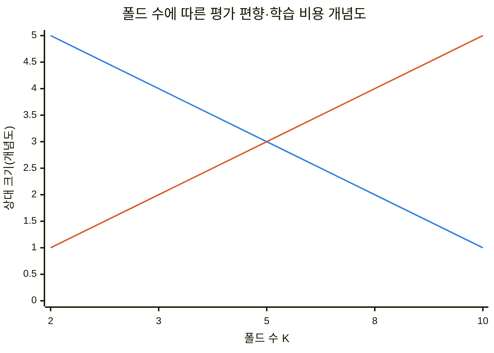
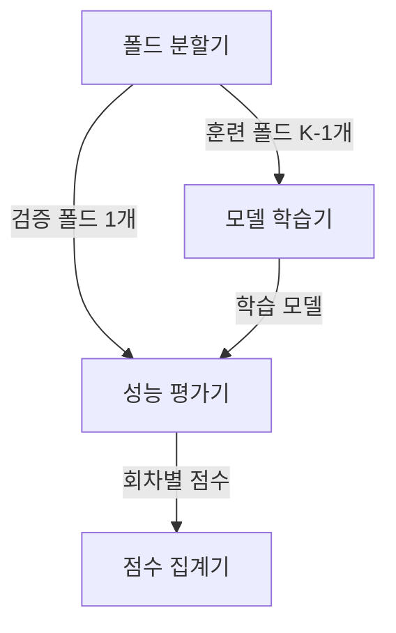
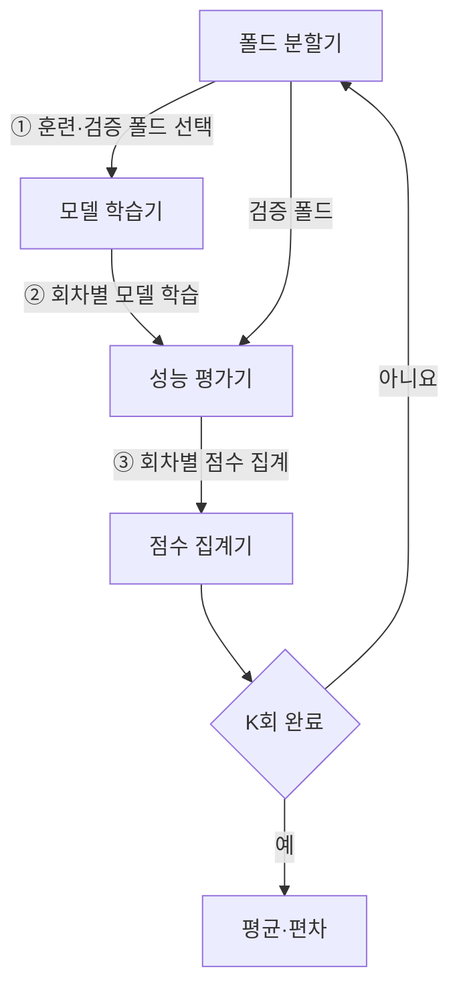
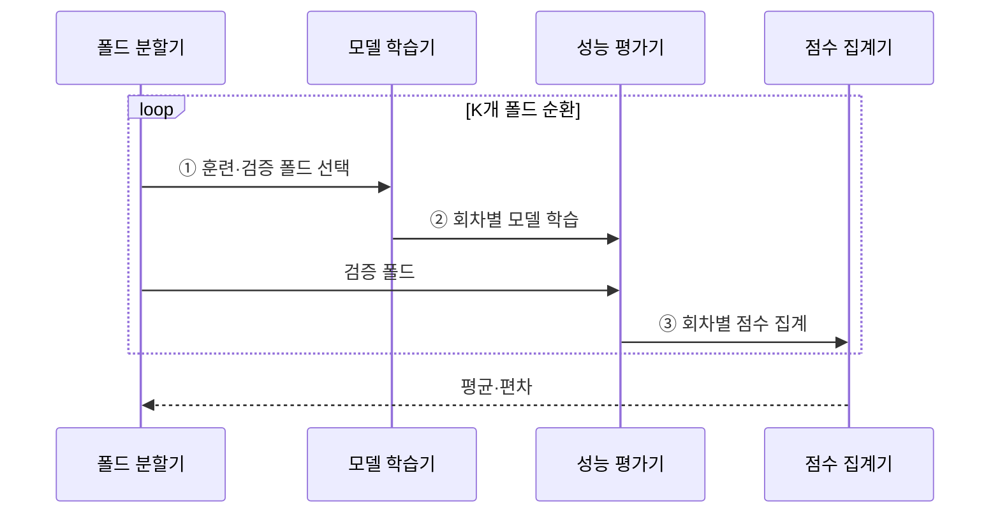

---
sidebar:
  order: 38
  label: "038. K-Fold 교차 검증 (K-Fold Cross-Validation)"
  badge:
    text: "기출 · 50%"
    variant: note
title: "K-Fold 교차 검증 (K-Fold Cross-Validation)"
date: "2026-07-28T17:16:00+09:00"
tags:
  - "notes-basic-theory"
weight: 38
extra:
  question_no: "038"
  source_status: "기출"
  source_history: "128회"
  priority: 50
  priority_note: "누수 방지·평가 분할 설계의 높은 가치"
---

## 미리 알고가기

- **K-Fold 교차 검증(K-Fold Cross-Validation)**: 데이터를 K개 폴드로 나누고 각 폴드를 한 번씩 검증에 사용하여 K회의 평가 결과를 평균하는 모델 평가 방법이다.
- **폴드(Fold)**: 전체 데이터를 비슷한 크기로 접어 나눈 표본 묶음이며, 회차마다 이 묶음 하나가 검증용으로 빠지고 나머지가 학습에 쓰인다.
- **기호 $K$**: 전체 폴드 수와 반복할 학습·검증 횟수
- **홀드아웃(Hold-out)**: 데이터를 학습용과 검증용으로 딱 한 번만 갈라 놓고 끝내는 평가법이며, 어느 표본이 검증 쪽에 걸렸는지에 따라 점수가 크게 흔들린다.
- **데이터 누수(Data Leakage)**: 검증에만 써야 할 정보가 학습 쪽으로 새어 들어가는 오류이며, 시험 문제를 미리 본 셈이라 평가 점수가 실제 배포 성능보다 높게 나온다.
- **층화 추출(Stratification)**: 폴드마다 클래스 비율을 전체 데이터와 비슷하게 맞춰 뽑는 방식이며, 소수 클래스가 한 폴드에 몰려 다른 폴드에서 아예 사라지는 일을 막는다.
- **그룹 분할(Group Split)**: 같은 사용자나 같은 장비에서 나온 표본을 한 폴드에 모아 두는 방식이며, 같은 개체의 자료가 학습과 검증에 나뉘어 들어가는 누수를 방지한다.
- **평가 편향(Evaluation Bias)**: 제한된 학습 표본 때문에 평가 점수가 실제 배포 성능과 한쪽 방향으로 어긋나는 경향이며, 학습에 쓰는 폴드가 많아질수록 이 어긋남이 줄어든다.
- **평가 분산(Evaluation Variance)**: 어떻게 나누느냐에 따라 평가 점수가 회차마다 들쭉날쭉해지는 정도이며, 점수 하나가 아니라 여러 회차의 편차를 함께 봐야 신뢰할 수 있다.
- **일반 K-Fold**: 표본 순서를 무작위로 섞은 뒤 비슷한 크기의 폴드로 나누는 기본 방식
- **층화 K-Fold(Stratified K-Fold)**: 각 폴드의 클래스 비율을 전체 데이터와 비슷하게 유지하는 방식
- **그룹 K-Fold(Group K-Fold)**: 같은 사용자·장비처럼 서로 의존하는 표본을 같은 폴드에 묶는 방식
- **시계열 분할(Time-Series Split)**: 시간 순서를 보존해 과거 구간으로 학습하고 뒤의 구간으로 검증하는 방식
- **교환 가능 표본(Exchangeable Samples)**: 표본 순서를 바꿔도 결합 분포가 달라지지 않아 무작위 분할이 가능한 표본
- **불균형 분류(Imbalanced Classification)**: 클래스별 표본 수 차이로 소수 클래스 평가 점수의 변동성이 커지는 분류 문제
- **전처리(Preprocessing)**: 결측값 처리·척도 변환처럼 모델 학습 전에 데이터를 바꾸는 과정이며 검증 정보 누수를 피하려면 훈련 폴드에서만 기준을 구함

## Ⅰ. 개요

- 정의/개념: 표본을 $K$개 **폴드**로 나눠 순환 평가하는 **교차 검증**
- 기존 한계: **홀드아웃** 단일 분할은 표본 구성에 따른 **평가 편차** 큼

### 쉽게 이해하기 (학습용)
- 단일 홀드아웃은 검증 표본 구성에 따라 점수가 흔들리므로 여러 폴드의 평균과 편차가 필요하다.

## Ⅱ. 특징

- 모든 표본을 한 번씩 검증에 사용하는 **순환 평가**
- $K$회 재학습에 따른 **평가 안정성**·**계산 비용** 상충
- 회차별 점수 **평균·편차**로 분할 민감도 평가

> K 증가에 따라 평가 편향은 줄고 학습 비용은 느는 상충

■ **평가 편향** &nbsp;&nbsp; ■ **학습 비용**

> 폴드 수 증가는 평가 편향을 줄이지만 재학습 횟수 증가

### 쉽게 이해하기 (학습용)
- 폴드 수가 커지면 학습 표본은 늘지만 모델 재학습 횟수와 계산 비용도 증가한다.

## Ⅲ. 아키텍처

**도표안 A — 구조도**

**도표안 B — 동작 흐름도**

**도표안 C — sequenceDiagram**

| 구성요소 | 책임 |
|:---|:---|
| 폴드 분할기 | $K-1$개 **훈련 폴드**·1개 **검증 폴드** 순환 |
| 모델 학습기 | 훈련 폴드 기준 **회차별 모델** 생성 |
| 성능 평가기 | 검증 폴드 **예측 성능** 산출 |
| 점수 집계기 | 회차별 점수 **평균**·**편차** 계산 |

**동작 원리**

- **① 훈련·검증 폴드 선택**: 회차별 검증 폴드 하나를 분리
- **② 회차별 모델 학습**: 나머지 폴드에서 전처리·모델 적합
- **③ 회차별 점수 집계**: 검증 점수의 평균·편차 산출

### 쉽게 이해하기 (학습용)
- 회차별 점수의 평균과 편차를 함께 집계해 모델 성능과 분할 민감도를 평가한다.

## Ⅳ. 종류 및 비교

| 교차 검증 방식 | 일반 K-Fold | 층화 K-Fold | 그룹 K-Fold | 시계열 분할 |
|:---|:---|:---|:---|:---|
| 적용 기준 | **독립·교환 가능** 표본 | **불균형 분류** 문제 | 사용자·장비 **반복 측정** | 미래 구간 **예측 과제** |
| 핵심 특징 | 무작위 **균등 폴드** 순환 | 폴드별 **클래스 비율** 유지 | 같은 개체를 **한 폴드**에 유지 | **시간 순서** 보존 분할 |
| 한계 | 의존 표본에서 **데이터 누수** | 소수 클래스 수가 **폴드 수** 미만이면 비율 유지 불가 | **그룹 수** 부족 시 폴드 구성 제약 | 초기 회차 **학습 구간** 부족 |

> 요약: 표본 독립 가정의 성립 여부를 고려해 **분할 규칙** 선택

### 쉽게 이해하기 (학습용)
- 독립 표본은 일반, 불균형은 층화, 반복 개체는 그룹, 시간 의존은 시계열 분할이 적합하다.

## Ⅴ. 실무 고려사항 및 대책

| 고려사항 | 대책 | 효과 |
|:---|:---|:---|
| 전처리 기준의 **검증 정보 누수** | 회차별 훈련 폴드에서만 전처리 적합 | **일반화 성능 과대평가** 방지 |
| 동일 사용자·장비 **표본 분산** | **그룹 단위 분할** 적용 | **개체 정보 누수** 방지 |
| 불균형 클래스의 **폴드별 소실** | **층화 분할**·최소 클래스 수 점검 | **평가 지표** 변동 감소 |
| 시계열 **무작위 혼합** | 과거 학습·미래 검증 순서 보존 | **배포 시점 성능** 모사 |
| 장애 로그의 **전처리 기준** | 훈련 폴드에서만 결측·스케일 기준 산출 | 미래 정보 없는 **평가** |

### 쉽게 이해하기 (학습용)
- 전처리와 분할 단위를 평가 목적에 맞춰 각 훈련 폴드 안에서만 계산한다.

## Ⅵ. 결론

- 표본 의존성·불균형·시간 순서에 맞는 **교차 검증 분할** 결정

### 쉽게 이해하기 (학습용)
- 표본 의존성·불균형·시간 순서를 먼저 확인한 뒤 분할 규칙을 선택한다.
