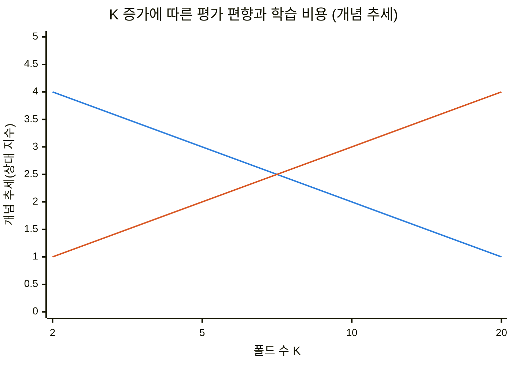
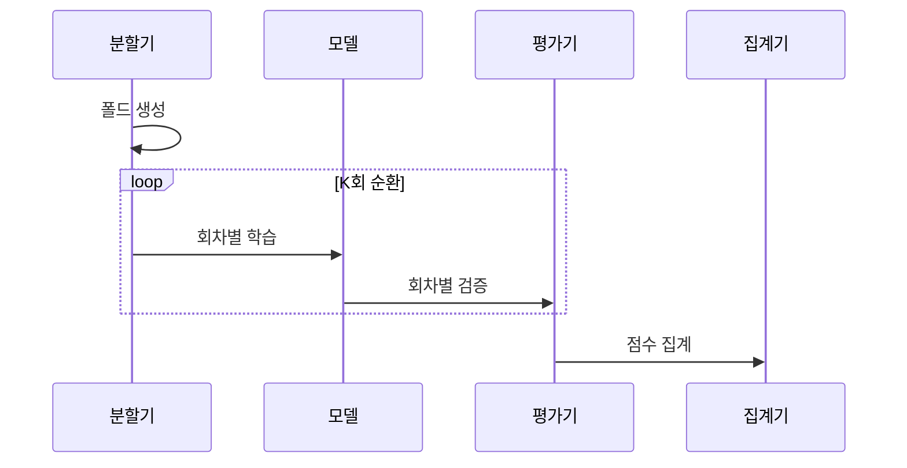

---
sidebar:
  order: 38
  label: "038. K-Fold 교차 검증 (K-Fold Cross-Validation)"
  badge:
    text: "기출 · 50%"
    variant: note
title: "K-Fold 교차 검증 (K-Fold Cross-Validation)"
date: "2026-07-26T22:16:20+09:00"
tags:
  - "notes-basic-theory"
weight: 38
extra:
  question_no: "038"
  source_status: "기출"
  source_history: "128회"
  priority: 50
  priority_note: "누수 방지·평가 분할 설계의 높은 가치"
---

## 미리 알고가기

- **K-Fold 교차 검증(K-Fold Cross-Validation)**: 시험지 한 장을 여러 조가 돌려 가며 한 번씩 풀어 보고 그 점수들을 모아 평균 내는 장면을 떠올리면 되며, ‘케이 폴드 크로스 밸리데이션’으로 읽고 K는 묶음 수, Fold는 접어 나눈 묶음을 뜻하는 이름으로 각 묶음을 한 번씩 검증에 써서 어떻게 나누느냐에 따라 점수가 달라지는 편차를 줄이는 평가법이다.
- **폴드(Fold)**: 전체 데이터를 비슷한 크기로 접어 나눈 표본 묶음이며, 회차마다 이 묶음 하나가 검증용으로 빠지고 나머지가 학습에 쓰인다.
- **기호 $K$**: ‘케이’로 읽고 묶음 개수에 관례적으로 쓰는 문자 표기이며, 전체 폴드 수와 반복할 학습·검증 횟수를 가리킨다.
- **홀드아웃(Hold-out)**: 데이터를 학습용과 검증용으로 딱 한 번만 갈라 놓고 끝내는 평가법이며, 어느 표본이 검증 쪽에 걸렸는지에 따라 점수가 크게 흔들린다.
- **데이터 누수(Data Leakage)**: 검증에만 써야 할 정보가 학습 쪽으로 새어 들어가는 오류이며, 시험 문제를 미리 본 셈이라 평가 점수가 실제 배포 성능보다 높게 나온다.
- **층화 추출(Stratification)**: 폴드마다 클래스 비율을 전체 데이터와 비슷하게 맞춰 뽑는 방식이며, 소수 클래스가 한 폴드에 몰려 다른 폴드에서 아예 사라지는 일을 막는다.
- **그룹 분할(Group Split)**: 같은 사용자나 같은 장비에서 나온 표본을 한 폴드에 모아 두는 방식이며, 같은 개체의 자료가 학습과 검증에 나뉘어 들어가는 누수를 방지한다.
- **평가 편향(Evaluation Bias)**: 제한된 학습 표본 때문에 평가 점수가 실제 배포 성능과 한쪽 방향으로 어긋나는 경향이며, 학습에 쓰는 폴드가 많아질수록 이 어긋남이 줄어든다.
- **평가 분산(Evaluation Variance)**: 어떻게 나누느냐에 따라 평가 점수가 회차마다 들쭉날쭉해지는 정도이며, 점수 하나가 아니라 여러 회차의 편차를 함께 봐야 신뢰할 수 있다.
- **일반 K-Fold**: 표본 순서를 무작위로 섞은 뒤 비슷한 크기의 폴드로 나누는 기본 방식
- **층화 K-Fold(Stratified K-Fold)**: 각 폴드의 클래스 비율을 전체 데이터와 비슷하게 유지하는 방식
- **그룹 K-Fold(Group K-Fold)**: 같은 사용자·장비처럼 서로 의존하는 표본을 같은 폴드에 묶는 방식
- **시계열 분할(Time-Series Split)**: 시간 순서를 보존해 과거 구간으로 학습하고 뒤의 구간으로 검증하는 방식
- **교환 가능 표본(Exchangeable Samples)**: 표본 순서를 바꿔도 결합 분포가 달라지지 않아 무작위 분할이 가능한 표본
- **불균형 분류(Imbalanced Classification)**: 클래스별 표본 수 차이로 소수 클래스 평가 점수의 변동성이 커지는 분류 문제
- **전처리(Preprocessing)**: 결측값 처리·척도 변환처럼 모델 학습 전에 데이터를 바꾸는 과정이며 검증 정보 누수를 피하려면 훈련 폴드에서만 기준을 구함

## Ⅰ. 개요

- **정의/개념**: 표본을 $K$개 **폴드**로 나눠 순환 평가하는 **교차 검증**
- **기존 한계**: **홀드아웃** 단일 분할은 **평가 편향**·분산 통제 불가

### 쉽게 이해하기 (학습용)
- 답안이 굳이 `단일 분할`을 문제로 지목한 이유는, 시험지를 한 번만 갈라 놓으면 하필 쉬운 문제가 시험지 쪽에 몰렸을 때 실력보다 높은 점수가 나오고 그 우연을 확인할 방법이 없기 때문이며, 조를 바꿔 가며 여러 번 시험을 치러야 그 점수가 운인지 실력인지 편차로 드러난다.

## Ⅱ. 특징

- 모든 표본을 한 번씩 검증에 사용하는 **순환 평가**
- $K$회 재학습에 따른 **평가 안정성**·**계산 비용** 상충
- **훈련 폴드** 기준 전처리로 **데이터 누수** 방지

■ **평가 편향** &nbsp;&nbsp; ■ **학습 비용**

> K 증가에 따라 평가 편향은 줄고 학습 비용은 느는 상충

### 쉽게 이해하기 (학습용)
- 답안이 `상충`이라고 못 박은 이유는, 조를 잘게 쪼갤수록 연습에 쓰는 문제 수가 전체에 가까워져 점수는 실제 실력에 근접하지만 그만큼 처음부터 다시 공부하는 횟수도 조 수만큼 늘어나서, 정확한 점수와 감당할 시간 중 하나를 골라야 하기 때문이다.

## Ⅲ. 아키텍처 및 구성요소

| 설계 요소 | 설명 |
|:---|:---|
| 폴드 분할기 | $K-1$개 **훈련 폴드**·1개 **검증 폴드** 순환 |
| 모델 학습기 | 훈련 폴드 기준 **회차별 모델** 생성 |
| 성능 평가기 | 검증 폴드 **예측 성능** 산출 |
| 점수 집계기 | 회차별 점수 **평균**·**편차** 계산 |

> 요약: 분할 규칙에 따라 달라지는 **누수 여부**와 **점수 변동성**

### 쉽게 이해하기 (학습용)
- 답안이 점수 집계기를 굳이 따로 세운 이유는, 회차마다 나온 점수 하나만 보면 그것도 결국 한 번의 시험 결과일 뿐이라 K개 점수를 모아 평균과 흩어진 폭까지 함께 내놓아야 이 모델이 평균 몇 점이고 운에 따라 몇 점까지 흔들리는지가 비로소 손에 잡히기 때문이다.

## Ⅳ. 원리 및 절차 흐름도

| 절차 | 설명 |
|:---|:---|
| 폴드 생성 | 분할 규칙에 따른 $K$개 **묶음 구성** |
| 회차별 학습 | 검증 폴드 제외 $K-1$개로 **모델 적합** |
| 회차별 검증 | 제외한 폴드의 **예측 성능** 산출 |
| 점수 집계 | **평균**·**편차**로 성능·변동성 요약 |

> 요약: 검증 폴드를 바꿔 가며 얻은 $K$회 점수를 집계해 **평균 산출**

### 쉽게 이해하기 (학습용)
- 답안이 `폴드 생성`을 반복 밖에 한 번만 두고 학습·검증만 loop 안에 넣은 이유는, 조를 짜는 일은 시험 시작 전에 딱 한 번 끝내야 매 회차가 같은 조 편성 위에서 비교되기 때문이며, 회차마다 조를 다시 짜면 점수 차이가 모델 때문인지 조가 바뀐 탓인지 갈리지 않는다.

## Ⅴ. 종류 및 비교

| 교차 검증 방식 | 일반 K-Fold | 층화 K-Fold | 그룹 K-Fold | 시계열 분할 |
|:---|:---|:---|:---|:---|
| 적용 기준 | **독립·교환 가능** 표본 | **불균형 분류** 문제 | 사용자·장비 **반복 측정** | 미래 구간 **예측 과제** |
| 핵심 특징 | 무작위 **균등 폴드** 순환 | 폴드별 **클래스 비율** 유지 | 같은 개체를 **한 폴드**에 유지 | **시간 순서** 보존 분할 |
| 한계 | 의존 표본에서 **데이터 누수** | 클래스 표본이 **폴드 수** 미만이면 불가 | **그룹 수** 부족 시 폴드 구성 제약 | 초기 회차 **학습 구간** 부족 |

> 요약: 표본 독립 가정의 성립 여부를 고려해 **분할 규칙** 선택

### 쉽게 이해하기 (학습용)
- 답안이 네 방식을 이 순서로 늘어놓은 이유는 뒤로 갈수록 무작위로 섞어도 된다는 전제가 하나씩 깨지기 때문인데, 아무 표본이나 섞어도 되면 일반 K-Fold, 희귀한 클래스가 한 조에 몰리면 안 되면 층화, 같은 사람의 기록이 연습지와 시험지로 갈리면 안 되면 그룹, 미래를 미리 봐서는 안 되면 시계열 분할이 남는다.

## Ⅵ. 실무 사례

1. 장애 로그 분류의 **전처리 기준**을 **훈련 폴드**에서만 산출
2. 서버 부하 예측에 **시계열 분할**로 미래 구간 검증

### 쉽게 이해하기 (학습용)
- 결측값을 채울 평균이나 값의 폭을 맞출 기준을 전체 데이터로 먼저 구해 버리면 그 평균 안에 시험지로 쓸 폴드의 값이 이미 섞여 들어가므로, 회차마다 훈련 폴드만 보고 기준을 다시 구해야 점수가 부풀지 않는다.
- 서버 부하는 어제까지의 흐름이 오늘을 설명하는 자료라 조를 무작위로 섞으면 내일 값으로 학습해 어제를 맞히는 셈이 되므로, 과거 구간으로 학습하고 그 뒤 구간으로만 검증해야 실제 운영에서 나올 점수가 된다.

## Ⅶ. 결론

- **그룹 의존성**·**시간 순서**로 검증 분할 선택

### 쉽게 이해하기 (학습용)
- 폴드 수를 몇으로 할지보다 먼저 답할 질문은 같은 사람이나 같은 장비의 기록이 여러 줄로 흩어져 있는지, 그리고 자료에 시간 순서가 있는지 두 가지이며, 여기서 하나라도 걸리면 무작위로 섞는 순간 점수는 이미 실제 배포 성능이 아니게 된다.
