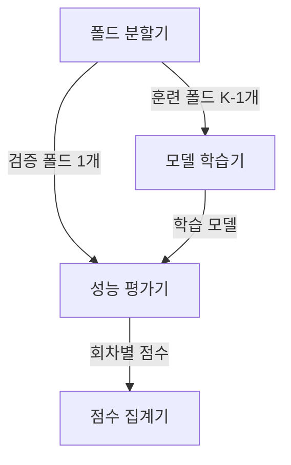
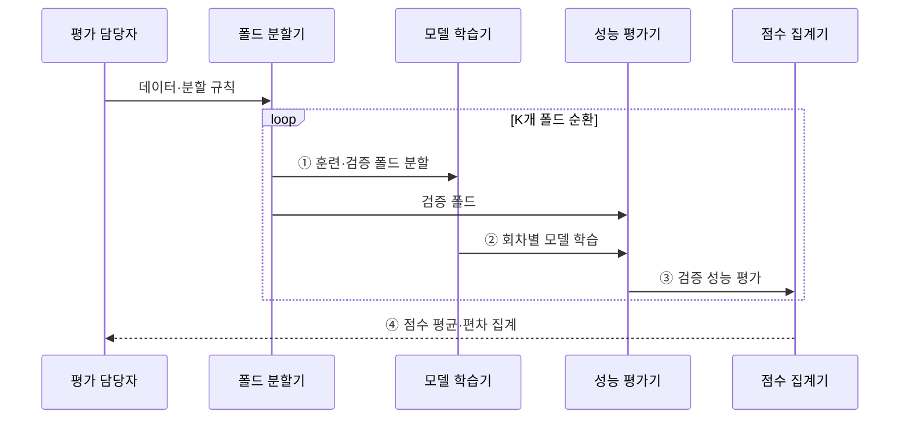

---
sidebar:
  order: 38
  label: "038. K-Fold 교차 검증 (K-Fold Cross-Validation)"
  badge:
    text: "기출 · 50%"
    variant: note
title: "K-Fold 교차 검증 (K-Fold Cross-Validation)"
date: "2026-07-28T23:03:00+09:00"
tags:
  - "notes-basic-theory"
weight: 38
extra:
  question_no: "038"
  source_status: "기출"
  source_history: "128회"
  priority: 50
  priority_note: "누수 방지·평가 분할 설계의 높은 가치"
---

## 미리 알고가기

- **K-Fold 교차 검증(K-Fold Cross-Validation)**: 데이터를 K개로 나눠 각 묶음을 한 번씩 검증하고 K회 점수를 종합하는 평가법
- **폴드(Fold)**: 회차마다 하나는 검증, 나머지는 학습에 쓰도록 나눈 표본 묶음
- **기호 $K$**: 전체 폴드 수와 반복할 학습·검증 횟수
- **홀드아웃(Hold-out)**: 데이터를 한 번만 학습·검증 집합으로 나눠 성능을 재는 평가법
- **데이터 누수(Data Leakage)**: 검증 정보가 학습 과정에 섞여 배포 성능보다 평가 점수가 높아지는 오류
- **층화 추출(Stratification)**: 전체 클래스 비율이 각 폴드에도 유지되게 표본을 나누는 방식
- **그룹 분할(Group Split)**: 같은 사용자·장비의 의존 표본을 한 폴드에 묶어 개체 정보 누수를 막는 방식
- **평가 편향(Evaluation Bias)**: 제한된 학습 표본 때문에 평가 점수가 실제 배포 성능과 한쪽 방향으로 어긋나는 경향이며, 학습에 쓰는 폴드가 많아질수록 이 어긋남이 줄어든다.
- **평가 분산(Evaluation Variance)**: 어떻게 나누느냐에 따라 평가 점수가 회차마다 들쭉날쭉해지는 정도이며, 점수 하나가 아니라 여러 회차의 편차를 함께 봐야 신뢰할 수 있다.
- **일반 K-Fold**: 표본 순서를 무작위로 섞은 뒤 비슷한 크기의 폴드로 나누는 기본 방식
- **층화 K-Fold(Stratified K-Fold)**: 각 폴드의 클래스 비율을 전체 데이터와 비슷하게 유지하는 방식
- **그룹 K-Fold(Group K-Fold)**: 같은 사용자·장비처럼 서로 의존하는 표본을 같은 폴드에 묶는 방식
- **시계열 분할(Time-Series Split)**: 시간 순서를 보존해 과거 구간으로 학습하고 뒤의 구간으로 검증하는 방식
- **교환 가능 표본(Exchangeable Samples)**: 표본 순서를 바꿔도 결합 분포가 달라지지 않아 무작위 분할이 가능한 표본
- **불균형 분류(Imbalanced Classification)**: 클래스별 표본 수 차이로 소수 클래스 평가 점수의 변동성이 커지는 분류 문제
- **반복 측정(Repeated Measurement)**: 같은 사용자·장비·대상에서 여러 번 수집해 서로 독립적이지 않은 관측값
- **전처리(Preprocessing)**: 결측값 처리·척도 변환처럼 모델 학습 전에 데이터를 바꾸는 과정이며 검증 정보 누수를 피하려면 훈련 폴드에서만 기준을 구함

## Ⅰ. 개요

- 정의/개념: 표본을 $K$개 **폴드**로 나눠 순환 평가하는 **교차 검증**
- 기존 한계: **홀드아웃** 단일 분할은 표본 구성에 따른 **평가 편차** 큼

### 쉽게 이해하기 (학습용)
- 학생을 한 번만 반으로 나누면 우연히 우수한 학생이 시험반에 몰릴 수 있으므로, 검증반을 K번 바꿔 점수 평균과 편차를 본다.

## Ⅱ. 특징

- 모든 표본을 한 번씩 검증에 사용하는 **순환 평가**
- $K$회 재학습에 따른 **평가 안정성**·**계산 비용** 상충
- 회차별 점수 **평균·편차**로 분할 민감도 평가

> 폴드 수 증가는 회차별 학습 표본을 늘리지만 재학습 횟수도 $K$회로 증가

### 쉽게 이해하기 (학습용)
- 시험반을 작게 나누면 매 회차 공부반은 커져 평가 편향이 줄지만, 반을 바꿔 모델을 다시 학습하는 횟수도 K번으로 늘어난다.

## Ⅲ. 아키텍처

**도표안 A — 구조도**

**도표안 B — sequenceDiagram**

| 구성요소 | 책임 |
|:---|:---|
| 폴드 분할기 | $K-1$개 **훈련 폴드**·1개 **검증 폴드** 순환 |
| 모델 학습기 | 훈련 폴드 기준 **회차별 모델** 생성 |
| 성능 평가기 | 검증 폴드 **예측 성능** 산출 |
| 점수 집계기 | 회차별 점수 **평균**·**편차** 계산 |

**동작 원리**

- **① 훈련·검증 폴드 분할**: 회차마다 검증 폴드 하나를 빼고 나머지 $K-1$개를 훈련 폴드로 전달
- **② 회차별 모델 학습**: 해당 훈련 폴드에서만 전처리 기준과 모델을 적합
- **③ 검증 성능 평가**: 학습에 쓰지 않은 검증 폴드로 회차별 예측 성능 산출
- **④ 점수 평균·편차 집계**: $K$개 검증 점수의 평균과 편차로 성능과 분할 민감도 요약

### 쉽게 이해하기 (학습용)
- 각 폴드가 한 번씩 시험지가 되고 나머지가 공부 자료가 되며, K개 시험 점수의 평균과 들쭉날쭉한 폭을 함께 모은다.

## Ⅳ. 종류 및 비교

| 교차 검증 방식 | 일반 K-Fold | 층화 K-Fold | 그룹 K-Fold | 시계열 분할 |
|:---|:---|:---|:---|:---|
| 적용 기준 | **독립·교환 가능** 표본 | **불균형 분류** 문제 | 사용자·장비 **반복 측정** | 미래 구간 **예측 과제** |
| 핵심 특징 | 무작위 **균등 폴드** 순환 | 폴드별 **클래스 비율** 유지 | 같은 개체를 **한 폴드**에 유지 | **시간 순서** 보존 분할 |
| 한계 | 의존 표본에서 **데이터 누수** | 소수 클래스 수가 **폴드 수** 미만이면 비율 유지 불가 | **그룹 수** 부족 시 폴드 구성 제약 | 초기 회차 **학습 구간** 부족 |

> 요약: 표본 독립 가정의 성립 여부를 고려해 **분할 규칙** 선택

### 쉽게 이해하기 (학습용)
- 서로 바꿔도 되는 표본은 무작위, 소수 반이 사라질 위험은 층화, 같은 사람의 반복 기록은 그룹, 미래 예측은 시간 순서로 나눈다.

## Ⅴ. 실무 고려사항 및 대책

| 고려사항 | 대책 | 효과 |
|:---|:---|:---|
| 전처리 기준의 **검증 정보 누수** | 회차별 훈련 폴드에서만 전처리 적합 | **일반화 성능 과대평가** 방지 |
| 동일 사용자·장비 **표본 분산** | **그룹 단위 분할** 적용 | **개체 정보 누수** 방지 |
| 불균형 클래스의 **폴드별 소실** | **층화 분할**·최소 클래스 수 점검 | **평가 지표** 변동 감소 |
| 시계열 **무작위 혼합** | 과거 학습·미래 검증 순서 보존 | **배포 시점 성능** 모사 |

### 쉽게 이해하기 (학습용)
- 시험반의 평균을 미리 본 채 표준화하면 답을 엿본 셈이므로, 전처리 기준과 모델은 매 회차 공부반 안에서만 다시 계산한다.

## Ⅵ. 결론

- 표본 의존성·불균형·시간 순서에 맞는 **교차 검증 분할** 결정

### 쉽게 이해하기 (학습용)
- 같은 사람 기록이 섞이는지, 소수 클래스가 사라지는지, 미래가 과거 학습에 들어가는지를 먼저 막고 교차 검증 방식을 고른다.
