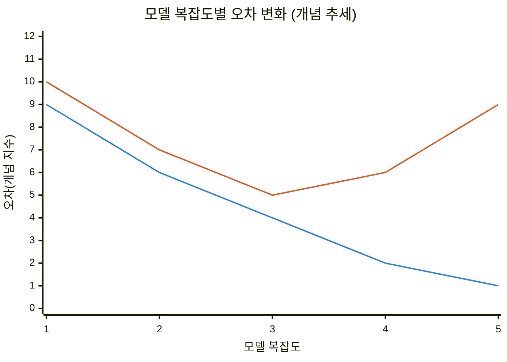
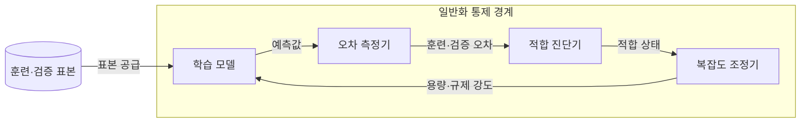
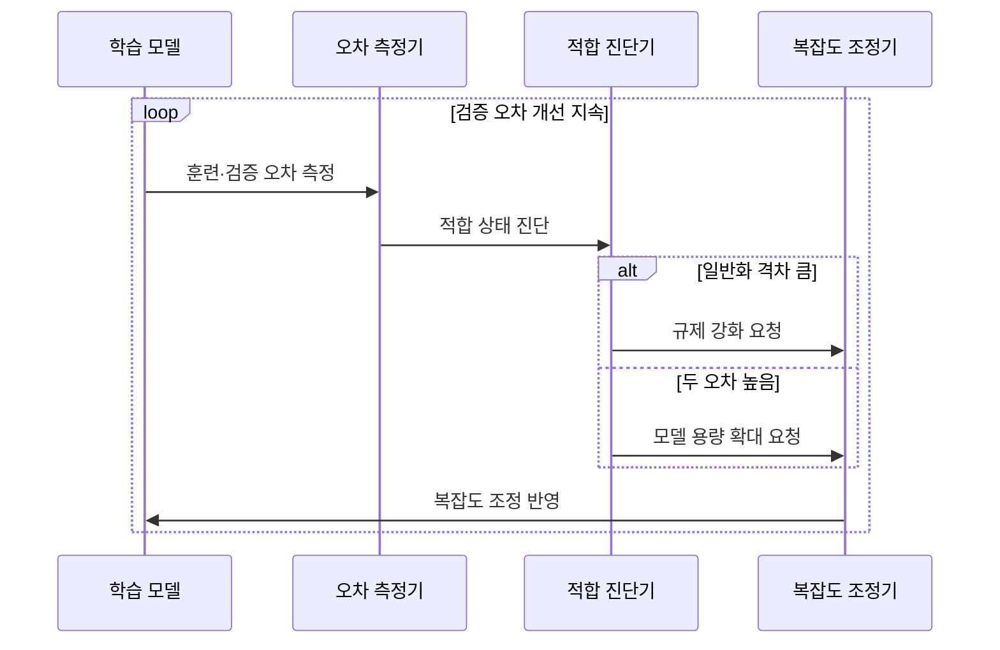

---
sidebar:
  order: 39
  label: "039. 과적합·과소적합·편향-분산 트레이드오프 (Overfitting, Underfitting, and Bias-Variance Tradeoff)"
  badge:
    text: "미출제 · 70%"
    variant: note
title: "과적합·과소적합·편향-분산 트레이드오프 (Overfitting, Underfitting, and Bias-Variance Tradeoff)"
date: "2026-07-26T22:16:20+09:00"
tags:
  - "notes-basic-theory"
weight: 39
extra:
  question_no: "039"
  source_status: "미출제"
  source_history: ""
  priority: 70
  priority_note: "일반화 실패 진단과 규제 선택"
---

## 미리 알고가기

- **적합 상태(Fit)**: 개념을 대충 훑어 연습 문제조차 못 푸는 학생과 답을 통째로 외워 연습 문제는 만점이지만 처음 보는 문제에서 무너지는 학생 사이 어딘가에 가장 좋은 공부량이 있는 장면을 떠올리면 되며, 이 주제는 그 양쪽 실패인 과소적합·과적합과 둘 사이를 가르는 편향·분산의 상충을 다룬다.
- **과소적합(Underfitting)**: 모델이 너무 단순해 핵심 패턴을 학습하지 못하고 훈련·검증 오차가 모두 큰 상태
- **과적합(Overfitting)**: 훈련 데이터의 잡음까지 학습해 새 데이터의 오차가 커지는 상태
- **편향(Bias)**: 모델이 여러 표본으로 학습됐을 때 평균적으로 내놓는 예측이 실제값에서 한쪽으로 치우쳐 벗어난 정도이며, 모델이 단순할수록 이 치우침이 커진다.
- **분산(Variance)**: 학습에 쓰는 표본이 조금 바뀌었을 때 예측이 얼마나 요동치는지를 나타내는 정도이며, 모델이 복잡할수록 표본의 우연한 잡음까지 따라가 이 요동이 커진다.
- **모델 용량(Capacity)**: 그 모델이 표현할 수 있는 함수가 얼마나 복잡한 모양까지 닿는지를 뜻하며, 용량이 크면 굽은 관계까지 담지만 그만큼 잡음도 담을 수 있다.
- **일반화 격차(Generalization Gap)**: 검증 오차에서 훈련 오차를 뺀 차이이며, 이 값이 벌어져 있다는 것은 배운 데이터에서만 잘하고 처음 보는 데이터에서는 못한다는 신호다.
- **L2 규제(L2 Regularization)**: ‘엘 투 규제’로 읽고 2는 가중치 벡터의 제곱합인 L2 노름을 쓴다는 수학 관례를 나타내며, 큰 가중치에 벌점을 주어 모델 복잡도와 과적합을 줄이는 기법이다.
- **조기 종료(Early Stopping)**: 학습을 계속하는데도 검증 오차가 다시 오르기 시작하면 그 지점에서 학습을 멈추는 기법이며, 훈련 오차만 더 낮추다 잡음을 외우는 구간에 들어가는 것을 막는다.
- **편향-분산 트레이드오프(Bias-Variance Tradeoff)**: 모델을 복잡하게 하면 편향은 줄지만 표본별 예측 변동은 커질 수 있어 검증 오차가 가장 작은 복잡도를 찾는 상충 관계
- **규제(Regularization)**: 모델이 지나치게 복잡해지지 않도록 가중치 크기나 학습 시간을 제한하는 기법
- **적정 적합(Appropriate Fit)**: 훈련 오차만 낮추지 않고 검증 오차와 일반화 격차도 낮게 유지한 상태
- **희소 특징(Sparse Feature)**: 가능한 특징은 많지만 한 표본에서 실제 값이 있는 특징은 적은 표현
- **입력 분포 변화(Input Distribution Shift)**: 운영 입력의 범위·빈도가 학습 데이터와 달라져 검증 당시 성능이 유지되지 않을 수 있는 현상

## Ⅰ. 개요

- **정의/개념**: **모델 복잡도**에 따른 편향·분산 상충과 **적합 상태** 구분 기준
- **기존 한계**: 훈련 성능만으로는 **일반화 성능**을 예측 불가

### 쉽게 이해하기 (학습용)

- 답안이 기존 한계를 훈련 성능 자체가 아니라 그것으로 알 수 없는 것으로 잡은 이유는, 연습 문제 정답률만 보면 답을 외운 학생이 늘 1등이라 그 숫자 하나로는 실력을 가릴 수 없고 처음 보는 문제 점수와 나란히 놓고 그 차이를 봐야 비로소 외운 것인지 이해한 것인지가 드러나기 때문이다.

## Ⅱ. 특징

- **모델 복잡도** 증가에 따른 편향 감소·**분산 증가**
- 고편향 **과소적합**과 고분산 **과적합**의 대칭적 진단
- **검증 오차 최소** 지점 기준 적정 복잡도 선택

■ **훈련 오차** &nbsp;&nbsp; ■ **검증 오차**

> 훈련 오차는 계속 하강하나 검증 오차는 복잡도 3 이후 상승하며, 두 선의 간격이 **일반화 격차**

### 쉽게 이해하기 (학습용)

- 답안이 두 실패를 `대칭적`이라 부른 이유는, 왼쪽 끝에서는 자가 너무 뭉툭해 연습 문제도 새 문제도 다 틀리고 오른쪽 끝에서는 자가 너무 뾰족해 연습 문제만 맞히고 새 문제를 틀리는 식으로, 같은 축의 반대쪽 끝에서 정반대 증상이 나타나 어느 쪽 증상인지만 확인하면 처방이 자동으로 정해지기 때문이다.

## Ⅲ. 아키텍처 및 구성요소

| 설계 요소 | 설명 |
|:---|:---|
| 학습 모델 | **모델 용량** 범위의 가설 표현과 예측 산출 |
| 오차 측정기 | 훈련·검증 표본별 **예측 오차** 산출 |
| 적합 진단기 | 오차 높이·**일반화 격차**로 상태 판정 |
| 복잡도 조정기 | **규제 강도**·용량 변경으로 복잡도 제어 |

> 요약: **적합 진단** 결과가 복잡도 조정으로 되먹임되는 고리

### 쉽게 이해하기 (학습용)

- 답안이 편향이나 분산 같은 값을 구성요소에서 빼고 네 덩어리만 남긴 이유는, 편향과 분산은 진단 결과에 붙는 이름표일 뿐이고 실제로 일하는 주체는 답을 내놓는 학습 모델, 연습지와 시험지 점수를 각각 매기는 오차 측정기, 두 점수를 나란히 놓고 어느 쪽 증상인지 가리는 적합 진단기, 그 판정대로 자의 뾰족함을 바꾸는 복잡도 조정기 넷뿐이기 때문이다.

## Ⅳ. 원리 및 절차 흐름도

| 절차 | 설명 |
|:---|:---|
| 훈련·검증 오차 측정 | 동일 모델의 두 표본 **오차 산출** |
| 적합 상태 진단 | 오차 높이와 **일반화 격차** 대조 |
| 규제 강화 요청 | 격차 클 때 **가중치 벌점** 상향 |
| 모델 용량 확대 요청 | 두 오차 클 때 **특징**·용량 확대 |
| 복잡도 조정 반영 | 조정 모델의 **검증 오차** 재측정 |

> 요약: 오차의 크기와 격차에 따라 **용량**·**규제** 조정 방향 결정

### 쉽게 이해하기 (학습용)

- 답안이 `적합 상태 진단`을 조정보다 앞에 세운 이유는, 시험 점수가 낮다는 사실만으로는 공부를 더 해야 할지 암기를 줄여야 할지 정반대의 처방이 갈리기 때문이며, 연습지 점수까지 함께 보고 둘 다 낮은지 아니면 연습지만 높은지를 먼저 가려야 자를 더 뾰족하게 할지 뭉툭하게 할지가 정해진다.

## Ⅴ. 종류 및 비교

| 적합 상태 | 과적합 | 과소적합 | 적정 적합 |
|:---|:---|:---|:---|
| 적용 기준 | 훈련 오차 대비 **일반화 격차** 클 때 | **훈련 오차** 자체가 높을 때 | **검증 오차** 최소 지점일 때 |
| 핵심 특징 | 잡음까지 학습한 **고분산** 상태 | 표현력이 모자란 **고편향** 상태 | **트레이드오프** 균형 지점 복잡도 |
| 한계 | 잡음 학습에 따른 **배포 성능** 급락 | **핵심 패턴** 누락에 따른 성능 한계 | **입력 분포 변화** 시 성능 저하 |
| 대응 조치 | **정규화**·조기 종료·데이터 증강 | **모델 용량** 확대·특징 추가 | **주기적 재검증**으로 상태 유지 |

> 요약: 두 오차의 높이와 간격으로 갈리는 **적합 상태**

### 쉽게 이해하기 (학습용)

- 답안이 세 상태를 한 표에 세운 이유는 처방이 정반대로 갈리기 때문인데, 연습지만 만점이고 시험지가 무너지면 자를 뭉툭하게 만들어야 하고 둘 다 낮으면 자를 더 뾰족하게 만들어야 하며, 두 점수가 함께 좋은 가운데 지점에 도달했더라도 운영 데이터의 성격이 바뀌면 그 자리는 다시 흔들린다.

## Ⅵ. 실무 사례

1. 문서 분류기의 **희소 특징** 가중치를 **L2 규제**로 제한
2. 탐지 모델의 검증 오차 반등 시 **조기 종료** 적용

### 쉽게 이해하기 (학습용)

- 문서 분류기는 어쩌다 한 번 나온 단어 하나에도 큰 가중치를 붙여 그 단어만 보이면 특정 분류로 몰아 버릴 수 있는데, 가중치가 커질수록 벌점을 물리면 그런 극단적 판단이 눌려 여러 단어를 함께 보는 규칙으로 돌아온다.
- 탐지 모델은 학습을 오래 돌릴수록 훈련 오차가 계속 내려가 잘되는 것처럼 보이지만 검증 오차가 바닥을 찍고 다시 오르는 순간부터는 잡음을 외우는 구간이므로, 그 반등 지점에서 학습을 끊어 그때의 모델을 남긴다.

## Ⅶ. 결론

- **일반화 격차** 크면 규제 강화, 두 오차 높으면 **용량 확대**

### 쉽게 이해하기 (학습용)

- 성능이 나쁘다는 말만으로는 아무것도 정해지지 않고, 연습지 점수와 시험지 점수를 나란히 놓아 둘이 벌어져 있는지 함께 낮은지를 확인하는 순간 규제를 조일지 모델을 키울지가 자동으로 결정된다.
