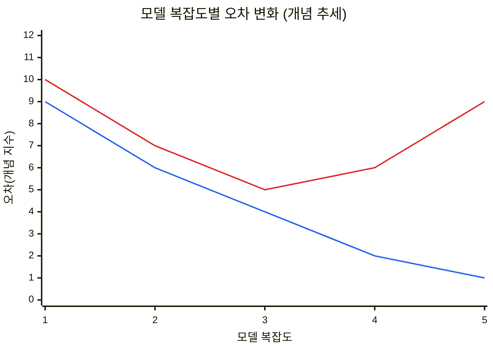
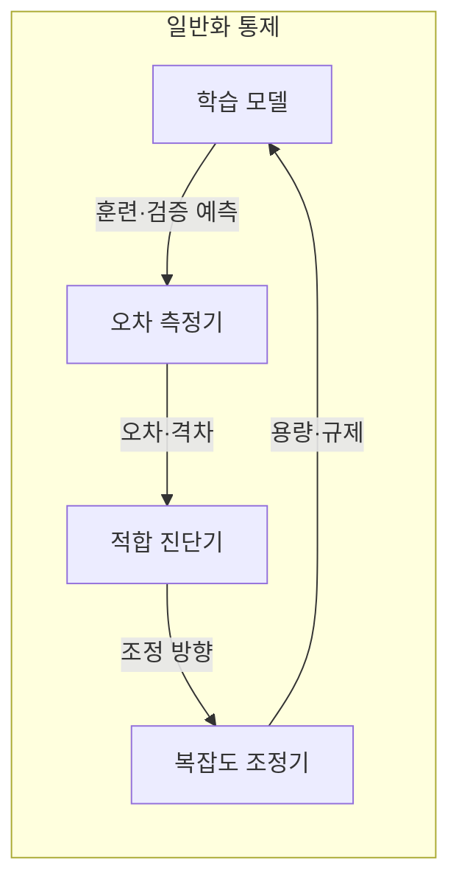
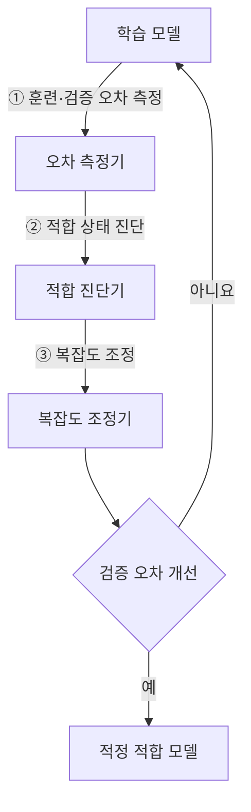
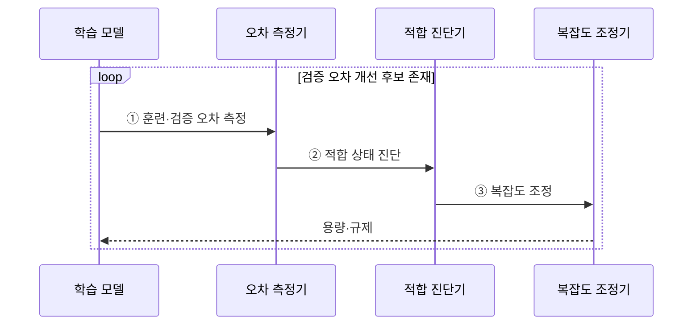

---
sidebar:
  order: 39
  label: "039. 과적합·과소적합·편향-분산 트레이드오프 (Overfitting, Underfitting, and Bias-Variance Tradeoff)"
  badge:
    text: "미출 · 70%"
    variant: note
title: "과적합·과소적합·편향-분산 트레이드오프 (Overfitting, Underfitting, and Bias-Variance Tradeoff)"
date: "2026-07-28T17:16:00+09:00"
tags:
  - "notes-basic-theory"
weight: 39
extra:
  question_no: "039"
  source_status: "미출"
  source_history: ""
  priority: 70
  priority_note: "일반화 실패 진단과 규제 선택"
---

## 미리 알고가기

- **적합 상태(Fit)**: 모델이 데이터의 일반적 패턴을 학습한 정도로, 과소적합과 과적합 사이에서 새로운 데이터의 예측 오차를 최소화해야 한다.
- **과소적합(Underfitting)**: 모델이 너무 단순해 핵심 패턴을 학습하지 못하고 훈련·검증 오차가 모두 큰 상태
- **과적합(Overfitting)**: 훈련 데이터의 잡음까지 학습해 새 데이터의 오차가 커지는 상태
- **편향(Bias)**: 모델이 여러 표본으로 학습됐을 때 평균적으로 내놓는 예측이 실제값에서 한쪽으로 치우쳐 벗어난 정도이며, 모델이 단순할수록 이 치우침이 커진다.
- **분산(Variance)**: 학습에 쓰는 표본이 조금 바뀌었을 때 예측이 얼마나 요동치는지를 나타내는 정도이며, 모델이 복잡할수록 표본의 우연한 잡음까지 따라가 이 요동이 커진다.
- **모델 용량(Capacity)**: 그 모델이 표현할 수 있는 함수가 얼마나 복잡한 모양까지 닿는지를 뜻하며, 용량이 크면 굽은 관계까지 담지만 그만큼 잡음도 담을 수 있다.
- **일반화 격차(Generalization Gap)**: 검증 오차에서 훈련 오차를 뺀 차이이며, 이 값이 벌어져 있다는 것은 배운 데이터에서만 잘하고 처음 보는 데이터에서는 못한다는 신호다.
- **L2 규제(L2 Regularization)**: 큰 가중치의 제곱합에 벌점을 주어 모델 복잡도를 줄이는 기법
- **조기 종료(Early Stopping)**: 학습을 계속하는데도 검증 오차가 다시 오르기 시작하면 그 지점에서 학습을 멈추는 기법이며, 훈련 오차만 더 낮추다 잡음을 외우는 구간에 들어가는 것을 막는다.
- **편향-분산 트레이드오프(Bias-Variance Tradeoff)**: 모델을 복잡하게 하면 편향은 줄지만 표본별 예측 변동은 커질 수 있어 검증 오차가 가장 작은 복잡도를 찾는 상충 관계
- **규제(Regularization)**: 모델이 지나치게 복잡해지지 않도록 가중치 크기나 학습 시간을 제한하는 기법
- **적정 적합(Appropriate Fit)**: 훈련 오차만 낮추지 않고 검증 오차와 일반화 격차도 낮게 유지한 상태
- **희소 특징(Sparse Feature)**: 가능한 특징은 많지만 한 표본에서 실제 값이 있는 특징은 적은 표현
- **입력 분포 변화(Input Distribution Shift)**: 운영 입력의 범위·빈도가 학습 데이터와 달라져 검증 당시 성능이 유지되지 않을 수 있는 현상

## Ⅰ. 개요

- 정의/개념: **모델 복잡도**에 따른 편향·분산 상충과 **적합 상태** 구분 기준
- 기존 한계: 훈련 성능만으로는 **일반화 성능**을 예측 불가

### 쉽게 이해하기 (학습용)

- 훈련 성능만으로는 잡음 암기와 일반 패턴 학습을 구분할 수 없어 검증 성능이 필요하다.

## Ⅱ. 특징

- **모델 복잡도** 증가에 따른 편향 감소·**분산 증가**
- 고편향 **과소적합**과 고분산 **과적합**의 대칭적 진단
- **검증 오차 최소** 지점 기준 적정 복잡도 선택

| 계열 | 수식·의미 |
|:---|:---|
| 파랑 · 1계열 | 복잡도 증가에 따라 계속 감소하는 훈련 오차 |
| 빨강 · 2계열 | 적정 복잡도 이후 다시 증가하는 검증 오차 |

> 훈련 오차는 계속 하강하나 검증 오차는 복잡도 3 이후 상승하며, 두 선의 간격이 **일반화 격차**

### 쉽게 이해하기 (학습용)

- 과소적합은 훈련·검증 오차가 모두 높고 과적합은 두 오차의 격차가 크다.

## Ⅲ. 아키텍처

**도표안 A — 구조도**

**도표안 B — 동작 흐름도**

**도표안 C — sequenceDiagram**

| 구성요소 | 책임 |
|:---|:---|
| 학습 모델 | **모델 용량** 범위의 가설 표현과 예측 산출 |
| 오차 측정기 | 훈련·검증 표본별 **예측 오차** 산출 |
| 적합 진단기 | 오차 높이·**일반화 격차**로 상태 판정 |
| 복잡도 조정기 | **규제 강도**·용량 변경으로 복잡도 제어 |

**동작 원리**

- **① 훈련·검증 오차 측정**: 두 표본군의 예측 오차·격차 산출
- **② 적합 상태 진단**: 과소적합·과적합·적정 적합 판정
- **③ 복잡도 조정**: 모델 용량·규제 강도·학습 시간 변경

### 쉽게 이해하기 (학습용)

- 훈련·검증 오차를 측정해 적합 상태를 진단하고 용량·규제 강도를 조정한다.

## Ⅳ. 종류 및 비교

| 적합 상태 | 과적합 | 과소적합 | 적정 적합 |
|:---|:---|:---|:---|
| 적용 기준 | 훈련 오차 대비 **일반화 격차** 클 때 | **훈련 오차** 자체가 높을 때 | **검증 오차** 최소 지점일 때 |
| 핵심 특징 | 잡음까지 학습한 **고분산** 상태 | 표현력이 모자란 **고편향** 상태 | **트레이드오프** 균형 지점 복잡도 |
| 한계 | 잡음 학습에 따른 **배포 성능** 급락 | **핵심 패턴** 누락에 따른 성능 한계 | **입력 분포 변화** 시 성능 저하 |

> 요약: 두 오차의 높이와 간격으로 갈리는 **적합 상태**

### 쉽게 이해하기 (학습용)

- 일반화 격차가 크면 규제를 강화하고 두 오차가 높으면 모델 용량을 늘린다.

## Ⅴ. 실무 고려사항 및 대책

| 고려사항 | 대책 | 효과 |
|:---|:---|:---|
| 훈련 오차만으로 모델 선택 | 독립 검증셋·교차검증 사용 | 일반화 성능 확인 |
| 과적합의 **일반화 격차** | L2 규제·조기 종료·데이터 증강 | 분산 감소 |
| 과소적합의 높은 두 오차 | 특징·모델 용량 확대·규제 완화 | 편향 감소 |
| 운영 **입력 분포 변화** | 성능·격차 감시와 재학습 | 적정 적합 유지 |
| 문서 분류기의 **희소 특징** | 큰 가중치에 L2 규제 적용 | 특정 단어 의존 감소 |

### 쉽게 이해하기 (학습용)
- 두 오차의 높이와 격차를 구분해 규제 강화 또는 모델 용량 확대 방향을 정한다.

## Ⅵ. 결론

- **일반화 격차** 크면 규제 강화, 두 오차 높으면 **용량 확대**

### 쉽게 이해하기 (학습용)

- 훈련·검증 오차의 높이와 격차로 규제 강화 또는 용량 확대를 결정한다.
