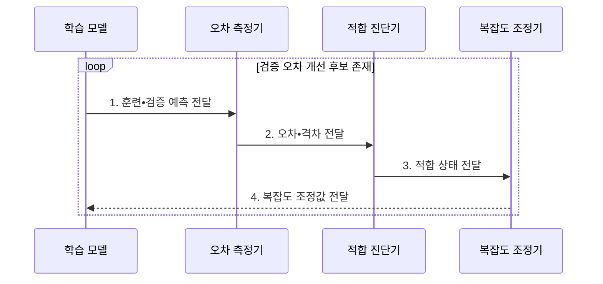

---
sidebar:
  order: 39
  label: "039. 과적합•과소적합•편향-분산 트레이드오프 (Overfitting, Underfitting, and Bias-Variance Tradeoff)"
  badge:
    text: "미출 • 70%"
    variant: note
title: "과적합•과소적합•편향-분산 트레이드오프 (Overfitting, Underfitting, and Bias-Variance Tradeoff)"
date: "2026-07-30T19:01:10+09:00"
tags:
  - "notes-basic-theory"
weight: 39
extra:
  question_no: "039"
  source_status: "미출"
  source_history: ""
  priority: 70
  priority_note: "일반화 실패 진단과 규제 선택"
---

## 미리 알고가기

- **적합 상태(Fit)**: 모델 복잡도에 따라 과소적합•적정 적합•과적합으로 구분되는 학습 상태
- **과소적합(Underfitting)**: 모델이 너무 단순해 핵심 패턴을 학습하지 못하고 훈련•검증 오차가 모두 큰 상태
- **과적합(Overfitting)**: 훈련 데이터의 잡음까지 학습해 새 데이터의 오차가 커지는 상태
- **편향(Bias)**: 여러 학습 표본에서 낸 평균 예측이 실제값에서 한쪽으로 벗어난 정도
- **분산(Variance)**: 학습 표본이 바뀔 때 모델 예측이 흔들리는 정도
- **모델 용량(Capacity)**: 모델이 표현할 수 있는 함수 복잡도의 범위
- **일반화 격차(Generalization Gap)**: 검증 오차에서 훈련 오차를 뺀 차이
- **L2 규제(L2 Regularization)**: 큰 가중치의 제곱합에 벌점을 주어 모델 복잡도를 줄이는 기법
- **조기 종료(Early Stopping)**: 학습을 계속하는데도 검증 오차가 다시 오르기 시작하면 그 지점에서 학습을 멈추는 기법이며, 훈련 오차만 더 낮추다 잡음을 외우는 구간에 들어가는 것을 막는다.
- **편향-분산 트레이드오프(Bias-Variance Tradeoff)**: 모델을 복잡하게 하면 편향은 줄지만 표본별 예측 변동은 커질 수 있어 검증 오차가 가장 작은 복잡도를 찾는 상충 관계
- **규제(Regularization)**: 모델이 지나치게 복잡해지지 않도록 가중치 크기나 학습 시간을 제한하는 기법
- **적정 적합(Appropriate Fit)**: 훈련 오차만 낮추지 않고 검증 오차와 일반화 격차도 낮게 유지한 상태
- **희소 특징(Sparse Feature)**: 가능한 특징은 많지만 한 표본에서 실제 값이 있는 특징은 적은 표현
- **입력 분포 변화(Input Distribution Shift)**: 운영 입력의 범위•빈도가 학습 데이터와 달라져 검증 당시 성능이 유지되지 않을 수 있는 현상
- **검증셋(Validation Set)**: 학습에 직접 사용하지 않고 모델•규제 선택의 일반화 성능을 측정하는 데이터
- **교차검증(Cross-validation)**: 데이터를 여러 분할로 나눠 학습•검증을 반복하고 일반화 성능을 평균하는 평가 방법
- **데이터 증강(Data Augmentation)**: 의미를 보존하는 변환으로 학습 표본의 다양성을 늘리는 기법

## Ⅰ. 개요

- 정의/개념: 훈련•검증 오차로 모델 복잡도의 **편향•분산 상충**을 판정하는 진단
- 배경/필요성: 훈련 성능과 **일반화 성능**의 차이 판별

### 쉽게 이해하기 (학습용)

- 문제집 답을 외워 훈련 점수만 높은 학생과 원리를 배운 학생을 가르려면, 처음 보는 검증 문제의 오차를 함께 봐야 한다.

## Ⅱ. 특징

> 설명용 개념 좌표에서 파란 훈련 오차는 계속 감소하지만 빨간 검증 오차는 중간 복잡도에서 최소가 된 뒤 다시 증가하며, 실측 데이터는 아니다.

- **모델 복잡도** 증가에 따른 편향 감소•**분산 증가**
- 고편향 **과소적합**과 고분산 **과적합**의 대칭적 진단
- **검증 오차 최소** 지점 기준 적정 복잡도 선택

> **과적합**: 검증 오차•일반화 격차 상승

### 쉽게 이해하기 (학습용)

- 곧은 자는 곡선을 놓치고 너무 굽은 자는 잡음까지 따르므로, 검증 오차가 가장 낮은 복잡도를 고른다.

## Ⅲ. 구조 및 구성요소

| 구성요소 | 책임 |
|:---|:---|
| 학습 모델 | **모델 용량** 범위의 예측 산출 |
| 오차 측정기 | 훈련•검증 **예측 오차** 계산 |
| 적합 진단기 | 오차•**일반화 격차**로 상태 판정 |
| 복잡도 조정기 | **규제 강도•용량** 변경 |

### 쉽게 이해하기 (학습용)

- 오차 측정기와 진단기가 훈련•검증 차이를 판정하면, 조정기가 모델 용량이나 규제 강도를 바꾼다.

## Ⅳ. 흐름도

### 동작 원리

- **1. 훈련•검증 예측 전달**: 두 표본군 예측 생성
- **2. 오차•격차 전달**: 오차와 일반화 격차 계산
- **3. 적합 상태 전달**: 과소•과적합•적정 판정
- **4. 복잡도 조정값 전달**: 용량•규제•학습 시간 변경

### 쉽게 이해하기 (학습용)

- 모델이 문제집•새 시험 답을 내면 측정기가 두 오차와 간격을 재고, 진단 결과에 따라 표현력을 늘리거나 규제 브레이크를 건다.

## Ⅴ. 종류 및 비교

| 적합 상태 | 과적합 | 과소적합 | 적정 적합 |
|:---|:---|:---|:---|
| 적용 기준 | 훈련 오차 대비 **일반화 격차** 클 때 | **훈련 오차** 자체가 높을 때 | **검증 오차** 최소 지점일 때 |
| 핵심 특징 | 잡음까지 학습한 **고분산** 상태 | 표현력이 모자란 **고편향** 상태 | **트레이드오프** 균형 지점 복잡도 |
| 한계 | 잡음 학습에 따른 **배포 성능** 급락 | **핵심 패턴** 누락에 따른 성능 한계 | **입력 분포 변화** 시 성능 저하 |

> 요약: 두 오차의 높이와 간격으로 갈리는 **적합 상태**

### 쉽게 이해하기 (학습용)

- 문제집 점수만 좋고 새 시험이 나쁘면 과적합이라 규제를 걸고, 두 점수가 모두 나쁘면 과소적합이라 모델 표현력을 늘린다.

## Ⅵ. 실무 고려사항 및 대책

| 고려사항 | 대책 | 효과 |
|:---|:---|:---|
| **훈련 오차**만으로 모델 선택 | 독립 검증셋•**교차검증** 사용 | **일반화 성능** 확인 |
| 과적합의 **일반화 격차** | **L2 규제•조기 종료**•데이터 증강 | **분산** 감소 |
| 과소적합의 **높은 두 오차** | 특징•모델 용량 확대•규제 완화 | **편향** 감소 |
| 운영 **입력 분포 변화** | 성능•격차 감시와 재학습 | **적정 적합** 유지 |

### 쉽게 이해하기 (학습용)
- 훈련선과 검증선이 벌어지면 L2•조기 종료로 잡음 암기를 막고, 두 선이 함께 높으면 특징과 모델 용량을 늘린다.

## Ⅶ. 결론

- 격차가 크면 **규제 강화**, 두 오차가 높으면 **용량 확대**

### 쉽게 이해하기 (학습용)

- 훈련•검증 오차의 간격이 크면 규제를 강화하고 둘 다 높으면 용량을 늘려, 검증 오차가 가장 낮은 복잡도에 맞춘다.
