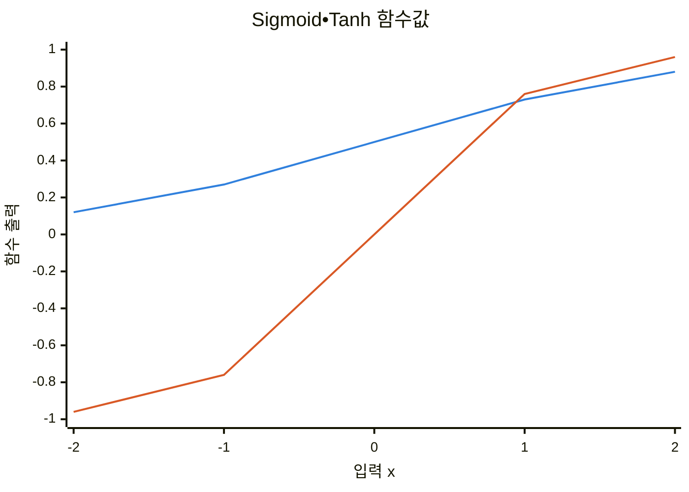
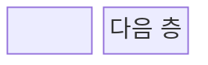
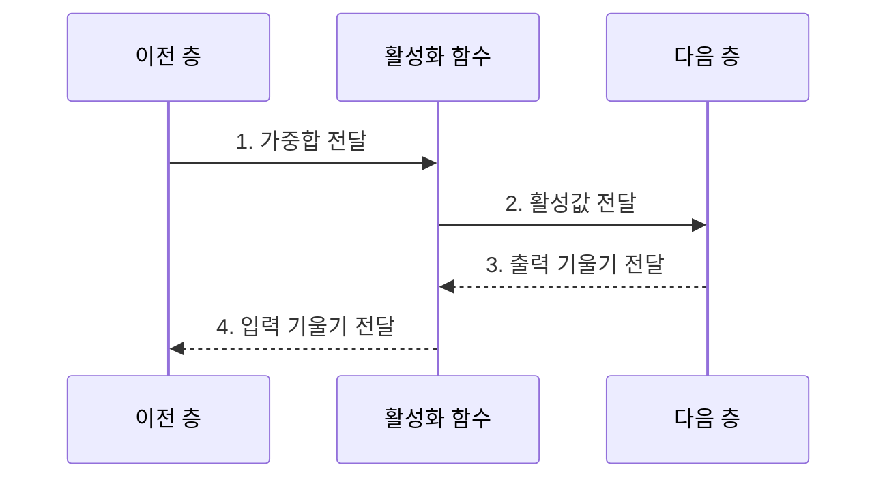
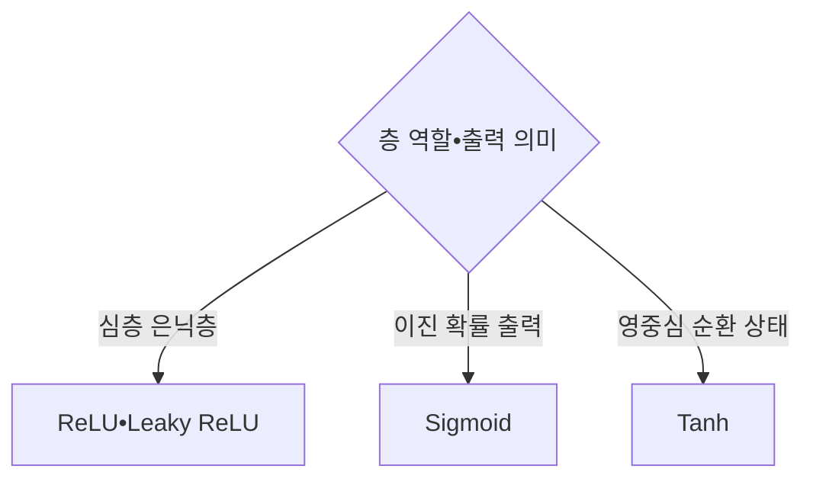

---
sidebar:
  order: 40
  label: "040. 활성화 함수: ReLU•Sigmoid•Tanh (Activation Functions)"
  badge:
    text: "기출 • 30%"
    variant: note
title: "활성화 함수: ReLU•Sigmoid•Tanh (Activation Functions)"
date: "2026-07-29T12:07:28+09:00"
tags:
  - "notes-basic-theory"
weight: 40
extra:
  question_no: "040"
  source_status: "기출"
  source_history: "120회"
  priority: 30
  priority_note: "함수별 출력 범위•기울기 비교"
---

## 미리 알고가기

- **활성화 함수($f$)**: 뉴런 가중합을 비선형 값으로 바꿔 신경망이 굽은 결정 경계를 학습하게 하는 함수
- **자연상수($e$)**: 자연로그의 밑인 약 2.718의 수로, 시그모이드•쌍곡탄젠트의 지수 계산에 사용한다.
- **비선형성(Nonlinearity)**: 상수배와 덧셈만으로 만들 수 없는 굽은 관계
- **결정 경계(Decision Boundary)**: 분류 모델이 서로 다른 클래스로 판정하는 입력 영역을 나누는 경계
- **도함수(Derivative)**: 입력 변화에 대한 출력 변화율로 역전파 기울기의 통과 배율
- **영중심 출력(Zero-centered Output)**: 출력이 0을 가운데 두고 양수와 음수로 고르게 나오는 성질이며, 출력이 모두 양수로만 나오면 다음 층 가중치의 갱신 방향이 한쪽으로 쏠린다.
- **포화•기울기 소실**: 입력의 절댓값이 커진 구간에서 출력이 거의 변하지 않아 도함수가 0에 가까워지는 것이 포화이고, 그 작은 값이 층마다 곱해져 앞쪽 층에는 오차가 거의 닿지 않게 되는 것이 기울기 소실이다.
- **죽은 ReLU(Dying ReLU)**: 음수 입력에서 출력•도함수가 계속 0이라 뉴런의 학습 신호가 끊긴 상태
- **리키 렐루(Leaky ReLU)**: 음수 구간에 작은 기울기를 남겨 죽은 ReLU를 줄이는 변형
- **장단기 메모리(Long Short-Term Memory, LSTM)**: 게이트로 셀 상태를 조절하여 장기 의존성을 학습하는 순환 신경망 구조로, 셀 후보와 은닉 상태 계산에 활성화 함수를 사용한다.
- **정류 선형 유닛(Rectified Linear Unit, ReLU)**: 음수는 0, 양수는 그대로 출력해 양수 기울기를 유지하는 함수
- **시그모이드 함수(Sigmoid Function)**: 입력을 0~1로 압축하며 양끝에서 기울기가 0에 가까워지는 함수
- **쌍곡탄젠트 함수(Hyperbolic Tangent, Tanh)**: 입력을 -1~1의 영중심 값으로 압축하는 함수
- **순전파•역전파(Forward•Backpropagation)**: 순전파는 입력에서 예측값을 계산하고 역전파는 출력 오차의 기울기를 앞쪽 층으로 전달함
- **은닉층•출력층(Hidden•Output Layer)**: 은닉층은 입력 특징을 중간 표현으로 바꾸고 출력층은 최종 예측값을 만듦
- **순환 신경망(Recurrent Neural Network, RNN)**: 이전 시점의 은닉 상태를 현재 입력과 함께 처리하여 순차 데이터의 문맥을 학습하는 신경망
- **수식 기호 $W$, $x$, $b$, $z$, $a$**: 각각 가중치•입력•편향•가중합•활성화 함수 출력을 가리킨다.
- **셀 후보•은닉 상태**: 셀 후보는 LSTM에 새로 기록할 내용이고 은닉 상태는 현재 시점에서 밖으로 전달할 요약값임
- **소프트맥스(Softmax)**: 여러 클래스 점수를 합이 1인 확률 분포로 변환하는 다중 분류 출력 함수
- **학습률(Learning Rate)**: 기울기 반대 방향으로 가중치를 한 번에 얼마나 갱신할지 정하는 크기
- **손실 함수(Loss Function)**: 예측값과 정답의 차이를 학습이 최소화할 하나의 수치로 계산하는 함수
- **가중치 초기화(Weight Initialization)**: 학습 시작 전 가중치 분포를 정해 순전파 활성값과 역전파 기울기의 규모를 조절하는 방법

## Ⅰ. 개요

- 정의/개념: 뉴런 가중합을 **비선형 활성값**으로 변환
- 배경/필요성: 다층 신경망의 **비선형 결정 경계** 표현

### 쉽게 이해하기 (학습용)

- 곧은 자를 여러 개 포개도 결국 직선이지만 층 사이 활성화 함수가 자를 꺾어, 신경망이 굽은 결정 경계를 이어 그리게 한다.

## Ⅱ. 특징

- **비선형 변환** 없이는 다층이 단일 **선형 변환**과 동치
- **출력 범위**가 좌우하는 다음 층 **신호 분포**
- **도함수**가 층마다 곱해져 **기울기 소실** 여부 좌우

| 계열 | 수식•의미 |
|:---|:---|
| ■ 파란색 선언 | **Sigmoid**: 0~1 범위 |
| ■ 주황색 선언 | **Tanh**: -1~1 영중심 |

> **Sigmoid•Tanh**: 큰 입력에서 변화 둔화

### 쉽게 이해하기 (학습용)

- 순전파에서는 함수의 출구 폭이 다음 층 신호 범위를 정하고, 역전파에서는 곡선 경사인 도함수가 앞 층으로 보낼 오차의 크기를 조절한다.

## Ⅲ. 구조 및 구성요소

| 구성요소 | 책임 |
|:---|:---|
| 이전 층 | 가중치•편향으로 **가중합** 산출 |
| 활성화 함수 | **비선형 값•도함수** 산출 |
| 다음 층 | 활성값 소비•**출력 기울기** 회신 |

### 쉽게 이해하기 (학습용)

- 활성화 함수가 이전 층의 가중합을 비선형 값으로 바꾸고, 역전파 때 도함수만큼 기울기를 전달한다.

## Ⅳ. 흐름도

**동작 원리**

- **1. 가중합 전달**: $z=Wx+b$를 함수에 입력
- **2. 활성값 전달**: $a=f(z)$를 다음 층에 제공
- **3. 출력 기울기 전달**: 손실 기울기 수신
- **4. 입력 기울기 전달**: 도함수를 곱해 이전 층 전파

### 쉽게 이해하기 (학습용)

- 앞으로 갈 때는 가중합을 굽은 활성값으로 바꾸고, 뒤로 올 때는 그 지점의 곡선 경사만큼 오차 기울기를 줄이거나 통과시킨다.

## Ⅴ. 종류 및 비교

| 활성화 함수 | Sigmoid | Tanh | ReLU |
|:---|:---|:---|:---|
| 적용 기준 | **이진 분류** 확률 출력층 | 부호 있는 **순환 상태** 표현 | 층 수 많은 **심층 은닉층** |
| 핵심 특징 | 출력을 0~1로 압축하는 **S자 곡선** | **영중심** 출력의 -1~1 압축 | 음수 차단•양수 구간 **항등 함수** |
| 한계 | 출력 전부 양수•**도함수** 최대 $0.25$ | 영중심에도 남는 양끝 **포화** | 음수 고정 뉴런의 **죽은 ReLU** |

> 요약: 출력 범위와 도함수 특성에 따른 **활성화 함수 선택**

### 쉽게 이해하기 (학습용)

- 확률 출력은 Sigmoid, 영중심 상태는 Tanh, 깊은 은닉층은 ReLU를 우선 검토한다.

## Ⅵ. 실무 고려사항 및 대책

| 고려사항 | 대책 | 효과 |
|:---|:---|:---|
| Sigmoid•Tanh의 **포화** | 입력 정규화•가중치 초기화 | **기울기 소실** 완화 |
| 음수 입력에 고정된 **ReLU** | Leaky ReLU•학습률 조정 | **죽은 뉴런** 감소 |
| 출력층과 **과업 불일치** | 이진 Sigmoid•다중 Softmax•회귀 선형 적용 | **출력 의미•손실** 정합 |
| **활성값•기울기 분포** 이상 | 층별 통계 감시•정규화 재조정 | **학습 불안정** 조기 탐지 |
| 영상 분류 **심층 은닉층** | 양수 기울기를 유지하는 ReLU 적용 | 깊은 층 **학습 신호** 유지 |

### 쉽게 이해하기 (학습용)
- 곡선 끝에 몰려 경사가 사라지면 입력•초기화를 조정하고, ReLU 문이 계속 닫히면 음수에도 틈을 둔 Leaky ReLU로 바꾼다.

## Ⅶ. 결론

- 층 역할•출력 의미•기울기로 **활성화 함수** 결정

### 쉽게 이해하기 (학습용)

- 층의 출력 의미와 기울기 특성에 맞는 함수를 선택하고, 포화나 죽은 뉴런이 관찰되면 정규화•초기화•함수 변형을 조정한다.
