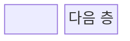
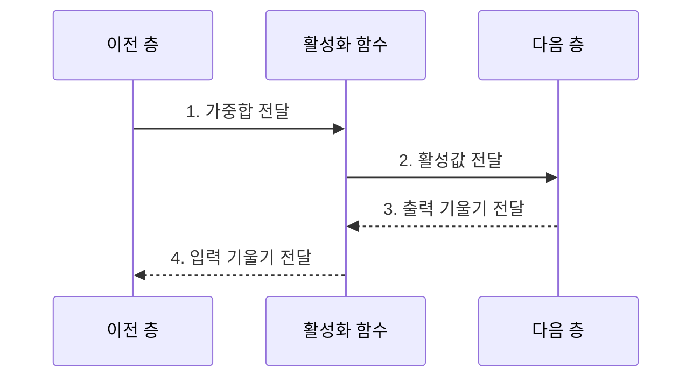

---
sidebar:
  order: 40
  label: "040. 활성화 함수: ReLU•Sigmoid•Tanh (Activation Functions)"
  badge:
    text: "기출 • 30%"
    variant: note
title: "활성화 함수: ReLU•Sigmoid•Tanh (Activation Functions)"
date: "2026-08-02T17:10:00+09:00"
tags:
  - "notes-basic-theory"
weight: 40
extra:
  question_no: "040"
  source_status: "기출"
  source_history: "120회"
  priority: 30
  priority_note: "함수별 출력 범위•기울기 비교"
---

## Ⅰ. 개요

핵심 용어

- **활성화 함수**: 뉴런 가중합을 비선형 값으로 바꿔 신경망이 굽은 결정 경계를 학습하게 하는 함수
- **비선형성**: 상수배와 덧셈만으로 표현할 수 없는 굽은 관계

- 정의/개념: 뉴런 가중합을 **비선형 출력**으로 바꾸는 함수
- 배경/필요성: 활성화가 없으면 다층도 **선형 결정 경계**만 표현

### 쉽게 이해하기 (학습용)

- 곧은 자를 여러 개 포개도 결국 직선이지만 층 사이 활성화 함수가 자를 꺾어, 신경망이 굽은 결정 경계를 이어 그리게 한다.

## Ⅱ. 특징

핵심 용어

- **선형 결정 경계**: 입력의 선형 결합으로 클래스를 나누는 직선이나 평면 형태의 경계
- **도함수**: 입력 변화에 대한 출력 변화율로 역전파 기울기의 통과 배율
- **기울기 소실**: 작은 도함수가 층마다 곱해져 앞쪽 층의 학습 신호가 거의 사라지는 현상

> 함수식 계산값에서 파란 Sigmoid와 빨간 Tanh는 큰 절댓값 입력에서 포화되고, 초록 ReLU는 음수 구간이 0이며 양수 구간은 선형 증가한다.

- **비선형 변환** 없이는 다층이 단일 **선형 변환**과 동치
- **출력 범위**에 따라 달라지는 다음 층 **신호 분포**
- 층마다 곱해지는 **작은 도함수**로 **기울기 소실**

### 쉽게 이해하기 (학습용)

- 순전파에서는 함수의 출구 폭이 다음 층 신호 범위를 정하고, 역전파에서는 곡선 경사인 도함수가 앞 층으로 보낼 오차의 크기를 조절한다.

## Ⅲ. 구조 및 구성요소

핵심 용어

- **가중합 $z=Wx+b$**: 입력과 가중치의 곱을 합하고 편향을 더한 활성화 함수 입력
- **활성값 $a=f(z)$**: 가중합에 활성화 함수를 적용해 다음 층으로 전달하는 출력
- **순전파•역전파**: 예측값을 앞으로 계산하고 손실 기울기를 이전 층으로 전달하는 과정

| 구성요소 | 책임 |
|:---|:---|
| 이전 층 | 가중치•편향으로 **가중합** 산출 |
| 활성화 함수 | **비선형 값•도함수** 산출 |
| 다음 층 | 활성값 소비•**출력 기울기** 회신 |

### 쉽게 이해하기 (학습용)

- 활성화 함수가 이전 층의 가중합을 비선형 값으로 바꾸고, 역전파 때 도함수만큼 기울기를 전달한다.

## Ⅳ. 흐름도

핵심 용어

- **출력 기울기**: 다음 층에서 현재 활성값으로 전달된 손실의 변화율
- **입력 기울기**: 출력 기울기에 활성화 함수 도함수를 곱해 이전 층으로 전달하는 값
- **손실 함수**: 예측값과 정답의 차이를 학습이 최소화할 하나의 수치로 계산하는 함수

### 동작 원리

- **1. 가중합 전달**: $z=Wx+b$를 함수에 입력
- **2. 활성값 전달**: $a=f(z)$를 다음 층에 제공
- **3. 출력 기울기 전달**: 손실 기울기 수신
- **4. 입력 기울기 전달**: 도함수를 곱해 이전 층 전파

### 쉽게 이해하기 (학습용)

- 앞으로 갈 때는 가중합을 굽은 활성값으로 바꾸고, 뒤로 올 때는 그 지점의 곡선 경사만큼 오차 기울기를 줄이거나 그대로 전달한다.

## Ⅴ. 종류 및 비교

핵심 용어

- **Sigmoid**: 입력을 0~1로 압축하며 양끝에서 포화하는 함수
- **Tanh**: 입력을 -1~1의 영중심 값으로 압축하는 함수
- **ReLU**: 음수는 0, 양수는 그대로 출력해 양수 기울기를 유지하는 함수
- **죽은 ReLU**: 음수 입력에서 출력과 도함수가 계속 0이라 뉴런의 학습 신호가 끊긴 상태

| 활성화 함수 | Sigmoid | Tanh | ReLU |
|:---|:---|:---|:---|
| 적용 기준 | **이진 분류** 확률 출력층 | 부호 있는 **순환 상태** 표현 | 층 수 많은 **심층 은닉층** |
| 핵심 특징 | 출력을 0~1로 압축하는 **S자 곡선** | **영중심** 출력의 -1~1 압축 | 음수 차단•양수 구간 **항등 함수** |
| 한계 | 출력 전부 양수•**도함수** 최대 $0.25$ | 영중심에도 남는 양끝 **포화** | 음수 고정 뉴런의 **죽은 ReLU** |

> 요약: 출력 범위와 도함수 특성에 따른 **활성화 함수 선택**

### 쉽게 이해하기 (학습용)

- 확률 출력은 Sigmoid, 영중심 상태는 Tanh, 깊은 은닉층은 ReLU를 우선 검토한다.

## Ⅵ. 실무 고려사항 및 대책

핵심 용어

- **포화**: 입력 절댓값이 큰 구간에서 출력이 거의 변하지 않아 도함수가 0에 가까워지는 상태
- **Leaky ReLU**: 음수 구간에 작은 기울기를 남겨 죽은 ReLU를 줄이는 변형
- **Softmax**: 여러 클래스 점수를 합이 1인 확률 분포로 바꾸는 다중 분류 출력 함수
- **가중치 초기화**: 학습 시작 전 가중치 분포를 정해 활성값과 기울기의 규모를 조절하는 방법

| 문제 | 대책 | 효과 |
|:---|:---|:---|
| Sigmoid•Tanh의 **포화** | **입력 정규화•가중치 초기화** | **기울기 소실** 완화 |
| 음수 입력에 고정된 **ReLU** | **Leaky ReLU**•학습률 조정 | **죽은 뉴런** 감소 |
| 출력층과 **과업 불일치** | **이진 Sigmoid•다중 Softmax**•회귀 선형 적용 | **출력 의미•손실** 정합 |
| **활성값•기울기 분포** 이상 | 층별 통계 감시•정규화 재조정 | **학습 불안정** 조기 탐지 |
| 영상 분류 **심층 은닉층** | 양수 기울기를 유지하는 ReLU 적용 | 깊은 층 **학습 신호** 유지 |

### 쉽게 이해하기 (학습용)
- 곡선 끝에 몰려 경사가 사라지면 입력•초기화를 조정하고, ReLU 문이 계속 닫히면 음수에도 틈을 둔 Leaky ReLU로 바꾼다.

## Ⅶ. 결론

핵심 용어

- **이진•다중 분류 출력**: 하나의 양성 확률이나 여러 클래스의 확률 분포를 내는 출력 과업
- **순환 상태•심층 은닉층**: 시간 문맥을 저장하는 상태와 여러 층으로 특징을 변환하는 내부 표현

- 이진은 **Sigmoid**, 순환은 **Tanh**, 심층 은닉은 ReLU 선택

### 쉽게 이해하기 (학습용)

- 층의 출력 의미와 기울기 특성에 맞는 함수를 선택하고, 포화나 죽은 뉴런이 관찰되면 정규화•초기화•함수 변형을 조정한다.
