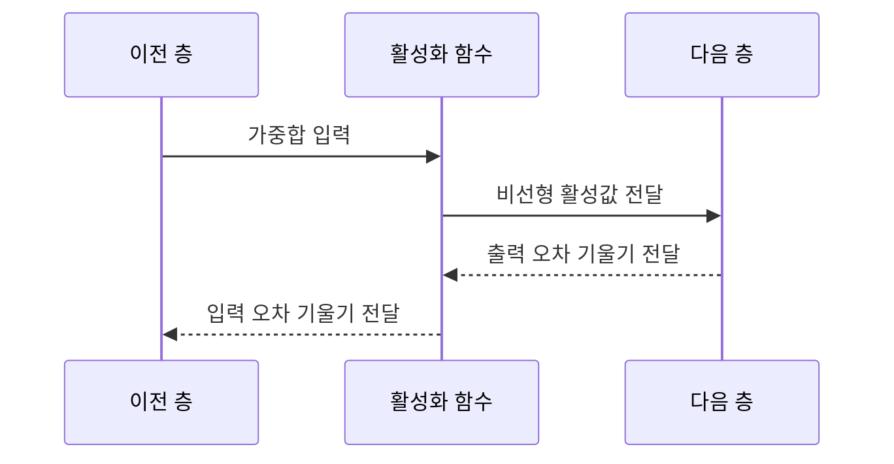

---
sidebar:
  order: 40
  label: "040. 활성화 함수 — ReLU·Sigmoid·Tanh (Activation Functions)"
  badge:
    text: "기출 · 30%"
    variant: note
title: "활성화 함수 — ReLU·Sigmoid·Tanh (Activation Functions)"
date: "2026-07-26T22:16:20+09:00"
tags:
  - "notes-basic-theory"
weight: 40
extra:
  question_no: "040"
  source_status: "기출"
  source_history: "120회"
  priority: 30
  priority_note: "함수별 출력 범위·기울기 비교"
---

## 미리 알고가기

- **활성화 함수($f$)**: 곧은 자로만 그은 직선 여러 개를 아무리 겹쳐도 결국 직선 하나가 되지만 중간에 한 번씩 구부려 주면 곡선 경계를 그릴 수 있는 장면을 떠올리면 되며, $f$는 ‘에프’로 읽고 function의 머리글자를 함수에 쓴 표기로 뉴런의 가중합을 비선형 활성값으로 바꿔 복잡한 패턴을 학습하게 한다.
- **자연상수($e$)**: $e$는 ‘이’로 읽고 자연로그의 밑에 관례적으로 쓰는 수학 상수 표기이며, 약 2.718의 값으로 시그모이드·쌍곡탄젠트의 지수 함수를 계산한다.
- **비선형성(Nonlinearity)**: 입력을 상수배하고 더하는 것만으로는 만들 수 없는 굽은 관계를 뜻하며, 층을 아무리 쌓아도 이 성질이 없으면 전체가 결국 한 층짜리 직선 변환으로 되돌아간다.
- **도함수(Derivative)**: 입력이 조금 변할 때 함수 출력이 얼마나 변하는지를 나타내는 변화율이며, 역전파에서 뒤에서 온 오차를 앞쪽으로 얼마나 통과시킬지의 배율이 된다.
- **영중심 출력(Zero-centered Output)**: 출력이 0을 가운데 두고 양수와 음수로 고르게 나오는 성질이며, 출력이 모두 양수로만 나오면 다음 층 가중치의 갱신 방향이 한쪽으로 쏠린다.
- **포화·기울기 소실**: 입력의 절댓값이 커진 구간에서 출력이 거의 변하지 않아 도함수가 0에 가까워지는 것이 포화이고, 그 작은 값이 층마다 곱해져 앞쪽 층에는 오차가 거의 닿지 않게 되는 것이 기울기 소실이다.
- **죽은 ReLU(Dying ReLU)**: 어떤 뉴런에 음수 입력만 계속 들어와 출력도 0이고 도함수도 0이라 학습 신호가 아예 끊긴 상태이며, 그 뉴런은 이후 갱신되지 않아 사실상 빠진 것과 같다.
- **리키 렐루(Leaky ReLU)**: ‘리키 렐루’로 읽고 새어 나간다는 뜻의 leaky를 붙인 이름이며, 음수 구간에도 아주 작은 기울기를 남겨 죽은 ReLU로 신호가 완전히 끊기는 것을 방지하는 ReLU 변형이다.
- **장단기 메모리(Long Short-Term Memory, LSTM)**: ‘엘에스티엠’으로 읽고 영문 머리글자를 딴 약어이며, 게이트로 시계열 상태를 유지하는 순환망으로 셀 후보와 은닉 상태를 만들 때 활성화 함수를 쓴다.
- **정류 선형 유닛(Rectified Linear Unit, ReLU)**: ‘렐루’로 읽고 영문 머리글자를 단어처럼 만든 약어이며, 음수 입력은 0으로 자르고 양수 입력은 그대로 통과시켜 양수 구간에서 도함수가 1로 유지되는 활성화 함수다.
- **시그모이드 함수(Sigmoid Function)**: 입력을 0과 1 사이로 눌러 담는 S자 곡선이며, 출력이 곧 확률처럼 읽히므로 이진 분류의 출력층에 쓰지만 양끝이 눕는 탓에 도함수가 최대 $0.25$에 그친다.
- **쌍곡탄젠트 함수(Hyperbolic Tangent, Tanh)**: ‘탠에이치’로 읽고 tangent hyperbolic을 줄인 표기이며, 입력을 -1과 1 사이로 압축하되 0을 가운데 두어 시그모이드의 한쪽 쏠림을 없앤 활성화 함수다.
- **순전파·역전파(Forward·Backpropagation)**: 순전파는 입력에서 예측값을 계산하고 역전파는 출력 오차의 기울기를 앞쪽 층으로 전달함
- **은닉층·출력층(Hidden·Output Layer)**: 은닉층은 입력 특징을 중간 표현으로 바꾸고 출력층은 최종 예측값을 만듦
- **순환 신경망(Recurrent Neural Network, RNN)**: ‘알엔엔’으로 읽고 영문 머리글자를 딴 약어이며, 이전 시점의 은닉 상태를 다음 시점 계산에 재사용하는 시계열 신경망
- **수식 기호 $W$, $x$, $b$, $z$, $a$**: 각각 ‘더블유·엑스·비·지·에이’로 읽고 weight·input·bias·가중합·activation에 관례적으로 대응하는 표기이며, 가중치·입력·편향·가중합·활성화 함수 출력을 가리킨다.
- **셀 후보·은닉 상태**: 셀 후보는 LSTM에 새로 기록할 내용이고 은닉 상태는 현재 시점에서 밖으로 전달할 요약값임

## Ⅰ. 개요

- **정의/개념**: 가중합을 **비선형 출력**으로 바꾸는 뉴런의 **변환 함수**
- **기존 한계**: **선형 결합**만 쌓으면 굽은 **결정 경계** 표현 불가

### 쉽게 이해하기 (학습용)

- 답안이 기존 한계를 `선형 결합만 쌓으면 불가`라고 적은 이유는, 곧은 자로 그은 직선을 몇 개를 이어 붙여도 결과는 여전히 직선 하나라서 층을 백 개 쌓아도 한 층짜리 모델과 같아지고, 중간중간 한 번씩 구부려 주어야 비로소 원이나 초승달 같은 경계를 그릴 수 있기 때문이다.

## Ⅱ. 특징

- **비선형 변환** 없이는 다층이 단일 **선형 변환**과 동치
- **출력 범위**가 좌우하는 다음 층 **신호 분포**
- **도함수**가 층마다 곱해져 **기울기 소실** 여부 좌우

### 쉽게 이해하기 (학습용)

- 답안이 특징을 `동치`라는 말로 못 박은 이유는, 활성화 함수가 없는 신경망은 층을 아무리 늘려도 결국 곱하고 더하는 계산의 합성이라 하나의 큰 곱셈과 덧셈으로 접히기 때문이며, 그 사이에 구부리는 함수를 한 번 끼워 넣는 순간에만 층이 진짜 층으로 늘어난다.

## Ⅲ. 아키텍처 및 구성요소

| 설계 요소 | 설명 |
|:---|:---|
| 이전 층 | 가중치·편향 기반 **가중합** 산출 |
| 활성화 함수 | **비선형 변환** 활성값과 **도함수** 산출 |
| 다음 층 | 활성값 소비와 **출력 오차 기울기** 회신 |

> 요약: 순전파 값 변환과 역전파 **기울기 전달**을 함께 담당

### 쉽게 이해하기 (학습용)

- 답안이 가중합이나 활성값을 구성요소에서 빼고 세 주체만 남긴 이유는, 그 값들은 주체 사이를 오가는 짐일 뿐이고 실제로 일하는 것은 짐을 만들어 넘기는 이전 층, 그 짐을 구부려 다시 내보내면서 되돌아올 오차에 곱할 배율까지 함께 쥐고 있는 활성화 함수, 받은 값을 쓰고 오차를 되돌려 주는 다음 층 셋이기 때문이다.

## Ⅳ. 원리 및 절차 흐름도

| 절차 | 설명 |
|:---|:---|
| 가중합 입력 | 이전 층 **선형 출력** 수신 |
| 비선형 활성값 전달 | 변환 **활성값**의 다음 층 공급 |
| 출력 오차 기울기 전달 | 다음 층 **출력 오차** 수신 |
| 입력 오차 기울기 전달 | 출력 오차에 **도함수** 곱한 값 역전달 |

> 요약: 변환값은 순전파로, **오차 기울기**는 역전파로 전달

### 쉽게 이해하기 (학습용)

- 답안이 마지막 단계에서 굳이 `도함수를 곱해`라고 적은 이유는, 뒤에서 돌아온 오차가 그대로 앞으로 넘어가는 것이 아니라 그 지점에서 함수가 얼마나 가파른지에 비례해 통과량이 정해지기 때문이며, 곡선이 눕는 포화 구간에 있던 뉴런은 이 배율이 0에 가까워 오차를 거의 흘려보내지 못한다.

## Ⅴ. 종류 및 비교

| 활성화 함수 | Sigmoid | Tanh | ReLU |
|:---|:---|:---|:---|
| 적용 기준 | **이진 분류** 확률 출력층 | 부호 있는 **순환 상태** 표현 | 층 수 많은 **심층 은닉층** |
| 핵심 특징 | 출력을 0~1로 압축하는 **S자 곡선** | **영중심** 출력의 -1~1 압축 | 음수 차단·양수 구간 **항등 함수** |
| 한계 | 출력 전부 양수·**도함수** 최대 $0.25$ | 영중심에도 남는 양끝 **포화** | 음수 고정 뉴런의 **죽은 ReLU** |

> 요약: 포화 한계를 뒤 세대가 줄여 온 **활성화 함수 계보**

### 쉽게 이해하기 (학습용)

- 답안이 세 함수를 이 순서로 늘어놓은 이유는 서로 무관한 후보 셋이 아니라 앞의 불편을 뒤가 고쳐 온 계보이기 때문인데, 출력이 전부 양수라 갱신이 한쪽으로 쏠리던 Sigmoid를 Tanh가 0을 가운데 둬서 바로잡았고, 그래도 양끝이 눕는 탓에 남아 있던 기울기 소실을 ReLU가 양수 쪽을 아예 구부리지 않고 직선 그대로 통과시켜 해소했다.

## Ⅵ. 실무 사례

1. 영상 분류기 **심층 은닉층**에 **ReLU** 적용
2. **LSTM** 셀 후보·은닉 상태에 **Tanh** 적용

### 쉽게 이해하기 (학습용)

- 영상 분류기는 층이 수십 겹이라 층마다 배율이 조금씩만 작아져도 앞쪽 층에는 오차가 닿지 않는데, ReLU는 양수 구간에서 배율을 1로 그대로 유지해 깊은 층까지 학습 신호를 실어 나른다.
- LSTM은 셀에 담긴 기억을 더하기도 하고 빼기도 해야 하는데, 출력이 0과 1 사이인 함수를 쓰면 빼는 방향을 표현할 수 없으므로 -1과 1 사이를 오가는 Tanh로 셀 후보와 은닉 상태를 만든다.

## Ⅶ. 결론

- 출력 의미로 선택하고 **죽은 ReLU** 시 **Leaky ReLU** 전환

### 쉽게 이해하기 (학습용)

- 활성화 함수는 성능표로 고르는 것이 아니라 그 층의 출력이 확률로 읽혀야 하는지 부호가 있어야 하는지부터 정하면 후보가 하나로 좁혀지며, 은닉층에 ReLU를 두고 나서 특정 뉴런이 계속 0만 내놓기 시작하면 그때 음수 쪽에 작은 기울기를 남기는 변형으로 갈아탄다.
