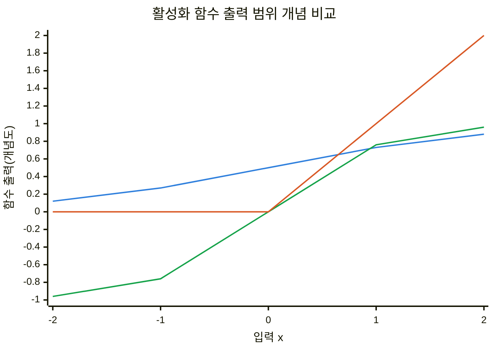
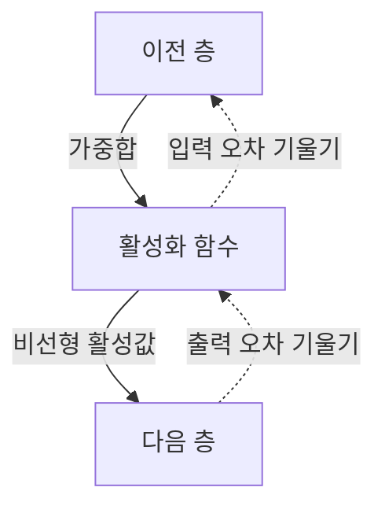
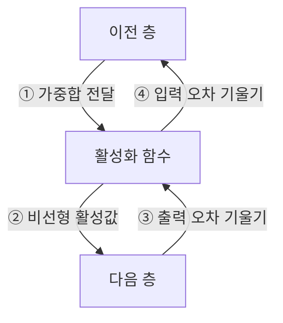
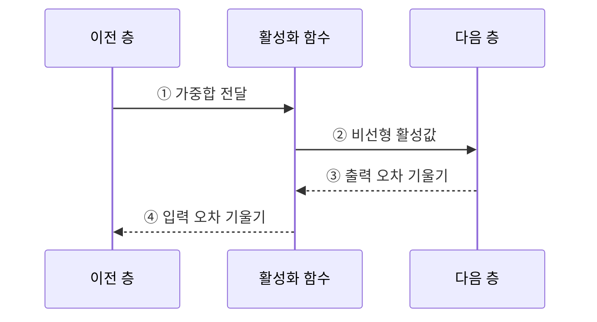

---
sidebar:
  order: 40
  label: "040. 활성화 함수 — ReLU·Sigmoid·Tanh (Activation Functions)"
  badge:
    text: "기출 · 30%"
    variant: note
title: "활성화 함수 — ReLU·Sigmoid·Tanh (Activation Functions)"
date: "2026-07-28T17:16:00+09:00"
tags:
  - "notes-basic-theory"
weight: 40
extra:
  question_no: "040"
  source_status: "기출"
  source_history: "120회"
  priority: 30
  priority_note: "함수별 출력 범위·기울기 비교"
---

## 미리 알고가기

- **활성화 함수($f$)**: 뉴런의 가중합을 비선형 값으로 변환하여 신경망이 복잡한 데이터 패턴과 비선형 결정 경계를 학습하게 하는 함수다.
- **자연상수($e$)**: 자연로그의 밑인 약 2.718의 수로, 시그모이드·쌍곡탄젠트의 지수 계산에 사용한다.
- **비선형성(Nonlinearity)**: 입력을 상수배하고 더하는 것만으로는 만들 수 없는 굽은 관계를 뜻하며, 층을 아무리 쌓아도 이 성질이 없으면 전체가 결국 한 층짜리 직선 변환으로 되돌아간다.
- **도함수(Derivative)**: 입력이 조금 변할 때 함수 출력이 얼마나 변하는지를 나타내는 변화율이며, 역전파에서 뒤에서 온 오차를 앞쪽으로 얼마나 통과시킬지의 배율이 된다.
- **영중심 출력(Zero-centered Output)**: 출력이 0을 가운데 두고 양수와 음수로 고르게 나오는 성질이며, 출력이 모두 양수로만 나오면 다음 층 가중치의 갱신 방향이 한쪽으로 쏠린다.
- **포화·기울기 소실**: 입력의 절댓값이 커진 구간에서 출력이 거의 변하지 않아 도함수가 0에 가까워지는 것이 포화이고, 그 작은 값이 층마다 곱해져 앞쪽 층에는 오차가 거의 닿지 않게 되는 것이 기울기 소실이다.
- **죽은 ReLU(Dying ReLU)**: 어떤 뉴런에 음수 입력만 계속 들어와 출력도 0이고 도함수도 0이라 학습 신호가 아예 끊긴 상태이며, 그 뉴런은 이후 갱신되지 않아 사실상 빠진 것과 같다.
- **리키 렐루(Leaky ReLU)**: 음수 구간에도 작은 기울기를 남겨 죽은 ReLU로 학습 신호가 끊기는 것을 방지하는 ReLU 변형이다.
- **장단기 메모리(Long Short-Term Memory, LSTM)**: 게이트로 셀 상태를 조절하여 장기 의존성을 학습하는 순환 신경망 구조로, 셀 후보와 은닉 상태 계산에 활성화 함수를 사용한다.
- **정류 선형 유닛(Rectified Linear Unit, ReLU)**: 음수 입력은 0으로, 양수 입력은 그대로 출력하여 양수 구간의 기울기를 유지하는 활성화 함수다.
- **시그모이드 함수(Sigmoid Function)**: 입력을 0과 1 사이의 값으로 변환하여 이진 분류 출력층에 사용하지만, 입력 절댓값이 커지면 기울기가 0에 가까워지는 활성화 함수다.
- **쌍곡탄젠트 함수(Hyperbolic Tangent, Tanh)**: 입력을 -1과 1 사이로 압축하되 0을 가운데 두어 시그모이드의 한쪽 쏠림을 줄인 활성화 함수다.
- **순전파·역전파(Forward·Backpropagation)**: 순전파는 입력에서 예측값을 계산하고 역전파는 출력 오차의 기울기를 앞쪽 층으로 전달함
- **은닉층·출력층(Hidden·Output Layer)**: 은닉층은 입력 특징을 중간 표현으로 바꾸고 출력층은 최종 예측값을 만듦
- **순환 신경망(Recurrent Neural Network, RNN)**: 이전 시점의 은닉 상태를 현재 입력과 함께 처리하여 순차 데이터의 문맥을 학습하는 신경망
- **수식 기호 $W$, $x$, $b$, $z$, $a$**: 각각 가중치·입력·편향·가중합·활성화 함수 출력을 가리킨다.
- **셀 후보·은닉 상태**: 셀 후보는 LSTM에 새로 기록할 내용이고 은닉 상태는 현재 시점에서 밖으로 전달할 요약값임

## Ⅰ. 개요

- 정의/개념: 가중합을 **비선형 출력**으로 바꾸는 뉴런의 **변환 함수**
- 기존 한계: **선형 결합**만 쌓으면 굽은 **결정 경계** 표현 불가

### 쉽게 이해하기 (학습용)

- 선형 변환만 여러 층 합성해도 하나의 선형 변환으로 축약된다. 활성화 함수가 층 사이에 비선형성을 넣어 굽은 결정 경계를 표현하게 한다.

## Ⅱ. 특징

- **비선형 변환** 없이는 다층이 단일 **선형 변환**과 동치
- **출력 범위**가 좌우하는 다음 층 **신호 분포**
- **도함수**가 층마다 곱해져 **기울기 소실** 여부 좌우

| 계열 | 수식·의미 |
|:---|:---|
| 파랑 · 1계열 | Sigmoid, 0~1 범위의 S자 출력 |
| 초록 · 2계열 | Tanh, -1~1 범위의 영중심 출력 |
| 빨강 · 3계열 | ReLU, 음수 0·양수 항등 출력 |

### 쉽게 이해하기 (학습용)

- 활성화 함수의 출력 범위는 다음 층의 입력 분포를, 도함수는 역전파되는 기울기의 크기를 결정한다.

## Ⅲ. 아키텍처

**도표안 A — 구조도**

**도표안 B — 동작 흐름도**

**도표안 C — sequenceDiagram**

| 구성요소 | 책임 |
|:---|:---|
| 이전 층 | 가중치·편향 기반 **가중합** 산출 |
| 활성화 함수 | **비선형 변환** 활성값과 **도함수** 산출 |
| 다음 층 | 활성값 소비와 **출력 오차 기울기** 회신 |

**동작 원리**

- **① 가중합 전달**: 이전 층의 선형 결합 입력
- **② 비선형 활성값**: 함수 출력으로 다음 층 표현 생성
- **③ 출력 오차 기울기**: 다음 층에서 역전파 신호 수신
- **④ 입력 오차 기울기**: 도함수를 곱해 이전 층으로 전달

### 쉽게 이해하기 (학습용)

- 활성화 함수는 순전파에서 가중합을 변환하고, 역전파에서 자신의 도함수만큼 오차 기울기를 조정한다.

## Ⅳ. 종류 및 비교

| 활성화 함수 | Sigmoid | Tanh | ReLU |
|:---|:---|:---|:---|
| 적용 기준 | **이진 분류** 확률 출력층 | 부호 있는 **순환 상태** 표현 | 층 수 많은 **심층 은닉층** |
| 핵심 특징 | 출력을 0~1로 압축하는 **S자 곡선** | **영중심** 출력의 -1~1 압축 | 음수 차단·양수 구간 **항등 함수** |
| 한계 | 출력 전부 양수·**도함수** 최대 $0.25$ | 영중심에도 남는 양끝 **포화** | 음수 고정 뉴런의 **죽은 ReLU** |

> 요약: 출력 범위와 도함수 특성에 따른 **활성화 함수 선택**

### 쉽게 이해하기 (학습용)

- 확률 출력은 Sigmoid, 부호 있는 상태는 Tanh, 깊은 은닉층은 ReLU를 우선 검토하고 각 함수의 포화·죽은 뉴런 한계를 확인한다.

## Ⅴ. 실무 고려사항 및 대책

| 고려사항 | 대책 | 효과 |
|:---|:---|:---|
| Sigmoid·Tanh의 **포화** | 입력 정규화·가중치 초기화 | **기울기 소실** 완화 |
| 음수 입력에 고정된 **ReLU** | Leaky ReLU·학습률 조정 | **죽은 뉴런** 감소 |
| 출력층과 **과업 불일치** | 이진 Sigmoid·다중 Softmax·회귀 선형 적용 | **출력 의미·손실** 정합 |
| **활성값·기울기 분포** 이상 | 층별 통계 감시·정규화 재조정 | **학습 불안정** 조기 탐지 |
| 영상 분류 **심층 은닉층** | 양수 기울기를 유지하는 ReLU 적용 | 깊은 층 **학습 신호** 유지 |

### 쉽게 이해하기 (학습용)
- 층의 출력 의미와 기울기 분포를 함께 확인해 포화·죽은 뉴런을 통제한다.

## Ⅵ. 결론

- 출력 의미·포화·음수 기울기를 기준으로 **활성화 함수** 결정

### 쉽게 이해하기 (학습용)

- 층의 출력 의미와 기울기 특성에 맞는 함수를 선택하고, 포화나 죽은 뉴런이 관찰되면 정규화·초기화·함수 변형을 조정한다.
