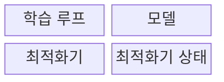
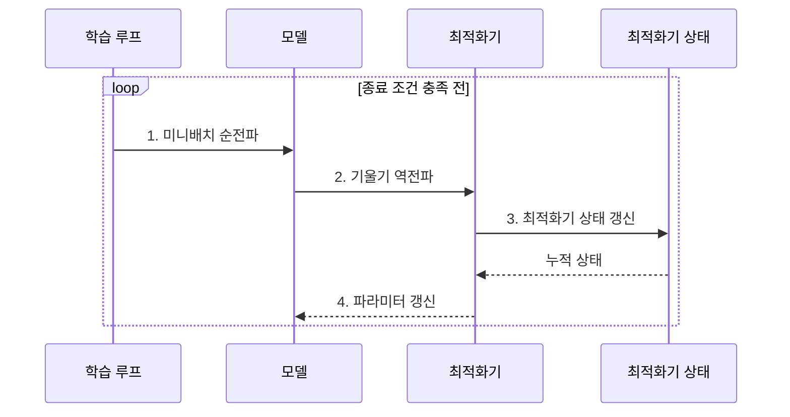

---
sidebar:
  order: 41
  label: "041. 경사하강법: SGD•Adam•AdaGrad (Gradient Descent)"
  badge:
    text: "기출 • 50%"
    variant: note
title: "경사하강법: SGD•Adam•AdaGrad (Gradient Descent)"
date: "2026-07-30T18:21:35+09:00"
tags:
  - "notes-basic-theory"
weight: 41
extra:
  question_no: "041"
  source_status: "기출"
  source_history: "122회"
  priority: 50
  priority_note: "학습률과 갱신 상태가 수렴을 좌우"
---

## 미리 알고가기

- **경사하강법(Gradient Descent)**: 손실 기울기의 반대 방향으로 파라미터를 반복 이동해 손실을 줄이는 최적화 기법
- **파라미터($\theta$)**: ‘세타’로 읽으며 학습이 조정하는 모델의 가중치•편향
- **손실 함수($L$)**: 모델의 예측 오류를 하나의 값으로 나타내 최적화 대상을 정한다.
- **기울기(Gradient, $\nabla L$)**: ‘나블라 $L$’로 읽으며 손실이 가장 빠르게 증가하는 방향과 크기를 모은 편미분 벡터
- **1차 최적화(First-order Optimization)**: 현재 지점의 기울기만으로 다음 이동을 정하는 국소 최적화 방식
- **학습률(Learning Rate, $\eta$)**: ‘에타’로 읽으며 기울기를 반영할 비율과 한 번의 이동 폭
- **미니배치(Mini-batch)**: 전체 데이터에서 한 번의 기울기 추정에 사용하는 표본 묶음
- **순전파(Forward Propagation)**: 입력을 층별로 통과시켜 예측값과 손실을 계산하는 과정
- **역전파(Backpropagation)**: 출력 오차를 거꾸로 전달해 파라미터별 손실 기울기를 계산하는 방법
- **볼록•비볼록 손실(Convex•Non-convex Loss)**: 볼록 손실은 모든 지역 최솟값이 전역 최솟값이지만, 비볼록 손실은 여러 지역 최솟값과 안장점을 가질 수 있는 목적함수다.
- **지역 최적해•전역 최적해(Local•Global Optimum)**: 지역 최적해는 주변보다는 낮지만 더 낮은 골짜기가 다른 곳에 남아 있는 지점이고, 전역 최적해는 손실면 전체에서 가장 낮은 지점이다.
- **안장점(Saddle Point)**: 어떤 방향에서는 손실이 낮아지고 다른 방향에서는 높아지며 기울기가 0에 가까워 최솟값처럼 정체될 수 있는 지점
- **수렴•발산(Convergence•Divergence)**: 수렴은 갱신값이 최솟값 부근에 가까워지는 현상이고 발산은 갱신값이 그 부근에서 점점 멀어져 학습이 실패하는 현상이다.
- **확률적 경사하강법(Stochastic Gradient Descent, SGD)**: 무작위 미니배치의 기울기로 파라미터를 직접 갱신하는 방법
- **적응적 기울기 알고리즘(Adaptive Gradient Algorithm, AdaGrad)**: 누적 제곱 기울기로 자주 갱신된 파라미터의 보폭을 줄이는 방법
- **적응적 모멘트 추정(Adaptive Moment Estimation, Adam)**: 기울기의 1•2차 모멘트 이동평균으로 파라미터별 방향•보폭을 조정하는 방법
- **모멘트(Moment)**: 1차 모멘트는 기울기의 평균으로 갱신 **방향**을, 2차 모멘트는 기울기 제곱의 평균으로 갱신 **크기**를 보정하는 데 쓰는 통계량이다.
- **지수 이동평균(Exponential Moving Average, EMA)**: 최근 관측값에 더 큰 가중치를 부여하고 과거 값의 영향을 지수적으로 감소시키는 평균 방식이다.
- **최적화기 상태(Optimizer State)**: 모멘트나 누적 제곱 기울기처럼 다음 파라미터 갱신에 사용하는 값으로, 학습 시 추가 메모리를 차지한다.
- **희소 특징(Sparse Feature)**: 대부분의 표본에서 값이 0이고 일부 표본에서만 값이 나타나는 입력 특성이며, 드물게 등장하는 만큼 갱신 기회도 적다.
- **일반화 성능(Generalization)**: 학습에 쓰지 않은 새 데이터에서의 예측 성능이며, 학습 손실이 잘 줄어도 이 성능이 함께 좋아진다는 보장은 없다.
- **그래픽처리장치(Graphics Processing Unit, GPU)**: 많은 연산을 동시에 처리하는 가속기이며, 학습에서는 파라미터와 최적화기 상태를 모두 이 장치의 메모리에 올려야 해서 용량 산정의 기준이 된다.
- **갱신식 $\theta_{t+1}=\theta_t-\eta\nabla L$**: 현재 파라미터를 학습률만큼 손실 기울기의 반대 방향으로 옮긴다는 뜻이다.
- **기울기 클리핑(Gradient Clipping)**: 기울기 노름이 임계값을 넘으면 크기를 제한해 과도한 파라미터 갱신을 방지하는 기법
- **기울기 누적(Gradient Accumulation)**: 여러 미니배치의 기울기를 더한 뒤 한 번 갱신해 큰 배치와 비슷한 효과를 내는 기법
- **학습률 스케줄(Learning Rate Schedule)**: 학습 진행도나 손실 정체에 따라 학습률을 단계적•연속적으로 바꾸는 정책
- **혼합 정밀도(Mixed Precision)**: 일부 연산과 상태에 낮은 비트 정밀도를 사용해 메모리와 연산량을 줄이는 학습 방식
- **상태 분할(State Sharding)**: 최적화기 상태를 여러 장치에 나누어 장치별 메모리 사용량을 줄이는 방식

## Ⅰ. 개요

- 정의/개념: 손실의 **기울기 반대 방향**으로 갱신하는 최적화
- 배경/필요성: 고차원 **비볼록 손실**은 해석적 최적해 산출 불가

### 쉽게 이해하기 (학습용)
- 최저점을 바로 풀 수 없는 손실 지형에서 발밑 경사인 기울기를 따라 반복 이동해 손실을 줄인다.

## Ⅱ. 특징

- **비볼록** 손실면에서 초기값에 따라 서로 다른 **지역 최적해** 수렴
- **학습률**이 크면 최적점 초과 **발산**, 작으면 학습 시간 급증
- **미니배치** 축소가 연산량은 줄이되 **기울기 추정 분산** 확대

> 손실 곡선에 따른 **학습률 조정**

### 쉽게 이해하기 (학습용)
- 비볼록 손실면은 여러 지역 최적해와 안장점을 가지므로 초기값과 미니배치 구성에 따라 수렴 경로가 달라질 수 있다.

## Ⅲ. 구조 및 구성요소

| 구성요소 | 책임 |
|:---|:---|
| 학습 루프 | **미니배치** 공급과 **종료 조건** 판정 |
| 모델 | **순전파** 예측과 **역전파** 기울기 산출 |
| 최적화기 | 기울기•상태 기반 **갱신 규칙** 적용 |
| 최적화기 상태 | **모멘트**•누적 제곱 기울기 보관 |

### 쉽게 이해하기 (학습용)
- 학습 루프와 모델이 기울기를 만들고, 최적화기가 누적 상태를 참고해 파라미터를 바꾼다.

## Ⅳ. 흐름도

### 동작 원리

- **1. 미니배치 순전파**: 표본 공급•예측•손실 산출
- **2. 기울기 역전파**: 손실을 역전파해 파라미터별 기울기 계산
- **3. 최적화기 상태 갱신**: 모멘트•누적 제곱 갱신
- **4. 파라미터 갱신**: 새 파라미터의 모델 반영

### 쉽게 이해하기 (학습용)
- 학습 루프가 미니배치를 공급하면 모델이 기울기를 계산하고, 최적화기는 현재 기울기와 누적 상태로 파라미터를 갱신한다.

## Ⅴ. 종류 및 비교

| 최적화기 | SGD | AdaGrad | Adam |
|:---|:---|:---|:---|
| 적용 기준 | 상태 **메모리** 여유 없는 학습 | 입력 **희소도** 높은 특징 | 파라미터 수 크고 **초기 수렴** 필요 |
| 핵심 특징 | 미니배치 **기울기**로 직접 갱신 | 특징별 **누적 제곱**으로 보폭 축소 | 1•2차 **모멘트 EMA**로 방향•크기 보정 |
| 한계 | **학습률** 수동 조정•수렴 지연 | 학습률 **단조 감소**에 따른 학습 정지 | 1•2차 모멘트의 **상태 메모리 2배** |

> 요약: 앞 세대 한계를 뒤 세대가 보완한 **최적화기 계보**

### 쉽게 이해하기 (학습용)
- SGD는 상태 비용이 작고, AdaGrad는 희소 특징에 유리하며, Adam은 모멘트 상태를 사용해 초기 수렴을 빠르게 하는 대신 메모리를 더 사용한다.

## Ⅵ. 실무 고려사항 및 대책

| 고려사항 | 대책 | 효과 |
|:---|:---|:---|
| **손실 진동•발산** 발생 | **학습률 축소**와 기울기 클리핑 | **갱신 폭 안정화** |
| **손실 감소 정체** 지속 | **학습률 스케줄**•초기값•최적화기 재조정 | **정체 구간 탈출** 가능성 향상 |
| **미니배치별 손실 변동** 과다 | **배치 크기 확대** 또는 기울기 누적 | **기울기 추정 분산** 감소 |
| Adam 상태로 **GPU 메모리 부족** | **혼합 정밀도**•상태 분할 또는 SGD 검토 | **학습 가능 모델 규모** 확보 |

### 쉽게 이해하기 (학습용)
- 손실 곡선•기울기 크기•갱신 폭을 함께 관찰하며, Adam은 파라미터마다 1•2차 모멘트를 보관하므로 GPU 메모리에도 최적화기 상태를 포함한다.

## Ⅶ. 결론

- **희소 특징**은 AdaGrad, **초기 수렴**은 Adam 선택

### 쉽게 이해하기 (학습용)
- 손실면, 입력 희소도, 수렴 속도, 상태 메모리를 함께 검토해 최적화기와 학습률 정책을 선택한다.
