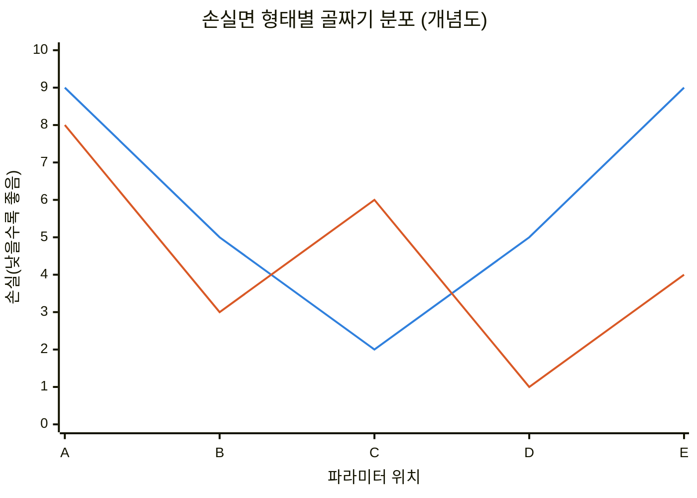
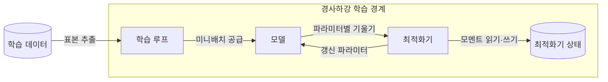
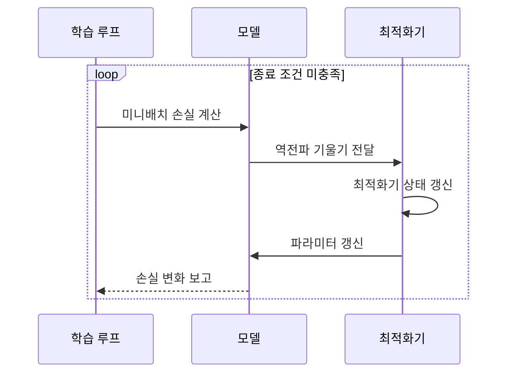

---
sidebar:
  order: 41
  label: "041. 경사하강법 — SGD·Adam·AdaGrad (Gradient Descent)"
  badge:
    text: "기출 · 50%"
    variant: note
title: "경사하강법 — SGD·Adam·AdaGrad (Gradient Descent)"
date: "2026-07-27T22:45:00+09:00"
tags:
  - "notes-basic-theory"
weight: 41
extra:
  question_no: "041"
  source_status: "기출"
  source_history: "122회"
  priority: 50
  priority_note: "학습률과 갱신 상태가 수렴을 좌우"
---

## 미리 알고가기

- **경사하강법(Gradient Descent)**: 안개 낀 산에서 발밑 경사만 만져 보고 가장 가파른 내리막으로 한 걸음씩 내려가는 장면을 떠올리면 되며, 손실이 작아지는 방향으로 파라미터를 반복 갱신해 최적값을 찾는 학습 기법이다.
- **파라미터($\theta$)**: $\theta$는 그리스 문자 ‘세타(theta)’로 읽고 통계학에서 추정 대상 모수를 가리키는 표준 표기이며, 모델이 손실을 줄이도록 학습 과정에서 조정하는 가중치와 편향을 가리킨다.
- **손실 함수($L$)**: $L$은 ‘엘’로 읽고 loss의 머리글자를 함수 이름에 쓴 표기이며, 모델의 예측 오류를 하나의 값으로 나타내 최적화 대상을 정한다.
- **기울기(Gradient, $\nabla L$)**: $\nabla$는 ‘나블라(nabla)’로 읽고 연산자의 정식 명칭은 ‘델 연산자(del operator)’이며, 여러 변수의 편미분을 한 벡터로 모아 손실 $L$이 가장 가파르게 증가하는 방향과 경사도의 크기를 나타내 파라미터 갱신 방향을 정한다.
- **1차 최적화(First-order Optimization)**: 손실면의 휘어진 정도(2차 미분)까지 보지 않고 한 점의 기울기라는 1차 미분 정보만 사용해 다음 이동을 정하는 방식이며, 계산이 싸지만 그 점 주변만 직선으로 어림잡는 국소 근사라는 한계를 함께 가진다.
- **학습률(Learning Rate, $\eta$)**: $\eta$는 그리스 문자 ‘에타(eta)’로 읽고 최적화 문헌에서 학습률을 나타내는 표준 표기이며, 기울기를 파라미터 갱신에 반영할 비율과 한 번의 이동 폭을 정한다.
- **미니배치(Mini-batch)**: 전체 학습 데이터에서 기울기를 추정하려고 뽑은 표본 묶음이며, 크기를 줄이면 한 번의 계산은 싸지지만 표본마다 기울기 추정값이 달라진다.
- **순전파(Forward Propagation)**: 입력을 모델의 앞쪽 층부터 차례로 통과시켜 예측값을 만들고 그 예측과 정답의 차이로 손실을 구하는 과정이다.
- **역전파(Backpropagation)**: 순전파로 구한 손실을 출력 쪽에서 입력 쪽으로 되짚어 가며 연쇄 법칙으로 각 파라미터가 손실에 얼마나 기여했는지 기울기를 계산하는 방법이다.
- **볼록·비볼록 손실(Convex·Non-convex Loss)**: 볼록 손실은 그릇처럼 골짜기가 하나뿐이라 지역 최솟값이 곧 전역 최솟값이지만, 비볼록 손실은 골짜기가 여러 개라 어느 골짜기에 들어가느냐에 따라 도착점이 달라지는 목적함수다.
- **지역 최적해·전역 최적해(Local·Global Optimum)**: 지역 최적해는 주변보다는 낮지만 더 낮은 골짜기가 다른 곳에 남아 있는 지점이고, 전역 최적해는 손실면 전체에서 가장 낮은 지점이다.
- **수렴·발산(Convergence·Divergence)**: 수렴은 갱신값이 최솟값 부근에 가까워지는 현상이고 발산은 갱신값이 그 부근에서 점점 멀어져 학습이 실패하는 현상이다.
- **확률적 경사하강법(Stochastic Gradient Descent, SGD)**: ‘에스지디’로 읽고 영문 머리글자를 딴 약어이며, 무작위 표본이나 미니배치의 기울기만으로 곧바로 파라미터를 갱신해 별도 상태 저장 비용을 두지 않는 방법이다.
- **적응적 기울기 알고리즘(Adaptive Gradient Algorithm, AdaGrad)**: ‘아다그라드’로 읽고 Adaptive와 Gradient를 결합한 이름이며, 지금까지의 기울기를 제곱해 누적한 값으로 자주 갱신된 파라미터의 보폭만 줄이는 방법이다.
- **적응적 모멘트 추정(Adaptive Moment Estimation, Adam)**: ‘애덤’으로 읽고 영문 핵심 글자를 사람 이름처럼 만든 약어이며, 기울기의 1차 모멘트와 2차 모멘트를 지수 이동평균으로 함께 추적해 갱신 방향과 보폭을 동시에 보정한다.
- **모멘트(Moment)**: 1차 모멘트는 기울기의 평균으로 갱신 **방향**을, 2차 모멘트는 기울기 제곱의 평균으로 갱신 **크기**를 보정하는 데 쓰는 통계량이다.
- **지수 이동평균(Exponential Moving Average, EMA)**: ‘이엠에이’로 읽고 영문 머리글자를 딴 약어이며, 최근 값에 더 큰 가중치를 주어 오래된 기록의 영향을 서서히 줄이는 평균 방식으로 Adam이 모멘트를 추적할 때 쓴다.
- **최적화기 상태(Optimizer State)**: 모멘트나 누적 제곱 기울기처럼 다음 갱신에 다시 쓰려고 파라미터마다 따로 보관하는 기록이며, 이 기록이 곧 학습 시 추가로 잡아먹는 메모리다.
- **희소 특징(Sparse Feature)**: 대부분의 표본에서 값이 0이고 일부 표본에서만 값이 나타나는 입력 특성이며, 드물게 등장하는 만큼 갱신 기회도 적다.
- **일반화 성능(Generalization)**: 학습에 쓰지 않은 새 데이터에서의 예측 성능이며, 학습 손실이 잘 줄어도 이 성능이 함께 좋아진다는 보장은 없다.
- **그래픽처리장치(Graphics Processing Unit, GPU)**: 많은 연산을 동시에 처리하는 가속기이며, 학습에서는 파라미터와 최적화기 상태를 모두 이 장치의 메모리에 올려야 해서 용량 산정의 기준이 된다.
- **갱신식 $\theta_{t+1}=\theta_t-\eta\nabla L$**: ‘다음 시점 세타는 현재 세타 마이너스 에타 곱하기 나블라 엘’로 읽고 아래첨자 $t$는 반복 시점을, 빼기 기호는 기울기가 가리키는 증가 방향의 반대로 이동함을 나타내며, 현재 파라미터를 학습률만큼 손실 감소 방향으로 옮긴다는 뜻이다.

## Ⅰ. 개요

- 정의/개념: **기울기** 반대 방향 반복 갱신으로 손실을 줄이는 **1차 최적화** 기법
- 기존 한계: 복잡한 손실의 **최적해 직접 계산** 한계로 반복적 최소화

### 쉽게 이해하기 (학습용)
- 산 전체를 공식으로 풀어 바닥 좌표를 바로 구할 수 있다면 한 걸음씩 내려갈 필요가 없지만, 딥러닝처럼 변수가 많은 손실은 최적해를 직접 계산하기 어려워 발밑 경사를 재고 이동하는 반복 근사로 손실을 최소화한다.

## Ⅱ. 특징

- **비볼록** 손실면에서 초기값에 따라 서로 다른 **지역 최적해** 수렴
- **학습률**이 크면 최적점 초과 **발산**, 작으면 학습 시간 급증
- **미니배치** 축소가 연산량은 줄이되 **기울기 추정 분산** 확대

### 쉽게 이해하기 (학습용)
- 답안이 `초기값별`이라는 단서를 붙인 이유는, 골짜기가 여러 개인 울퉁불퉁한 산에서는 한 점의 기울기만 보고 내려가는 사람이 자기가 처음 발을 디딘 자리 근처의 골짜기로 그대로 빨려 들어가서, 같은 방법으로 내려가도 출발 지점이 다르면 도착하는 골짜기가 달라지기 때문이다.

■ **볼록 손실면** &nbsp;&nbsp; ■ **비볼록 손실면**

> 파란색 선은 골짜기가 C 하나뿐이라 어디서 출발해도 같은 바닥에 닿지만, 주황색 선은 B와 D 두 곳이 골짜기여서 B에 먼저 들어가면 진짜 최저점인 D를 못 찾는다.

## Ⅲ. 아키텍처 및 구성요소

| 설계 요소 | 설명 |
|:---|:---|
| 학습 루프 | **미니배치** 공급과 **종료 조건** 판정 |
| 모델 | **순전파** 예측과 **역전파** 기울기 산출 |
| 최적화기 | 기울기·상태 기반 **갱신 규칙** 적용 |
| 최적화기 상태 | **모멘트**·누적 제곱 기울기 보관 |

> 요약: 학습 루프가 모델의 **기울기 계산**과 최적화기의 **갱신**을 조정

### 쉽게 이해하기 (학습용)
- 답안이 파라미터나 학습률 같은 값을 구성요소에서 빼고 네 덩어리만 남긴 이유는, 등산으로 치면 값들은 그저 눈금일 뿐이고 실제로 일하는 주체는 언제 멈출지 정하는 인솔자(학습 루프), 발밑 경사를 재 주는 산(모델), 그 경사를 보고 다음 발의 방향과 보폭을 정하는 조언자(최적화기), 조언자가 직전 몇 걸음을 적어 둔 수첩(최적화기 상태) 넷뿐이기 때문이다.

## Ⅳ. 원리 및 절차 흐름도

| 절차 | 설명 |
|:---|:---|
| 미니배치 손실 계산 | 표본 **예측값**과 정답의 오차 집계 |
| 역전파 기울기 전달 | **연쇄 법칙** 기반 파라미터별 **편미분** |
| 최적화기 상태 갱신 | **모멘트**·누적 제곱 기울기 반영 |
| 파라미터 갱신 | **학습률**과 상태로 **이동 폭** 결정 |
| 손실 변화 보고 | **종료 조건** 판정용 손실값 회신 |

> 요약: **기울기** 산출과 **상태 갱신**을 종료 조건까지 반복

### 쉽게 이해하기 (학습용)
- 답안이 `최적화기 상태 갱신`을 파라미터 갱신보다 앞 단계로 따로 세운 이유는, 조언자가 발을 옮기라고 말하기 전에 먼저 자기 수첩에 직전 걸음의 경사를 적어 넣고 그 누적 기록을 봐야 이번 보폭을 얼마로 할지 정할 수 있기 때문이며, 이 수첩을 쓰느냐 마느냐가 곧 SGD와 Adam을 가르는 지점이다.

## Ⅴ. 종류 및 비교

| 최적화기 | SGD | AdaGrad | Adam |
|:---|:---|:---|:---|
| 적용 기준 | 상태 **메모리** 여유 없는 학습 | 입력 **희소도** 높은 특징 | 파라미터 수 크고 **초기 수렴** 필요 |
| 핵심 특징 | 미니배치 **기울기**로 직접 갱신 | 특징별 **누적 제곱**으로 보폭 축소 | 1·2차 **모멘트 EMA**로 방향·크기 보정 |
| 한계 | **학습률** 수동 조정·수렴 지연 | 학습률 **단조 감소**에 따른 학습 정지 | 1·2차 모멘트의 **상태 메모리 2배** |

> 요약: 앞 세대 한계를 뒤 세대가 보완한 **최적화기 계보**

### 쉽게 이해하기 (학습용)
- 답안이 세 방식을 굳이 이 순서로 늘어놓은 이유는 이것이 서로 무관한 후보 셋이 아니라 앞의 불편을 뒤가 고쳐 온 계보이기 때문인데, 수첩 없이 매번 같은 보폭으로 걷던 SGD의 불편을 AdaGrad가 자주 밟은 길의 보폭을 줄여 해결했고, 그러다 보폭이 0에 수렴해 멈춰 버리는 AdaGrad의 결함을 Adam이 오래된 기록을 서서히 잊는 지수 이동평균으로 해결한 것이다.

## Ⅵ. 실무 사례

1. **Adam** 기반 분산 학습의 **GPU 메모리** 산정에 상태 2배 반영

### 쉽게 이해하기 (학습용)
- 여러 장비에 모델을 나눠 학습시킬 때 Adam은 파라미터마다 방향 수첩과 크기 수첩을 하나씩 더 들고 다니므로, 장비 메모리를 계산할 때 모델 크기만 보면 실제로는 세 배 가까이 필요해 학습이 중간에 멈추게 된다.

## Ⅶ. 결론

- **전역 최적해** 미보장을 전제로 **상태 메모리**·희소도로 최적화기 선택

### 쉽게 이해하기 (학습용)
- 어떤 방식을 써도 진짜 최저점에 닿는다는 보장은 없다는 사실을 먼저 인정한 뒤에, 남은 판단은 결국 장비 메모리가 수첩 두 권을 감당할 수 있는지와 입력이 희소한지 두 가지로 좁혀서 옵티마이저를 고르는 것이다.
