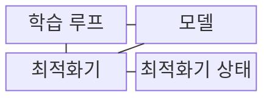
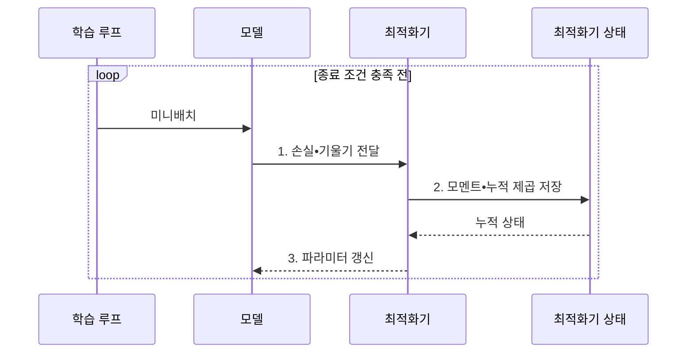

---
sidebar:
  order: 41
  label: "041. 경사하강법: SGD•Adam•AdaGrad (Gradient Descent)"
  badge:
    text: "기출 • 50%"
    variant: note
title: "경사하강법: SGD•Adam•AdaGrad (Gradient Descent)"
date: "2026-08-04T09:53:42+09:00"
tags:
  - "notes-basic-theory"
weight: 41
extra:
  question_no: "041"
  source_status: "기출"
  source_history: "122회"
  priority: 50
  priority_note: "학습률•갱신 상태에 따른 수렴 속도•안정성"
---

## Ⅰ. 개요

핵심 용어

- **경사하강법**: 손실 기울기의 반대 방향으로 파라미터를 반복 이동해 손실을 줄이는 최적화 기법
- **비볼록 손실**: 여러 지역 최솟값과 안장점을 가질 수 있어 해석적 최적해를 구하기 어려운 목적함수
- **해석적 최적해**: 반복 계산 없이 수식 변형으로 직접 구한 목적 함수의 최적값이나 파라미터

- 정의/개념: 손실을 줄이도록 **기울기 반대 방향**으로 갱신하는 최적화 기법
- 배경/필요성: 고차원 **비볼록 손실** 은 해석적으로 최적해를 직접 구하기 어려움

#### 한줄 요약
- 최저점을 바로 풀 수 없는 손실 지형에서 발밑 경사인 기울기를 따라 반복 이동해 손실을 줄인다.

## Ⅱ. 특징

핵심 용어

- **기울기 $\nabla L$**: 손실이 가장 빠르게 증가하는 방향과 크기를 모은 편미분 벡터
- **학습률 $\eta$**: 기울기를 반영할 비율로 한 번의 파라미터 이동 폭을 정하는 값
- **안장점**: 방향에 따라 손실이 낮아지거나 높아지며 기울기가 0에 가까운 지점
- **기울기 추정 분산**: 미니배치 구성에 따라 계산된 기울기가 변하는 정도
- **지역 최적해(Local Optimum)**: 주변 값보다 손실이 작지만 전체 최소는 아닐 수 있는 해
- **발산(Divergence)**: 갱신이 최적점에서 멀어지며 손실이 계속 커지는 상태
- **미니배치(Mini-batch)**: 한 번의 기울기 계산에 사용하는 학습 표본 묶음

- **비볼록** 손실면의 지역 최적해•**안장점**으로 초기값별 결과 변화
- **학습률** 이 크면 최적점 초과 **발산**, 작으면 학습 시간 급증
- **미니배치** 축소가 연산량은 줄이되 **기울기 추정 분산** 확대

#### 한줄 요약
- 울퉁불퉁한 산에서 출발점과 발밑 표본이 달라지면 서로 다른 골짜기나 평평한 안장점에 멈춘다.

## Ⅲ. 구조 및 구성요소

핵심 용어

- **순전파(Forward Propagation)**: 예측과 손실을 입력에서 출력 방향으로 계산하는 과정
- **역전파(Backpropagation)**: 파라미터별 손실 기울기를 출력에서 입력 방향으로 계산하는 과정
- **최적화기 상태**: 모멘트나 누적 제곱 기울기처럼 다음 갱신에 사용하는 저장값
- **종료 조건**: 손실 개선•반복 횟수•시간 등의 기준으로 학습을 멈추는 조건
- **갱신 규칙**: 기울기와 최적화기 상태로 파라미터의 이동 방향과 크기를 정하는 규칙
- **모멘트(Moment)**: 기울기의 평균과 제곱 평균으로 갱신을 보정하는 통계량

| 구성요소 | 책임 |
|:---|:---|
| 학습 루프 | **미니배치** 공급과 **종료 조건** 판정 |
| 모델 | **순전파** 예측과 **역전파** 기울기 산출 |
| 최적화기 | 기울기•상태 기반 **갱신 규칙** 적용 |
| 최적화기 상태 | **모멘트**•누적 제곱 기울기 보관 |

#### 한줄 요약
- 작업반장이 표본을 건네면 모델이 경사도를 계산하고, 최적화기는 장부의 누적 상태를 참고해 가중치를 바꾼다.

## Ⅳ. 흐름도

핵심 용어

- **파라미터 $\theta$**: 학습이 조정하는 모델의 가중치와 편향
- **누적 제곱 기울기**: 좌표별 과거 기울기 제곱을 더해 적응적 보폭을 정하는 상태

### 동작 원리

- **1. 손실•기울기 전달**: 순전파 손실에서 파라미터별 기울기 계산
- **2. 모멘트•누적 제곱 저장**: 최적화기별 갱신 이력 누적
- **3. 파라미터 갱신**: 학습률과 누적 상태를 모델에 반영

#### 한줄 요약
- 컨베이어가 표본을 보내면 모델이 경사도를 적고 최적화기가 누적 장부와 보폭을 합쳐 가중치를 옮긴다.

## Ⅴ. 종류 및 비교

핵심 용어

- **확률적 경사하강법(Stochastic Gradient Descent, SGD)**: 무작위 미니배치의 기울기로 파라미터를 직접 갱신하는 방법
- **적응적 기울기(Adaptive Gradient, AdaGrad)**: 누적 제곱 기울기로 자주 갱신된 파라미터의 보폭을 줄이는 방법
- **적응적 모멘트 추정(Adaptive Moment Estimation, Adam)**: 기울기의 1•2차 모멘트 이동평균으로 방향과 보폭을 조정하는 방법
- **희소 특징**: 대부분 표본에서 0이고 일부 표본에서만 값이 나타나는 입력 특성
- **지수 이동평균(Exponential Moving Average, EMA)**: 최근 값에 더 큰 가중치를 두어 모멘트를 누적하는 평균
- **상태 메모리**: 파라미터 외에 모멘트나 누적 기울기를 저장하는 메모리

| 최적화기 | SGD | AdaGrad | Adam |
|:---|:---|:---|:---|
| 적용 기준 | 상태 **메모리** 여유가 없는 학습 | 입력 **희소도** 가 높은 특징 | 파라미터가 많고 **초기 수렴** 필요 |
| 핵심 특징 | 미니배치 **기울기** 로 직접 갱신 | 특징별 **누적 제곱** 으로 보폭 축소 | 1•2차 **모멘트 EMA** 로 방향•크기 보정 |
| 한계 | **학습률** 수동 조정•수렴 지연 | 학습률 **단조 감소** 에 따른 학습 정지 | 1•2차 모멘트의 **상태 메모리 2배** |

> 요약: 앞 세대 한계를 뒤 세대가 보완한 **최적화기 계보**

#### 한줄 요약
- 빈 배낭의 SGD는 가볍고, 희소 좌표 장부를 쓰는 AdaGrad와 두 모멘트 장부를 쓰는 Adam은 차례로 메모리를 더 쓴다.

## Ⅵ. 실무 고려사항 및 대책

핵심 용어

- **기울기 클리핑**: 기울기 노름이 임계값을 넘으면 크기를 제한해 과도한 갱신을 막는 기법
- **학습률 스케줄**: 학습 진행도나 손실 정체에 따라 학습률을 바꾸는 정책
- **기울기 누적**: 여러 미니배치의 기울기를 더한 뒤 한 번 갱신하는 기법
- **상태 분할**: 최적화기 상태를 여러 장치에 나눠 장치별 메모리 사용량을 줄이는 방식
- **손실 진동•정체**: 갱신마다 손실이 크게 오르내리거나 일정 수준에서 더 줄지 않는 상태
- **배치 크기**: 한 번의 기울기 추정에 포함하는 표본 수
- **혼합 정밀도(Mixed Precision)**: 여러 부동소수점 비트 폭을 함께 사용해 학습 메모리와 연산량을 줄이는 방식
- **그래픽 처리 장치(Graphics Processing Unit, GPU)**: 병렬 연산으로 모델 학습을 수행하는 처리 장치

| 문제 | 대책 | 효과 |
|:---|:---|:---|
| **손실 진동•발산** 발생 | **학습률 축소** 와 기울기 클리핑 | **갱신 폭 안정화** |
| **손실 감소 정체** 지속 | **학습률 스케줄**•초기값•최적화기 재조정 | **정체 구간 탈출** 가능성 향상 |
| **미니배치별 손실 변동** 과다 | **배치 크기 확대** 또는 기울기 누적 | **기울기 추정 분산** 감소 |
| Adam 상태로 **GPU 메모리 부족** | **혼합 정밀도**•상태 분할 또는 SGD 검토 | **학습 가능 모델 규모** 확보 |

#### 한줄 요약
- 계기판의 손실 곡선이 출렁이면 보폭을 줄이고, Adam 장부가 GPU 선반을 넘치면 상태 분할이나 SGD로 바꾼다.

## Ⅶ. 결론

핵심 용어

- **초기 수렴**: 학습 초기에 손실이 빠르게 감소해 유용한 성능에 도달하는 속성

- **상태 메모리** 제약은 SGD, 희소 특징은 AdaGrad, **초기 수렴** 은 Adam 선택

#### 한줄 요약
- 도구함이 작으면 SGD, 드문 특징에는 AdaGrad, 빠른 출발에는 Adam을 꺼낸다.
