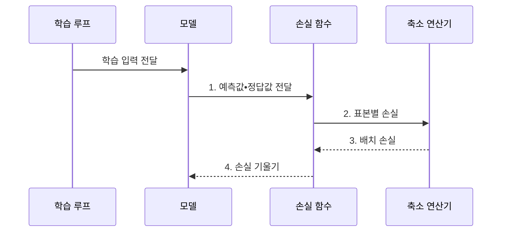

---
sidebar:
  order: 42
  label: "042. 손실 함수: Cross-Entropy•MSE (Loss Functions)"
  badge:
    text: "기출 • 50%"
    variant: note
title: "손실 함수: Cross-Entropy•MSE (Loss Functions)"
date: "2026-08-02T10:10:00+09:00"
tags:
  - "notes-basic-theory"
weight: 42
extra:
  question_no: "042"
  source_status: "기출"
  source_history: "122회"
  priority: 50
  priority_note: "오류 비용을 학습 기울기로 변환"
---

## Ⅰ. 개요

핵심 용어

- **손실 함수**: 예측과 정답의 차이를 최적화할 하나의 비용값으로 바꾸는 함수
- **스칼라 비용**: 여러 예측 오차를 학습이 최소화할 단일 숫자로 표현한 값
- **비미분 평가 지표**: 값이 불연속이거나 기울기를 직접 구할 수 없어 학습 목적에 바로 쓰기 어려운 성능 척도
- **갱신 방향**: 손실을 줄이기 위해 모델 파라미터를 이동해야 하는 방향

- 정의/개념: 예측과 정답의 차이를 **스칼라 비용**으로 바꾸는 함수
- 배경/필요성: 비미분 평가 지표로는 **갱신 방향 산출 불가**

#### 한줄 요약
- 채점기가 예측과 정답의 차이를 하나의 벌점으로 매겨야 모델이 그 경사도를 따라 가중치를 고칠 수 있다.

## Ⅱ. 특징

핵심 용어

- **기울기**: 예측 변화에 따라 손실이 가장 빠르게 증가하는 방향과 크기
- **부분미분**: 여러 입력 중 하나만 변화시켰을 때 함수값의 변화율을 구하는 미분
- **평가 지표**: 학습과 별개로 모델의 업무 성능을 판단하는 정확도•재현율•오차 등의 측정값
- **역전파(Backpropagation)**: 손실 기울기를 출력층에서 이전 층으로 전달해 파라미터별 기울기를 구하는 절차
- **벌점 증가율**: 예측 오차가 커질 때 손실값이 증가하는 속도

> 함수식 계산값에서 파란 MSE는 큰 오차를 제곱 강조하고, 빨간 MAE는 선형 증가하며, 초록 Huber($\delta=1$)는 0 주변의 제곱 구간과 바깥의 선형 구간을 잇는다.

- **미분•부분미분**으로 역전파할 **손실 기울기** 산출
- **손실 형태** 가 오차 크기별 **벌점 증가율** 을 결정
- **평가 지표** 와 손실이 어긋나면 **학습 방향** 왜곡

#### 한줄 요약
- 벌점판이 희귀 장애 누락에 작은 점수만 매기면 모델은 정상 칸만 맞히므로 업무 피해가 큰 오류에 더 큰 벌점을 준다.

## Ⅲ. 구조 및 구성요소

핵심 용어

- **예측값 $\hat y$•정답값 $y$**: 모델이 산출한 추정 결과와 비교할 학습 목표
- **배치**: 한 번의 손실 계산과 파라미터 갱신에 함께 사용하는 표본 묶음
- **축소 연산**: 표본별 손실을 합계나 평균으로 모아 하나의 배치 손실로 만드는 처리
- **표본 손실**: 예측값과 정답값 한 쌍에서 계산한 개별 비용
- **손실 기울기**: 파라미터나 예측값 변화에 따른 손실의 변화율

| 구성요소 | 책임 |
|:---|:---|
| 학습 루프 | **입력•정답 배치** 공급 |
| 모델 | 배치 표본별 **예측값** 산출과 기울기 수신 |
| 손실 함수 | 정답 대조로 **표본 손실**•**기울기** 산출 |
| 축소 연산기 | 표본 손실의 **합계•평균** 집계 |

#### 한줄 요약
- 작업대에서 모델이 답을 내면 채점기가 표본별 벌점을 매기고 집계기가 한 묶음의 평균 벌점으로 모은다.

## Ⅳ. 흐름도

핵심 용어

- **표본별 손실**: 각 예측과 정답의 차이에서 개별적으로 계산한 비용
- **배치 손실**: 표본별 손실을 합계나 평균으로 집계한 최적화 목적
- **역전파**: 손실 기울기를 출력층에서 입력층으로 전달해 파라미터별 기울기를 계산하는 절차
- **파라미터 갱신 방향**: 손실 기울기의 반대쪽으로 가중치와 편향을 이동하는 방향

### 동작 원리

- **1. 예측값•정답값 전달**: 손실 함수의 비교 입력 구성
- **2. 표본별 손실**: 예측•정답별 비용 산출
- **3. 배치 손실**: 표본 손실을 합계•평균으로 집계
- **4. 손실 기울기**: 파라미터 갱신 방향을 모델에 전달

#### 한줄 요약
- 답안지마다 매긴 벌점을 한 묶음의 평균으로 모은 뒤, 그 벌점의 경사표를 모델 쪽으로 되돌려 보낸다.

## Ⅴ. 종류 및 비교

핵심 용어

- **교차 엔트로피**: 정답 클래스에 낮은 확률을 준 예측에 큰 벌점을 주는 분류 손실
- **MSE**: 예측 오차를 제곱해 평균하여 큰 오차를 강조하는 회귀 손실
- **허버 손실**: 작은 오차는 제곱, 임계값을 넘는 오차는 선형으로 벌하는 회귀 손실
- **이상치**: 다른 관측값에서 크게 벗어나 손실과 학습 방향을 왜곡할 수 있는 값
- **라벨 오류(Label Error)**: 학습 표본에 잘못된 정답 클래스가 기록된 상태
- **선형 완화**: 큰 오차 구간의 손실 증가를 제곱이 아닌 직선 비율로 제한하는 처리

| 손실 함수 | 교차 엔트로피 | MSE | 허버 손실 |
|:---|:---|:---|:---|
| 적용 기준 | 출력이 **확률**인 분류 과업 | **잡음** 적은 회귀 과업 | **이상치** 섞인 회귀 과업 |
| 핵심 특징 | 낮은 **정답 확률** 에 급증하는 손실 | **제곱 오차** 로 큰 편차 강조 | 임계값 초과 오차의 **선형 완화** |
| 한계 | **라벨 오류** 표본에 과도한 손실 | 소수 이상치가 **기울기** 지배 | **임계값** 설정에 민감한 결과 |

> 요약: MSE의 이상치 지배를 **허버 손실** 이 선형 벌점으로 완화

#### 한줄 요약
- 제곱 자는 큰 오차를 급격히 키우고, 허버 자는 임계선 밖을 직선으로 재어 이상치 하나가 전체 방향을 끌지 못하게 한다.

## Ⅵ. 실무 고려사항 및 대책

핵심 용어

- **포컬 손실**: 쉬운 표본의 가중치를 낮추고 어려운 표본을 강조하는 불균형 분류 손실
- **클래스 가중치**: 희소 클래스의 손실 비중을 높여 다수 클래스 편중을 줄이는 계수
- **대리 손실**: 미분하기 어려운 평가 지표와 같은 개선 방향을 유도하는 학습 목적
- **라벨 스무딩**: 정답 확률을 1보다 낮춰 라벨 오류와 과도한 확신의 영향을 줄이는 기법
- **다수 클래스 편중**: 표본이 많은 클래스의 손실이 학습을 지배해 소수 클래스 성능이 낮아지는 현상
- **학습 목표 정렬**: 최적화하는 손실의 개선 방향을 실제 평가 지표의 개선 방향과 맞추는 작업

| 문제 | 대책 | 효과 |
|:---|:---|:---|
| 소수 이상치가 **MSE 기울기 지배** | **허버 손실** 로 임계 초과분 선형화 | **평상 구간 예측** 안정화 |
| 클래스 불균형에 **다수 클래스 편중** | **포컬 손실**•클래스 가중치 적용 | **희귀 클래스 학습** 강화 |
| 평가 지표와 **손실 방향 불일치** | 지표에 맞는 **대리 손실** 재선정 | 검증 지표와 **학습 목표 정렬** |
| 라벨 오류에 **과도한 손실 집중** | **라벨 스무딩**•이상 표본 검토 | **기울기 왜곡** 완화 |

#### 한줄 요약
- 계기판에서 손실은 내려가는데 업무 지표가 멈추면 벌점표를 바꾸고, 튀는 값이 방향을 끌면 허버 손실로 완화한다.

## Ⅶ. 결론

핵심 용어

- **확률 분류•이상치 회귀**: 클래스 확률을 예측하는 과업과 극단 관측값이 섞인 연속값 예측 과업
- **교차 엔트로피•허버 손실**: 정답 클래스 확률에 벌점을 주는 분류 손실과 큰 회귀 오차를 선형으로 완화하는 손실

- 확률 분류는 **교차 엔트로피**, 이상치 회귀는 **허버 손실** 선택

#### 한줄 요약
- 갈림길에서 확률 분류 표지판은 교차 엔트로피로, 이상치가 섞인 회귀 표지판은 허버 손실로 향한다.
