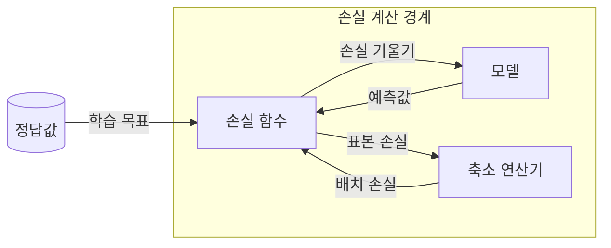
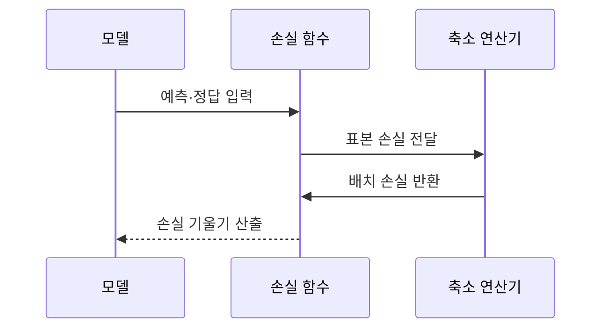

---
sidebar:
  order: 42
  label: "042. 손실 함수 — Cross-Entropy·MSE (Loss Functions)"
  badge:
    text: "기출 · 50%"
    variant: note
title: "손실 함수 — Cross-Entropy·MSE (Loss Functions)"
date: "2026-07-27T22:52:00+09:00"
tags:
  - "notes-basic-theory"
weight: 42
extra:
  question_no: "042"
  source_status: "기출"
  source_history: "122회"
  priority: 50
  priority_note: "오류 비용을 학습 기울기로 변환"
---

## 미리 알고가기

- **예측값($\hat{y}$)**: ‘와이 햇’으로 읽고 $y$는 출력값, 위의 모자표는 추정값을 나타내는 수학 관례이며, 모델이 산출해 손실 함수에 넣는 예측 결과를 가리킨다.
- **정답값($y$)**: ‘와이’로 읽고 출력·목표 변수에 관례적으로 쓰는 문자 표기이며, 예측값과 비교할 학습 데이터의 목표를 가리킨다.
- **손실 함수(Loss Function)**: 시험지를 채점할 때 틀린 정도를 감점 숫자 하나로 적어 두면 그 숫자를 보고 어느 답을 어느 쪽으로 고쳐야 할지 정할 수 있는 장면을 떠올리면 되며, 예측과 정답의 차이를 학습이 줄여야 할 단일 비용으로 바꾸는 함수다.
- **손실(Loss)**: 예측이 정답에서 얼마나 어긋났는지를 하나의 숫자로 나타낸 값이며, 학습은 이 숫자를 줄이는 방향으로만 파라미터를 움직인다.
- **기울기(Gradient)**: 예측값을 조금 움직였을 때 손실이 가장 가파르게 증가하는 방향과 그 증가 폭을 함께 나타내며, 학습은 이 방향의 반대쪽으로 예측을 밀어 손실을 줄인다.
- **분류·회귀(Classification·Regression)**: 분류는 입력의 범주를, 회귀는 연속적인 수치를 예측하는 문제
- **배치(Batch)**: 한 번의 손실 계산과 파라미터 갱신에 함께 사용하는 표본 묶음
- **이상치(Outlier)**: 다른 관측값에서 크게 벗어나 손실과 학습 방향을 왜곡할 수 있는 값
- **평균제곱오차(Mean Squared Error, MSE) $\frac{1}{n}\sum_{i=1}^n(y_i-\hat{y}_i)^2$**: MSE는 ‘엠에스이’로 읽고 영문 머리글자를 딴 약어이며, 식은 ‘엔 분의 일 곱하기 오차 제곱합’으로 읽고 표본별 예측 오차를 제곱해 평균낸 회귀 손실이다.
- **허버 손실(Huber Loss)**: 오차가 작을 때는 제곱해 세밀하게 벌하고 정해 둔 임계값을 넘는 큰 오차부터는 제곱 대신 선형으로만 벌해서, 튀는 값 하나가 학습 방향을 통째로 끌고 가지 못하게 막는 회귀 손실이다.
- **포컬 손실(Focal Loss)**: 이미 잘 맞히고 있는 표본의 감점 비중을 낮추고 계속 틀리는 표본의 비중을 키워, 다수 클래스에 묻히기 쉬운 희귀 사례 학습에 집중하게 만드는 분류 손실이다.
- **교차 엔트로피(Cross-Entropy) $-\sum_k y_k\log\hat{y}_k$**: ‘마이너스 케이에 대한 와이 케이 곱하기 로그 와이 햇 케이의 합’으로 읽고 마이너스는 낮은 확률의 로그를 양의 손실로 바꾸며 시그마·아래첨자는 클래스별 합과 번호를 나타내는 수학 관례이므로, 정답 클래스에 낮은 확률을 준 예측에 큰 분류 손실을 부여한다.
- **축소 연산(Reduction)**: 표본마다 나온 손실 여러 개를 합계나 평균으로 눌러 하나의 배치 손실로 만드는 처리이며, 평균을 쓰면 배치 크기가 달라져도 손실 값을 서로 견줄 수 있다.

## Ⅰ. 개요

- 정의/개념: 예측·정답 차이를 단일 **오류 비용**으로 바꾸는 **목적 함수**
- 기존 한계: 예측 오차만으로는 **최적화 목표·갱신 방향** 불명확

### 쉽게 이해하기 (학습용)
- 답안이 정의를 `단일 비용`으로 못 박은 이유는, 채점자가 여러 문항의 오답을 말로만 늘어놓으면 어느 답부터 고쳐야 할지 알 수 없지만 감점을 숫자 하나로 모아 두면 그 숫자가 커지는 쪽과 작아지는 쪽이 곧바로 갈려 고칠 방향이 정해지기 때문이다.

## Ⅱ. 특징

- **미분·부분미분**으로 역전파할 **손실 기울기** 산출
- **손실 형태**가 오차 크기별 **벌점 증가율**을 결정
- **평가 지표**와 손실이 어긋나면 **학습 방향** 왜곡

### 쉽게 이해하기 (학습용)
- 모델은 채점표에 적힌 감점만 줄이려 들기 때문에, 희귀 장애를 놓치는 것이 진짜 문제인데도 전체 정답 개수로만 감점을 매기면 흔한 정상 사례만 맞히면서 감점이 줄어드는 엉뚱한 방향으로 학습이 굳는다.

## Ⅲ. 아키텍처 및 구성요소

| 설계 요소 | 설명 |
|:---|:---|
| 모델 | 배치 표본별 **예측값** 산출과 기울기 수신 |
| 손실 함수 | 정답 대조로 **표본 손실**·**기울기** 산출 |
| 축소 연산기 | 표본 손실의 **합계·평균** 집계 |

> 요약: 예측·정답이 **배치 손실**과 **갱신 방향**으로 바뀌는 경로

### 쉽게 이해하기 (학습용)
- 답안이 표본 손실이나 배치 손실 같은 값을 구성요소에서 빼고 세 주체만 남긴 이유는, 그 값들은 손을 거쳐 가는 채점 쪽지일 뿐이고 실제로 일하는 것은 답안을 써 내는 모델, 답안마다 감점을 매기고 어느 쪽으로 고칠지까지 알려 주는 손실 함수, 흩어진 감점 쪽지를 한 장의 총점으로 모으는 축소 연산기 셋이기 때문이다.

## Ⅳ. 원리 및 절차 흐름도

| 절차 | 설명 |
|:---|:---|
| 예측·정답 입력 | 모델 출력과 학습 **목표값** 전달 |
| 표본 손실 전달 | 표본별 오류를 **스칼라 손실**로 변환 |
| 배치 손실 반환 | **합계·평균**으로 단일 손실 확정 |
| 손실 기울기 산출 | 예측값별 **편미분**으로 갱신 방향 도출 |

> 요약: 표본별 손실을 **배치 손실**로 모아 **갱신 방향** 산출

### 쉽게 이해하기 (학습용)
- 답안이 마지막 단계를 손실값이 아니라 `손실 기울기` 산출로 적은 이유는, 모델에게 총점 몇 점이라고 알려 줘 봐야 그것만으로는 무엇을 어느 쪽으로 바꿔야 할지 알 수 없고 예측을 조금 올렸을 때 감점이 늘어나는지 줄어드는지를 함께 돌려줘야 비로소 파라미터를 움직일 방향이 정해지기 때문이다.

## Ⅴ. 종류 및 비교

| 손실 함수 | 교차 엔트로피 | MSE | 허버 손실 |
|:---|:---|:---|:---|
| 적용 기준 | 출력이 **확률**인 분류 과업 | **잡음** 적은 회귀 과업 | **이상치** 섞인 회귀 과업 |
| 핵심 특징 | 낮은 **정답 확률**에 급증하는 손실 | **제곱 오차**로 큰 편차 강조 | 임계값 초과 오차의 **선형 완화** |
| 한계 | **라벨 오류** 표본에 과도한 손실 | 소수 이상치가 **기울기** 지배 | **임계값** 설정에 민감한 결과 |

> 요약: MSE의 이상치 지배를 **허버 손실**이 선형 벌점으로 완화

### 쉽게 이해하기 (학습용)
- 답안이 MSE 바로 옆에 허버 손실을 붙여 둔 이유는 둘이 별개의 후보가 아니라 뒤가 앞의 결함을 고친 관계이기 때문인데, 오차를 제곱하는 MSE에서는 100배 튄 값 하나가 감점에서 만 배가 되어 나머지 정상 표본 전체를 눌러 버리므로, 허버는 일정 크기를 넘는 오차부터 제곱을 그만두고 비례로만 벌해 그 한 점의 발언권을 깎는다.

## Ⅵ. 실무 사례

1. 지연시간 회귀에 **허버 손실**로 **이상치** 영향 제한

### 쉽게 이해하기 (학습용)
- 응답 지연은 평소 수십 밀리초이다가 가비지 컬렉션 한 번에 수 초로 튀는데, 제곱 감점을 그대로 쓰면 그 몇 건이 전체 학습을 끌고 가 평상시 구간 예측이 망가지므로 큰 오차의 벌점 증가를 선형으로 눌러 둔다.

## Ⅶ. 결론

- **평가 지표** 정합과 **이상치** 비중으로 손실 함수 선택

### 쉽게 이해하기 (학습용)
- 손실 함수를 고르는 일은 어느 식이 더 정교한가가 아니라 실제로 무엇을 잘 맞혀야 성공인지를 먼저 적어 두고 그 성공 기준과 감점 규칙이 같은 쪽을 가리키는지 확인하는 일이며, 여기에 튀는 값이 얼마나 섞여 있는지만 더 보면 후보는 사실상 하나로 좁혀진다.

## 2~4교시 확장

**예상 문항**

> 이상치가 포함된 운영 지표를 학습하는 예측 시스템에서 손실 함수 선택이
> 학습 결과에 미치는 영향을 설명하고, 평가 지표와 손실이 어긋날 때
> 발생하는 문제점과 대책을 논하시오. (25점)

**목차 조립**: `Ⅰ 정의·기존 한계 → Ⅱ 특징 → Ⅴ 비교 → 아래 표 → Ⅶ 결론`

| 문제점 | 대책 | 효과 |
|:---|:---|:---|
| 소수 **이상치**가 MSE **기울기** 지배 | **허버 손실**로 임계 초과분 선형화 | 평상 구간 **예측 정확도** 회복 |
| **클래스 불균형**에 다수 클래스 편중 | **포컬 손실**·클래스 가중치 부여 | 희귀 사례 **재현율** 상승 |
| **평가 지표**와 손실이 서로 다른 방향 지시 | 지표 근사 손실·**대리 손실** 교체 | 검증 지표와 **학습 방향** 정렬 |
| **라벨 오류** 표본에 과도한 손실 집중 | **라벨 스무딩**·이상 표본 제외 | 오답 표본의 **기울기 왜곡** 완화 |
