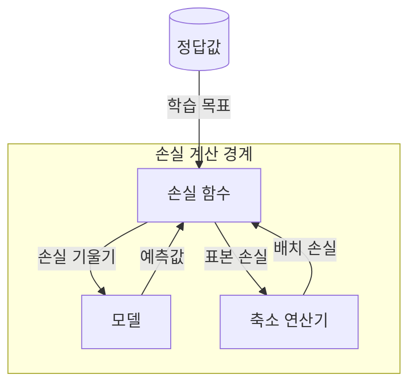
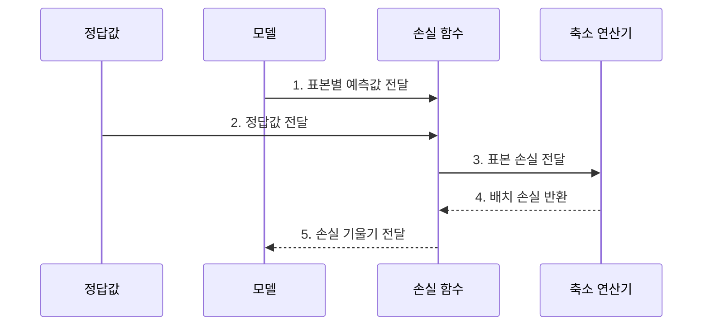

---
sidebar:
  order: 42
  label: "042. 손실 함수 — Cross-Entropy·MSE (Loss Functions)"
  badge:
    text: "기출 · 50%"
    variant: note
title: "손실 함수 — Cross-Entropy·MSE (Loss Functions)"
date: "2026-07-28T17:40:00+09:00"
tags:
  - "notes-basic-theory"
weight: 42
extra:
  question_no: "042"
  source_status: "기출"
  source_history: "122회"
  priority: 50
  priority_note: "오류 비용을 학습 기울기로 변환"
---

## 미리 알고가기

- **예측값($\hat{y}$)**: 모델이 산출해 손실 함수에 넣는 예측 결과로, 모자표는 추정값을 뜻한다.
- **정답값($y$)**: 예측값과 비교할 학습 데이터의 목표를 가리킨다.
- **손실 함수(Loss Function)**: 모델의 예측값과 정답의 차이를 최적화할 단일 비용으로 정량화하는 함수다.
- **손실(Loss)**: 예측이 정답에서 얼마나 어긋났는지를 하나의 숫자로 나타낸 값이며, 학습은 이 숫자를 줄이는 방향으로만 파라미터를 움직인다.
- **기울기(Gradient)**: 예측값을 조금 움직였을 때 손실이 가장 가파르게 증가하는 방향과 그 증가 폭을 함께 나타내며, 학습은 이 방향의 반대쪽으로 예측을 밀어 손실을 줄인다.
- **분류·회귀(Classification·Regression)**: 분류는 입력의 범주를, 회귀는 연속적인 수치를 예측하는 문제
- **배치(Batch)**: 한 번의 손실 계산과 파라미터 갱신에 함께 사용하는 표본 묶음
- **이상치(Outlier)**: 다른 관측값에서 크게 벗어나 손실과 학습 방향을 왜곡할 수 있는 값
- **평균제곱오차(Mean Squared Error, MSE) $\frac{1}{n}\sum_{i=1}^n(y_i-\hat{y}_i)^2$**: 표본별 예측 오차를 제곱하여 평균한 회귀 손실로, 큰 오차에 더 큰 페널티를 부여한다.
- **허버 손실(Huber Loss)**: 오차가 작을 때는 제곱해 세밀하게 벌하고 정해 둔 임계값을 넘는 큰 오차부터는 제곱 대신 선형으로만 벌해서, 튀는 값 하나가 학습 방향을 통째로 끌고 가지 못하게 막는 회귀 손실이다.
- **포컬 손실(Focal Loss)**: 분류가 쉬운 표본의 가중치는 낮추고 어려운 표본의 가중치는 높여 클래스 불균형 상황에서 희소 클래스 학습을 강화하는 손실 함수다.
- **교차 엔트로피(Cross-Entropy) $-\sum_k y_k\log\hat{y}_k$**: $\sum$(시그마)는 클래스별 합을 뜻하며, 정답 클래스에 낮은 확률을 준 예측에 큰 분류 손실을 부여한다.
- **축소 연산(Reduction)**: 표본마다 나온 손실 여러 개를 합계나 평균으로 눌러 하나의 배치 손실로 만드는 처리이며, 평균을 쓰면 배치 크기가 달라져도 손실 값을 서로 견줄 수 있다.

## Ⅰ. 개요

- 정의/개념: 예측·정답 차이를 단일 **오류 비용**으로 바꾸는 **목적 함수**
- 기존 한계: 예측 오차만으로는 **최적화 목표·갱신 방향** 불명확

### 쉽게 이해하기 (학습용)
- 손실 함수는 여러 예측 오차를 비교 가능한 비용으로 바꾸고, 미분을 통해 모델이 파라미터를 갱신할 방향을 제공한다.

## Ⅱ. 특징

- **미분·부분미분**으로 역전파할 **손실 기울기** 산출
- **손실 형태**가 오차 크기별 **벌점 증가율**을 결정
- **평가 지표**와 손실이 어긋나면 **학습 방향** 왜곡

### 쉽게 이해하기 (학습용)
- 모델은 채점표에 적힌 감점만 줄이려 들기 때문에, 희귀 장애를 놓치는 것이 진짜 문제인데도 전체 정답 개수로만 감점을 매기면 흔한 정상 사례만 맞히면서 감점이 줄어드는 엉뚱한 방향으로 학습이 굳는다.

## Ⅲ. 아키텍처 및 구성요소

| 설계 요소 | 설명 |
|:---|:---|
| 모델 | 배치 표본별 **예측값** 산출과 기울기 수신 |
| 손실 함수 | 정답 대조로 **표본 손실**·**기울기** 산출 |
| 축소 연산기 | 표본 손실의 **합계·평균** 집계 |

> 요약: 예측·정답이 **배치 손실**과 **갱신 방향**으로 바뀌는 경로

### 쉽게 이해하기 (학습용)
- 모델의 예측과 정답이 손실 함수에서 표본 손실로 바뀌고, 축소 연산기가 이를 합계나 평균의 배치 손실로 모은다.

## Ⅳ. 종류 및 비교

| 손실 함수 | 교차 엔트로피 | MSE | 허버 손실 |
|:---|:---|:---|:---|
| 적용 기준 | 출력이 **확률**인 분류 과업 | **잡음** 적은 회귀 과업 | **이상치** 섞인 회귀 과업 |
| 핵심 특징 | 낮은 **정답 확률**에 급증하는 손실 | **제곱 오차**로 큰 편차 강조 | 임계값 초과 오차의 **선형 완화** |
| 한계 | **라벨 오류** 표본에 과도한 손실 | 소수 이상치가 **기울기** 지배 | **임계값** 설정에 민감한 결과 |

> 요약: MSE의 이상치 지배를 **허버 손실**이 선형 벌점으로 완화

### 쉽게 이해하기 (학습용)
- MSE는 큰 오차를 강하게 벌하지만 이상치에도 민감하다. 허버 손실은 임계값을 넘는 오차를 선형으로 처리해 그 영향을 제한한다.

## Ⅴ. 실무 고려사항 및 대책

| 실패 징후 | 완화 방안 | 기대 효과 |
|:---|:---|:---|
| 소수 이상치가 MSE 기울기 지배 | 허버 손실로 임계 초과분 선형화 | 평상 구간 예측 안정화 |
| 클래스 불균형에 다수 클래스 편중 | 포컬 손실·클래스 가중치 적용 | 희귀 클래스 학습 강화 |
| 평가 지표와 손실 방향 불일치 | 지표에 맞는 대리 손실 재선정 | 검증 지표와 학습 목표 정렬 |
| 라벨 오류에 과도한 손실 집중 | 라벨 스무딩·이상 표본 검토 | 기울기 왜곡 완화 |

### 쉽게 이해하기 (학습용)
- 손실값 감소와 실제 평가 지표 개선을 함께 관찰한다. 응답 지연처럼 드문 큰 값이 섞인 회귀에서는 허버 손실로 이상치가 전체 학습 방향을 지배하지 않게 한다.

## Ⅵ. 결론

- 학습 목표 정렬을 위해 지표·이상치를 검토하여 **손실 함수** 활용

### 쉽게 이해하기 (학습용)
- 과업의 성공 기준, 데이터 분포, 이상치 특성을 함께 검토해 평가 지표와 같은 방향의 손실 함수를 선택한다.
