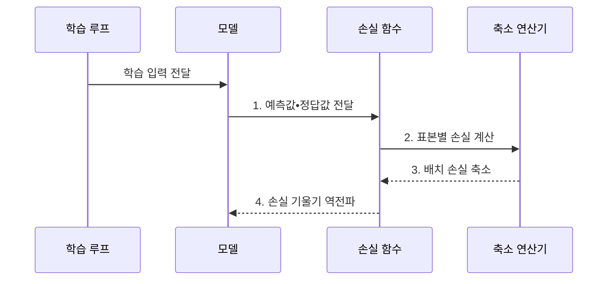

---
sidebar:
  order: 42
  label: "042. 손실 함수: Cross-Entropy•MSE (Loss Functions)"
  badge:
    text: "기출 • 50%"
    variant: note
title: "손실 함수: Cross-Entropy•MSE (Loss Functions)"
date: "2026-07-30T18:49:29+09:00"
tags:
  - "notes-basic-theory"
weight: 42
extra:
  question_no: "042"
  source_status: "기출"
  source_history: "122회"
  priority: 50
  priority_note: "오류 비용을 학습 기울기로 변환"
---

## 미리 알고가기

- **예측값($\hat{y}$)**: ‘와이 햇’으로 읽으며 모델이 산출한 추정 결과
- **정답값($y$)**: 예측값과 비교할 학습 데이터의 목표
- **손실 함수(Loss Function)**: 예측과 정답의 차이를 최적화할 단일 비용으로 바꾸는 함수
- **손실(Loss)**: 예측이 정답에서 벗어난 정도를 나타내는 비용값
- **기울기(Gradient)**: 예측 변화에 따라 손실이 가장 빠르게 증가하는 방향과 크기
- **부분미분(Partial Derivative)**: 여러 입력 중 하나만 변화시키고 나머지는 고정했을 때 함수값의 변화율을 구하는 미분
- **역전파(Backpropagation)**: 손실 기울기를 출력층에서 입력층으로 전달해 파라미터별 기울기를 계산하는 절차
- **분류•회귀(Classification•Regression)**: 분류는 입력의 범주를, 회귀는 연속적인 수치를 예측하는 문제
- **배치(Batch)**: 한 번의 손실 계산과 파라미터 갱신에 함께 사용하는 표본 묶음
- **이상치(Outlier)**: 다른 관측값에서 크게 벗어나 손실과 학습 방향을 왜곡할 수 있는 값
- **평균제곱오차(Mean Squared Error, MSE) $\frac{1}{n}\sum_{i=1}^n(y_i-\hat{y}_i)^2$**: $n$은 표본 수, $i$는 표본 순번이며, 표본별 예측 오차를 제곱해 평균하므로 큰 오차에 더 큰 페널티를 부여한다.
- **평균절대오차(Mean Absolute Error, MAE)**: 표본별 예측 오차의 절댓값을 평균해 오차에 선형 벌점을 부여한다.
- **허버 손실(Huber Loss)**: 작은 오차는 제곱, 임계값을 넘는 오차는 선형으로 벌해 이상치 영향을 줄이는 회귀 손실
- **포컬 손실(Focal Loss)**: 쉬운 표본의 가중치를 낮추고 어려운 표본을 강조하는 불균형 분류 손실
- **교차 엔트로피(Cross-Entropy) $-\sum_k y_k\log\hat{y}_k$**: $k$는 클래스 순번, $\sum$(시그마)는 클래스별 합, $\log$는 낮은 정답 확률의 벌점을 크게 만드는 로그 변환이며, 정답 클래스에 낮은 확률을 준 예측에 큰 분류 손실을 부여한다.
- **축소 연산(Reduction)**: 표본별 손실을 합계•평균으로 모아 하나의 배치 손실로 만드는 처리
- **클래스 가중치(Class Weight)**: 희소 클래스의 손실 비중을 높여 다수 클래스 편중을 줄이는 계수
- **클래스 불균형(Class Imbalance)**: 클래스별 표본 수 차이가 커서 다수 클래스가 학습과 평가를 지배하는 상태
- **평가 지표(Evaluation Metric)**: 학습과 별개로 모델의 업무 성능을 판단하는 정확도•재현율•오차 등의 측정값
- **대리 손실(Surrogate Loss)**: 미분하기 어려운 평가 지표와 같은 개선 방향을 유도하는 학습 목적
- **라벨 스무딩(Label Smoothing)**: 정답 확률을 1보다 낮춰 라벨 오류와 과도한 확신의 영향을 줄이는 기법

## Ⅰ. 개요

- 정의/개념: 예측과 정답의 차이를 **스칼라 비용**으로 바꾸는 함수
- 배경/필요성: 비미분 평가 지표로는 **갱신 방향 산출 불가**

### 쉽게 이해하기 (학습용)
- 손실 함수는 여러 예측 오차를 비교 가능한 비용으로 바꾸고, 미분을 통해 모델이 파라미터를 갱신할 방향을 제공한다.

## Ⅱ. 특징

> 함수식 계산값에서 파란 MSE는 큰 오차를 제곱 강조하고, 빨간 MAE는 선형 증가하며, 초록 Huber($\delta=1$)는 0 주변의 제곱 구간과 바깥의 선형 구간을 잇는다.

- **미분•부분미분**으로 역전파할 **손실 기울기** 산출
- **손실 형태**가 오차 크기별 **벌점 증가율**을 결정
- **평가 지표**와 손실이 어긋나면 **학습 방향** 왜곡

### 쉽게 이해하기 (학습용)
- 희귀 장애를 놓쳐도 정확도 감점이 작으면 모델은 정상 사례만 맞히므로, 손실을 업무 목표에 맞춰야 한다.

## Ⅲ. 구조 및 구성요소

| 구성요소 | 책임 |
|:---|:---|
| 학습 루프 | **입력•정답 배치** 공급 |
| 모델 | 배치 표본별 **예측값** 산출과 기울기 수신 |
| 손실 함수 | 정답 대조로 **표본 손실**•**기울기** 산출 |
| 축소 연산기 | 표본 손실의 **합계•평균** 집계 |

### 쉽게 이해하기 (학습용)
- 학습 루프가 입력과 정답을 공급하면 모델, 손실 함수, 축소 연산기가 배치 비용을 계산한다.

## Ⅳ. 흐름도

### 동작 원리

- **1. 예측값•정답값 전달**: 손실 함수의 비교 입력 구성
- **2. 표본별 손실 계산**: 예측•정답별 비용 산출
- **3. 배치 손실 축소**: 표본 손실의 합계•평균 집계
- **4. 손실 기울기 역전파**: 파라미터 갱신 방향 전달

### 쉽게 이해하기 (학습용)
- 모델의 예측과 정답이 손실 함수에서 표본 손실로 바뀌고, 축소 연산기가 이를 합계나 평균의 배치 손실로 모은다.

## Ⅴ. 종류 및 비교

| 손실 함수 | 교차 엔트로피 | MSE | 허버 손실 |
|:---|:---|:---|:---|
| 적용 기준 | 출력이 **확률**인 분류 과업 | **잡음** 적은 회귀 과업 | **이상치** 섞인 회귀 과업 |
| 핵심 특징 | 낮은 **정답 확률**에 급증하는 손실 | **제곱 오차**로 큰 편차 강조 | 임계값 초과 오차의 **선형 완화** |
| 한계 | **라벨 오류** 표본에 과도한 손실 | 소수 이상치가 **기울기** 지배 | **임계값** 설정에 민감한 결과 |

> 요약: MSE의 이상치 지배를 **허버 손실**이 선형 벌점으로 완화

### 쉽게 이해하기 (학습용)
- MSE는 큰 오차를 강하게 벌여 이상치에도 민감하지만, 허버 손실은 임계값을 넘는 오차를 선형으로 처리해 그 영향을 제한한다.

## Ⅵ. 실무 고려사항 및 대책

| 고려사항 | 대책 | 효과 |
|:---|:---|:---|
| 소수 이상치가 **MSE 기울기 지배** | **허버 손실**로 임계 초과분 선형화 | **평상 구간 예측** 안정화 |
| 클래스 불균형에 **다수 클래스 편중** | **포컬 손실**•클래스 가중치 적용 | **희귀 클래스 학습** 강화 |
| 평가 지표와 **손실 방향 불일치** | 지표에 맞는 **대리 손실** 재선정 | 검증 지표와 **학습 목표 정렬** |
| 라벨 오류에 **과도한 손실 집중** | **라벨 스무딩**•이상 표본 검토 | **기울기 왜곡** 완화 |

### 쉽게 이해하기 (학습용)
- 손실값 감소와 실제 평가 지표 개선을 함께 관찰하고, 응답 지연처럼 드문 큰 값이 섞인 회귀에서는 허버 손실로 이상치가 전체 학습 방향을 지배하지 않게 한다.

## Ⅶ. 결론

- 확률 분류는 **교차 엔트로피**, 이상치 회귀는 **허버 손실** 선택

### 쉽게 이해하기 (학습용)
- 과업의 성공 기준, 데이터 분포, 이상치 특성을 함께 검토해 평가 지표와 같은 방향의 손실 함수를 선택한다.
