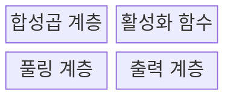
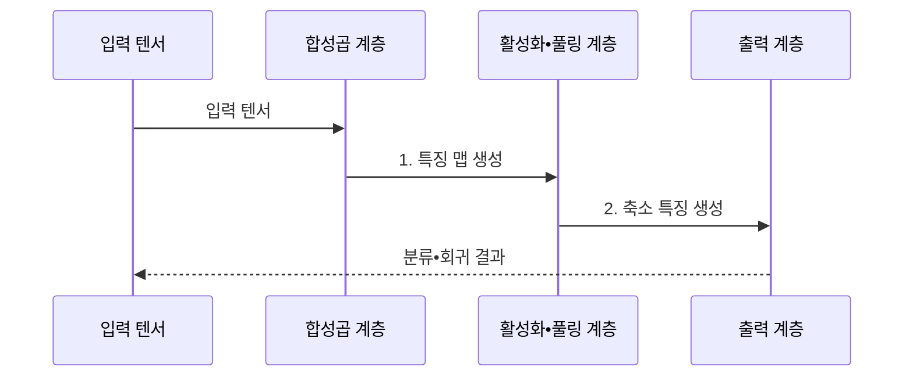

---
sidebar:
  order: 43
  label: "043. 합성곱 신경망 (CNN)"
  badge:
    text: "기출 • 70%"
    variant: note
title: "합성곱 신경망 (CNN)"
date: "2026-07-30T18:49:48+09:00"
tags:
  - "notes-basic-theory"
weight: 43
extra:
  question_no: "043"
  source_status: "기출"
  source_history: "120회, 128회"
  priority: 70
  priority_note: "공간 귀납 편향과 구조 비교가 핵심"
---

## 미리 알고가기

- **합성곱 신경망(Convolutional Neural Network, CNN)**: 공유 커널로 국소 공간 특징을 추출하는 신경망
- **텐서(Tensor)**: 높이•너비•채널 등 여러 축을 가진 수치 배열
- **완전연결 신경망(Fully Connected Neural Network)**: 모든 입출력을 개별 가중치로 연결해 공간 이웃 관계를 보존하지 않는 신경망
- **합성곱•커널(Convolution•Kernel)**: 작은 가중치 창인 커널을 입력 위로 밀며 겹친 값의 곱을 더하는 연산
- **특징 맵(Feature Map)**: 커널이 찾은 무늬의 위치별 반응값
- **채널(Channel)**: 입력•특징 맵에서 서로 다른 색상이나 특징 종류를 구분하는 축
- **스트라이드•패딩(Stride•Padding)**: 커널의 이동 간격과 입력 가장자리에 덧대는 값
- **수용영역(Receptive Field)**: 출력값 하나가 참조하는 원본 입력 범위
- **풀링(Pooling)**: 구역별 최댓값•평균으로 특징 맵을 줄이는 연산
- **활성화 함수(Activation Function)**: 층 사이에 비선형성을 더하는 함수
- **귀납 편향(Inductive Bias)**: 학습 전에 모델 구조에 반영한 문제 가정
- **패치(Patch)**: 이미지를 일정 크기로 나눈 조각
- **셀프 어텐션(Self-Attention)**: 입력 요소 간 관련도를 반영한 가중합 연산
- **비전 트랜스포머(Vision Transformer, ViT)**: 패치 간 전역 관계를 셀프 어텐션으로 학습하는 비전 모델
- **분류•회귀(Classification•Regression)**: 범주 또는 연속 수치를 예측하는 문제
- **클래스 편중(Class Imbalance)**: 범주별 표본 수가 크게 다른 상태
- **데이터 증강(Data Augmentation)**: 의미를 유지한 변형으로 학습 표본을 늘리는 기법
- **입력 정규화(Input Normalization)**: 픽셀값의 범위•분포를 일정하게 맞추는 전처리
- **양자화(Quantization)**: 수치 정밀도를 낮춰 모델 크기•연산량을 줄이는 기법
- **파라미터(Parameter)**: 학습 과정에서 조정되는 커널 가중치와 편향
- **추론(Inference)**: 학습을 마친 모델에 새 입력을 넣어 예측 결과를 계산하는 과정
- **오탐•미탐(False Positive•False Negative)**: 실제로 없는 대상을 있다고 판정한 오류와 실제 대상을 놓친 오류

## Ⅰ. 개요

- 정의/개념: **공유 커널**로 공간의 국소 패턴을 추출하는 **신경망**
- 배경/필요성: 완전연결망은 **공간 관계 손실•가중치 급증**

### 쉽게 이해하기 (학습용)

- 완전연결망이 사진을 한 줄로 펼쳐 이웃 픽셀을 떼어 놓는다면, CNN은 작은 돋보기인 커널을 사진 전역에 공유해 가까운 무늬를 보존한다.

## Ⅱ. 특징

- **지역 수용영역** 기반 공간 국소 특징 추출
- **커널 가중치 공유**에 따른 파라미터 수 절감
- 층 심화에 따른 수용영역 확대와 **고수준 패턴** 결합

### 쉽게 이해하기 (학습용)

- 얕은 층이 선을 찾고 깊은 층이 이를 눈•바퀴 같은 큰 형태로 결합한다.

## Ⅲ. 구조 및 구성요소

| 구성요소 | 책임 |
|:---|:---|
| 합성곱 계층 | **공유 커널**•스트라이드•패딩 기반 **국소 특징** 추출 |
| 활성화 함수 | 특징 맵에 **비선형성** 부여 |
| 풀링 계층 | 공간 크기 축소와 **구역 반응** 요약 |
| 출력 계층 | 특징의 **분류•회귀** 결과 변환 |

> 출력 크기: $\lfloor(H+2P-K)/S\rfloor+1$
> $H$: 입력, $P$: 패딩, $K$: 커널, $S$: 간격

### 쉽게 이해하기 (학습용)
- 합성곱 계층이 무늬를 찾고 활성화•풀링 계층이 필요한 반응을 남겨 출력 계층에 전달한다.

## Ⅳ. 흐름도

### 동작 원리

- **1. 특징 맵 생성**: 공유 커널로 국소 특징 추출
- **2. 축소 특징 생성**: 활성화•풀링 기반 반응 요약

### 쉽게 이해하기 (학습용)
- 입력 영상이 국소 특징, 축소 특징, 최종 예측 순서로 변환된다.

## Ⅴ. 종류 및 비교

| 신경망 구조 | CNN | 완전연결 신경망 | ViT |
|:---|:---|:---|:---|
| 적용 기준 | **국소 시각 패턴** 중심 과업 | 공간 구조 없는 **고정 길이 벡터** | **전역 문맥** 의존 시각 과업 |
| 핵심 특징 | **공유 커널**의 국소 패턴 추출 | 입력•출력 **전결합** 가중치 | 패치 간 **셀프 어텐션** 전역 관계 |
| 한계 | **장거리 관계** 모델링 효율 저하 | **공간 구조** 손실•가중치 급증 | 약한 귀납 편향에 따른 **데이터 요구량** 증가 |

> 요약: 공간 **귀납 편향**의 유무와 강도를 기준으로 모델 선택

### 쉽게 이해하기 (학습용)

- CNN은 강한 공간 귀납 편향으로 비교적 적은 데이터에 유리하고, ViT는 더 많은 데이터로 전역 관계를 직접 학습한다.

## Ⅵ. 실무 고려사항 및 대책

| 고려사항 | 대책 | 효과 |
|:---|:---|:---|
| 결함 표본 희소로 **클래스 편중** | **데이터 증강**•결함 표본 가중치 적용 | **희귀 결함 재현율** 향상 |
| 조명•촬영 각도 변화에 **오탐 증가** | 조건별 증강•**입력 정규화** | 촬영 조건별 **오탐 편차 감소** |
| 검사 단말의 **추론 지연** | 채널 축소•양자화•**경량 모델** 적용 | **추론 지연•메모리** 사용량 감소 |
| **판정 근거 설명** 부족 | 특징 맵•**활성 영역 시각화** | **오탐•미탐 원인 추적** 지원 |

### 쉽게 이해하기 (학습용)

- 회로기판 검사대가 조명별 표본과 가벼운 모델을 쓰면 위치가 다른 균열도 같은 커널로 찾으면서 제한된 단말의 검사 주기를 지킬 수 있다.

## Ⅶ. 결론

- **국소 패턴•제한 데이터**는 CNN, **장거리 관계**는 ViT 선택

### 쉽게 이해하기 (학습용)

- 국소 패턴과 제한된 데이터가 중심이면 CNN을 우선 적용하고, 장거리 관계가 핵심이면 ViT 등 대안을 비교한다.
