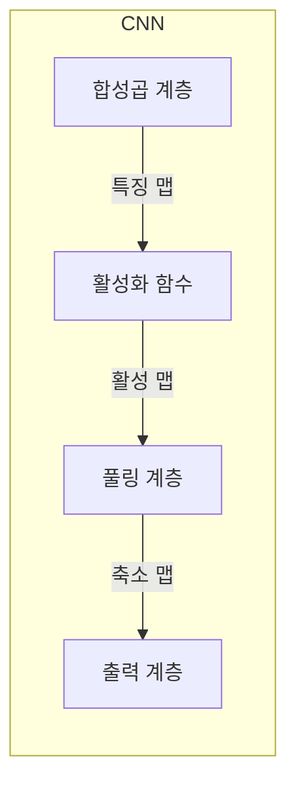
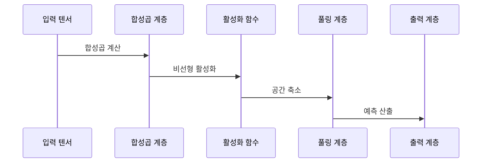

---
sidebar:
  order: 43
  label: "043. 합성곱 신경망 (CNN)"
  badge:
    text: "기출 · 70%"
    variant: note
title: "합성곱 신경망 (CNN)"
date: "2026-07-26T18:10:00+09:00"
tags:
  - "notes-basic-theory"
weight: 43
extra:
  question_no: "043"
  source_status: "기출"
  source_history: "120회, 128회"
  priority: 70
  priority_note: "공간 귀납 편향과 구조 비교가 핵심"
---

## 미리 알고가기

- **합성곱 신경망(Convolutional Neural Network, CNN)**: 작은 가중치 창 하나를 이미지 전 구역에 재사용해 위치와 무관하게 같은 공간 패턴을 찾는 신경망이며, 사진 위로 돋보기를 한 칸씩 미는 장면이 이 노트의 기준 그림이다.
- **텐서(Tensor)**: 높이·너비·채널 축을 가진 다차원 배열이며, 컬러 이미지 한 장이 여기에 해당한다.
- **완전연결 신경망(Fully Connected Neural Network)**: 모든 입력을 모든 출력에 각각 다른 가중치로 잇는 신경망이며, 이미지를 한 줄로 펴서 넣으므로 이웃 픽셀 관계가 사라진다.
- **합성곱·커널(Convolution·Kernel)**: 커널은 몇 픽셀 크기의 가중치 창이고 합성곱은 그 창을 밀며 겹친 값끼리 곱해 더하는 계산이며, 창 하나를 전 구역에 재사용하는 것이 가중치 공유다.
- **특징 맵(Feature Map)**: 커널이 찾는 무늬가 어느 위치에서 얼마나 강하게 나타났는지 기록한 출력이다.
- **스트라이드·패딩(Stride·Padding)**: 스트라이드는 커널을 몇 칸씩 밀지 정하는 간격, 패딩은 가장자리에 값을 덧대 창이 테두리까지 닿게 하는 처리이며, 둘이 출력 크기를 정한다.
- **수용영역(Receptive Field)**: 출력값 하나가 원본에서 참조한 입력 범위이며, 층을 쌓을수록 넓어진다.
- **풀링(Pooling)**: 특징 맵을 구역별로 나눠 최댓값이나 평균 하나만 남기는 축소 연산이며, 무늬가 몇 픽셀 어긋나도 같은 값이 나온다.
- **활성화 함수(Activation Function)**: 층 사이에 비선형성을 넣어 여러 층이 한 겹으로 접히지 않게 하는 함수다.
- **귀납 편향(Inductive Bias)**: 데이터를 보기 전에 모델 구조에 심어 둔 가정이며, CNN은 가까운 픽셀끼리 관련이 깊고 같은 무늬는 위치가 달라도 같다는 두 가정을 갖는다.
- **패치(Patch)**: 이미지를 일정 크기로 잘라 낸 조각이다.
- **셀프 어텐션(Self-Attention)**: 입력 요소끼리 관련도를 계산해 가중합하는 연산이며, 멀리 떨어진 요소를 직접 잇는다.
- **비전 트랜스포머(Vision Transformer, ViT)**: 이미지 패치 사이의 셀프 어텐션으로 전역 관계를 학습하는 모델이다.
- **분류·회귀(Classification·Regression)**: 분류는 범주를, 회귀는 연속 수치를 예측하는 문제다.
- **객체 탐지(Object Detection)**: 이미지에서 객체의 범주와 위치를 함께 찾는 작업이다.

## Ⅰ. 개요

- **정의/개념**: **공유 커널**로 공간의 국소 패턴을 추출하는 **신경망**
- **기존 한계**: **완전연결**은 공간 구조 손실·**파라미터** 폭증

### 쉽게 이해하기 (학습용)

- 사진을 한 줄로 펴서 모든 픽셀을 모든 출력에 잇는 방식은 가중치가 억 단위로 늘지만, 돋보기 하나를 사진 전체에 돌려 쓰면 아홉 개 숫자로 끝나므로 답안이 기존 한계에 `파라미터 폭증`을 적었다.

## Ⅱ. 특징

- **지역 수용영역** 기반 공간 국소 특징 추출
- **커널 가중치 공유**에 따른 파라미터 수 절감
- 층 심화에 따른 수용영역 확대와 **고수준 패턴** 결합

### 쉽게 이해하기 (학습용)

- 첫 층 돋보기는 좁은 넓이만 보아 점과 짧은 선까지 찾지만, 그 결과 위에 돋보기를 다시 대면 앞 층이 요약해 둔 넓은 구역을 한 번에 보게 되어 눈·바퀴 같은 큰 모양이 잡힌다.

## Ⅲ. 아키텍처 및 구성요소

| 설계 요소 | 설명 |
|:---|:---|
| 합성곱 계층 | **공유 커널**·스트라이드·패딩 기반 **국소 특징** 추출 |
| 활성화 함수 | 특징 맵에 **비선형성** 부여 |
| 풀링 계층 | 공간 크기 축소와 **구역 반응** 요약 |
| 출력 계층 | 특징의 **분류·회귀** 결과 변환 |

> 요약: 합성곱·활성화·풀링이 쌓아 올리는 **공간 특징 계층**

### 쉽게 이해하기 (학습용)

- 돋보기로 훑어 무늬 위치를 낱낱이 적는 합성곱과 그 기록을 구역 대표값 하나로 줄이는 풀링은 방향이 반대이며, 늘리고 줄이기를 번갈아야 세부를 지키면서 계산량이 감당된다.

## Ⅳ. 원리 및 절차 흐름도

| 절차 | 설명 |
|:---|:---|
| 합성곱 계산 | **공유 커널** 이동에 따른 국소 **가중합** 산출 |
| 비선형 활성화 | 특징 맵의 **활성화 함수** 통과 |
| 공간 축소 | 구역 **대표값** 기반 특징 맵 축소 |
| 예측 산출 | 축소 특징의 **분류·회귀** 변환 |

> 요약: 특징 추출과 **공간 축소** 반복 후 **예측 산출**

### 쉽게 이해하기 (학습용)

- 합성곱도 곱하고 더하는 직선 계산이라 층을 겹쳐도 한 겹으로 접히므로, 돋보기를 댈 때마다 한 번씩 구부려 줘야 앞 층이 찾은 짧은 선이 다음 층에서 굽은 모양으로 조합된다.

## Ⅴ. 종류 및 비교

| 신경망 구조 | CNN | 완전연결 신경망 | ViT |
|:---|:---|:---|:---|
| 적용 기준 | **국소 시각 패턴** 중심 과업 | 공간 구조 없는 **고정 길이 벡터** | **전역 문맥** 의존 시각 과업 |
| 핵심 특징 | **공유 커널**의 국소 패턴 추출 | 입력·출력 **전결합** 가중치 | 패치 간 **셀프 어텐션** 전역 관계 |
| 한계 | 먼 영역 관계의 **수용영역** 제약 | **공간 구조** 손실·가중치 급증 | 대규모 **학습 데이터**·연산량 요구 |

> 요약: 공간 **귀납 편향**의 유무와 강도가 가르는 모델 선택

### 쉽게 이해하기 (학습용)

- 완전연결은 이웃 관계조차 모른 채 시작하고, CNN은 돋보기가 어디서든 같은 무늬를 본다는 가정을 공짜로 얻어 적은 데이터로도 학습되며, ViT는 그 가정을 내려놓은 대신 무엇이 무엇과 관련 있는지를 데이터로 직접 배운다.

## Ⅵ. 실무 사례

1. 회로기판 검사에 **CNN** 기반 균열·**납땜 불량** 탐지
2. 영상 감시 단말 내 **경량 CNN** **객체 탐지**

### 쉽게 이해하기 (학습용)

- 균열이 기판 어느 자리에 날지 미리 알 수 없지만 같은 돋보기가 판 전체를 훑으므로, 왼쪽 위에서 배운 균열 무늬를 오른쪽 아래에서도 알아본다.
- 영상을 전부 서버로 올리면 회선과 지연이 감당되지 않으므로, 돋보기 수와 채널을 줄인 가벼운 모델을 카메라 안에 넣어 사람이나 차량이 잡힌 장면만 내보낸다.

## Ⅶ. 결론

- **국소 패턴** 중심이면 CNN, **전역 관계** 우세면 ViT 선택

### 쉽게 이해하기 (학습용)

- 찾는 단서가 한 곳의 작은 무늬면 돋보기를 미는 CNN이 적은 데이터로도 맞고, 화면 양끝에 떨어진 것들의 관계면 데이터와 연산을 더 내주고 ViT를 쓴다.

## 2~4교시 확장

**예상 문항**

> 제조 공정의 영상 기반 결함 검사 시스템을 CNN으로 구축할 때
> 아키텍처 구성과 학습 방안을 설명하고, 현장 적용 시 발생하는
> 문제점과 대책을 논하시오. (25점)

**목차 조립**: `Ⅰ 정의·기존 한계 → Ⅱ 특징 → Ⅲ 구성요소 → Ⅴ 비교 → 아래 표 → Ⅶ 결론`

| 문제점 | 대책 | 효과 |
|:---|:---|:---|
| 결함 표본 희소로 **클래스 불균형** | **데이터 증강**·결함 중심 표본 가중 | 희귀 결함 **재현율** 상승 |
| 조명·설치 각도 변화에 **오탐 증가** | 촬영 조건별 증강·**정규화** 계층 | 현장 조건 변동에 **판정 일관성** 확보 |
| 검사 단말의 **연산 자원** 부족 | 채널 축소·**모델 경량화** 후 단말 배포 | 회선 부하 없이 **검사 주기** 단축 |
| 미검출 원인 **설명 불가** | **특징 맵** 시각화로 판정 근거 제시 | 품질 담당자의 **오탐 원인** 추적 가능 |
