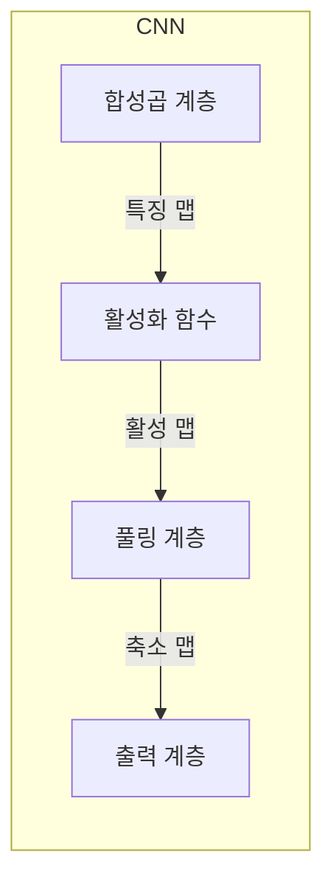
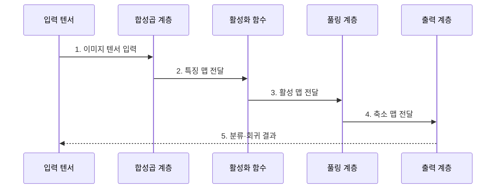

---
sidebar:
  order: 43
  label: "043. 합성곱 신경망 (CNN)"
  badge:
    text: "기출 · 70%"
    variant: note
title: "합성곱 신경망 (CNN)"
date: "2026-07-28T17:40:00+09:00"
tags:
  - "notes-basic-theory"
weight: 43
extra:
  question_no: "043"
  source_status: "기출"
  source_history: "120회, 128회"
  priority: 70
  priority_note: "공간 귀납 편향과 구조 비교가 핵심"
---

## 미리 알고가기

- **합성곱 신경망(Convolutional Neural Network, CNN)**: 동일한 필터를 입력의 각 위치에 적용하여 국소 공간 특징을 추출하는 신경망이다.
- **텐서(Tensor)**: 높이·너비·채널 축을 가진 다차원 배열이며, 컬러 이미지 한 장이 여기에 해당한다.
- **완전연결 신경망(Fully Connected Neural Network)**: 모든 입력을 모든 출력에 각각 다른 가중치로 잇는 신경망이며, 이미지를 한 줄로 펴서 넣으므로 이웃 픽셀 관계가 사라진다.
- **합성곱·커널(Convolution·Kernel)**: 커널은 몇 픽셀 크기의 가중치 창이고 합성곱은 그 창을 밀며 겹친 값끼리 곱해 더하는 계산이며, 창 하나를 전 구역에 재사용하는 것이 가중치 공유다.
- **특징 맵(Feature Map)**: 커널이 찾는 무늬가 어느 위치에서 얼마나 강하게 나타났는지 기록한 출력이다.
- **스트라이드·패딩(Stride·Padding)**: 스트라이드는 커널을 몇 칸씩 밀지 정하는 간격, 패딩은 가장자리에 값을 덧대 창이 테두리까지 닿게 하는 처리이며, 둘이 출력 크기를 정한다.
- **수용영역(Receptive Field)**: 출력값 하나가 원본에서 참조한 입력 범위이며, 층을 쌓을수록 넓어진다.
- **풀링(Pooling)**: 특징 맵을 구역별로 나눠 최댓값이나 평균 하나만 남기는 축소 연산이며, 무늬가 몇 픽셀 어긋나도 같은 값이 나온다.
- **활성화 함수(Activation Function)**: 층 사이에 비선형성을 넣어 여러 층이 한 겹으로 접히지 않게 하는 함수다.
- **귀납 편향(Inductive Bias)**: 데이터를 보기 전에 모델 구조에 심어 둔 가정이며, CNN은 가까운 픽셀끼리 관련이 깊고 같은 무늬는 위치가 달라도 같다는 두 가정을 갖는다.
- **패치(Patch)**: 이미지를 일정 크기로 잘라 낸 조각이다.
- **셀프 어텐션(Self-Attention)**: 입력 요소끼리 관련도를 계산해 가중합하는 연산이며, 멀리 떨어진 요소를 직접 잇는다.
- **비전 트랜스포머(Vision Transformer, ViT)**: 이미지를 패치 단위로 분할하고 셀프 어텐션으로 패치 간 전역 관계를 학습하는 비전 모델이다.
- **분류·회귀(Classification·Regression)**: 분류는 범주를, 회귀는 연속 수치를 예측하는 문제다.
- **객체 탐지(Object Detection)**: 이미지에서 객체의 범주와 위치를 함께 찾는 작업이다.

## Ⅰ. 개요

- 정의/개념: **공유 커널**로 공간의 국소 패턴을 추출하는 **신경망**
- 기존 한계: **완전연결**은 공간 구조 손실·**파라미터** 폭증

### 쉽게 이해하기 (학습용)

- 완전연결 방식은 이미지를 펼치면서 이웃 관계를 잃고 가중치 수도 급증한다. CNN은 작은 커널을 전 위치에 공유해 두 문제를 줄인다.

## Ⅱ. 특징

- **지역 수용영역** 기반 공간 국소 특징 추출
- **커널 가중치 공유**에 따른 파라미터 수 절감
- 층 심화에 따른 수용영역 확대와 **고수준 패턴** 결합

### 쉽게 이해하기 (학습용)

- 첫 층 돋보기는 좁은 넓이만 보아 점과 짧은 선까지 찾지만, 그 결과 위에 돋보기를 다시 대면 앞 층이 요약해 둔 넓은 구역을 한 번에 보게 되어 눈·바퀴 같은 큰 모양이 잡힌다.

## Ⅲ. 아키텍처 및 구성요소

| 설계 요소 | 설명 |
|:---|:---|
| 합성곱 계층 | **공유 커널**·스트라이드·패딩 기반 **국소 특징** 추출 |
| 활성화 함수 | 특징 맵에 **비선형성** 부여 |
| 풀링 계층 | 공간 크기 축소와 **구역 반응** 요약 |
| 출력 계층 | 특징의 **분류·회귀** 결과 변환 |

> 요약: 합성곱·활성화·풀링이 쌓아 올리는 **공간 특징 계층**

### 쉽게 이해하기 (학습용)

- 합성곱은 국소 무늬를 특징 맵으로 만들고, 활성화와 풀링은 비선형 표현을 더하면서 공간 크기를 줄인다.

## Ⅳ. 종류 및 비교

| 신경망 구조 | CNN | 완전연결 신경망 | ViT |
|:---|:---|:---|:---|
| 적용 기준 | **국소 시각 패턴** 중심 과업 | 공간 구조 없는 **고정 길이 벡터** | **전역 문맥** 의존 시각 과업 |
| 핵심 특징 | **공유 커널**의 국소 패턴 추출 | 입력·출력 **전결합** 가중치 | 패치 간 **셀프 어텐션** 전역 관계 |
| 한계 | **장거리 관계** 모델링 효율 저하 | **공간 구조** 손실·가중치 급증 | 약한 귀납 편향에 따른 **데이터 요구량** 증가 |

> 요약: 공간 **귀납 편향**의 유무와 강도를 기준으로 모델 선택

### 쉽게 이해하기 (학습용)

- CNN은 강한 공간 귀납 편향으로 비교적 적은 데이터에 유리하고, ViT는 더 많은 데이터로 전역 관계를 직접 학습한다.

## Ⅴ. 실무 고려사항 및 대책

| 실패 징후 | 완화 방안 | 기대 효과 |
|:---|:---|:---|
| 결함 표본 희소로 클래스 편중 | 데이터 증강·결함 표본 가중치 적용 | 희귀 결함 재현율 향상 |
| 조명·촬영 각도 변화에 오탐 증가 | 조건별 증강·입력 정규화 | 현장 환경 변화에 대한 일관성 확보 |
| 검사 단말의 추론 지연 | 채널 축소·양자화·경량 모델 적용 | 검사 주기와 자원 사용량 개선 |
| 판정 근거 설명 부족 | 특징 맵·활성 영역 시각화 | 오탐·미탐 원인 추적 지원 |

### 쉽게 이해하기 (학습용)

- 데이터 분포 변화와 단말 자원 제약을 함께 관리한다. 회로기판 검사에서는 공유 커널로 어느 위치에 나타난 균열이나 납땜 불량도 같은 특징으로 탐지할 수 있다.

## Ⅵ. 결론

- 국소 특징 추출을 위해 패턴·자원을 검토하여 **CNN** 활용

### 쉽게 이해하기 (학습용)

- 국소 패턴과 제한된 데이터가 중심이면 CNN을 우선 적용하고, 장거리 관계가 핵심이면 ViT 등 대안을 비교한다.
