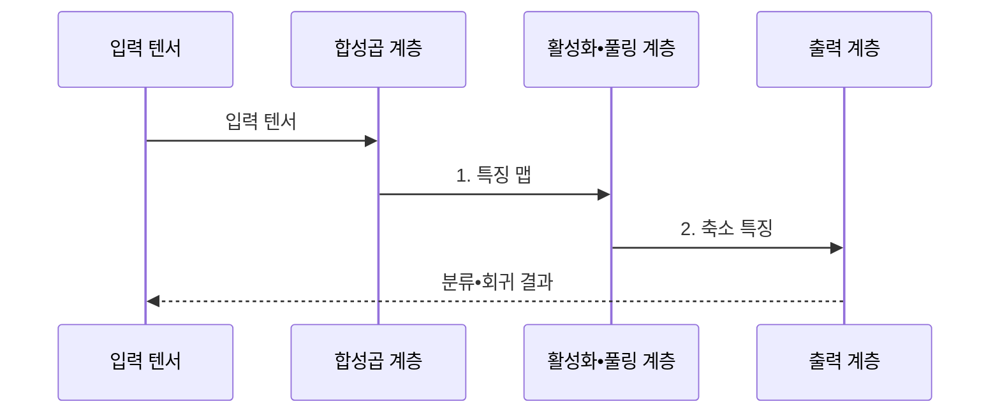

---
sidebar:
  order: 43
  label: "043. 합성곱 신경망 (CNN)"
  badge:
    text: "기출 • 70%"
    variant: note
title: "합성곱 신경망 (CNN)"
date: "2026-08-05T00:35:28+09:00"
tags:
  - "notes-basic-theory"
weight: 43
extra:
  question_no: "043"
  source_status: "기출"
  source_history: "120회, 128회"
  priority: 70
  priority_note: "공간 귀납 편향과 구조 비교가 핵심"
---

## Ⅰ. 개요

<details><summary>핵심 용어</summary>

- **합성곱 신경망(Convolutional Neural Network, CNN)**: 공유 커널로 입력의 국소 공간 패턴을 추출하는 신경망
- **공간 관계**: 이미지에서 픽셀이나 특징이 서로 이웃하고 배치된 관계
- **공유 커널(Shared Kernel)**: 같은 작은 가중치 필터를 입력의 모든 위치에 반복 적용하는 구조
- **완전연결망(Fully Connected Network)**: 모든 입력과 출력 뉴런을 개별 가중치로 연결하는 신경망

</details>

- 정의/개념: **공유 커널** 로 공간의 국소 패턴을 추출하는 **신경망**
- 배경/필요성: 완전연결망은 **공간 관계 손실•가중치 급증**

#### 한줄 요약

- 완전연결망이 사진을 한 줄로 펼쳐 이웃 픽셀을 떼어 놓는다면, CNN은 작은 돋보기인 커널을 사진 전역에 공유해 가까운 무늬를 보존한다.

## Ⅱ. 특징

<details><summary>핵심 용어</summary>

- **수용영역(Receptive Field)**: 출력값 하나가 참조하는 원본 입력 범위
- **가중치 공유**: 하나의 커널을 여러 입력 위치에 반복 적용해 파라미터를 줄이는 방식
- **고수준 패턴**: 여러 국소 특징을 결합해 만든 물체 부분이나 의미 단위의 특징

</details>

- **지역 수용영역** 기반 공간 국소 특징 추출
- **커널 가중치 공유** 에 따른 파라미터 수 절감
- 층 심화에 따른 수용영역 확대와 **고수준 패턴** 결합

#### 한줄 요약

- 얕은 층이 선을 찾고 깊은 층이 이를 눈•바퀴 같은 큰 형태로 결합한다.

## Ⅲ. 구조 및 구성요소

<details><summary>핵심 용어</summary>

- **특징 맵(Feature Map)**: 커널이 입력에서 찾은 특징의 위치별 반응값
- **스트라이드(Stride)**: 입력 위에서 커널이 이동하는 간격
- **패딩(Padding)**: 입력 가장자리에 덧대는 값
- **풀링(Pooling)**: 구역별 최댓값이나 평균으로 특징 맵 크기를 줄이는 연산
- **국소 특징(Local Feature)**: 가까운 픽셀에서 추출한 공간 패턴
- **비선형성**: 선형 합성만으로 표현할 수 없는 복잡한 관계를 활성화 함수가 부여하는 성질

</details>

```text
[합성곱 계층] -- [활성화 함수] -- [풀링 계층] -- [출력 계층]
```

선의 의미: CNN을 이루는 네 계층 사이의 정적 직렬 연결이며 상하 포함 관계가 아니다.

| 구성요소 | 책임 |
|:---|:---|
| 합성곱 계층 | **공유 커널**•스트라이드•패딩 기반 **국소 특징** 추출 |
| 활성화 함수 | 특징 맵에 **비선형성** 부여 |
| 풀링 계층 | 공간 크기 축소와 **구역 반응** 요약 |
| 출력 계층 | 특징의 **분류•회귀** 결과 변환 |

#### 한줄 요약
- 돋보기인 합성곱 계층이 무늬를 찾으면 스위치와 체가 반응을 추려 마지막 이름표 출력층에 건넨다.

## Ⅳ. 흐름도

<details><summary>핵심 용어</summary>

- **입력 텐서**: 높이•너비•채널처럼 여러 축으로 표현한 입력 수치 배열
- **분류(Classification)**: 입력의 범주를 예측하는 문제
- **회귀(Regression)**: 입력의 연속 수치를 예측하는 문제
- **축소 특징**: 활성화와 풀링으로 크기를 줄이고 핵심 반응을 남긴 표현

</details>



### 동작 원리

- **1. 특징 맵**: 공유 커널로 위치별 국소 반응 산출
- **2. 축소 특징**: 활성화•풀링으로 핵심 반응 요약

#### 한줄 요약
- 사진이 돋보기 창을 지나 위치별 무늬 지도로 바뀌고, 체로 줄어든 특징이 마지막 이름표가 된다.

## Ⅴ. 종류 및 비교

<details><summary>핵심 용어</summary>

- **귀납 편향(Inductive Bias)**: 학습 전에 모델 구조에 반영한 문제에 대한 가정
- **비전 트랜스포머(Vision Transformer, ViT)**: 이미지 패치 사이의 전역 관계를 셀프 어텐션으로 학습하는 모델
- **완전연결 신경망**: 모든 입출력을 개별 가중치로 연결하는 신경망
- **셀프 어텐션(Self-Attention)**: 입력 위치들이 서로의 관련도를 계산해 전역 정보를 결합하는 연산
- **전역 문맥**: 이미지 전체의 멀리 떨어진 위치까지 함께 고려한 관계 정보

</details>

| 신경망 구조 | CNN | 완전연결 신경망 | ViT |
|:---|:---|:---|:---|
| 적용 기준 | **국소 시각 패턴** 중심 과업 | 공간 구조 없는 **고정 길이 벡터** | **전역 문맥** 의존 시각 과업 |
| 핵심 특징 | **공유 커널** 의 국소 패턴 추출 | 입력•출력 **전결합** 가중치 | 패치 간 **셀프 어텐션** 전역 관계 |
| 한계 | **장거리 관계** 모델링 효율 저하 | **공간 구조** 손실•가중치 급증 | 약한 귀납 편향에 따른 **데이터 요구량** 증가 |

> 요약: 공간 **귀납 편향** 의 유무와 강도를 기준으로 모델 선택

#### 한줄 요약

- 가까운 무늬를 먼저 보는 CNN은 적은 사진에 유리하고, 사진 전체를 한눈에 잇는 ViT는 더 많은 학습 사진이 필요하다.

## Ⅵ. 실무 고려사항 및 대책

<details><summary>핵심 용어</summary>

- **클래스 편중**: 범주별 학습 표본 수가 크게 다른 상태
- **데이터 증강**: 의미를 유지하는 변형으로 학습 표본을 늘리는 기법
- **양자화**: 수치 정밀도를 낮춰 모델 크기와 연산량을 줄이는 기법
- **오탐(False Positive)**: 없는 대상을 있다고 잘못 판정한 오류
- **미탐(False Negative)**: 실제 대상을 놓친 오류
- **입력 정규화**: 영상 밝기나 채널 값의 중심과 척도를 일정하게 맞추는 전처리
- **경량 모델**: 채널 수와 연산량을 줄여 제한된 장치에서 빠르게 실행하는 모델
- **활성 영역 시각화**: 예측에 크게 기여한 이미지 위치를 열지도 등으로 표시하는 설명 방법

</details>

| 문제 | 대책 | 효과 |
|:---|:---|:---|
| 결함 표본 희소로 **클래스 편중** | **데이터 증강**•결함 표본 가중치 적용 | **희귀 결함 재현율** 향상 |
| 조명•촬영 각도 변화에 **오탐 증가** | 조건별 증강•**입력 정규화** | 촬영 조건별 **오탐 편차 감소** |
| 검사 단말의 **추론 지연** | 채널 축소•양자화•**경량 모델** 적용 | **추론 지연•메모리** 사용량 감소 |
| **판정 근거 설명** 부족 | 특징 맵•**활성 영역 시각화** | **오탐•미탐 원인 추적** 지원 |

#### 한줄 요약

- 회로기판 검사대가 조명별 표본과 가벼운 모델을 쓰면 위치가 다른 균열도 같은 커널로 찾으면서 제한된 단말의 검사 주기를 지킬 수 있다.

## Ⅶ. 결론

<details><summary>핵심 용어</summary>

- **국소 패턴**: 서로 가까운 픽셀이나 특징이 이루는 선•모서리•질감 등의 구조
- **장거리 관계**: 이미지에서 멀리 떨어진 영역 사이의 연관성

</details>

- **국소 패턴•제한 데이터** 는 CNN, **장거리 관계** 는 ViT 선택

#### 한줄 요약

- 작은 돋보기로 충분한 국소 무늬는 CNN, 화면 양끝을 함께 봐야 하는 장면은 ViT 쪽 표지판을 따른다.
