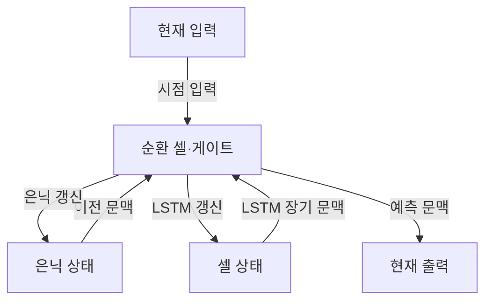
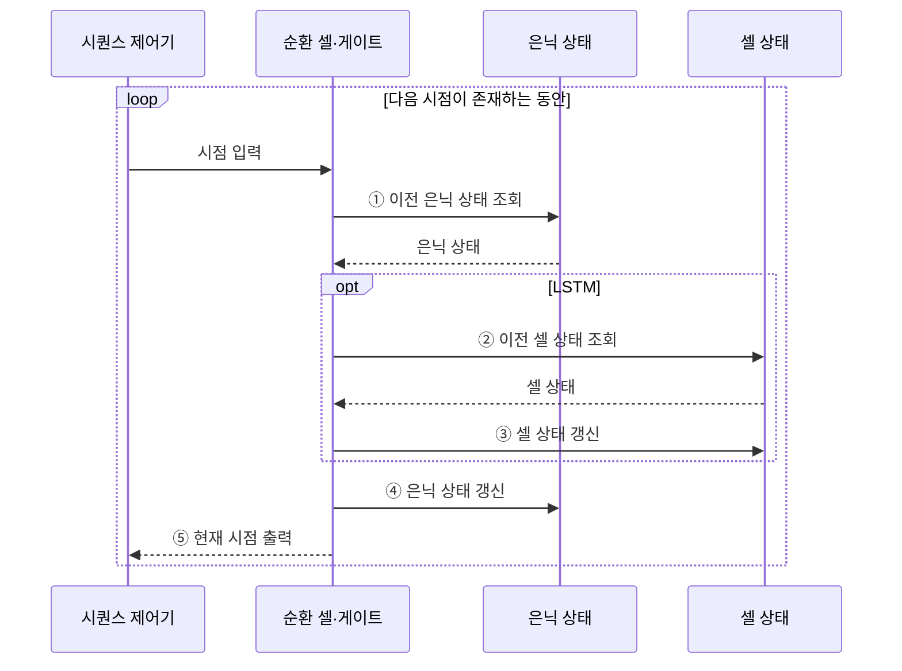

---
sidebar:
  order: 44
  label: "044. 순환 신경망 (RNN·LSTM·GRU)"
  badge:
    text: "미출 · 30%"
    variant: note
title: "순환 신경망 (RNN·LSTM·GRU)"
date: "2026-07-28T21:27:55+09:00"
tags:
  - "notes-basic-theory"
weight: 44
extra:
  question_no: "044"
  source_status: "미출"
  source_history: ""
  priority: 30
  priority_note: "장기 의존성과 게이트 구조 비교"
---

## 미리 알고가기

- **순환 신경망(Recurrent Neural Network, RNN)**: 이전 시점의 은닉 상태를 현재 입력과 함께 처리하여 순서가 있는 데이터의 문맥을 학습하는 신경망이다.
- **시퀀스(Sequence)**: 원소를 늘어놓은 순서 자체가 뜻을 바꾸는 데이터이며, 같은 단어를 담아도 어순이 달라지면 문장의 의미가 달라지는 것이 대표적이다.
- **장단기 메모리(Long Short-Term Memory, LSTM)**: 입력·망각·출력 게이트로 셀 상태를 조절하여 장기 의존성을 학습하는 순환 신경망 구조다.
- **게이트 순환 유닛(Gated Recurrent Unit, GRU)**: 갱신·리셋 게이트로 은닉 상태를 직접 조절하여 LSTM보다 단순한 구조로 장기 의존성을 학습한다.
- **은닉 상태(Hidden State)**: 지금까지 읽은 내용과 현재 입력을 하나로 요약해 다음 시점에 넘겨주는 기억값이며, 이 값이 곧 그 시점의 출력 근거가 된다.
- **셀 상태(Cell State)**: LSTM에만 있는 별도의 기억 통로이며, 시점마다 크게 뒤섞이지 않고 더하기 위주로만 지나가기 때문에 먼 과거의 정보가 덜 희석된 채 흘러간다.
- **순환 셀(Recurrent Cell)**: 현재 입력과 이전 상태를 결합해 다음 상태를 계산하는 처리 단위
- **게이트(Gate)**: 입력값에 0에서 1 사이의 비율을 곱해 기억의 보존·삭제·출력을 조절하는 장치
- **파라미터(Parameter)**: 학습 과정에서 조정되는 가중치와 편향이며, 순환망은 시점마다 새로 만들지 않고 같은 묶음을 모든 시점에서 돌려 쓴다.
- **문맥(Context)**: 현재 결과를 해석하는 데 필요한 앞선 시점의 정보
- **시간축 역전파(Backpropagation Through Time, BPTT)**: 순환 구조를 시간 순서대로 전개한 뒤 각 시점에서 공유하는 가중치의 기울기를 역방향으로 누적하는 학습 방법이다.
- **장기 의존성(Long-term Dependency)**: 수십 시점 앞의 사건이 지금의 결과를 좌우하는 관계이며, 문장 첫머리의 주어가 한참 뒤 동사의 형태를 정하는 경우가 여기에 해당한다.
- **기울기 소실·폭주(Vanishing·Exploding Gradient)**: 시간축을 거슬러 갈 때 같은 배율이 시점 수만큼 거듭 곱해져, 1보다 작으면 기울기가 0에 수렴해 먼 과거를 배우지 못하고 1보다 크면 발산해 학습이 무너지는 현상이다.
- **손실 함수(Loss Function)**: 예측값과 목표값의 오차를 하나의 수치로 바꾸는 함수이며, 순환망에서는 출력이 필요한 시점마다 이 값이 만들어져 역전파의 출발점이 된다.
- **기울기 클리핑(Gradient Clipping)**: 기울기 크기가 임계값을 넘으면 잘라 기울기 폭주를 억제하는 방법이다.
- **절단 시간축 역전파(Truncated BPTT)**: 긴 시퀀스를 구간으로 나눠 제한된 시점까지만 역전파하는 학습 방법이다.
- **상태 초기화(State Reset)**: 서로 독립인 시퀀스의 경계에서 은닉·셀 상태를 초기값으로 되돌려 앞 표본의 문맥이 섞이지 않게 하는 처리

## Ⅰ. 개요

- 정의/개념: **은닉 상태** 순환으로 **시퀀스**의 순서 정보를 처리하는 신경망
- 기존 한계: 입력 칸이 고정된 모델은 **가변 길이** 시계열 처리 불가

### 쉽게 이해하기 (학습용)
- RNN은 같은 순환 셀을 시점마다 재사용하므로 길이가 다른 문장이나 시계열을 같은 파라미터로 처리한다.

## Ⅱ. 특징

- **은닉 상태** 순환을 통한 과거 **문맥 전달**
- 시간축 **가중치 공유** 기반 **가변 길이** 입력 처리
- 반복 기울기 곱에 따른 **장기 의존성** 학습 한계

### 쉽게 이해하기 (학습용)
- 시간축 역전파에서는 같은 배율이 시점마다 반복되어 기울기가 소실되거나 폭주할 수 있다.

## Ⅲ. 아키텍처

**도표안 A — 구조도**

**도표안 B — sequenceDiagram**

| 구성요소 | 책임 |
|:---|:---|
| 순환 셀·게이트 | 현재 입력·이전 상태 결합과 **게이트 제어** |
| 은닉 상태 | 시점별 **출력 문맥** 전달 |
| 셀 상태 | LSTM의 **장기 문맥** 전달 경로 |

**동작 원리**

- **① 이전 은닉 상태 조회**: RNN·LSTM·GRU가 이전 시점의 출력 문맥을 읽음
- **② 이전 셀 상태 조회**: LSTM일 때 별도 장기 기억 통로의 이전 값 조회
- **③ 셀 상태 갱신**: LSTM 게이트로 이전 기억의 보존·삭제와 새 정보 반영 비율 결정
- **④ 은닉 상태 갱신**: 현재 입력과 이전 상태를 결합해 다음 시점에 전달할 문맥 생성
- **⑤ 현재 시점 출력**: 갱신된 은닉 상태로 해당 시점의 예측값 산출

### 쉽게 이해하기 (학습용)
- 메모지인 은닉 상태는 직전 문맥을 넘기고 장부인 셀 상태는 게이트가 고른 정보를 오래 보존해 LSTM의 장기 의존성을 유지한다.

## Ⅳ. 종류 및 비교

| 순환 신경망 | RNN | LSTM | GRU |
|:---|:---|:---|:---|
| 적용 기준 | 시점 간격 짧은 **단기 의존성** | 먼 시점 **장기 의존성** 과업 | 장기 문맥과 **메모리 제약** 동시 |
| 핵심 특징 | **은닉 상태** 단일 순환 | **셀 상태**와 세 게이트의 기억 제어 | 셀 상태 없는 **두 게이트** 갱신 |
| 한계 | 장기 구간의 **기울기 소실·폭주** | 파라미터·연산량 증가로 **학습 지연** | LSTM 대비 제한된 **기억 제어** |

> 요약: 기울기 소실을 게이트로 풀고 다시 경량화한 **순환망 계보**

### 쉽게 이해하기 (학습용)
- LSTM은 별도 셀 상태와 세 게이트로 기억을 세밀하게 제어하고, GRU는 상태와 게이트를 줄여 연산 비용을 낮춘다.

## Ⅴ. 실무 고려사항 및 대책

| 고려사항 | 대책 | 효과 |
|:---|:---|:---|
| 긴 구간에서 **과거 정보 소실** | **LSTM·GRU 게이트** 구조 적용 | **장기 의존성 보존** 강화 |
| 기울기 폭주로 **손실 불안정** | **기울기 클리핑**과 학습률 조정 | **파라미터 갱신** 안정화 |
| 긴 시퀀스로 **학습 메모리 급증** | **절단 시간축 역전파**와 구간 배치 | **연산·메모리 상한** 통제 |
| 독립 시퀀스 사이 **상태 오염** | 경계에서 **은닉 상태 초기화·분리** | 표본 간 **문맥 누출 방지** |

### 쉽게 이해하기 (학습용)
- 장비 로그의 긴 두루마리를 구간별로 펼치듯, 절단 시간축 역전파와 상태 경계 초기화로 메모리 급증과 독립 시퀀스의 문맥 오염을 함께 줄인다.

## Ⅵ. 결론

- **장기 의존성** 필요 시 LSTM, **자원 제약**이면 GRU 선택

### 쉽게 이해하기 (학습용)
- 의존 구간이 짧으면 RNN, 장기 기억 제어가 중요하면 LSTM, 자원 제약까지 크면 GRU를 검토한다.
