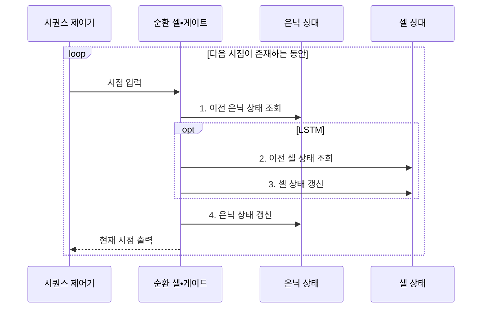

---
sidebar:
  order: 44
  label: "044. 순환 신경망 (RNN•LSTM•GRU)"
  badge:
    text: "미출 • 30%"
    variant: note
title: "순환 신경망 (RNN•LSTM•GRU)"
date: "2026-07-30T18:50:01+09:00"
tags:
  - "notes-basic-theory"
weight: 44
extra:
  question_no: "044"
  source_status: "미출"
  source_history: ""
  priority: 30
  priority_note: "장기 의존성과 게이트 구조 비교"
---

## 미리 알고가기

- **순환 신경망(Recurrent Neural Network, RNN)**: 이전 상태를 현재 입력과 결합해 순서 문맥을 학습하는 신경망
- **시퀀스(Sequence)**: 원소의 순서가 의미를 바꾸는 데이터
- **장단기 메모리(Long Short-Term Memory, LSTM)**: 세 게이트와 셀 상태로 장기 문맥을 보존하는 순환 신경망
- **게이트 순환 유닛(Gated Recurrent Unit, GRU)**: 두 게이트로 은닉 상태를 직접 조절하는 경량 순환 신경망
- **은닉 상태(Hidden State)**: 현재까지의 문맥을 요약해 다음 시점에 넘기는 기억값
- **셀 상태(Cell State)**: LSTM에서 장기 문맥을 전달하는 별도 기억 통로
- **순환 셀(Recurrent Cell)**: 현재 입력과 이전 상태를 결합해 다음 상태를 계산하는 처리 단위
- **게이트(Gate)**: 입력값에 0에서 1 사이의 비율을 곱해 기억의 보존•삭제•출력을 조절하는 장치
- **파라미터(Parameter)**: 학습으로 조정하며 모든 시점에 공유하는 가중치•편향
- **문맥(Context)**: 현재 결과를 해석하는 데 필요한 앞선 시점의 정보
- **시간축 역전파(Backpropagation Through Time, BPTT)**: 시간축으로 펼친 순환망의 기울기를 역순으로 누적하는 학습법
- **장기 의존성(Long-term Dependency)**: 먼 과거의 정보가 현재 결과를 좌우하는 관계
- **기울기 소실•폭주(Vanishing•Exploding Gradient)**: 반복 곱으로 기울기가 0에 수렴하거나 발산하는 현상
- **기울기 클리핑(Gradient Clipping)**: 기울기를 임계 크기로 제한하는 폭주 억제법
- **절단 시간축 역전파(Truncated BPTT)**: 긴 시퀀스를 구간별로 역전파하는 학습법
- **상태 초기화(State Reset)**: 서로 독립인 시퀀스의 경계에서 은닉•셀 상태를 초기값으로 되돌려 앞 표본의 문맥이 섞이지 않게 하는 처리

## Ⅰ. 개요

- 정의/개념: 이전 **은닉 상태**를 다음 시점에 전달하는 신경망
- 배경/필요성: 독립 표본 처리로는 **시간 순서•과거 문맥 반영 불가**

### 쉽게 이해하기 (학습용)

- RNN은 같은 순환 셀을 시점마다 재사용하므로 길이가 다른 문장이나 시계열을 같은 파라미터로 처리한다.

## Ⅱ. 특징

- **은닉 상태** 순환을 통한 과거 **문맥 전달**
- 시간축 **가중치 공유** 기반 **가변 길이** 입력 처리
- 반복 기울기 곱에 따른 **장기 의존성** 학습 한계

### 쉽게 이해하기 (학습용)

- 시간축 역전파에서는 같은 배율이 시점마다 반복되어 기울기가 소실되거나 폭주할 수 있다.

## Ⅲ. 구조 및 구성요소

| 구성요소 | 책임 |
|:---|:---|
| 순환 셀•게이트 | 현재 입력•이전 상태 결합과 **게이트 제어** |
| 은닉 상태 | 시점별 **출력 문맥** 전달 |
| 셀 상태 | LSTM의 **장기 문맥** 전달 경로 |

### 쉽게 이해하기 (학습용)
- 순환 셀이 현재 입력과 상태를 결합하고, 은닉 상태와 셀 상태가 서로 다른 길이의 문맥을 보관한다.

## Ⅳ. 흐름도

### 동작 원리

- **1. 이전 은닉 상태 조회**: 이전 시점 문맥 조회
- **2. 이전 셀 상태 조회**: LSTM 장기 기억 조회
- **3. 셀 상태 갱신**: 기억 보존•삭제•입력 비율 결정
- **4. 은닉 상태 갱신**: 다음 시점 전달 문맥 생성

### 쉽게 이해하기 (학습용)

- 은닉 상태는 현재 문맥을 넘기고, LSTM의 셀 상태는 게이트가 고른 장기 문맥을 보존한다.

## Ⅴ. 종류 및 비교

| 순환 신경망 | RNN | LSTM | GRU |
|:---|:---|:---|:---|
| 적용 기준 | 시점 간격 짧은 **단기 의존성** | 먼 시점 **장기 의존성** 과업 | 장기 문맥과 **메모리 제약** 동시 |
| 핵심 특징 | **은닉 상태** 단일 순환 | **셀 상태**와 세 게이트의 기억 제어 | 셀 상태 없는 **두 게이트** 갱신 |
| 한계 | 장기 구간의 **기울기 소실•폭주** | 파라미터•연산량 증가로 **학습 지연** | LSTM 대비 제한된 **기억 제어** |

> 요약: 기울기 소실을 게이트로 풀고 다시 경량화한 **순환망 계보**

### 쉽게 이해하기 (학습용)

- LSTM은 별도 셀 상태와 세 게이트로 기억을 세밀하게 제어하고, GRU는 상태와 게이트를 줄여 연산 비용을 낮춘다.

## Ⅵ. 실무 고려사항 및 대책

| 고려사항 | 대책 | 효과 |
|:---|:---|:---|
| 긴 구간에서 **과거 정보 소실** | **LSTM•GRU 게이트** 구조 적용 | **장기 의존성 보존** 강화 |
| 기울기 폭주로 **손실 불안정** | **기울기 클리핑**과 학습률 조정 | **파라미터 갱신** 안정화 |
| 긴 시퀀스로 **학습 메모리 급증** | **절단 시간축 역전파**와 구간 배치 | **연산•메모리 상한** 통제 |
| 독립 시퀀스 사이 **상태 오염** | 경계에서 **은닉 상태 초기화•분리** | 표본 간 **문맥 누출 방지** |

### 쉽게 이해하기 (학습용)

- 독립된 장비 로그 경계에서 상태를 초기화해 이전 로그의 문맥 유입을 막는다.

## Ⅶ. 결론

- **장기 기억**은 LSTM, **메모리 제약**은 GRU 선택

### 쉽게 이해하기 (학습용)

- 의존 구간이 짧으면 RNN, 장기 기억 제어가 중요하면 LSTM, 메모리와 추론 시간이 제한되면 GRU를 검토한다.
