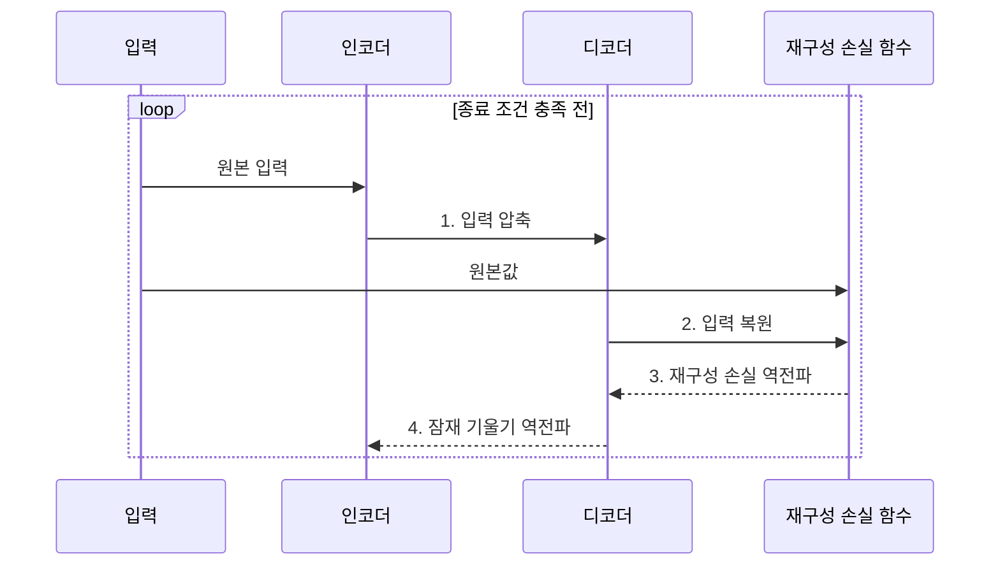

---
sidebar:
  order: 45
  label: "045. 오토인코더 (Autoencoder)"
  badge:
    text: "기출 • 50%"
    variant: note
title: "오토인코더 (Autoencoder)"
date: "2026-07-29T00:00:00+09:00"
tags:
  - "notes-basic-theory"
weight: 45
extra:
  question_no: "045"
  source_status: "기출"
  source_history: "131회"
  priority: 50
  priority_note: "표현 학습과 복원오차 활용이 핵심"
---

## 미리 알고가기

- **오토인코더(Autoencoder)**: 입력의 압축•복원을 통해 핵심 구조를 학습하는 신경망
- **자기지도학습(Self-supervised Learning)**: 입력 자체에서 학습 목표를 만드는 방식
- **지도학습•레이블(Supervised Learning•Label)**: 사람이 부여한 정답값으로 예측을 학습하는 방식과 각 표본에 붙이는 정답
- **인코더(Encoder)**: 입력을 잠재 벡터로 압축하는 신경망
- **디코더(Decoder)**: 잠재 벡터에서 입력을 복원하는 신경망
- **잠재 공간•병목(Latent Space•Bottleneck)**: 압축 표현 공간과 정보량을 제한하는 지점
- **재구성 손실(Reconstruction Loss)**: 원본과 복원값의 차이
- **디노이징(Denoising)**: 잡음 입력에서 원본을 복원하도록 학습하는 방식
- **강건한 특징(Robust Feature)**: 잡음•결측에도 크게 변하지 않는 표현
- **차원 축소(Dimensionality Reduction)**: 입력을 더 적은 수의 값으로 압축하는 처리
- **쿨백•라이블러 발산(Kullback-Leibler Divergence, KL Divergence)**: 두 확률분포의 차이를 나타내며, VAE의 잠재 분포를 기준 분포에 가깝게 규제하는 값
- **잠재 붕괴(Posterior Collapse)**: VAE의 잠재 변수가 입력 정보를 거의 담지 않아 디코더가 잠재 표현을 무시하는 현상
- **변이형 오토인코더(Variational Autoencoder, VAE)**: 입력의 잠재 확률분포를 학습하고 해당 분포에서 새로운 표본을 생성하는 확률적 오토인코더
- **역전파(Backpropagation)**: 출력 오차를 뒤로 전달해 각 파라미터의 손실 기울기를 계산하는 방법
- **복원오차 임계값(Reconstruction-error Threshold)**: 정상 데이터의 복원오차 분포를 기준으로 이상 여부를 나누는 경계값
- **이상 탐지(Anomaly Detection)**: 정상 패턴에서 크게 벗어난 입력을 찾아 이상 후보로 판정하는 처리
- **오탐(False Positive)**: 실제 정상인 입력을 이상으로 잘못 판정한 결과
- **희소 규제(Sparsity Regularization)**: 일부 잠재 변수만 활성화하는 제약
- **KL 가중치(KL Weight)**: 재구성 손실과 KL 발산의 영향 비율

## Ⅰ. 개요

- 정의/개념: 입력을 **압축•복원**해 데이터 구조를 학습하는 신경망
- 배경/필요성: **레이블 구축 없이 핵심 표현** 학습

### 쉽게 이해하기 (학습용)

- 인코더가 입력을 요약하고 디코더가 복원하며, 원본과의 차이를 줄이는 과정에서 별도 레이블 없이 표현을 학습한다.

## Ⅱ. 특징

- 입력 복원을 학습 목표로 하는 **자기지도** 표현 학습
- 입력을 **저차원 잠재 벡터**로 압축해 핵심 특징 추출
- **복원 오차 최소화**를 통한 인코더•디코더 공동 학습

### 쉽게 이해하기 (학습용)

- 병목 계층은 통로를 좁혀 핵심 특징만 통과시키지만, 지나치게 넓으면 입력을 그대로 복사할 수 있다.

## Ⅲ. 구조 및 구성요소

| 구성요소 | 책임 |
|:---|:---|
| 인코더 | 입력을 **잠재 벡터**로 압축 |
| 잠재 공간•병목 | 입력의 **핵심 표현** 보관과 정보량 제한 |
| 디코더 | 잠재 벡터에서 입력 형태의 **복원값** 산출 |
| 재구성 손실 함수 | 원본•복원값 차이와 **손실 기울기** 산출 |

### 쉽게 이해하기 (학습용)
- 인코더와 디코더 사이의 병목이 전달 정보량을 제한해 입력의 핵심 구조를 남긴다.

## Ⅳ. 흐름도

**동작 원리**

- **1. 입력 압축**: 인코더가 원본 입력을 저차원 잠재 벡터로 변환
- **2. 입력 복원**: 잠재 벡터의 원본 형태 복원
- **3. 재구성 손실 역전파**: 원본•복원 차이 전달
- **4. 잠재 기울기 역전파**: 인코더•디코더 공동 학습

### 쉽게 이해하기 (학습용)

- 잠재 벡터는 인코더와 디코더 사이의 유일한 정보 통로이므로 그 차원과 규제가 학습되는 표현을 좌우한다.

## Ⅴ. 종류 및 비교

| 오토인코더 계열 | 기본 오토인코더 | 디노이징 오토인코더 | VAE |
|:---|:---|:---|:---|
| 적용 기준 | **레이블** 없는 고차원 입력 | 입력에 **잡음•결측** 혼입 | 학습 분포 기반 **신규 표본 생성 요구** |
| 핵심 특징 | 원본 입력의 **결정적 압축•복원** | 잡음 주입 후 **강건한 특징** 학습 | **확률적 잠재 분포** 학습•신규 표본 생성 |
| 한계 | 과대 모델의 **단순 복사•특징 추출 약화** | **잡음 수준** 설정에 따른 복원 성능 민감성 | 복원 흐림•**잠재 붕괴** |

> 요약: 잡음은 복사 억제, **VAE**는 표본 생성

### 쉽게 이해하기 (학습용)

- 디노이징형은 잡음 입력에서 원본을 복원해 강건한 특징을 학습하고, VAE는 잠재 확률분포를 학습해 새로운 표본을 생성한다.

## Ⅵ. 실무 고려사항 및 대책

| 고려사항 | 대책 | 효과 |
|:---|:---|:---|
| 입력을 그대로 복사해 **표현력이 낮음** | 병목 축소•잡음 주입•**희소 규제** | **핵심 특징 학습** 강화 |
| 정상 데이터 변화로 **오탐 증가** | 주기적 재학습과 **임계값 재보정** | **이상 판정 기준** 안정화 |
| VAE 잠재 변수를 **디코더가 무시** | **KL 가중치** 점진 증가•디코더 용량 조정 | **잠재 붕괴** 완화 |
| 복원오차만으로 **이상 원인 설명 부족** | 특징별 오차와 **잠재 공간** 함께 분석 | **이상 원인 추적성** 향상 |

### 쉽게 이해하기 (학습용)

- 정상 지표의 복원오차 분포로 임계값을 재보정해 환경 변화에 따른 오탐을 줄인다.

## Ⅶ. 결론

- **잡음•복원오차•생성 요구** 기반 모델 선택

### 쉽게 이해하기 (학습용)

- 얼룩을 지운 원본이 필요하면 디노이징형을, 같은 분포의 새 표본이 필요하면 VAE를 선택한다.
