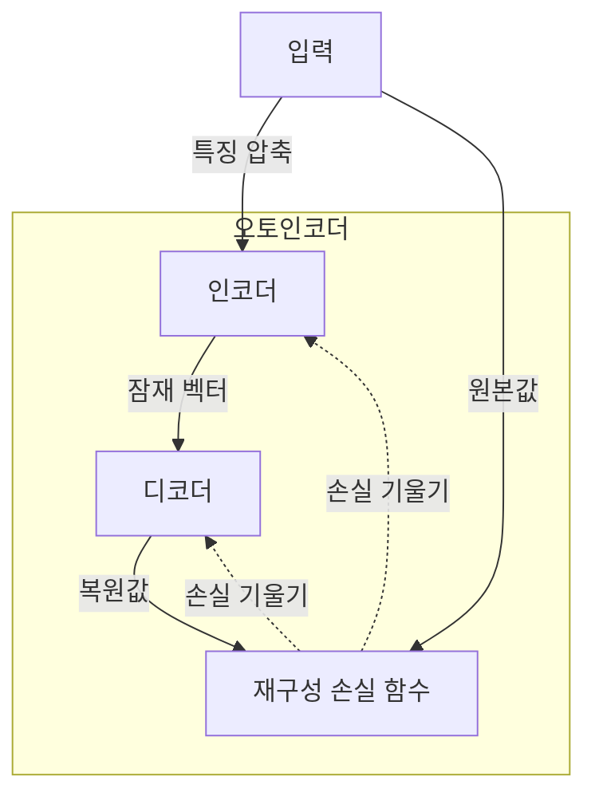
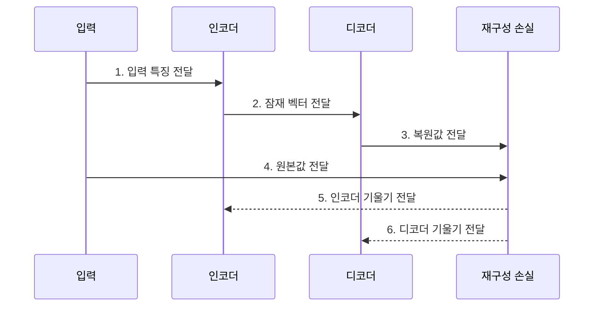

---
sidebar:
  order: 45
  label: "045. 오토인코더 (Autoencoder)"
  badge:
    text: "기출 · 50%"
    variant: note
title: "오토인코더 (Autoencoder)"
date: "2026-07-28T17:40:00+09:00"
tags:
  - "notes-basic-theory"
weight: 45
extra:
  question_no: "045"
  source_status: "기출"
  source_history: "131회"
  priority: 50
  priority_note: "표현 학습과 복원오차 활용이 핵심"
---

## 미리 알고가기

- **오토인코더(Autoencoder)**: 입력을 압축했다가 복원하며 원본과 복원본의 차이를 줄이는 과정에서 데이터의 핵심 구조를 학습하는 신경망이다.
- **자기지도학습(Self-supervised Learning)**: 사람이 붙인 정답 없이 입력 자체에서 학습 목표를 만드는 방식으로, 오토인코더는 원본 입력을 복원 목표로 삼는다.
- **인코더(Encoder)**: 입력을 낮은 차원의 잠재 벡터로 압축하는 앞쪽 신경망이다.
- **디코더(Decoder)**: 잠재 벡터에서 원래 입력 차원의 복원값을 만드는 뒤쪽 신경망이다.
- **잠재 공간·병목(Latent Space·Bottleneck)**: 인코더 출력이 놓이는 저차원 공간과 정보량을 제한하는 지점이다.
- **재구성 손실(Reconstruction Loss)**: 원래 입력과 복원값의 차이를 하나의 수치로 잰 값으로, 이 값을 줄이는 방향으로 인코더와 디코더의 가중치가 함께 갱신된다
- **디노이징(Denoising)**: 일부러 잡음을 섞은 입력을 넣고 잡음 없는 원본을 정답으로 복원시키는 학습 방식으로, 모델이 입력을 통째로 베끼지 못하게 만든다
- **강건한 특징(Robust Feature)**: 입력에 잡음이 섞이거나 일부가 지워져도 값이 크게 흔들리지 않는 표현으로, 디노이징 학습이 노리는 결과다
- **차원 축소(Dimensionality Reduction)**: 수백 개 값으로 이루어진 입력을 훨씬 적은 수의 값으로 줄여 저장·검색·비교를 쉽게 만드는 처리
- **쿨백·라이블러 발산(Kullback–Leibler Divergence, KL Divergence)**: 두 확률분포의 차이를 나타내며, VAE의 잠재 분포를 기준 분포에 가깝게 규제하는 값
- **잠재 붕괴(Posterior Collapse)**: VAE의 잠재 변수가 입력 정보를 거의 담지 않아 디코더가 잠재 표현을 무시하는 현상
- **변이형 오토인코더(Variational Autoencoder, VAE)**: 입력의 잠재 확률분포를 학습하고 해당 분포에서 새로운 표본을 생성하는 확률적 오토인코더
- **역전파(Backpropagation)**: 출력 오차를 뒤로 전달해 각 파라미터의 손실 기울기를 계산하는 방법
- **복원오차 임계값(Reconstruction-error Threshold)**: 정상 데이터의 복원오차 분포를 기준으로 이상 여부를 나누는 경계값

## Ⅰ. 개요

- 정의/개념: 입력을 **압축·복원**해 데이터 구조를 학습하는 신경망
- 기존 한계: **지도학습**의 **레이블 비용** 증가로 대규모 표현 학습 제약

### 쉽게 이해하기 (학습용)
- 인코더가 입력을 요약하고 디코더가 복원하며, 원본과의 차이를 줄이는 과정에서 별도 레이블 없이 표현을 학습한다.

## Ⅱ. 특징

- 입력 복원을 학습 목표로 하는 **자기지도** 표현 학습
- 입력을 **저차원 잠재 벡터**로 압축해 핵심 특징 추출
- **복원 오차 최소화**를 통한 인코더·디코더 공동 학습

### 쉽게 이해하기 (학습용)
- 병목 계층은 입력보다 낮은 차원으로 정보를 제한해 핵심 특징을 선택하도록 하며, 병목이 지나치게 넓으면 입력을 그대로 복사해 유의미한 표현을 학습하지 못할 수 있다

## Ⅲ. 아키텍처 및 구성요소

| 설계 요소 | 설명 |
|:---|:---|
| 인코더 | 입력을 **잠재 벡터**로 압축 |
| 디코더 | 잠재 벡터에서 입력 형태의 **복원값** 산출 |
| 재구성 손실 함수 | 원본·복원값 차이와 **손실 기울기** 산출 |

> 요약: **인코더** 압축·**디코더** 복원으로 입력 구조 학습

### 쉽게 이해하기 (학습용)
- 잠재 벡터는 인코더와 디코더 사이의 유일한 정보 통로이므로 그 차원과 규제가 학습되는 표현을 좌우한다.

## Ⅳ. 종류 및 비교

| 오토인코더 계열 | 기본 오토인코더 | 디노이징 오토인코더 | VAE |
|:---|:---|:---|:---|
| 적용 기준 | **레이블** 없는 고차원 입력 | 입력에 **잡음·결측** 혼입 | 학습 분포 기반 **신규 표본 생성 요구** |
| 핵심 특징 | 원본 입력의 **결정적 압축·복원** | 잡음 주입 후 **강건한 특징** 학습 | **확률적 잠재 분포** 학습·신규 표본 생성 |
| 한계 | 과대 모델의 **단순 복사·특징 추출 약화** | **잡음 수준** 설정에 따른 복원 성능 민감성 | 복원 흐림·**잠재 붕괴** |

> 요약: 잡음 주입은 단순 복사 한계를, **VAE**는 생성 요구를 해결

### 쉽게 이해하기 (학습용)
- 디노이징형은 잡음 입력에서 원본을 복원해 강건한 특징을 학습하고, VAE는 잠재 확률분포를 학습해 새로운 표본을 생성한다.

## Ⅴ. 실무 고려사항 및 대책

| 실패 징후 | 완화 방안 | 기대 효과 |
|:---|:---|:---|
| 입력을 그대로 복사해 표현력이 낮음 | 병목 축소·잡음 주입·희소 규제 | 핵심 특징 학습 강화 |
| 정상 데이터 변화로 오탐 증가 | 주기적 재학습과 임계값 재보정 | 이상 판정 기준 안정화 |
| VAE 잠재 변수를 디코더가 무시 | KL 가중치 점진 증가·디코더 용량 조정 | 잠재 붕괴 완화 |
| 복원오차만으로 이상 원인 설명 부족 | 특징별 오차와 잠재 공간 함께 분석 | 이상 원인 추적성 향상 |

### 쉽게 이해하기 (학습용)
- 재구성 손실과 잠재 분포를 함께 관찰한다. 서버 이상 탐지는 정상 지표의 복원오차 분포로 임계값을 정하고, 이를 넘는 구간을 이상으로 판정한다.

## Ⅵ. 결론

- 표현 학습을 위해 복원 목적·잠재공간을 검토하여 **오토인코더** 활용

### 쉽게 이해하기 (학습용)
- 표현 압축, 잡음 제거, 표본 생성, 이상 탐지 중 목적을 먼저 정하고 병목 구조와 손실·임계값을 설계한다.
