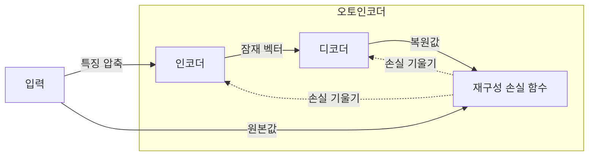
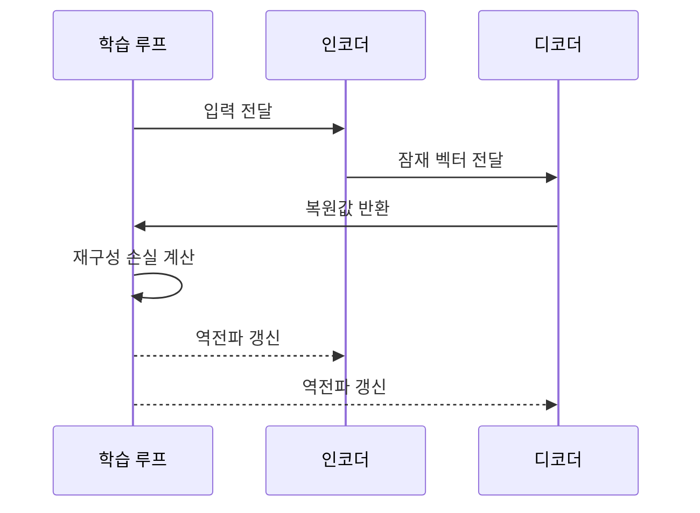

---
sidebar:
  order: 45
  label: "045. 오토인코더 (Autoencoder)"
  badge:
    text: "기출 · 50%"
    variant: note
title: "오토인코더 (Autoencoder)"
date: "2026-07-27T23:04:00+09:00"
tags:
  - "notes-basic-theory"
weight: 45
extra:
  question_no: "045"
  source_status: "기출"
  source_history: "131회"
  priority: 50
  priority_note: "표현 학습과 복원오차 활용이 핵심"
---

## 미리 알고가기

- **오토인코더(Autoencoder)**: 입력을 좁은 통로로 밀어 넣어 한 번 요약했다가 다시 원래 모습으로 펴 내는 신경망으로, 원본과 복원본의 차이를 줄이는 과정에서 데이터의 핵심 구조를 스스로 익힌다
- **자기지도학습(Self-supervised Learning)**: 사람이 붙인 정답표 없이 입력 자체를 정답으로 삼아 학습하는 방식으로, 오토인코더에서는 `입력을 그대로 되살리기`가 곧 정답 역할을 한다
- **인코더(Encoder)**: 입력을 점점 작은 차원으로 줄여 잠재 벡터 하나로 압축하는 앞쪽 신경망
- **디코더(Decoder)**: 잠재 벡터만 받아 원래 입력 차원의 복원값을 다시 만들어 내는 뒤쪽 신경망
- **잠재 공간·병목(Latent Space·Bottleneck)**: 인코더 출력이 놓이는 저차원 공간과 그 폭을 좁혀 정보량을 제한하는 지점으로, 폭이 좁을수록 모델은 무엇을 버릴지 골라야 해서 핵심 특징만 남는다
- **재구성 손실(Reconstruction Loss)**: 원래 입력과 복원값의 차이를 하나의 수치로 잰 값으로, 이 값을 줄이는 방향으로 인코더와 디코더의 가중치가 함께 갱신된다
- **디노이징(Denoising)**: 일부러 잡음을 섞은 입력을 넣고 잡음 없는 원본을 정답으로 복원시키는 학습 방식으로, 모델이 입력을 통째로 베끼지 못하게 만든다
- **강건한 특징(Robust Feature)**: 입력에 잡음이 섞이거나 일부가 지워져도 값이 크게 흔들리지 않는 표현으로, 디노이징 학습이 노리는 결과다
- **차원 축소(Dimensionality Reduction)**: 수백 개 값으로 이루어진 입력을 훨씬 적은 수의 값으로 줄여 저장·검색·비교를 쉽게 만드는 처리
- **쿨백·라이블러 발산(Kullback–Leibler Divergence, KL Divergence)**: ‘케이엘 다이버전스’로 읽고 두 연구자 이름의 머리글자를 딴 약어이며, 두 확률분포의 차이를 나타내 VAE의 잠재 분포를 기준 분포에 가깝게 규제하는 값
- **잠재 붕괴(Posterior Collapse)**: VAE의 잠재 변수가 입력 정보를 거의 담지 않아 디코더가 잠재 표현을 무시하는 현상
- **변이형 오토인코더(Variational Autoencoder, VAE)**: ‘브이에이이’로 읽고 영문 머리글자를 딴 약어이며, 잠재 분포를 학습하고 그 분포에서 새 표본을 생성하는 오토인코더
- **역전파(Backpropagation)**: 출력 오차를 뒤로 전달해 각 파라미터의 손실 기울기를 계산하는 방법
- **복원오차 임계값(Reconstruction-error Threshold)**: 정상 데이터의 복원오차 분포를 기준으로 이상 여부를 나누는 경계값

## Ⅰ. 개요

- 정의/개념: 입력을 **압축·복원**해 데이터 구조를 학습하는 신경망
- 기존 한계: **지도학습**의 **레이블 비용** 증가로 대규모 표현 학습 제약

### 쉽게 이해하기 (학습용)
- 긴 회의록을 한 장짜리 메모로 줄였다가 그 메모만 보고 원문을 다시 써 보는 연습처럼, 인코더가 줄이고 디코더가 되살리며 둘의 차이를 좁히는 과정 자체가 정답표 없이도 데이터의 구조를 배우게 하는 이유다

## Ⅱ. 특징

- 입력 복원을 학습 목표로 하는 **자기지도** 표현 학습
- 입력을 **저차원 잠재 벡터**로 압축해 핵심 특징 추출
- **복원 오차 최소화**를 통한 인코더·디코더 공동 학습

### 쉽게 이해하기 (학습용)
- 메모 칸이 좁을수록 무엇을 버리고 무엇을 남길지 고르게 되는데 이 좁은 칸이 병목 계층이고, 칸을 넓게 주면 원문을 통째로 베껴 복원 오차만 0에 가까워질 뿐 쓸 만한 특징은 남지 않는다

## Ⅲ. 아키텍처 및 구성요소

| 설계 요소 | 설명 |
|:---|:---|
| 인코더 | 입력을 **잠재 벡터**로 압축 |
| 디코더 | 잠재 벡터에서 입력 형태의 **복원값** 산출 |
| 재구성 손실 함수 | 원본·복원값 차이와 **손실 기울기** 산출 |

> 요약: **인코더** 압축·**디코더** 복원으로 입력 구조 학습

### 쉽게 이해하기 (학습용)
- 요점만 적는 사람(인코더)이 쪽지 한 장을 넘기고 복원 담당(디코더)은 그 쪽지만 보고 원문을 다시 쓰는 구조라, 두 모듈 사이를 오가는 잠재 벡터가 전달 가능한 정보량을 정하는 유일한 통로다

## Ⅳ. 원리 및 절차 흐름도

| 절차 | 설명 |
|:---|:---|
| 입력 전달 | 학습 루프가 원본 입력을 **인코더**에 전달 |
| 잠재 벡터 전달 | **인코더**가 입력을 저차원 잠재 벡터로 압축·전달 |
| 복원값 반환 | **디코더**가 입력 차원의 복원값을 학습 루프에 반환 |
| 재구성 손실 계산 | 원본·복원값 차이를 **재구성 손실**로 산출 |
| 역전파 갱신 | 손실 기울기로 인코더·디코더 가중치 갱신 |

> 요약: 압축·복원 오차를 **역전파**해 표현 학습

### 쉽게 이해하기 (학습용)
- 복원한 글을 원문과 나란히 놓고 틀린 글자에 표시를 한 뒤 그 표시를 디코더에서 인코더 쪽으로 거슬러 올려 보내, 압축 규칙과 복원 규칙을 같은 회차에 함께 고치는 것이 역전파다

## Ⅴ. 종류 및 비교

| 오토인코더 계열 | 기본 오토인코더 | 디노이징 오토인코더 | VAE |
|:---|:---|:---|:---|
| 적용 기준 | **레이블** 없는 고차원 입력 | 입력에 **잡음·결측** 혼입 | 학습 분포 기반 **신규 표본 생성 요구** |
| 핵심 특징 | 원본 입력의 **결정적 압축·복원** | 잡음 주입 후 **강건한 특징** 학습 | **확률적 잠재 분포** 학습·신규 표본 생성 |
| 한계 | 과대 모델의 **단순 복사·특징 추출 약화** | **잡음 수준** 설정에 따른 복원 성능 민감성 | 복원 흐림·**잠재 붕괴** |

> 요약: 잡음 주입은 단순 복사 한계를, **VAE**는 생성 요구를 해결

### 쉽게 이해하기 (학습용)
- 깨끗한 문서만 주면 학생이 뜻을 몰라도 그대로 베껴 쓸 수 있으니 디노이징형은 일부러 얼룩진 문서를 주어 내용을 이해해야만 복원되게 만들고, VAE는 문서 자체를 하나의 확률 분포로 배워 본 적 없는 새 문서까지 뽑아낸다

## Ⅵ. 실무 사례

1. 서버 이상 탐지는 **복원오차 크기**로 이상 판정

### 쉽게 이해하기 (학습용)
- 평소 서버 지표만 보고 자란 모델은 정상 구간은 거의 그대로 되살리지만 처음 보는 장애 구간은 엉뚱하게 복원해 오차가 솟구치므로, 그 오차 높이에 자를 대듯 임계선을 그어 이상으로 표시한다

## Ⅶ. 결론

- 표현 학습을 위해 복원 목적·잠재공간을 검토하여 **오토인코더** 활용

### 쉽게 이해하기 (학습용)
- 지저분한 원본을 깨끗하게 되살리는 일은 얼룩을 지우는 훈련을 받은 디노이징형이 잘하고, 없던 데이터를 새로 만드는 일은 잠재 공간을 확률 분포로 배운 VAE가 알맞아 목적이 곧 구조 선택을 가른다
