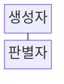
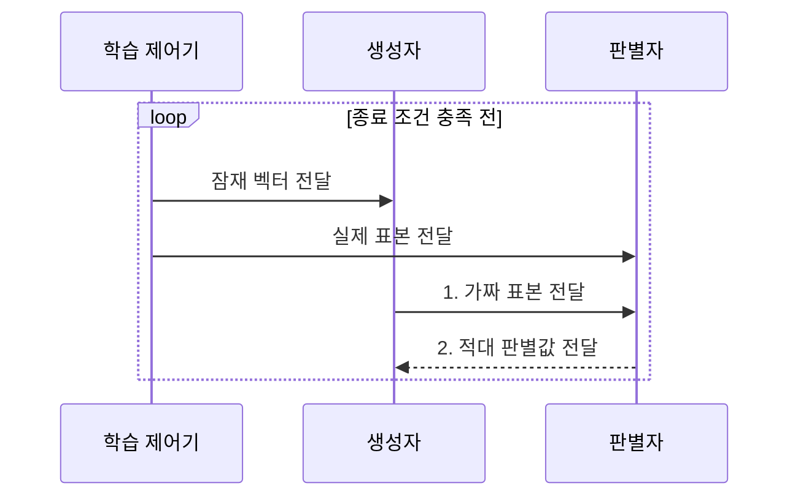

---
sidebar:
  order: 46
  label: "046. 생성적 적대 신경망 (GAN)"
  badge:
    text: "기출 • 50%"
    variant: note
title: "생성적 적대 신경망 (GAN)"
date: "2026-08-03T09:07:03+09:00"
tags:
  - "notes-basic-theory"
weight: 46
extra:
  question_no: "046"
  source_status: "기출"
  source_history: "122회"
  priority: 50
  priority_note: "생성 구조•모드 붕괴 분석 우선"
---

## Ⅰ. 개요

핵심 용어

- **생성적 적대 신경망(GAN)**: 생성자와 판별자의 경쟁으로 실제와 유사한 표본을 만드는 모델
- **데이터 분포**: 데이터 값이나 형태가 나타나는 빈도와 범위
- **생성자•판별자**: 잠재 벡터에서 가짜 표본을 만드는 신경망과 실제•가짜를 구분하는 신경망
- **명시적 확률밀도**: 가능한 각 데이터값에 모델이 직접 계산해 부여하는 확률 밀도 함수

- 정의/개념: **생성자** 와 **판별자** 의 경쟁으로 데이터 분포를 학습해 실제와 유사한 표본을 만드는 생성 모델
- 배경/필요성: 명시적 확률밀도 계산은 고차원에서 **추정 비용 급증**

#### 한줄 요약

- 위조범인 생성자가 표본을 만들고 감별사인 판별자가 진위를 가리며, 서로의 실수를 이용해 실제와 가까운 분포를 익힌다.

## Ⅱ. 특징

핵심 용어

- **암묵적 생성 모델**: 명시적 확률밀도 없이 표본 생성 절차를 학습하는 모델
- **모드 붕괴**: 일부 형태만 반복 생성해 데이터 분포의 다양한 형태를 덮지 못하는 현상
- **기울기 소실**: 역전파되는 학습 신호가 지나치게 작아져 갱신이 멈추는 현상
- **적대적 경쟁**: 판별자는 진위를 잘 구분하고 생성자는 판별자를 속이도록 서로 반대 목표를 학습하는 관계
- **우도(Likelihood)**: 모델 분포가 관측 데이터에 부여하는 확률이나 밀도
- **학습 균형**: 생성자와 판별자 어느 한쪽도 지나치게 우세하지 않은 상태

- 생성자와 판별자의 **적대적 경쟁** 에 의한 데이터 분포 학습
- 명시적 **우도** 없이 표본을 생성하는 **암묵적 생성 모델**
- **학습 균형** 이탈 시 기울기 소실•**모드 붕괴** 발생

#### 한줄 요약

- 감별사가 너무 강하면 위조범에게 돌아갈 단서가 사라지고, 한 위조품만 통하면 생성자가 그 모양만 찍는 모드 붕괴에 빠진다.

## Ⅲ. 구조 및 구성요소

핵심 용어

- **생성자**: 무작위 잠재 벡터를 가짜 표본으로 변환하는 신경망
- **판별자**: 실제 표본과 가짜 표본의 진위를 판정하는 신경망
- **적대 학습 신호**: 판별자는 진위를 잘 맞히고 생성자는 판별자를 속이도록 만드는 반대 방향의 학습 신호
- **잠재 벡터(Latent Vector)**: 생성 표본의 특성을 결정하도록 생성자에 입력하는 무작위 변수

| 구성요소 | 책임 |
|:---|:---|
| 생성자 | 잠재 벡터를 **가짜 표본**으로 변환하고 적대 신호로 갱신 |
| 판별자 | 실제•가짜를 판별해 **적대 학습 신호** 제공 |

#### 한줄 요약
- 위조 작업대인 생성자와 감별대인 판별자가 맞붙어, 한쪽의 판정 결과가 다른 쪽의 개선 단서가 된다.

## Ⅳ. 흐름도

핵심 용어

- **잠재 벡터**: 생성자에 넣어 표본의 특성을 결정하는 무작위 잠재 변수
- **적대 판별값**: 판별자가 생성 표본을 실제로 판단한 정도를 나타내는 값
- **종료 조건**: 학습 손실•품질•반복 횟수 기준으로 적대 학습을 멈추는 조건

### 동작 원리

- **1. 가짜 표본 전달**: 잠재 벡터를 후보 표본으로 변환
- **2. 적대 판별값 전달**: 판별자는 진위를 학습하고 생성자는 실제 판정 방향으로 갱신

#### 한줄 요약

- 위조범이 낸 표본을 감별사가 채점하고, 돌아온 점수표로 위조범과 감별사가 번갈아 솜씨를 고친다.

## Ⅴ. 종류 및 비교

핵심 용어

- **VAE**: 입력을 확률 잠재 공간으로 압축하고 복원해 새 표본을 만드는 생성 모델
- **확산 모델**: 무작위 잡음을 여러 단계에 걸쳐 제거하며 표본을 만드는 생성 모델
- **추론**: 학습을 마친 모델이 새 입력에서 결과를 산출하는 과정
- **GAN**: 생성자와 판별자의 적대 학습으로 실제와 유사한 표본을 만드는 모델
- **잠재 보간**: 두 잠재 벡터 사이의 좌표를 이동해 중간 특성의 표본을 생성하는 방법
- **표본 다양성**: 생성 모델이 데이터 분포의 여러 형태를 폭넓게 만들어 내는 정도

| 생성 모델 | GAN | VAE | 확산 모델 |
|:---|:---|:---|:---|
| 적용 기준 | 단일 통과 **실시간 생성** 필요 | 잠재 벡터 **보간•편집** 필요 | **표본 다양성** 우선•지연 허용 |
| 핵심 특징 | 생성자•판별자 **적대 학습** | **확률 잠재 공간** 에서 복원 | 반복 **잡음 제거** 로 생성 |
| 한계 | **모드 붕괴**•학습 불안정 | **복원 흐림**•잠재 변수 무시 | 다단계 **추론** 의 생성 지연 |

> 요약: 선명도는 **GAN**, 편집은 VAE, 다양성은 **확산 모델**

#### 한줄 요약

- 한 번에 찍는 GAN은 빠르고, 잠재 지도를 잇는 VAE는 편집에, 잡음을 여러 번 지우는 확산 모델은 다양성에 유리하다.

## Ⅵ. 실무 고려사항 및 대책

핵심 용어

- **학습 균형**: 생성자와 판별자 어느 한쪽도 지나치게 우세하지 않은 학습 상태
- **FID**: 실제 이미지와 생성 이미지의 특징 분포 거리를 측정하는 품질 지표
- **미니배치**: 한 번의 파라미터 갱신에 사용하는 표본 묶음
- **학습률•갱신 횟수**: 한 번의 파라미터 이동 크기와 생성자•판별자를 업데이트하는 빈도
- **정규화 기법**: 가중치나 활성값의 규모를 제한해 적대 학습을 안정화하는 방법
- **합성 데이터 편향**: 생성 표본이 실제 데이터의 불균형이나 왜곡을 재현•증폭하는 현상

| 문제 | 대책 | 효과 |
|:---|:---|:---|
| 판별자 우세로 **생성자 기울기 소실** | 학습률•갱신 횟수 **균형** 과 손실 함수 조정 | 두 모델의 **학습 신호 유지** |
| 일부 형태만 반복하는 **모드 붕괴** | 미니배치 다양성 점검•**정규화 기법** 적용 | **생성 분포 범위** 확대 |
| 학습 손실은 안정적이나 **품질 저하** | **FID 등 분포 지표** 와 사람 평가 병행 | 표본 **품질•다양성 동시 검증** |
| 합성 데이터가 **실제 편향 증폭** | 클래스•속성별 **품질 검수** 와 사용 비율 제한 | **운영 데이터 왜곡** 완화 |

#### 한줄 요약

- 품질 계기판의 FID와 미니배치 표본판을 함께 보며 같은 얼굴만 줄지어 나오면 모드 붕괴 경보를 울린다.

## Ⅶ. 결론

핵심 용어

- **실시간 생성**: 긴 반복 과정 없이 짧은 시간 안에 표본을 만드는 요구
- **경쟁 균형**: 생성자와 판별자가 서로 유효한 학습 신호를 주고받는 상태
- **GAN**: 생성자와 판별자의 경쟁으로 데이터 분포를 학습하는 생성 모델

- **실시간 생성** 이 우선이고 경쟁 균형 확보 시 **GAN** 선택

#### 한줄 요약

- 한 번에 표본을 내는 빠른 생산선과 균형 잡힌 위조범•감별사 훈련장을 함께 마련할 수 있을 때 GAN을 고른다.
