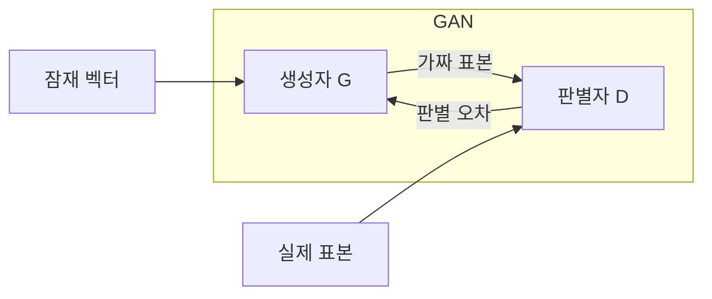
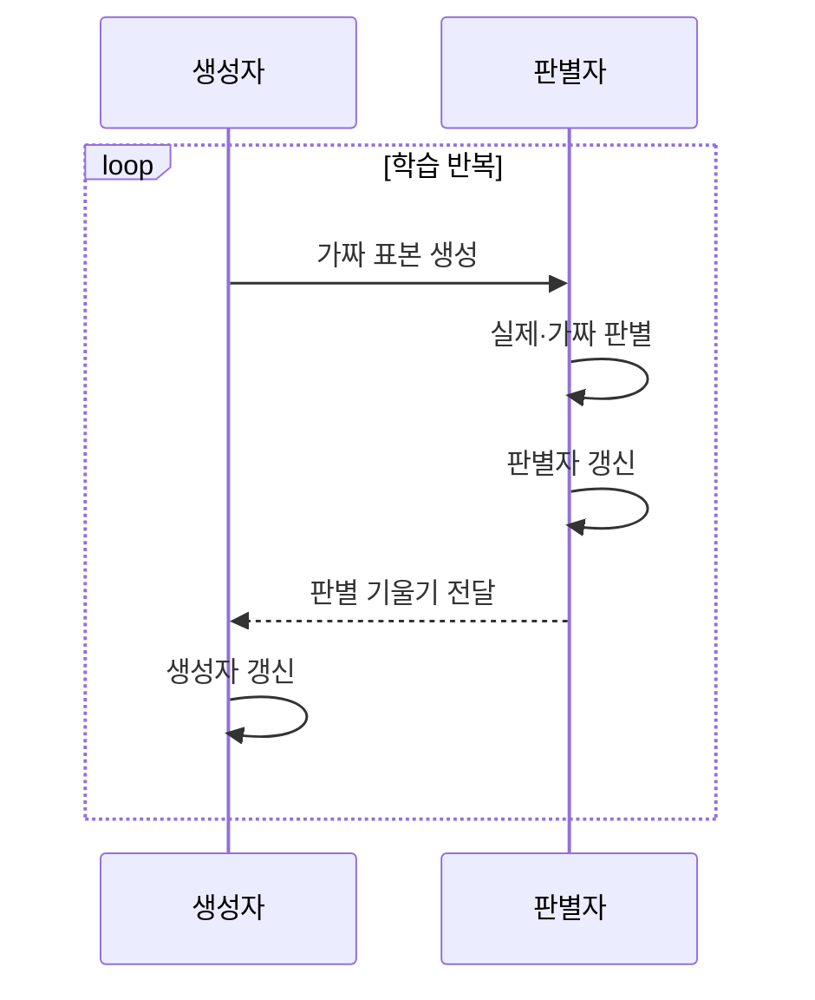

---
sidebar:
  order: 46
  label: "046. 생성적 적대 신경망 (GAN)"
  badge:
    text: "기출 · 50%"
    variant: note
title: "생성적 적대 신경망 (GAN)"
date: "2026-07-27T23:14:00+09:00"
tags:
  - "notes-basic-theory"
weight: 46
extra:
  question_no: "046"
  source_status: "기출"
  source_history: "122회"
  priority: 50
  priority_note: "생성 구조·모드 붕괴 분석 우선"
---

## 미리 알고가기

- **생성적 적대 신경망(Generative Adversarial Network, GAN)**: ‘갠’으로 읽으며, 위조범과 감별사가 마주 앉은 것처럼 생성자와 판별자를 경쟁시켜 진짜 같은 가짜 표본을 만들어 내는 모델이다
- **잠재 벡터(Latent Vector, $z$)**: $z$는 ‘제트’로 읽고 잠재 변수를 나타내는 분야 관례에 따라 붙인 표기로, 생성자에 무작위 입력을 제공
- **생성자(Generator, $G$)**: $G$는 ‘지’로 읽고 Generator의 첫 글자를 딴 표기로, $z$를 가짜 표본으로 변환
- **판별자(Discriminator, $D$)**: $D$는 ‘디’로 읽고 Discriminator의 첫 글자를 딴 표기로, 실제·가짜 표본의 진위를 판정
- **실제 표본(Real Sample, $x$)**: $x$는 ‘엑스’로 읽고 관측값을 나타내는 분야 관례에 따라 붙인 표기로, 실제 분포에서 추출해 판별자에 제공
- **적대 손실(Adversarial Loss)**: 생성자는 낮추려 하고 판별자는 높이려 하는 하나의 점수처럼 두 신경망의 학습 목표가 정반대로 걸려 있는 손실이며, 이 대립이 GAN 학습을 밀고 가는 동력이다
- **판별 경계(Decision Boundary)**: 판별자가 진짜와 가짜를 가르는 기준선으로, 학습이 진행될수록 이 선이 움직여 생성자에게 더 까다로운 기준을 제시한다
- **기울기 소실(Vanishing Gradient)**: 역전파되는 학습 신호가 지나치게 작아져 파라미터 갱신이 멈추는 현상
- **모드 붕괴(Mode Collapse)**: 판별자 점수에 과적합한 일부 표본만 생성해 데이터 분포의 여러 모드를 덮지 못하는 현상
- **우도(Likelihood)**: 가설의 적합도를 나타내는 수치
- **암묵적 생성 모델(Implicit Generative Model)**: 확률밀도 없이 표본 생성 절차를 학습하는 모델
- **잠재 공간 보간(Latent-space Interpolation)**: 두 잠재 벡터 사이의 값을 사용해 중간 특성의 표본을 생성하는 방법
- **추론(Inference)**: 학습을 마친 모델이 결과를 산출하는 과정
- **잠재 변수 무시(Latent-variable Ignoring)**: 생성 결과가 잠재 변수의 정보를 거의 반영하지 않는 실패 현상
- **데이터 증강(Data Augmentation)**: 기존 표본을 변형하거나 합성해 학습 표본의 수와 다양성을 늘리는 방법
- **변이형 오토인코더(Variational Autoencoder, VAE)**: 입력을 잠재 분포로 압축했다가 디코더로 되돌려 새 표본을 만드는 생성 모델
- **확산 모델(Diffusion Model)**: 잡음을 조금씩 걷어내며 표본을 만드는 생성 모델

## Ⅰ. 개요

- 정의/개념: **생성자**·**판별자** 경쟁으로 분포를 학습하는 모델
- 기존 한계: 복잡한 데이터는 **우도** 직접 계산 불가

### 쉽게 이해하기 (학습용)

- 위조범과 감별사가 경쟁하며 함께 실력을 키우는 방식입니다. 어려운 수학 공식을 풀어낼 필요 없이, 둘의 라이벌 경쟁만으로도 진짜 같은 가짜 사진을 만들어 냅니다.

## Ⅱ. 특징

- 생성자와 판별자의 **적대적 경쟁**에 의한 데이터 분포 학습
- 명시적 **우도** 없이 표본을 생성하는 **암묵적 생성 모델**
- **학습 균형** 이탈 시 기울기 소실·**모드 붕괴** 발생

### 쉽게 이해하기 (학습용)

- 위조범과 감별사가 서로를 밀어 올리며 가짜가 정교해지지만, 감별사가 너무 앞서 나가면 위조범에게 돌아오는 지적이 0에 가까워져 학습이 멈추는 기울기 소실이 오고 반대로 한 번 통한 가짜만 계속 찍어내면 모드 붕괴가 되므로 경쟁의 균형 자체가 성능을 좌우한다

## Ⅲ. 아키텍처 및 구성요소

| 설계 요소 | 설명 |
|:---|:---|
| 생성자 G | 잠재 벡터를 **가짜 표본**으로 변환 |
| 판별자 D | 실제·가짜를 판별해 **학습 신호** 제공 |

> 요약: **적대 손실**로 경쟁하며 학습하는 생성자·판별자 2블록 구조

### 쉽게 이해하기 (학습용)

- 무작위 숫자 뭉치를 재료로 받아 그림을 찍어내는 공장이 생성자이고 그 그림을 진짜 사진 더미와 나란히 놓고 점수를 매기는 검수대가 판별자인데, 검수 점수가 공장 쪽으로 되돌아가는 선 하나가 두 블록을 잇는 유일한 연결이다

## Ⅳ. 원리 및 절차 흐름도

| 절차 | 설명 |
|:---|:---|
| 가짜 표본 생성 | 무작위 **잠재 벡터**를 표본 공간으로 사상 |
| 실제·가짜 판별 | 두 표본의 **진위 점수** 산출 |
| 판별자 갱신 | 실제 점수 상향·가짜 점수 하향으로 **판별 경계** 이동 |
| 판별 기울기 전달 | 판별 결과의 **오차 기울기**를 생성자로 역전파 |
| 생성자 갱신 | 가짜 표본의 **판별 통과율** 상승 방향 갱신 |

> 요약: 진위 점수로 판별자·생성자를 **교대 갱신**

### 쉽게 이해하기 (학습용)

- 한 회차에 감별사를 먼저 손봐 진짜와 가짜를 더 잘 가르게 만든 다음 그 감별사의 점수를 따라 위조범을 고치며, 두 목표를 교대로 반영해야 상대 모델이 바꾼 판별 기준을 추적하면서 경쟁을 이어 갈 수 있다

## Ⅴ. 종류 및 비교

| 생성 모델 | GAN | VAE | 확산 모델 |
|:---|:---|:---|:---|
| 적용 기준 | 단일 통과 **실시간 생성** 필요 | 잠재 벡터 **보간·편집** 필요 | **표본 다양성** 우선·지연 허용 |
| 핵심 특징 | 생성자·판별자 **적대 학습** | **확률 잠재 공간**에서 복원 | 반복 **잡음 제거**로 생성 |
| 한계 | **모드 붕괴**·학습 불안정 | **복원 흐림**·잠재 변수 무시 | 다단계 **추론**의 생성 지연 |

> 요약: 선명도는 **GAN**, 편집은 VAE, 다양성은 **확산 모델**

### 쉽게 이해하기 (학습용)

- GAN은 위조범과 감별사가 한 번에 승부를 보듯 단 한 번의 통과로 선명한 그림을 뽑고, VAE는 지도 위 좌표를 조금씩 옮기듯 잠재 벡터를 이동시켜 중간 모습을 만들며, 확산은 뿌연 화면에서 잡음을 수십 번 걷어내듯 시간을 들여 여러 갈래의 모습을 고르게 얻는다

## Ⅵ. 실무 사례

1. 제조 결함 탐지는 **GAN 합성 이미지**로 희소 불량 보완

### 쉽게 이해하기 (학습용)

- 불량 사진이 부족한 검사 라인에서 GAN으로 희소 결함 이미지를 생성해 탐지 학습 데이터를 보완하되, 한 형태만 반복되지 않는지 확인한다

## Ⅶ. 결론

- **실시간·고선명 생성**에 GAN 선택, **학습 균형·모드 다양성** 검증

### 쉽게 이해하기 (학습용)

- 빠르고 선명한 표본이 필요하면 GAN을 선택하되, 생성자와 판별자의 학습 균형이 유지되고 다양한 형태가 생성되는지 확인한다
