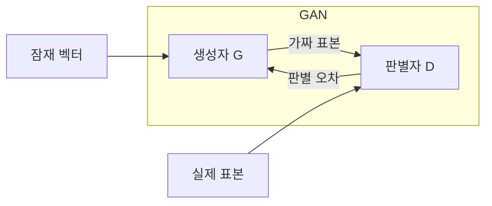
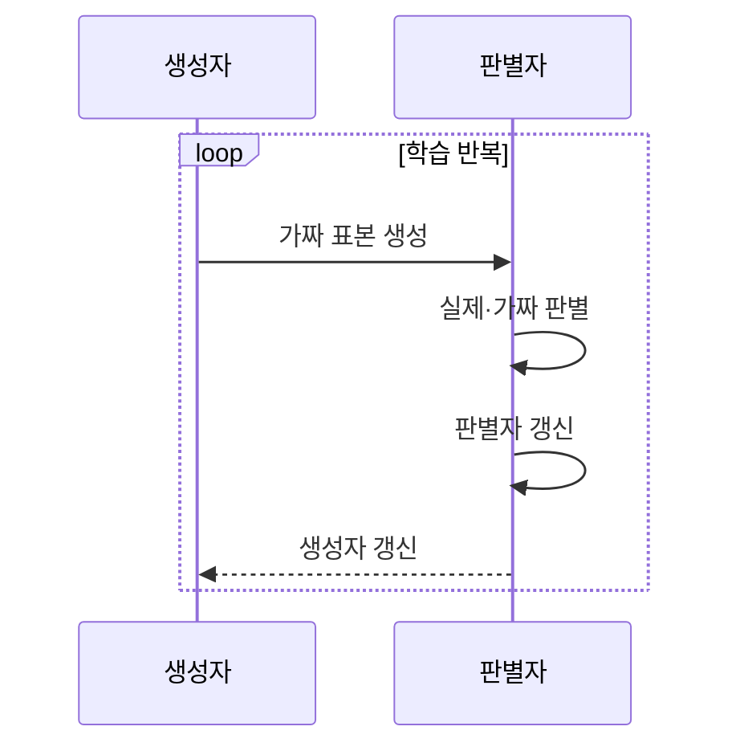

---
sidebar:
  order: 46
  label: "046. 생성적 적대 신경망 (GAN)"
  badge:
    text: "기출 · 50%"
    variant: note
title: "생성적 적대 신경망 (GAN)"
date: "2026-07-27T23:14:00+09:00"
tags:
  - "notes-basic-theory"
weight: 46
extra:
  question_no: "046"
  source_status: "기출"
  source_history: "122회"
  priority: 50
  priority_note: "생성 구조·모드 붕괴 분석 우선"
---

## 미리 알고가기

- **생성적 적대 신경망(Generative Adversarial Network, GAN)**: ‘갠’으로 읽고 영문 머리글자를 단어처럼 만든 약어이며, 위조범과 감별사가 마주 앉은 것처럼 생성자와 판별자를 경쟁시켜 진짜 같은 가짜 표본을 만들어 내는 모델이다
- **잠재 벡터(Latent Vector, $z$)**: $z$는 ‘제트’로 읽고 잠재 변수를 나타내는 분야 관례에 따라 붙인 표기로, 생성자에 무작위 입력을 제공
- **생성자(Generator, $G$)**: $G$는 ‘지’로 읽고 Generator의 첫 글자를 딴 표기로, $z$를 가짜 표본으로 변환
- **판별자(Discriminator, $D$)**: $D$는 ‘디’로 읽고 Discriminator의 첫 글자를 딴 표기로, 실제·가짜 표본의 진위를 판정
- **실제 표본(Real Sample, $x$)**: $x$는 ‘엑스’로 읽고 관측값을 나타내는 분야 관례에 따라 붙인 표기로, 실제 분포에서 추출해 판별자에 제공
- **적대 손실(Adversarial Loss)**: 생성자는 낮추려 하고 판별자는 높이려 하는 하나의 점수처럼 두 신경망의 학습 목표가 정반대로 걸려 있는 손실이며, 이 대립이 GAN 학습을 밀고 가는 동력이다
- **판별 경계(Decision Boundary)**: 판별자가 진짜와 가짜를 가르는 기준선으로, 학습이 진행될수록 이 선이 움직여 생성자에게 더 까다로운 기준을 제시한다
- **기울기 소실(Vanishing Gradient)**: 역전파되는 학습 신호가 지나치게 작아져 파라미터 갱신이 멈추는 현상
- **모드 붕괴(Mode Collapse)**: 생성자가 판별자를 잘 속이는 몇 가지 모습만 찾아내 계속 같은 그림만 찍어내는 실패로, 데이터 분포의 여러 갈래를 덮지 못하게 된다
- **원본 암기(Memorization)**: 생성자가 새 표본을 만드는 대신 학습에 쓴 원본을 거의 그대로 되뱉는 실패로, 합성 데이터를 늘려도 정보량이 늘지 않는다
- **가능도(Likelihood)**: 모델이 지금 본 데이터에 부여하는 확률·밀도값으로, GAN은 이를 식으로 직접 계산하지 않고 판별자 점수로 대신한다
- **잠재 공간 보간(Latent-space Interpolation)**: 두 잠재 벡터 사이의 값을 사용해 중간 특성의 표본을 생성하는 방법
- **추론(Inference)**: 학습을 마친 모델이 입력이나 잠재 벡터로 결과를 산출하는 과정
- **잠재 변수 무시(Latent-variable Ignoring)**: 생성 결과가 잠재 변수의 정보를 거의 반영하지 않는 실패 현상
- **데이터 증강(Data Augmentation)**: 기존 표본을 변형하거나 합성해 학습 표본의 수와 다양성을 늘리는 방법
- **변이형 오토인코더(Variational Autoencoder, VAE)**: ‘브이에이이’로 읽고 영문 머리글자를 딴 약어이며, 잠재 분포를 디코딩해 표본 생성
- **확산 모델(Diffusion Model)**: 완전한 잡음 화면에서 시작해 잡음을 조금씩 걷어내는 과정을 수십 번 반복해 표본을 만드는 생성 모델

## Ⅰ. 개요

- **정의/개념**: **생성자**·**판별자** 경쟁으로 분포를 학습하는 모델
- **기존 한계**: 고차원 데이터의 명시적 **가능도 모델링·계산** 복잡

### 쉽게 이해하기 (학습용)

- 위조범이 점점 진짜 같은 지폐를 만들고 감별사가 진위를 더 잘 가리는 경쟁을 반복하는 장면인데, 이렇게 서로를 밀어 올리는 방식이면 데이터가 어떤 확률식을 따르는지 직접 계산하지 않고도 진짜 같은 표본을 얻을 수 있어 고차원 이미지 생성에 쓴다

## Ⅱ. 특징

- 생성자와 판별자의 **적대적 경쟁**에 의한 데이터 분포 학습
- 명시적 가능도 없이 **암묵적 분포** 학습·표본 생성
- **학습 균형** 이탈 시 기울기 소실·**모드 붕괴** 발생

### 쉽게 이해하기 (학습용)

- 위조범과 감별사가 서로를 밀어 올리며 가짜가 정교해지지만, 감별사가 너무 앞서 나가면 위조범에게 돌아오는 지적이 0에 가까워져 학습이 멈추는 기울기 소실이 오고 반대로 한 번 통한 가짜만 계속 찍어내면 모드 붕괴가 되므로 경쟁의 균형 자체가 성능을 좌우한다

## Ⅲ. 아키텍처 및 구성요소

| 설계 요소 | 설명 |
|:---|:---|
| 생성자 G | 잠재 벡터를 **가짜 표본**으로 변환 |
| 판별자 D | 실제·가짜를 판별해 **학습 신호** 제공 |

> 요약: **적대 손실**로 경쟁하며 학습하는 생성자·판별자 2블록 구조

### 쉽게 이해하기 (학습용)

- 무작위 숫자 뭉치를 재료로 받아 그림을 찍어내는 공장이 생성자이고 그 그림을 진짜 사진 더미와 나란히 놓고 점수를 매기는 검수대가 판별자인데, 검수 점수가 공장 쪽으로 되돌아가는 선 하나가 두 블록을 잇는 유일한 연결이다

## Ⅳ. 원리 및 절차 흐름도

| 절차 | 설명 |
|:---|:---|
| 가짜 표본 생성 | 무작위 **잠재 벡터**를 표본 공간으로 사상 |
| 실제·가짜 판별 | 두 표본의 **진위 점수** 산출 |
| 판별자 갱신 | 실제 점수 상향·가짜 점수 하향으로 **판별 경계** 이동 |
| 생성자 갱신 | 가짜 표본의 **판별 통과율** 상승 방향 갱신 |

> 요약: 진위 점수로 판별자·생성자를 **교대 갱신**

### 쉽게 이해하기 (학습용)

- 한 회차에 감별사를 먼저 손봐 진짜와 가짜를 더 잘 가르게 만든 다음 그 감별사의 점수를 따라 위조범을 고치며, 두 목표를 교대로 반영해야 상대 모델이 바꾼 판별 기준을 추적하면서 경쟁을 이어 갈 수 있다

## Ⅴ. 종류 및 비교

| 생성 모델 | GAN | VAE | 확산 모델 |
|:---|:---|:---|:---|
| 적용 기준 | 단일 통과 **실시간 생성** 필요 | 잠재 벡터 **보간·편집** 필요 | **표본 다양성** 우선·지연 허용 |
| 핵심 특징 | 생성자·판별자 **적대 학습** | **확률 잠재 공간**에서 복원 | 반복 **잡음 제거**로 생성 |
| 한계 | **모드 붕괴**·학습 불안정 | **복원 흐림**·잠재 변수 무시 | 다단계 **추론**의 생성 지연 |

> 요약: 선명도는 **GAN**, 편집은 VAE, 다양성은 **확산 모델**

### 쉽게 이해하기 (학습용)

- GAN은 위조범과 감별사가 한 번에 승부를 보듯 단 한 번의 통과로 선명한 그림을 뽑고, VAE는 지도 위 좌표를 조금씩 옮기듯 잠재 벡터를 이동시켜 중간 모습을 만들며, 확산은 뿌연 화면에서 잡음을 수십 번 걷어내듯 시간을 들여 여러 갈래의 모습을 고르게 얻는다

## Ⅵ. 실무 사례

1. 제조 불량 분류는 **GAN** 합성 이미지로 희소 표본 보완
2. 영상 복원은 **생성 질감**의 입력 구조 이탈 여부 판정

### 쉽게 이해하기 (학습용)

- 긁힘 불량 사진은 수천 장인데 균열 불량은 열 장뿐인 검사 라인에서 GAN으로 균열 이미지를 만들어 채우되, 만들어 낸 그림이 실제 균열 유형을 고르게 덮는지 확인해야 모드 붕괴로 한 모양만 늘어나는 일을 피한다
- 흐릿한 감시 영상을 GAN으로 선명하게 만들면 벽돌 무늬나 글자 획처럼 원래 화면에 없던 형태까지 그럴듯하게 그려 넣을 수 있어, 복원 결과를 원본 구조와 겹쳐 보며 없던 형태가 생겼는지 가린다

## Ⅶ. 결론

- **모드 붕괴**·**원본 암기** 검증 후 증강 비율 결정

### 쉽게 이해하기 (학습용)

- 만들어 낸 그림들이 서로 비슷하기만 하거나 학습에 쓴 사진을 거의 그대로 베낀 것이 섞여 있으면, 그 합성 데이터를 학습에 넣는 비율부터 낮춰야 원래 데이터 분포가 왜곡되지 않는다
