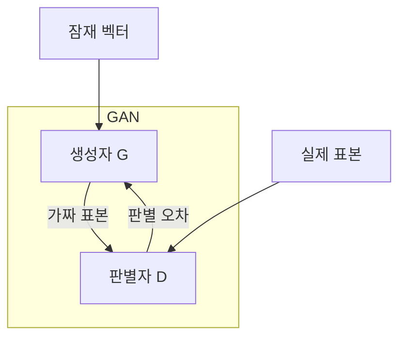
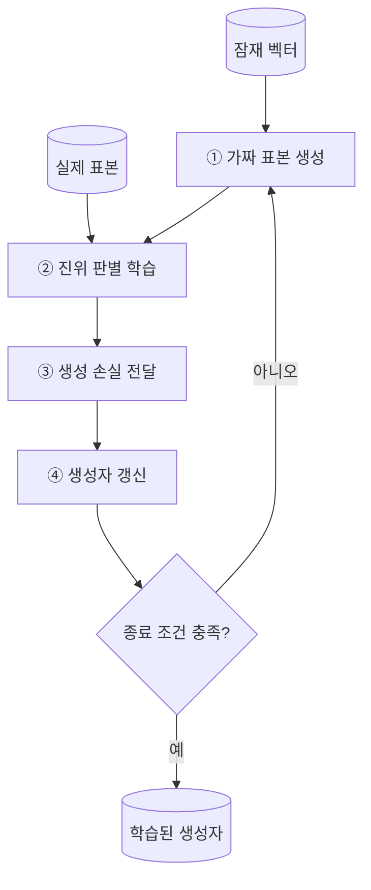
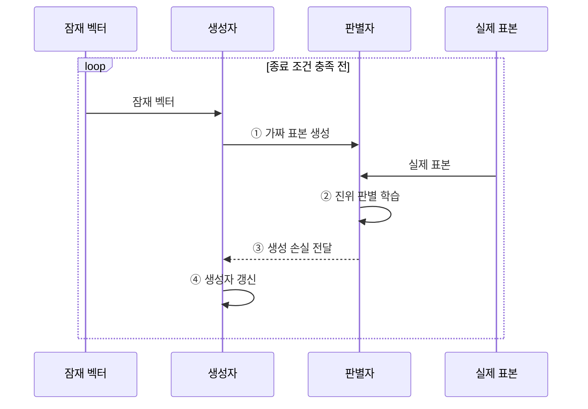

---
sidebar:
  order: 46
  label: "046. 생성적 적대 신경망 (GAN)"
  badge:
    text: "기출 · 50%"
    variant: note
title: "생성적 적대 신경망 (GAN)"
date: "2026-07-28T17:45:00+09:00"
tags:
  - "notes-basic-theory"
weight: 46
extra:
  question_no: "046"
  source_status: "기출"
  source_history: "122회"
  priority: 50
  priority_note: "생성 구조·모드 붕괴 분석 우선"
---

## 미리 알고가기

- **생성적 적대 신경망(Generative Adversarial Network, GAN)**: 생성자와 판별자를 적대적으로 학습하여 실제 데이터 분포와 유사한 새로운 표본을 생성하는 모델이다.
- **잠재 벡터(Latent Vector, $z$)**: 생성자에 무작위 입력을 제공하는 잠재 변수다.
- **생성자(Generator, $G$)**: 잠재 벡터를 가짜 표본으로 변환한다.
- **판별자(Discriminator, $D$)**: 실제 표본과 가짜 표본의 진위를 판정한다.
- **실제 표본(Real Sample, $x$)**: 실제 데이터 분포에서 추출해 판별자에 제공하는 관측값이다.
- **적대 손실(Adversarial Loss)**: 생성자는 판별 오류를 높이고 판별자는 진위 판별 성능을 높이도록 서로 반대되는 목적을 정의한 손실 함수
- **판별 경계(Decision Boundary)**: 판별자가 진짜와 가짜를 가르는 기준선으로, 학습이 진행될수록 이 선이 움직여 생성자에게 더 까다로운 기준을 제시한다
- **기울기 소실(Vanishing Gradient)**: 역전파되는 학습 신호가 지나치게 작아져 파라미터 갱신이 멈추는 현상
- **모드 붕괴(Mode Collapse)**: 판별자 점수에 과적합한 일부 표본만 생성해 데이터 분포의 여러 모드를 덮지 못하는 현상
- **우도(Likelihood)**: 가설의 적합도를 나타내는 수치
- **암묵적 생성 모델(Implicit Generative Model)**: 확률밀도 없이 표본 생성 절차를 학습하는 모델
- **잠재 공간 보간(Latent-space Interpolation)**: 두 잠재 벡터 사이의 값을 사용해 중간 특성의 표본을 생성하는 방법
- **추론(Inference)**: 학습을 마친 모델이 결과를 산출하는 과정
- **잠재 변수 무시(Latent-variable Ignoring)**: 생성 결과가 잠재 변수의 정보를 거의 반영하지 않는 실패 현상
- **데이터 증강(Data Augmentation)**: 기존 표본을 변형하거나 합성해 학습 표본의 수와 다양성을 늘리는 방법
- **변이형 오토인코더(Variational Autoencoder, VAE)**: 입력을 잠재 분포로 압축했다가 디코더로 되돌려 새 표본을 만드는 생성 모델
- **확산 모델(Diffusion Model)**: 잡음을 조금씩 걷어내며 표본을 만드는 생성 모델

## Ⅰ. 개요

- 정의/개념: **생성자**·**판별자** 경쟁으로 분포를 학습하는 모델
- 기존 한계: 복잡한 데이터는 **우도** 직접 계산 불가

### 쉽게 이해하기 (학습용)

- 생성자는 판별자를 속이는 표본을 만들고 판별자는 진위를 더 잘 가르도록 경쟁하면서 실제 분포와 가까운 표본을 학습한다.

## Ⅱ. 특징

- 생성자와 판별자의 **적대적 경쟁**에 의한 데이터 분포 학습
- 명시적 **우도** 없이 표본을 생성하는 **암묵적 생성 모델**
- **학습 균형** 이탈 시 기울기 소실·**모드 붕괴** 발생

### 쉽게 이해하기 (학습용)

- 위조범과 감별사가 서로를 밀어 올리며 가짜가 정교해지지만, 감별사가 너무 앞서 나가면 위조범에게 돌아오는 지적이 0에 가까워져 학습이 멈추는 기울기 소실이 오고 반대로 한 번 통한 가짜만 계속 찍어내면 모드 붕괴가 되므로 경쟁의 균형 자체가 성능을 좌우한다

## Ⅲ. 아키텍처

| 구성요소 | 책임 |
|:---|:---|
| 생성자 G | 잠재 벡터를 **가짜 표본**으로 변환 |
| 판별자 D | 실제·가짜를 판별해 **학습 신호** 제공 |

**동작 원리**

- ① **생성자**가 잠재 벡터를 **가짜 표본**으로 변환한다.
- ② **판별자**가 실제·가짜 표본을 구분하도록 **판별 학습**한다.
- ③ 판별자가 가짜 표본의 **생성 손실**을 생성자에 **역전파**한다.
- ④ 생성자가 판별자를 속이도록 **파라미터**를 갱신해 **생성 분포**를 개선한다.

### 쉽게 이해하기 (학습용)

- 생성자는 잠재 벡터를 표본으로 바꾸고, 판별자는 실제·가짜 점수에서 얻은 학습 신호를 생성자에 전달한다.

## Ⅳ. 종류 및 비교

| 생성 모델 | GAN | VAE | 확산 모델 |
|:---|:---|:---|:---|
| 적용 기준 | 단일 통과 **실시간 생성** 필요 | 잠재 벡터 **보간·편집** 필요 | **표본 다양성** 우선·지연 허용 |
| 핵심 특징 | 생성자·판별자 **적대 학습** | **확률 잠재 공간**에서 복원 | 반복 **잡음 제거**로 생성 |
| 한계 | **모드 붕괴**·학습 불안정 | **복원 흐림**·잠재 변수 무시 | 다단계 **추론**의 생성 지연 |

> 요약: 선명도는 **GAN**, 편집은 VAE, 다양성은 **확산 모델**

### 쉽게 이해하기 (학습용)

- GAN은 단일 통과 생성이 빠르고, VAE는 잠재 공간 보간에 유리하며, 확산 모델은 반복 추론 비용 대신 표본 다양성을 높인다.

## Ⅴ. 실무 고려사항 및 대책

| 고려사항 | 대책 | 효과 |
|:---|:---|:---|
| 판별자 우세로 **생성자 기울기 소실** | 학습률·갱신 횟수 **균형**과 손실 함수 조정 | 두 모델의 **학습 신호 유지** |
| 일부 형태만 반복하는 **모드 붕괴** | 미니배치 다양성 점검·**정규화 기법** 적용 | **생성 분포 범위** 확대 |
| 학습 손실은 안정적이나 **품질 저하** | **FID 등 분포 지표**와 사람 평가 병행 | 표본 **품질·다양성 동시 검증** |
| 합성 데이터가 **실제 편향 증폭** | 클래스·속성별 **품질 검수**와 사용 비율 제한 | **운영 데이터 왜곡** 완화 |

### 쉽게 이해하기 (학습용)

- 생성자·판별자 손실과 표본 다양성을 함께 관찰한다. 제조 검사에서는 GAN으로 희소 결함 이미지를 보완하되 한 형태만 반복되지 않는지 검증한다.

## Ⅵ. 결론

- **생성 지연·표본 다양성·학습 균형**으로 GAN 선택

### 쉽게 이해하기 (학습용)

- 실시간 생성이 필요할 때 학습 균형, 표본 다양성, 합성 데이터 편향을 검증하며 GAN을 활용한다.
