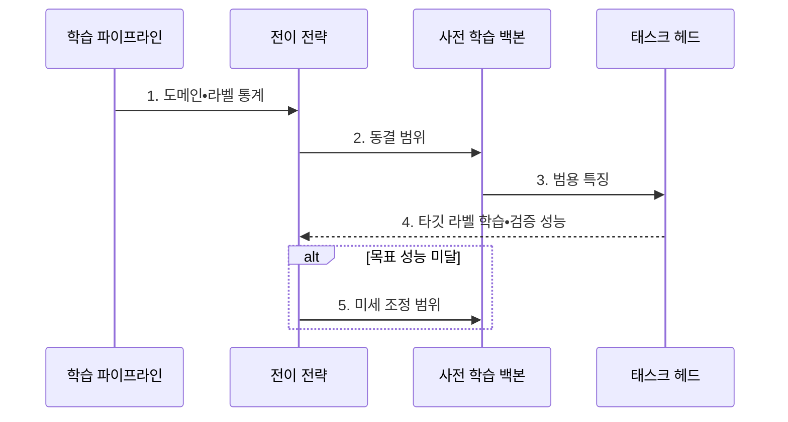

---
sidebar:
  order: 47
  label: "047. 전이 학습 (Transfer Learning)"
  badge:
    text: "기출 • 70%"
    variant: note
title: "전이 학습 (Transfer Learning)"
date: "2026-07-29T00:00:00+09:00"
tags:
  - "notes-basic-theory"
weight: 47
extra:
  question_no: "047"
  source_status: "기출"
  source_history: "123회, 131회"
  priority: 70
  priority_note: "반복 기출, 데이터 부족 대응•미세 조정이 핵심"
---

## 미리 알고가기

- **전이 학습(Transfer Learning)**: 소스 도메인에서 학습한 지식을 타깃 과제에 재사용하는 학습 방법이다
- **핵심 판단**: 소스•타깃 도메인의 유사성과 타깃 라벨 데이터 규모에 따라 재학습 범위를 결정한다
- **소스 도메인(Source Domain)**: 기존 모델의 학습에 사용한 데이터 분포와 과제 영역이다
- **타깃 도메인(Target Domain)**: 기존 모델을 적용할 새로운 데이터 분포와 과제 영역이다
- **사전 학습 모델(Pre-trained Model)**: 대량 데이터에서 범용 특징을 학습하여 타깃 과제에 재사용하는 모델이다
- **라벨 데이터(Labeled Data)**: 입력마다 정답 범주 또는 목표값이 부여된 학습 데이터이다
- **백본•태스크 헤드(Backbone•Task Head)**: 백본은 입력에서 범용 특징을 추출하고, 태스크 헤드는 추출한 특징으로 타깃 과제의 예측값을 출력한다
- **학습 파이프라인(Training Pipeline)**: 모델 구성•학습•검증과 재학습 범위를 순서대로 제어하는 실행 흐름이다
- **동결•동결 해제(Freeze•Unfreeze)**: 동결은 가중치를 고정하는 설정이고, 동결 해제는 해당 가중치를 다시 학습할 수 있도록 전환하는 설정이다
- **학습률(Learning Rate)**: 한 번의 학습 단계에서 가중치를 갱신하는 크기다
- **특징 추출(Feature Extraction)**: 백본을 동결하고 태스크 헤드만 학습하는 전이 학습 방식이다
- **미세 조정(Fine-tuning)**: 백본의 일부 또는 전체를 낮은 학습률로 다시 학습하는 전이 학습 방식이다
- **처음부터 학습(Training from Scratch)**: 사전 학습 가중치 없이 무작위 초기값에서 전체 모델을 학습하는 방식이다
- **부정적 전이(Negative Transfer)**: 전이 학습으로 인해 타깃 과제의 성능이 오히려 저하되는 현상이다
- **과적합(Overfitting)**: 학습 데이터에 지나치게 맞춰져 새로운 데이터의 예측 성능이 저하되는 현상이다
- **검증셋(Validation Set)**: 학습에 직접 쓰지 않고 모델의 일반화 성능과 재학습 범위를 판단하는 데이터다
- **기준 모델(Baseline Model)**: 전이 효과를 비교하기 위해 같은 타깃 데이터로 처음부터 학습한 대조 모델이다

## Ⅰ. 개요

- 정의/개념: 사전 학습한 **범용 특징**을 타깃 과제에 쓰는 기법
- 배경/필요성: **타깃 라벨**이 적을 때 학습 부족•과적합 완화

### 쉽게 이해하기 (학습용)
- 원단부터 새 정장을 만들지 않고 기성 정장을 몸에 맞게 고치듯, 소스 도메인에서 익힌 범용 특징을 가져와 적은 라벨 데이터로 타깃 과제를 학습한다.

## Ⅱ. 특징

- **범용 특징** 재사용으로 적은 **라벨 데이터**의 과적합 완화
- **동결 범위** 조절로 타깃 과제에 맞는 재학습 계층 선택
- **도메인 유사성**이 낮을수록 **부정적 전이** 위험 증가

### 쉽게 이해하기 (학습용)
- 기성 정장은 체형이 비슷하면 조금만 고쳐도 되지만 체형 차이가 크면 전체를 손봐야 하듯, 도메인 유사성과 라벨 데이터 규모에 따라 동결 범위를 달리한다.

## Ⅲ. 구조 및 구성요소

| 구성요소 | 책임 |
|:---|:---|
| 전이 전략 | **도메인 유사성**과 라벨 규모에 따라 재학습 범위 결정 |
| 사전 학습 백본 | 소스 도메인에서 학습한 **범용 특징** 추출 |
| 태스크 헤드 | 범용 특징에서 **타깃 과제 예측값** 출력 |

### 쉽게 이해하기 (학습용)
- 전이 전략이 백본의 동결 범위를 정하고 태스크 헤드가 타깃 과제의 예측을 담당한다.

## Ⅳ. 흐름도

### 동작 원리

- **1. 도메인•라벨 통계**: 유사성과 **라벨 규모** 분석
- **2. 동결 범위**: 계층별 학습 여부와 **학습률** 설정
- **3. 범용 특징**: 백본 표현으로 **태스크 헤드** 학습
- **4. 타깃 라벨 학습•검증 성능**: 태스크 헤드를 학습하고 **기준 모델**과 비교
- **5. 미세 조정 범위**: 목표 미달 시 상위 계층부터 확대

### 쉽게 이해하기 (학습용)
- 백본의 범용 특징을 재사용하고 태스크 헤드를 타깃 과제에 맞게 학습하되, 성능이 부족하면 백본 일부까지 미세 조정한다

## Ⅴ. 종류 및 비교

| 전이 학습 방식 | 특징 추출 | 미세 조정 | 처음부터 학습 |
|:---|:---|:---|:---|
| 적용 기준 | 도메인이 유사하고 **라벨 데이터**가 적은 경우 | 도메인 차이로 **범용 특징** 조정이 필요한 경우 | 도메인 차이가 크고 **라벨 데이터**가 충분한 경우 |
| 핵심 특징 | **백본 동결** 후 태스크 헤드만 학습 | 백본 일부•전체를 낮은 **학습률**로 갱신 | 무작위 초기값에서 **전체 계층** 학습 |
| 한계 | 도메인 차이가 크면 **고정 특징**의 적합성 저하 | **학습률**이 크면 범용 특징 훼손 | 라벨 데이터가 적으면 **과적합**•학습 비용 증가 |

> 요약: **도메인 유사성•라벨 규모**로 범위 선택

### 쉽게 이해하기 (학습용)
- 특징 추출은 백본을 고정하고, 미세 조정은 일부•전체 백본을 낮은 학습률로 갱신하며, 도메인 차이가 크고 데이터가 충분하면 처음부터 학습한다.

## Ⅵ. 실무 고려사항 및 대책

| 고려사항 | 대책 | 효과 |
|:---|:---|:---|
| 낮은 도메인 유사성으로 **부정적 전이** | 처음부터 학습한 **기준 모델**과 검증 성능 비교 | **부정적 전이** 조기 식별 |
| 미세 조정 중 **범용 특징 훼손** | 상위 계층부터 점진적 동결 해제•**낮은 학습률** 적용 | 기존 **표현 보존•타깃 적응** 균형 |
| 적은 라벨로 백본까지 학습해 **과적합** | **특징 추출**부터 시작하고 데이터 확보 후 범위 확대 | 학습•검증 **성능 격차** 완화 |
| 사전 학습 데이터의 **편향 승계** | 타깃 분포별 **편향 평가**와 취약 표본 보강 | 집단별 **오분류 편중** 완화 |

### 쉽게 이해하기 (학습용)
- 기성 정장의 바깥 부분부터 조금씩 풀어 보듯, 기준 모델과 검증 성능을 비교하며 백본의 동결 범위를 상위 계층부터 단계적으로 줄인다.

## Ⅶ. 결론

- **기준 모델 대비 검증 성능**으로 재학습 범위 결정

### 쉽게 이해하기 (학습용)
- 타깃 검증 점수가 오르면 백본을 조금 더 풀고, 기준 모델보다 낮아지면 사전 가중치를 버리고 처음부터 학습한다.
