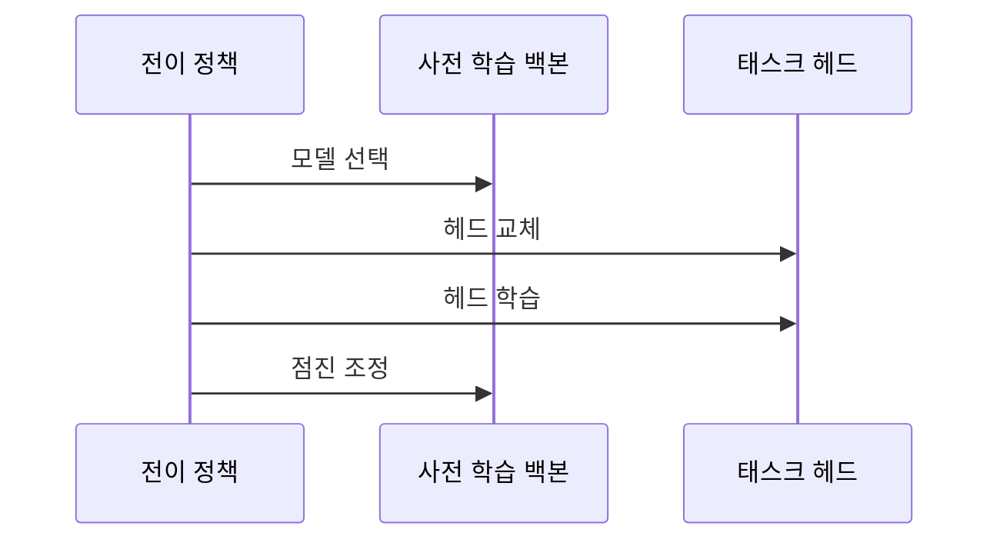

---
sidebar:
  order: 47
  label: "047. 전이 학습 (Transfer Learning)"
  badge:
    text: "기출 · 70%"
    variant: note
title: "전이 학습 (Transfer Learning)"
date: "2026-07-27T23:55:00+09:00"
tags:
  - "notes-basic-theory"
weight: 47
extra:
  question_no: "047"
  source_status: "기출"
  source_history: "123회, 131회"
  priority: 70
  priority_note: "반복 기출, 데이터 부족 대응·미세 조정이 핵심"
---

## 미리 알고가기

- **전이 학습(Transfer Learning)**: 기존 모델이 학습한 지식을 새로운 과제에 재사용하는 학습 방법이다
- **핵심 판단**: 소스·타깃 도메인의 유사성과 타깃 라벨 데이터의 규모를 기준으로 재학습 범위를 결정한다
- **소스 도메인(Source Domain)**: 기존 모델의 학습에 사용한 데이터 분포와 과제 영역이다
- **타깃 도메인(Target Domain)**: 기존 모델을 적용할 새로운 데이터 분포와 과제 영역이다
- **사전 학습 모델(Pre-trained Model)**: 대량 데이터로 학습을 완료하여 재사용할 수 있는 모델이다
- **라벨(Label)**: 학습 데이터에 부여된 정답 범주 또는 목표값이다
- **백본·태스크 헤드(Backbone·Task Head)**: 백본은 입력에서 범용 특징을 추출하고, 태스크 헤드는 추출한 특징으로 타깃 과제의 예측값을 출력한다
- **동결·동결 해제(Freeze·Unfreeze)**: 동결은 가중치를 고정하는 설정이고, 동결 해제는 해당 가중치를 다시 학습할 수 있도록 전환하는 설정이다
- **학습률(Learning Rate)**: 한 번의 학습에서 가중치를 갱신하는 크기다
- **특징 추출(Feature Extraction)**: 백본을 동결하고 태스크 헤드만 학습하는 전이 학습 방식이다
- **미세 조정(Fine-tuning)**: 백본의 일부 또는 전체를 낮은 학습률로 다시 학습하는 전이 학습 방식이다
- **처음부터 학습(Training from Scratch)**: 사전 학습 가중치 없이 무작위 초기값에서 모델 전체를 학습하는 방식이다
- **부정적 전이(Negative Transfer)**: 전이 학습으로 인해 타깃 과제의 성능이 오히려 저하되는 현상이다
- **과적합(Overfitting)**: 학습 데이터에 지나치게 맞춰져 새로운 데이터의 예측 성능이 저하되는 현상이다

## Ⅰ. 개요

- **정의/개념**: **소스 도메인** 지식을 재사용해 **타깃 과제** 학습을 개선하는 기법
- **기존 한계**: **처음부터 학습**은 타깃 **라벨** 확보 비용으로 성능 제약

### 쉽게 이해하기 (학습용)
- 원단부터 끊어 새 정장을 짓는 대신 이미 지어진 정장을 가져다 몸에 맞게 고치듯, 이미 지어진 옷이 소스 도메인의 학습 표현이고 고치는 일이 타깃 과제 학습이어서 타깃 정답 데이터가 적어도 성능을 확보한다

## Ⅱ. 특징

- **사전 학습 표현** 재사용으로 타깃 **라벨** 요구량 감소
- **동결 범위**에 따른 재학습 계층 수 조절
- 소스·타깃 **도메인 유사도**에 좌우되는 **전이 이득**

### 쉽게 이해하기 (학습용)
- 이미 지어진 정장은 원단부터 끊는 것보다 품이 덜 들고 어디까지 뜯을지도 고를 수 있지만, 체형이 다를수록 고칠 곳이 늘어 그 이득이 줄어든다

## Ⅲ. 아키텍처 및 구성요소

| 설계 요소 | 설명 |
|:---|:---|
| 사전 학습 백본 | **소스 도메인**에서 대량 학습한 범용 특징 추출기 |
| 태스크 헤드 | **타깃 업무**의 클래스에 맞춘 출력 계층 |
| 전이 정책 | 백본·헤드의 **동결 범위**와 **학습률** 결정 |

> 요약: **전이 정책**에 따라 백본과 **헤드**의 학습 범위 결정

### 쉽게 이해하기 (학습용)
- 이미 지어진 정장의 몸판은 그대로 두고 깃과 단추만 새로 다는 것처럼, 몸판이 사전 학습 백본이고 새로 단 깃이 태스크 헤드이며 어디까지 뜯을지 정하는 재단사가 전이 정책이다

## Ⅳ. 원리 및 절차 흐름도

| 절차 | 설명 |
|:---|:---|
| 모델 선택 | 타깃 업무와 **도메인 유사도** 높은 모델 채택 |
| 헤드 교체 | 타깃 **클래스 수**·형식에 맞춘 출력층 교체 |
| 헤드 학습 | **백본 동결** 후 태스크 헤드 우선 학습 |
| 점진 조정 | 상위 계층 **동결 해제**와 낮은 **학습률** 적용 |

> 요약: **헤드** 우선 학습 후 **백본** 상위 계층 점진 해제

### 쉽게 이해하기 (학습용)
- 정장을 고칠 때 소매 길이부터 손보고 그래도 안 맞을 때만 어깨선을 조금씩 뜯듯, 태스크 헤드를 먼저 학습한 뒤 백본 상위 계층을 낮은 학습률로 열어야 오래 다듬어 둔 범용 특징이 한꺼번에 흐트러지지 않는다

## Ⅴ. 종류 및 비교

| 전이 학습 방식 | 특징 추출 | 미세 조정 | 처음부터 학습 |
|:---|:---|:---|:---|
| 적용 기준 | 소스·타깃 유사하고 **라벨** 소량 | 라벨 충분·**표현 조정** 필요 | 소스와 격차 크고 **데이터 충분** |
| 핵심 특징 | 백본 동결 후 **태스크 헤드**만 갱신 | 백본 상위·전체까지 **동결 해제** | 무작위 초기값에서 **전체 학습** |
| 한계 | 도메인 격차 시 **고정 표현 부적합** | **학습률** 과대 시 기존 표현 훼손 | 데이터 부족 시 **과적합**·큰 학습 비용 |

> 요약: **도메인 유사도**와 라벨량에 따라 재학습 범위 결정

### 쉽게 이해하기 (학습용)
- 지어진 정장에 깃만 바꿔 다는 것이 특징 추출, 어깨와 품까지 뜯어 몸에 맞추는 것이 미세 조정, 원단부터 새로 끊는 것이 처음부터 학습이며, 손을 많이 댈수록 필요한 시간과 정답 데이터가 함께 늘어난다

## Ⅵ. 실무 사례

1. 장애 티켓 분류는 **백본 동결** 후 태스크 헤드만 학습

### 쉽게 이해하기 (학습용)
- 장애 티켓의 문장은 일반 문서와 크게 다르지 않아 이미 학습된 언어 표현을 그대로 쓰고, 이 티켓을 어느 장애 유형으로 보낼지 고르는 마지막 판단층만 새로 가르치면 정답 몇백 건으로도 분류가 선다

## Ⅶ. 결론

- **처음부터 학습** 대비 성능 검증 후 **전이 범위** 확정

### 쉽게 이해하기 (학습용)
- 고쳐 입은 정장이 새로 맞춘 옷보다 오히려 몸에 안 맞는 상황이 부정적 전이라, 전이한 모델의 성적이 처음부터 학습한 모델보다 낮으면 전이를 접고 원단부터 새로 끊는 쪽으로 돌린다

## 2~4교시 확장

**예상 문항**

> 학습 데이터가 부족한 사내 업무에 딥러닝 모델을 도입하려 한다.
> 전이 학습의 적용 절차와 방식 선택 기준을 설명하고,
> 적용 과정에서 발생하는 문제점과 대책을 논하시오. (25점)

**목차 조립**: `Ⅰ 정의·기존 한계 → Ⅱ 특징 → Ⅳ 절차 → Ⅴ 비교 → 아래 표 → Ⅶ 결론`

| 문제점 | 대책 | 효과 |
|:---|:---|:---|
| 소스·타깃 격차로 **부정적 전이** | **처음부터 학습**과 성능 비교 후 채택 | 전이 여부의 **정량 판단** 근거 확보 |
| 미세 조정 중 **기존 표현** 훼손 | 상위 층부터 **단계적 동결 해제**·낮은 학습률 | 범용 특징 유지한 채 **타깃 적합도** 상승 |
| 소량 **라벨**에 백본까지 열어 **과적합** | **특징 추출** 우선·라벨 확보 후 확대 | 검증 성능과 학습 성능의 **격차 축소** |
| 사전 학습 데이터의 **편향 승계** | 타깃 분포 기준 **재평가**·편향 표본 보강 | 운영 구간에서 **오판정 편중** 완화 |
