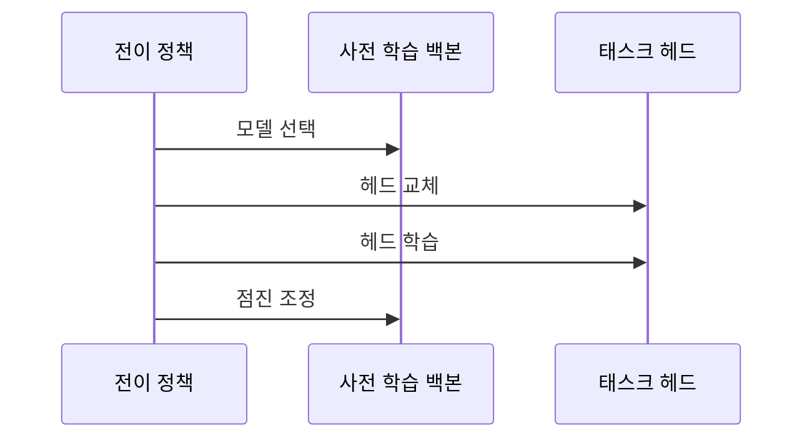

---
sidebar:
  order: 47
  label: "047. 전이 학습 (Transfer Learning)"
  badge:
    text: "기출 · 70%"
    variant: note
title: "전이 학습 (Transfer Learning)"
date: "2026-07-27T23:18:00+09:00"
tags:
  - "notes-basic-theory"
weight: 47
extra:
  question_no: "047"
  source_status: "기출"
  source_history: "123회, 131회"
  priority: 70
  priority_note: "반복 기출, 데이터 부족 대응·미세 조정이 핵심"
---

## 미리 알고가기

- **전이 학습(Transfer Learning)**: 이미 대량 데이터로 훈련을 마친 모델을 가져와 앞부분은 그대로 두고 뒷부분만 새 업무에 맞게 갈아 끼우는 방식으로, 새 업무의 정답 데이터가 적어도 쓸 만한 성능을 얻는 것이 목적이다
- **핵심 판단**: 소스와 타깃이 얼마나 닮았는지와 타깃 정답 데이터가 얼마나 있는지를 재어 기존 모델을 어디까지 다시 학습시킬지 정하는 것이 이 주제의 판단 축이다
- **소스 도메인(Source Domain)**: 사전 학습에 쓴 원래 데이터와 업무 영역으로, 여기서 얻은 표현이 새 업무로 옮겨 갈 밑천이 된다
- **타깃 도메인(Target Domain)**: 지금 풀어야 하는 새 업무와 그 데이터 영역으로, 소스와 얼마나 닮았는지가 전이의 성패를 좌우한다
- **사전 학습 모델(Pre-trained Model)**: 소스 도메인의 대량 데이터로 학습을 이미 끝낸 모델로, 전이 학습은 무작위 초기값이 아니라 이 모델의 가중치에서 출발한다
- **라벨(Label)**: 학습 표본마다 붙여 둔 정답 범주나 목표값으로, 사람이 직접 달아야 해서 타깃 도메인에서는 확보량이 모자란 경우가 많다
- **백본·태스크 헤드(Backbone·Task Head)**: 백본은 가장자리나 질감처럼 업무를 가리지 않는 범용 특징을 뽑아내는 본체이고, 태스크 헤드는 그 특징을 받아 이번 업무의 범주로 답을 내는 마지막 출력층이다
- **동결·동결 해제(Freeze·Unfreeze)**: 동결은 해당 계층의 가중치를 학습 중에 바뀌지 않도록 잠그는 설정이고, 동결 해제는 그 잠금을 풀어 다시 학습되게 하는 설정이다
- **학습률(Learning Rate)**: 한 번의 갱신에서 가중치를 얼마나 크게 움직일지 정하는 값으로, 미세 조정에서는 오래 다듬어 둔 기존 표현이 한꺼번에 무너지지 않도록 평소보다 작게 잡는다
- **특징 추출(Feature Extraction)**: 백본 전체를 동결한 채 새로 붙인 태스크 헤드만 학습시키는 전이 방식
- **미세 조정(Fine-tuning)**: 백본의 상위 계층이나 전체까지 동결을 풀고 낮은 학습률로 함께 갱신하는 전이 방식
- **처음부터 학습(Training from Scratch)**: 사전 학습 가중치를 쓰지 않고 무작위 초기값에서 전체를 새로 학습하는 방식으로, 전이가 이득인지 판단할 때의 비교 대상이 된다
- **부정적 전이(Negative Transfer)**: 소스에서 물려받은 표현이 타깃 업무와 맞지 않아 오히려 처음부터 학습한 모델보다 성능이 낮아지는 실패
- **과적합(Overfitting)**: 학습 데이터의 세부까지 외워 버려 처음 보는 데이터에서는 성능이 떨어지는 현상

## Ⅰ. 개요

- 정의/개념: **사전 학습 표현**을 타깃 학습에 재사용하는 기법
- 기존 한계: 타깃 **레이블 확보 비용**으로 처음부터 학습 제약

### 쉽게 이해하기 (학습용)
- 자전거를 오래 탄 사람이 오토바이 안장에 앉으면 균형 감각은 그대로 쓰고 손잡이 조작만 새로 익히듯, 이미 몸에 밴 균형 감각이 사전 학습 표현이고 새로 익히는 조작이 타깃 학습이어서 새 업무의 정답 데이터가 적어도 금세 쓸 만해진다

## Ⅱ. 특징

- **사전 학습 특징** 재사용을 통한 데이터·학습 비용 절감
- **동결 범위** 조절에 따른 재학습 범위 선택
- 소스·타깃 **도메인 유사도**가 전이 이득의 방향 결정

### 쉽게 이해하기 (학습용)
- 자전거를 타던 사람이 오토바이는 금방 배우지만 조종간 방향이 반대인 기체 앞에서는 몸에 밴 반사가 오히려 손을 엉뚱하게 움직이게 하듯, 소스와 타깃이 닮았는지에 따라 물려받은 표현이 밑천이 되기도 하고 걸림돌이 되기도 해서 잠금을 어디까지 풀지가 갈린다

## Ⅲ. 아키텍처 및 구성요소

| 설계 요소 | 설명 |
|:---|:---|
| 사전 학습 백본 | **소스 도메인**에서 대량 학습한 범용 특징 추출기 |
| 태스크 헤드 | **타깃 업무**의 클래스에 맞춘 출력 계층 |
| 전이 정책 | 백본·헤드의 **동결 범위**와 **학습률** 결정 |

> 요약: **전이 정책**에 따라 백본과 **헤드**의 학습 범위 결정

### 쉽게 이해하기 (학습용)
- 이미 완성된 조립 라인 본체는 그대로 두고 마지막 포장 기계만 새 제품용으로 갈아 끼우는 공장 장면인데, 조립 라인 본체가 백본이고 갈아 끼운 포장 기계가 태스크 헤드이며 어느 공정까지 손댈지 지시서를 내는 관리자가 전이 정책이다

## Ⅳ. 원리 및 절차 흐름도

| 절차 | 설명 |
|:---|:---|
| 모델 선택 | 타깃 업무와 **도메인 유사도** 높은 모델 채택 |
| 헤드 교체 | 타깃 **클래스 수**·형식에 맞춘 출력층 교체 |
| 헤드 학습 | **백본 동결** 후 태스크 헤드 우선 학습 |
| 점진 조정 | 상위 계층 **동결 해제**와 낮은 **학습률** 적용 |

> 요약: **헤드** 우선 학습 후 **백본** 상위 계층 점진 해제

### 쉽게 이해하기 (학습용)
- 기성복을 고칠 때 소매 길이부터 손보고 그래도 안 맞을 때만 어깨선을 조금씩 뜯듯, 태스크 헤드만 먼저 학습해 큰 오차를 걷어낸 뒤 백본 상위 계층을 낮은 학습률로 열어야 오래 다듬어 둔 범용 특징이 한꺼번에 흐트러지지 않는다

## Ⅴ. 종류 및 비교

| 전이 학습 방식 | 특징 추출 | 미세 조정 | 처음부터 학습 |
|:---|:---|:---|:---|
| 적용 기준 | 소스·타깃 유사하고 **라벨** 소량 | 라벨 충분·**표현 조정** 필요 | 소스와 격차 크고 **데이터 충분** |
| 핵심 특징 | 백본 동결 후 **태스크 헤드**만 갱신 | 백본 상위·전체까지 **동결 해제** | 무작위 초기값에서 **전체 학습** |
| 한계 | 도메인 격차 시 **고정 표현 부적합** | **학습률** 과대 시 기존 표현 훼손 | 데이터 부족 시 **과적합**·큰 학습 비용 |

> 요약: **도메인 유사도**와 라벨량에 따라 재학습 범위 결정

### 쉽게 이해하기 (학습용)
- 남이 입던 정장을 그대로 걸치고 넥타이만 바꾸는 것이 특징 추출이고 어깨와 품까지 뜯어 몸에 맞추는 것이 미세 조정이며 체형이 아예 달라 원단부터 새로 끊는 것이 처음부터 학습인데, 손을 많이 댈수록 필요한 시간과 정답 데이터가 함께 늘어난다

## Ⅵ. 실무 사례

1. 장애 티켓 분류는 **백본 동결** 후 태스크 헤드만 학습
2. 사내 문서 분류는 용어 격차로 상위 층 **동결 해제**

### 쉽게 이해하기 (학습용)
- 장애 티켓의 문장은 일반 문서와 크게 다르지 않아 이미 학습된 언어 표현을 그대로 쓰고, 이 티켓을 어느 장애 유형으로 보낼지 고르는 마지막 판단층만 새로 가르치면 정답 몇백 건으로도 분류가 선다
- 사내 문서에는 제품 코드나 내부 약어처럼 공개 데이터에 없던 말이 많아 마지막 판단층만으로는 뜻을 잡지 못하므로, 백본 상위 몇 층의 잠금을 풀어 그 낯선 어휘의 표현 자체를 다시 배우게 한다

## Ⅶ. 결론

- 처음부터 학습 대비 **전이 이득** 없으면 전이 중단

### 쉽게 이해하기 (학습용)
- 남의 정장을 고쳐 입었는데 새로 맞춘 옷보다 오히려 몸에 안 맞는 상황이 부정적 전이라, 전이한 모델의 성적이 처음부터 학습한 모델보다 낮게 나오면 그 자리에서 전이를 접고 원단부터 새로 끊는 쪽으로 돌린다

## 2~4교시 확장

**예상 문항**

> 학습 데이터가 부족한 사내 업무에 딥러닝 모델을 도입하려 한다.
> 전이 학습의 적용 절차와 방식 선택 기준을 설명하고,
> 적용 과정에서 발생하는 문제점과 대책을 논하시오. (25점)

**목차 조립**: `Ⅰ 정의·기존 한계 → Ⅱ 특징 → Ⅳ 절차 → Ⅴ 비교 → 아래 표 → Ⅶ 결론`

| 문제점 | 대책 | 효과 |
|:---|:---|:---|
| 소스·타깃 격차로 **부정적 전이** | **처음부터 학습**과 성능 비교 후 채택 | 전이 여부의 **정량 판단** 근거 확보 |
| 미세 조정 중 **기존 표현** 훼손 | 상위 층부터 **단계적 동결 해제**·낮은 학습률 | 범용 특징 유지한 채 **타깃 적합도** 상승 |
| 소량 **라벨**에 백본까지 열어 **과적합** | **특징 추출** 우선·라벨 확보 후 확대 | 검증 성능과 학습 성능의 **격차 축소** |
| 사전 학습 데이터의 **편향 승계** | 타깃 분포 기준 **재평가**·편향 표본 보강 | 운영 구간에서 **오판정 편중** 완화 |
