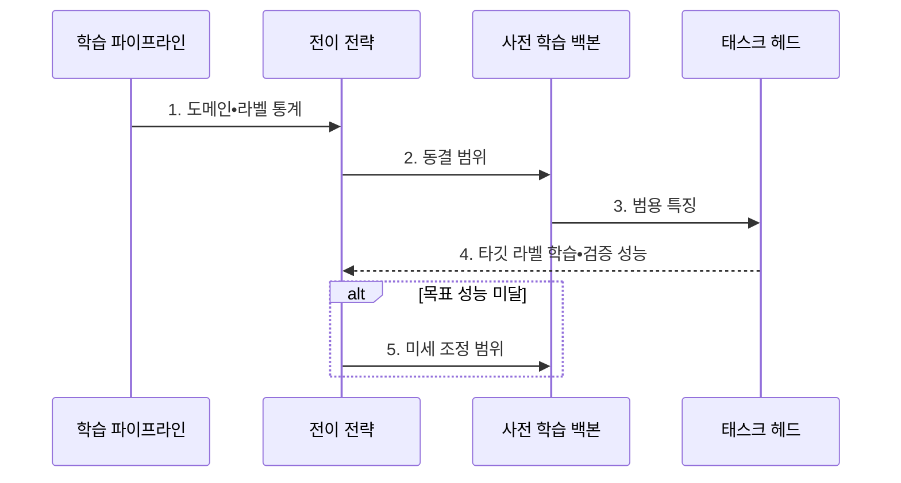

---
sidebar:
  order: 47
  label: "047. 전이 학습 (Transfer Learning)"
  badge:
    text: "기출 • 70%"
    variant: note
title: "전이 학습 (Transfer Learning)"
date: "2026-08-02T10:15:00+09:00"
tags:
  - "notes-basic-theory"
weight: 47
extra:
  question_no: "047"
  source_status: "기출"
  source_history: "123회, 131회"
  priority: 70
  priority_note: "반복 기출, 데이터 부족 대응•미세 조정이 핵심"
---

## Ⅰ. 개요

핵심 용어

- **전이 학습**: 소스 도메인에서 학습한 지식을 타깃 과제에 재사용하는 학습 방법
- **사전 학습 모델**: 대량 데이터에서 범용 특징을 미리 학습한 모델
- **소스•타깃 도메인**: 지식을 먼저 학습한 데이터 영역과 그 지식을 적용할 목표 데이터•과제 영역
- **타깃 라벨**: 전이 학습의 목표 과제에서 각 표본에 부여한 정답값
- **범용 특징**: 여러 과제에 공통으로 재사용할 수 있는 저수준•중간 수준 표현

- 정의/개념: 소스 도메인에서 사전 학습한 **지식•범용 특징** 을 타깃 과제에 재사용하는 학습 기법
- 배경/필요성: **타깃 라벨** 부족으로 처음부터 학습 시 과적합

#### 한줄 요약
- 원단부터 새 정장을 만들지 않고 기성 정장을 몸에 맞게 고치듯, 소스 도메인에서 익힌 범용 특징을 가져와 적은 라벨 데이터로 타깃 과제를 학습한다.

## Ⅱ. 특징

핵심 용어

- **동결 범위**: 사전 학습 가중치 중 학습하지 않고 고정할 계층의 범위
- **도메인 유사성**: 소스 데이터와 타깃 데이터의 분포·과제가 닮은 정도
- **부정적 전이**: 전이 학습으로 타깃 과제 성능이 오히려 낮아지는 현상
- **범용 특징**: 사전 학습 모델이 여러 과제에 재사용할 수 있도록 익힌 표현
- **라벨 데이터**: 입력 표본과 정답값을 함께 가진 학습 데이터

- **범용 특징** 재사용으로 적은 **라벨 데이터** 의 과적합 완화
- **동결 범위** 조절로 타깃 과제에 맞는 재학습 계층 선택
- **도메인 유사성** 이 낮을수록 **부정적 전이** 위험 증가

#### 한줄 요약
- 기성 정장은 체형이 비슷하면 조금만 고쳐도 되지만 체형 차이가 크면 전체를 손봐야 하듯, 도메인 유사성과 라벨 데이터 규모에 따라 동결 범위를 달리한다.

## Ⅲ. 구조 및 구성요소

핵심 용어

- **백본**: 입력에서 여러 과제에 재사용할 수 있는 범용 특징을 추출하는 모델 부분
- **태스크 헤드**: 추출한 특징을 타깃 과제의 예측값으로 바꾸는 출력 부분
- **전이 전략**: 도메인 유사성과 라벨 규모에 따라 재학습 범위를 정하는 기준
- **라벨 규모**: 타깃 과제에서 사용할 수 있는 정답 표본의 수

| 구성요소 | 책임 |
|:---|:---|
| 전이 전략 | **도메인 유사성** 과 라벨 규모에 따라 재학습 범위 결정 |
| 사전 학습 백본 | 소스 도메인에서 학습한 **범용 특징** 추출 |
| 태스크 헤드 | 범용 특징에서 **타깃 과제 예측값** 출력 |

#### 한줄 요약
- 재단사가 전이 전략표로 기성 정장의 백본을 얼마나 고정할지 정하고, 태스크 헤드를 새 업무용 소매처럼 붙인다.

## Ⅳ. 흐름도

핵심 용어

- **학습률**: 한 학습 단계에서 가중치를 갱신하는 크기
- **기준 모델**: 전이 효과를 비교하려고 같은 타깃 데이터로 처음부터 학습한 대조 모델
- **미세 조정**: 백본 일부나 전체를 낮은 학습률로 다시 학습하는 방식
- **도메인•라벨 통계**: 소스와 타깃 분포의 유사성 및 타깃 정답 표본 수를 요약한 정보
- **동결 범위**: 사전 학습 가중치 중 갱신하지 않고 고정할 계층의 범위

### 동작 원리

- **1. 도메인•라벨 통계**: 유사성과 **라벨 규모** 분석
- **2. 동결 범위**: 계층별 학습 여부와 **학습률** 설정
- **3. 범용 특징**: 백본 표현으로 **태스크 헤드** 학습
- **4. 타깃 라벨 학습•검증 성능**: 태스크 헤드를 학습하고 **기준 모델** 과 비교
- **5. 미세 조정 범위**: 목표 미달 시 상위 계층부터 확대

#### 한줄 요약
- 먼저 기성 정장의 몸통을 잠그고 새 소매만 맞춘 뒤, 검증 거울에서 어긋나면 몸통의 위쪽 단추부터 푼다.

## Ⅴ. 종류 및 비교

핵심 용어

- **특징 추출**: 백본을 동결하고 태스크 헤드만 학습하는 방식
- **처음부터 학습**: 사전 학습 가중치 없이 무작위 초기값에서 전체 모델을 학습하는 방식
- **과적합**: 학습 데이터에 지나치게 맞아 새 데이터의 예측 성능이 낮아지는 현상
- **미세 조정(Fine-tuning)**: 사전 학습 백본 일부나 전체를 낮은 학습률로 다시 학습하는 방식
- **백본(Backbone)**: 입력에서 범용 특징을 추출하는 사전 학습 모델 부분

| 전이 학습 방식 | 특징 추출 | 미세 조정 | 처음부터 학습 |
|:---|:---|:---|:---|
| 적용 기준 | 도메인이 유사하고 **라벨 데이터** 가 적은 경우 | 도메인 차이로 **범용 특징** 조정이 필요한 경우 | 도메인 차이가 크고 **라벨 데이터** 가 충분한 경우 |
| 핵심 특징 | **백본 동결** 후 태스크 헤드만 학습 | 백본 일부•전체를 낮은 **학습률** 로 갱신 | 무작위 초기값에서 **전체 계층** 학습 |
| 한계 | 도메인 차이가 크면 **고정 특징** 의 적합성 저하 | **학습률** 이 크면 범용 특징 훼손 | 라벨 데이터가 적으면 **과적합**•학습 비용 증가 |

> 요약: **도메인 유사성•라벨 규모** 로 범위 선택

#### 한줄 요약
- 체형이 비슷하고 치수가 적으면 소매만 바꾸고, 차이가 커지면 몸통을 풀며, 원단과 치수가 충분하면 새 정장을 만든다.

## Ⅵ. 실무 고려사항 및 대책

핵심 용어

- **점진적 동결 해제**: 출력에 가까운 계층부터 순서대로 가중치를 다시 학습 가능하게 만드는 방법
- **편향 승계**: 사전 학습 데이터의 불균형이나 고정관념이 타깃 모델에도 이어지는 현상
- **검증 성능**: 학습에 직접 쓰지 않은 데이터에서 측정한 일반화 성능

| 문제 | 대책 | 효과 |
|:---|:---|:---|
| 낮은 도메인 유사성으로 **부정적 전이** | 처음부터 학습한 **기준 모델** 과 검증 성능 비교 | **부정적 전이** 조기 식별 |
| 미세 조정 중 **범용 특징 훼손** | 상위 계층부터 점진적 동결 해제•**낮은 학습률** 적용 | 기존 **표현 보존•타깃 적응** 균형 |
| 적은 라벨로 백본까지 학습해 **과적합** | **특징 추출**부터 시작하고 데이터 확보 후 범위 확대 | 학습•검증 **성능 격차** 완화 |
| 사전 학습 데이터의 **편향 승계** | 타깃 분포별 **편향 평가** 와 취약 표본 보강 | 집단별 **오분류 편중** 완화 |

#### 한줄 요약
- 기성 정장의 바깥 부분부터 조금씩 풀어 보듯, 기준 모델과 검증 성능을 비교하며 백본의 동결 범위를 상위 계층부터 단계적으로 줄인다.

## Ⅶ. 결론

핵심 용어

- **검증 향상**: 전이 학습 후 검증셋 지표가 기준 모델보다 좋아진 상태
- **기준 미달**: 전이 모델의 성능이 사전에 정한 목표나 기준 모델보다 낮은 상태
- **미세 조정•처음부터 학습**: 사전 가중치를 타깃 데이터로 다시 조정하는 방식과 무작위 초기값에서 전체 모델을 학습하는 방식

- 검증 향상 시 **미세 조정**, 기준 미달 시 **처음부터 학습**

#### 한줄 요약
- 타깃 검증 점수가 오르면 백본을 조금 더 풀고, 기준 모델보다 낮아지면 사전 가중치를 버리고 처음부터 학습한다.
