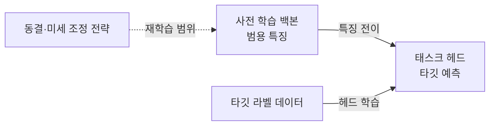

---
sidebar:
  order: 47
  label: "047. 전이 학습 (Transfer Learning)"
  badge:
    text: "기출 · 70%"
    variant: note
title: "전이 학습 (Transfer Learning)"
date: "2026-07-27T23:55:00+09:00"
tags:
  - "notes-basic-theory"
weight: 47
extra:
  question_no: "047"
  source_status: "기출"
  source_history: "123회, 131회"
  priority: 70
  priority_note: "반복 기출, 데이터 부족 대응·미세 조정이 핵심"
---

## 미리 알고가기

- **전이 학습(Transfer Learning)**: 소스 도메인에서 학습한 지식을 타깃 과제에 재사용하는 학습 방법이다
- **핵심 판단**: 소스·타깃 도메인의 유사성과 타깃 라벨 데이터 규모에 따라 재학습 범위를 결정한다
- **소스 도메인(Source Domain)**: 기존 모델의 학습에 사용한 데이터 분포와 과제 영역이다
- **타깃 도메인(Target Domain)**: 기존 모델을 적용할 새로운 데이터 분포와 과제 영역이다
- **사전 학습 모델(Pre-trained Model)**: 대량 데이터에서 범용 특징을 학습하여 타깃 과제에 재사용하는 모델이다
- **라벨 데이터(Labeled Data)**: 입력마다 정답 범주 또는 목표값이 부여된 학습 데이터이다
- **백본·태스크 헤드(Backbone·Task Head)**: 백본은 입력에서 범용 특징을 추출하고, 태스크 헤드는 추출한 특징으로 타깃 과제의 예측값을 출력한다
- **학습 파이프라인(Training Pipeline)**: 모델 구성·학습·검증과 재학습 범위를 순서대로 제어하는 실행 흐름이다
- **동결·동결 해제(Freeze·Unfreeze)**: 동결은 가중치를 고정하는 설정이고, 동결 해제는 해당 가중치를 다시 학습할 수 있도록 전환하는 설정이다
- **학습률(Learning Rate)**: 한 번의 학습 단계에서 가중치를 갱신하는 크기다
- **특징 추출(Feature Extraction)**: 백본을 동결하고 태스크 헤드만 학습하는 전이 학습 방식이다
- **미세 조정(Fine-tuning)**: 백본의 일부 또는 전체를 낮은 학습률로 다시 학습하는 전이 학습 방식이다
- **처음부터 학습(Training from Scratch)**: 사전 학습 가중치 없이 무작위 초기값에서 전체 모델을 학습하는 방식이다
- **부정적 전이(Negative Transfer)**: 전이 학습으로 인해 타깃 과제의 성능이 오히려 저하되는 현상이다
- **과적합(Overfitting)**: 학습 데이터에 지나치게 맞춰져 새로운 데이터의 예측 성능이 저하되는 현상이다

## Ⅰ. 개요

- 정의/개념: **사전 학습 모델**의 **범용 특징**을 타깃 과제에 재사용하는 기법
- 기존 한계: **처음부터 학습**은 적은 **라벨 데이터**에서 과적합 위험 증가

### 쉽게 이해하기 (학습용)
- 원단부터 새 정장을 만들지 않고 기성 정장을 몸에 맞게 고치듯, 소스 도메인에서 익힌 범용 특징을 가져와 적은 라벨 데이터로 타깃 과제를 학습한다

## Ⅱ. 특징

- **범용 특징** 재사용으로 적은 **라벨 데이터**의 과적합 완화
- **동결 범위** 조절로 타깃 과제에 맞는 재학습 계층 선택
- **도메인 유사성**이 낮을수록 **부정적 전이** 위험 증가

### 쉽게 이해하기 (학습용)
- 기성 정장은 체형이 비슷하면 조금만 고쳐도 되지만 체형 차이가 크면 전체를 손봐야 하듯, 도메인 유사성과 라벨 데이터 규모에 따라 동결 범위를 달리한다

## Ⅲ. 아키텍처 및 구성요소

| 설계 요소 | 설명 |
|:---|:---|
| 사전 학습 백본 | **소스 도메인**에서 학습한 범용 특징 추출 |
| 태스크 헤드 | **타깃 과제**에 맞는 예측값 출력 |
| 전이 전략 | **도메인 유사성**과 라벨 데이터 규모에 따라 동결·미세 조정 범위 결정 |

> 요약: 사전 학습 백본의 **범용 특징**을 타깃 과제로 전이하고 필요한 계층만 재학습

### 쉽게 이해하기 (학습용)
- 백본의 범용 특징을 재사용하고 태스크 헤드를 타깃 과제에 맞게 학습하되, 성능이 부족하면 백본 일부까지 미세 조정한다

## Ⅳ. 원리 및 절차 흐름도

| 절차 | 설명 |
|:---|:---|
| 전이 적합성 판단 | **도메인 유사성**·타깃 **라벨 데이터** 규모 평가 |
| 동결 범위 설정 | 특징 재사용 가능성에 따라 **백본 동결** 범위 결정 |
| 태스크 헤드 학습 | 타깃 **예측 형식**에 맞게 출력 계층을 구성하고 고정된 범용 특징으로 우선 학습 |
| 일반화 성능 검증 | 타깃 검증 데이터로 **일반화 성능** 평가 |
| 점진 미세 조정 | 상위 계층부터 **동결 해제**·낮은 **학습률** 적용 |

> 요약: 전이 적합성과 동결 범위를 먼저 판단하고, 검증 결과에 따라 **백본**을 점진적으로 미세 조정

### 쉽게 이해하기 (학습용)
- 소스·타깃 도메인의 유사성을 기준으로 재사용할 특징과 다시 학습할 계층을 정하고, 성능이 부족할 때만 동결 범위를 단계적으로 줄인다

## Ⅴ. 종류 및 비교

| 전이 학습 방식 | 특징 추출 | 미세 조정 | 처음부터 학습 |
|:---|:---|:---|:---|
| 적용 기준 | 도메인이 유사하고 **라벨 데이터**가 적은 경우 | 도메인 차이로 **범용 특징** 조정이 필요한 경우 | 도메인 차이가 크고 **라벨 데이터**가 충분한 경우 |
| 핵심 특징 | **백본 동결** 후 태스크 헤드만 학습 | 백본 일부·전체를 낮은 **학습률**로 갱신 | 무작위 초기값에서 **전체 계층** 학습 |
| 한계 | 도메인 차이가 크면 **고정 특징**의 적합성 저하 | **학습률**이 크면 범용 특징 훼손 | 라벨 데이터가 적으면 **과적합**·학습 비용 증가 |

> 요약: **도메인 유사성**과 **라벨 데이터** 규모에 따라 재학습 범위 선택

### 쉽게 이해하기 (학습용)
- 기성 정장의 깃만 바꾸는 방식이 특징 추출, 몸판까지 고치는 방식이 미세 조정, 원단부터 새로 만드는 방식이 처음부터 학습이며, 체형 차이와 옷감 여유에 맞춰 수선 범위를 고른다

## Ⅵ. 실무 사례

1. 장애 티켓 분류에서 **언어 백본**을 동결하고 **태스크 헤드**만 학습

### 쉽게 이해하기 (학습용)
- 장애 티켓이 일반 문서와 언어 특성이 비슷하면 사전 학습 백본은 그대로 두고, 티켓을 장애 유형으로 나누는 태스크 헤드만 적은 라벨 데이터로 학습한다

## Ⅶ. 결론

- **부정적 전이**를 줄이도록 검증 성능에 따라 **전이 범위** 선택

### 쉽게 이해하기 (학습용)
- 고친 기성 정장이 새 정장보다 맞지 않으면 수선 범위를 다시 정하듯, 전이 모델의 검증 성능이 낮으면 동결 범위를 조정하거나 처음부터 학습한다

## 2~4교시 확장

**예상 문항**

> 학습 데이터가 부족한 사내 업무에 딥러닝 모델을 도입하려 한다.
> 전이 학습의 적용 절차와 방식 선택 기준을 설명하고,
> 적용 과정에서 발생하는 문제점과 대책을 논하시오. (25점)

**목차 조립**: `Ⅰ 정의·기존 한계 → Ⅱ 특징 → Ⅳ 절차 → Ⅴ 비교 → 아래 표 → Ⅶ 결론`

| 문제점 | 대책 | 효과 |
|:---|:---|:---|
| 낮은 도메인 유사성으로 **부정적 전이** | **처음부터 학습**한 모델과 검증 성능 비교 | **전이 적용 여부**의 객관적 판단 |
| 미세 조정 중 **범용 특징** 훼손 | 상위 계층부터 **점진적 동결 해제**·낮은 학습률 | 범용 특징을 보존한 **타깃 적합성** 향상 |
| 적은 **라벨 데이터**로 백본까지 학습해 과적합 | **특징 추출**부터 시작하고 데이터 확보 후 확대 | 학습·검증 성능의 **격차 완화** |
| 사전 학습 데이터의 **편향 승계** | 타깃 분포에서 **편향 평가**·취약 표본 보강 | 특정 집단의 **오분류 편중** 완화 |
