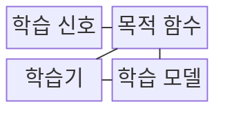
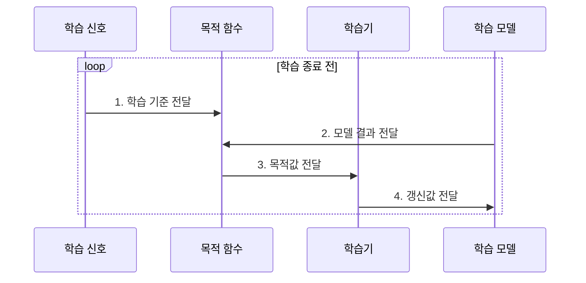

---
sidebar:
  order: 48
  label: "048. 지도 학습•비지도 학습•강화 학습 (Learning Paradigms)"
  badge:
    text: "기출 • 50%"
    variant: note
title: "지도 학습•비지도 학습•강화 학습 (Learning Paradigms)"
date: "2026-07-30T18:21:35+09:00"
tags:
  - "notes-basic-theory"
weight: 48
extra:
  question_no: "048"
  source_status: "기출"
  source_history: "120회"
  priority: 50
  priority_note: "학습 신호 기반 상위 분류와 선택 기준"
---

## 미리 알고가기

- **학습 패러다임(Learning Paradigm)**: 정답 라벨•데이터 자체•환경 보상 중 무엇을 학습 기준으로 삼는지에 따른 학습 방식의 분류
- **학습 신호(Learning Signal)**: 모델 갱신 기준이 되는 정답 라벨•데이터 자체의 관계•환경 보상
- **지도 학습(Supervised Learning)**: 입력과 정답 라벨의 대응 관계를 학습해 새 입력의 결과를 예측하는 방식
- **비지도 학습(Unsupervised Learning)**: 정답 라벨 없이 데이터 안의 군집이나 표현 같은 잠재 구조를 스스로 찾는 방식
- **강화 학습(Reinforcement Learning)**: 환경에 행동을 해 보고 돌아오는 보상을 근거로 누적 보상이 커지는 행동 정책을 학습하는 방식
- **라벨(Label)**: 입력마다 부여한 정답 범주•목표값
- **잠재 구조(Latent Structure)**: 데이터의 군집•분포•표현에 내재한 규칙
- **보상(Reward)**: 환경에서 한 행동의 결과를 평가하는 강화 학습 신호
- **정책(Policy, $\pi$)**: $\pi$는 ‘파이’로 읽으며, 상태별 행동 선택 규칙을 나타내는 강화 학습의 통용 기호이다
- **기대 누적 보상(Expected Cumulative Reward)**: 현재부터 미래까지 받을 보상의 합을 확률적으로 평균한 강화 학습의 목표값이다
- **목적 함수(Objective Function)**: 학습 신호를 모델 갱신용 손실이나 보상값으로 바꾸는 함수
- **학습기(Learner)**: 목적값에 따라 가중치•정책을 갱신하는 주체
- **목표 우회(Reward Hacking)**: 보상 설계의 빈틈을 파고들어 의도한 목표는 달성하지 않으면서 점수만 높게 받는 행동으로, 강화 학습의 대표 실패다
- **라벨 편향(Label Bias)**: 라벨을 부여한 기준이나 표본 구성의 치우침이 정답 데이터에 반영된 상태이다
- **내부 평가 지표(Internal Evaluation Metric)**: 정답 라벨 없이 군집 응집도•분리도처럼 데이터 자체의 구조로 학습 결과를 평가하는 수치다

## Ⅰ. 개요

- 정의/개념: **학습 신호와 환경 상호작용**에 따른 학습 방식 분류
- 배경/필요성: **학습 신호**에 맞는 목적 함수와 갱신 방식 선택

### 쉽게 이해하기 (학습용)
- 정답지를 보고 답을 맞히는 지도 학습, 카드의 모양만으로 묶는 비지도 학습, 행동 뒤 받은 점수로 다음 선택을 바꾸는 강화 학습처럼 제공되는 신호가 학습 목표와 절차를 결정한다.

## Ⅱ. 특징

- **라벨•데이터 자체•보상**에 따라 목적 함수와 **갱신 방식** 분화

### 쉽게 이해하기 (학습용)
- 같은 로그도 정답표를 주면 예측하고, 기록만 주면 구조를 찾고, 조치 점수를 주면 행동을 바꾼다.

## Ⅲ. 구조 및 구성요소

| 구성요소 | 책임 |
|:---|:---|
| 학습 신호 | 라벨•데이터•보상으로 **학습 기준** 제공 |
| 목적 함수 | 학습 신호와 모델 결과로 **목적값** 계산 |
| 학습기 | 갱신 기준에 따라 **모델 파라미터** 조정 |
| 학습 모델 | 예측•표현•행동 **정책** 산출 |

### 쉽게 이해하기 (학습용)
- 정답표•채점표•선생님•학생처럼 학습 신호•목적 함수•학습기•모델이 기준•평가•조정•산출 책임을 나눠 맡는다.

## Ⅳ. 흐름도

### 동작 원리

- **1. 학습 기준 전달**: 라벨•관계•보상으로 목표 규정
- **2. 모델 결과 전달**: 예측•표현•행동 전달
- **3. 목적값 전달**: 오차•관계•보상 기반 조정값 산출
- **4. 갱신값 전달**: 파라미터•정책 조정

### 쉽게 이해하기 (학습용)
- 목적 함수가 정답표•숨은 규칙•행동 점수와 모델 결과를 비교해 학습기의 갱신 방향을 정한다.

## Ⅴ. 종류 및 비교

| 학습 패러다임 | 지도 학습 | 비지도 학습 | 강화 학습 |
|:---|:---|:---|:---|
| 적용 기준 | 입력마다 **정답 라벨**을 확보한 경우 | 라벨 없이 **잠재 구조**를 찾는 경우 | 행동 결과를 **보상**으로 관측하는 경우 |
| 핵심 특징 | 정답 라벨과 **예측 오차**로 모델 갱신 | 데이터 분포와 **잠재 구조** 탐색 | **기대 누적 보상**으로 **행동 정책** 갱신 |
| 한계 | **라벨 편향**과 잡음의 모델 전파 | 정답 부재로 **학습 품질 검증** 어려움 | 보상 오설계에 따른 **목표 우회** |

> 요약: **라벨•데이터•보상**에 따른 방식 선택

### 쉽게 이해하기 (학습용)
- 지도 학습은 라벨 품질, 비지도 학습은 결과 검증, 강화 학습은 보상 설계와 안전한 탐색이 핵심 한계다.

## Ⅵ. 실무 고려사항 및 대책

| 고려사항 | 대책 | 효과 |
|:---|:---|:---|
| 지도 학습의 **집단별 오분류 편중** | 라벨 기준 감사•**집단별 지표**와 표본 보강 | **라벨 편향 전파** 완화 |
| 비지도 **군집•표현**의 업무 의미 불명확 | 내부 지표와 **전문가 표본 검토** 병행 | 군집•표현의 **업무 타당성** 확보 |
| 강화 학습의 **목표 우회** | 보상 함수 검증•제약 조건•**행동 감사** 적용 | 의도한 목표와 **정책 행동 정렬** |

### 쉽게 이해하기 (학습용)
- 지도 학습은 라벨 편향, 비지도 학습은 구조 타당성, 강화 학습은 보상 목표와 행동 안전성을 각각 검증한다.

## Ⅶ. 결론

- **보상**은 강화, **라벨**은 지도, 없으면 비지도

### 쉽게 이해하기 (학습용)
- 정답 라벨이 있으면 지도 학습, 환경과 행동 결과의 보상이 있으면 강화 학습, 두 신호가 없으면 데이터 구조를 찾는 비지도 학습을 선택한다
