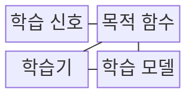
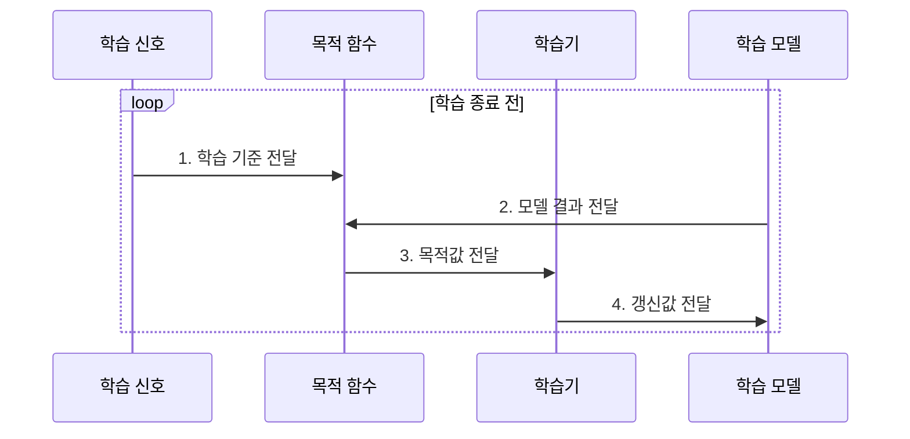

---
sidebar:
  order: 48
  label: "048. 지도 학습•비지도 학습•강화 학습 (Learning Paradigms)"
  badge:
    text: "기출 • 50%"
    variant: note
title: "지도 학습•비지도 학습•강화 학습 (Learning Paradigms)"
date: "2026-08-02T10:16:00+09:00"
tags:
  - "notes-basic-theory"
weight: 48
extra:
  question_no: "048"
  source_status: "기출"
  source_history: "120회"
  priority: 50
  priority_note: "학습 신호 기반 상위 분류와 선택 기준"
---

## Ⅰ. 개요

핵심 용어

- **학습 패러다임**: 정답 라벨·데이터 자체·환경 보상 중 무엇을 학습 기준으로 삼는지에 따른 방식 분류
- **학습 신호**: 모델 갱신의 기준이 되는 라벨, 데이터 관계 또는 환경 보상

- 정의/개념: **학습 신호와 환경 상호작용**에 따른 학습 방식 분류
- 배경/필요성: **라벨•보상 유무**에 따른 목적 함수•갱신 방식 구분

### 쉽게 이해하기 (학습용)
- 정답지를 보고 답을 맞히는 지도 학습, 카드의 모양만으로 묶는 비지도 학습, 행동 뒤 받은 점수로 다음 선택을 바꾸는 강화 학습처럼 제공되는 신호가 학습 목표와 절차를 결정한다.

## Ⅱ. 특징

핵심 용어

- **라벨**: 입력마다 부여한 정답 범주나 목표값
- **보상**: 환경에서 선택한 행동의 결과를 평가하는 강화 학습 신호
- **갱신 방식**: 학습 신호를 바탕으로 모델 파라미터나 정책을 조정하는 방법

- **라벨•데이터 자체•보상**에 따라 목적 함수와 **갱신 방식** 분화

### 쉽게 이해하기 (학습용)
- 같은 로그도 정답표를 주면 예측하고, 기록만 주면 구조를 찾고, 조치 점수를 주면 행동을 바꾼다.

## Ⅲ. 구조 및 구성요소

핵심 용어

- **목적 함수**: 학습 신호와 모델 결과를 모델 갱신용 손실이나 보상값으로 바꾸는 함수
- **학습기**: 목적값에 따라 가중치나 정책을 갱신하는 주체
- **정책**: 강화 학습에서 상태별 행동을 선택하는 규칙

| 구성요소 | 책임 |
|:---|:---|
| 학습 신호 | 라벨•데이터•보상으로 **학습 기준** 제공 |
| 목적 함수 | 학습 신호와 모델 결과로 **목적값** 계산 |
| 학습기 | 갱신 기준에 따라 **모델 파라미터** 조정 |
| 학습 모델 | 예측•표현•행동 **정책** 산출 |

### 쉽게 이해하기 (학습용)
- 정답표•채점표•선생님•학생처럼 학습 신호•목적 함수•학습기•모델이 기준•평가•조정•산출 책임을 나눠 맡는다.

## Ⅳ. 흐름도

핵심 용어

- **목적값**: 모델의 현재 결과를 평가하고 다음 갱신 방향을 정하는 수치
- **파라미터 갱신**: 목적값을 개선하도록 모델의 가중치를 조정하는 과정

### 동작 원리

- **1. 학습 기준 전달**: 라벨•관계•보상으로 목표 규정
- **2. 모델 결과 전달**: 예측•표현•행동 전달
- **3. 목적값 전달**: 오차•관계•보상 기반 조정값 산출
- **4. 갱신값 전달**: 파라미터•정책 조정

### 쉽게 이해하기 (학습용)
- 채점표가 정답•카드 무늬•행동 점수 중 받은 기준과 학생의 답을 비교해 다음 연습 방향을 선생님에게 건넨다.

## Ⅴ. 종류 및 비교

핵심 용어

- **지도 학습**: 입력과 정답 라벨의 대응을 학습해 새 입력을 예측하는 방식
- **비지도 학습**: 정답 라벨 없이 데이터의 군집·분포·표현 같은 잠재 구조를 찾는 방식
- **강화 학습**: 환경의 보상을 근거로 기대 누적 보상을 높이는 행동 정책을 학습하는 방식

| 학습 패러다임 | 지도 학습 | 비지도 학습 | 강화 학습 |
|:---|:---|:---|:---|
| 적용 기준 | 입력마다 **정답 라벨**을 확보한 경우 | 라벨 없이 **잠재 구조**를 찾는 경우 | 행동 결과를 **보상**으로 관측하는 경우 |
| 핵심 특징 | 정답 라벨과 **예측 오차**로 모델 갱신 | 데이터 분포와 **잠재 구조** 탐색 | **기대 누적 보상**으로 **행동 정책** 갱신 |
| 한계 | **라벨 편향**과 잡음의 모델 전파 | 정답 부재로 **학습 품질 검증** 어려움 | 보상 오설계에 따른 **목표 우회** |

> 요약: **라벨•데이터•보상**에 따른 방식 선택

### 쉽게 이해하기 (학습용)
- 정답지가 있으면 지도 교실, 카드만 있으면 비지도 분류대, 행동 점수가 돌아오면 강화 훈련장으로 들어간다.

## Ⅵ. 실무 고려사항 및 대책

핵심 용어

- **라벨 편향**: 라벨 기준이나 표본 구성의 치우침이 정답 데이터에 반영된 상태
- **내부 평가 지표**: 정답 없이 군집 응집도·분리도처럼 데이터 구조로 결과를 평가하는 수치
- **목표 우회**: 의도한 목표는 달성하지 않고 보상 설계의 빈틈으로 점수만 높이는 행동

| 문제 | 대책 | 효과 |
|:---|:---|:---|
| 지도 학습의 **집단별 오분류 편중** | 라벨 기준 감사•**집단별 지표**와 표본 보강 | **라벨 편향 전파** 완화 |
| 비지도 **군집•표현**의 업무 의미 불명확 | 내부 지표와 **전문가 표본 검토** 병행 | 군집•표현의 **업무 타당성** 확보 |
| 강화 학습의 **목표 우회** | 보상 함수 검증•제약 조건•**행동 감사** 적용 | 의도한 목표와 **정책 행동 정렬** |

### 쉽게 이해하기 (학습용)
- 교사는 정답지의 치우침을, 카드 분류자는 묶음의 의미를, 훈련사는 점수만 노리는 꼼수를 각각 검사한다.

## Ⅶ. 결론

핵심 용어

- **잠재 구조**: 데이터의 군집·분포·표현에 내재한 규칙
- **기대 누적 보상**: 현재부터 미래까지 받을 보상 합의 확률적 평균

- **보상**은 강화, **라벨**은 지도, 둘 다 없으면 비지도 선택

### 쉽게 이해하기 (학습용)
- 갈림길에서 정답표 화살표는 지도 학습, 행동 점수 화살표는 강화 학습, 빈 표지판은 비지도 학습으로 이어진다.
