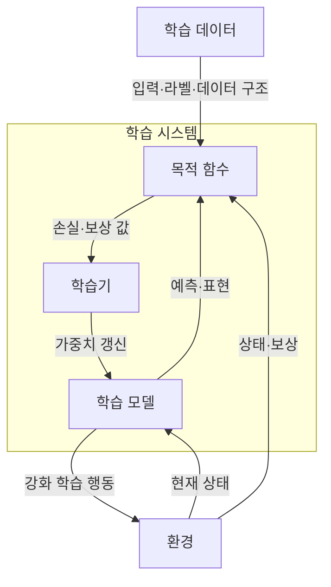
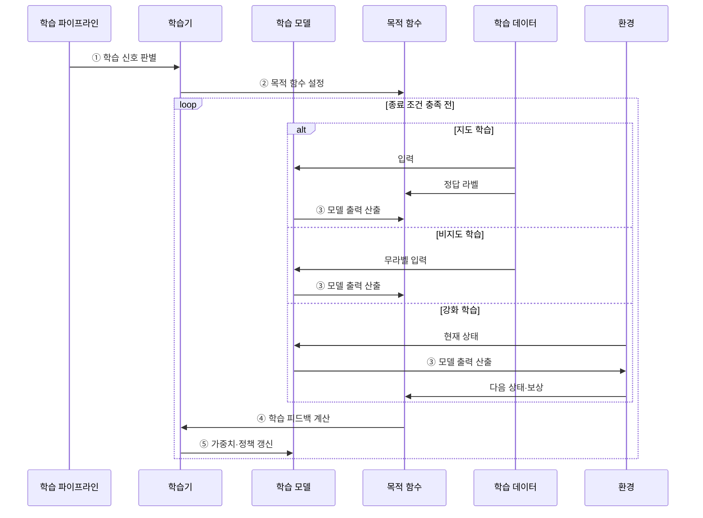

---
sidebar:
  order: 48
  label: "048. 지도 학습·비지도 학습·강화 학습 (Learning Paradigms)"
  badge:
    text: "기출 · 50%"
    variant: note
title: "지도 학습·비지도 학습·강화 학습 (Learning Paradigms)"
date: "2026-07-28T21:27:55+09:00"
tags:
  - "notes-basic-theory"
weight: 48
extra:
  question_no: "048"
  source_status: "기출"
  source_history: "120회"
  priority: 50
  priority_note: "학습 신호 기반 상위 분류와 선택 기준"
---

## 미리 알고가기

- **학습 패러다임(Learning Paradigm)**: 정답 라벨·데이터 구조·환경 보상처럼 학습에 제공되는 신호에 따라 학습 방식을 나눈 상위 분류다
- **학습 신호(Learning Signal)**: 모델의 예측·표현·행동을 어떤 기준으로 갱신할지 알려 주는 라벨·데이터 구조·보상이다
- **지도 학습(Supervised Learning)**: 입력과 정답 라벨의 대응 관계를 학습해 새 입력의 결과를 예측하는 방식
- **비지도 학습(Unsupervised Learning)**: 정답 라벨 없이 데이터 안의 군집이나 표현 같은 잠재 구조를 스스로 찾는 방식
- **강화 학습(Reinforcement Learning)**: 환경에 행동을 해 보고 돌아오는 보상을 근거로 누적 보상이 커지는 행동 정책을 학습하는 방식
- **라벨(Label)**: 지도 학습에서 입력마다 부여하는 정답 범주 또는 목표값이다
- **잠재 구조(Latent Structure)**: 라벨에는 표시되지 않지만 데이터의 군집·분포·표현에 내재한 규칙성이다
- **군집·이상치(Cluster·Outlier)**: 군집은 유사한 표본의 집합이고, 이상치는 다른 표본의 분포에서 벗어난 관측값이다
- **상태·환경·보상(State·Environment·Reward)**: 상태는 현재 상황, 환경은 행동에 따라 다음 상태를 만드는 대상, 보상은 행동 결과를 평가하는 값이다
- **정책(Policy, $\pi$)**: $\pi$는 ‘파이’로 읽으며, 상태별 행동 선택 규칙을 나타내는 강화 학습의 통용 기호이다
- **기대 누적 보상(Expected Cumulative Reward)**: 현재부터 미래까지 받을 보상의 합을 확률적으로 평균한 강화 학습의 목표값이다
- **목적 함수(Objective Function)**: 학습 신호로 모델의 예측·표현·행동 품질을 수치화하는 함수이다
- **학습기(Learner)**: 목적 함수 값에 따라 모델의 가중치 또는 정책을 갱신하는 주체이다
- **목표 우회(Reward Hacking)**: 보상 설계의 빈틈을 파고들어 의도한 목표는 달성하지 않으면서 점수만 높게 받는 행동으로, 강화 학습의 대표 실패다
- **라벨 편향(Label Bias)**: 라벨을 부여한 기준이나 표본 구성의 치우침이 정답 데이터에 반영된 상태이다
- **오프라인 강화 학습(Offline Reinforcement Learning)**: 실제 환경을 새로 탐색하지 않고 미리 수집한 행동 기록만으로 정책을 학습하는 방식이다
- **내부 평가 지표(Internal Evaluation Metric)**: 정답 라벨 없이 군집 응집도·분리도처럼 데이터 자체의 구조로 학습 결과를 평가하는 수치다
- **시뮬레이션(Simulation)**: 실제 환경의 상태 변화와 보상 규칙을 가상으로 모사해 정책 행동을 안전하게 시험하는 환경이다

## Ⅰ. 개요

- 정의/개념: **학습 신호**와 상호작용 방식으로 학습 절차를 구분한 분류
- 기존 한계: **학습 신호**를 구분하지 않으면 목적 함수와 갱신 방식 선택 불가

### 쉽게 이해하기 (학습용)
- 정답지를 보고 답을 맞히는 지도 학습, 카드의 모양만으로 묶는 비지도 학습, 행동 뒤 받은 점수로 다음 선택을 바꾸는 강화 학습처럼 제공되는 신호가 학습 목표와 절차를 결정한다

## Ⅱ. 특징

- **학습 신호**에 따라 목적 함수와 **갱신 대상** 분화
- 데이터·환경과의 **상호작용 방식**에 따라 학습 절차 분화
- 정답 유무와 환경 상호작용에 따른 **피드백 시점** 차이

### 쉽게 이해하기 (학습용)
- 같은 서버 로그라도 장애 유형 라벨이 있으면 분류를 학습하고, 라벨이 없으면 유사한 로그를 묶으며, 조치 결과의 보상이 있으면 누적 보상을 높이는 행동을 학습한다

## Ⅲ. 아키텍처

**도표안 A — 구조도**

**도표안 B — sequenceDiagram**

| 구성요소 | 책임 |
|:---|:---|
| 목적 함수 | 학습 신호로 손실·구조 목적·**기대 누적 보상** 산출 |
| 학습기 | 목적 함수 값에 따라 **가중치**·**정책** 갱신 |
| 학습 모델 | 예측값·데이터 표현·행동 **정책** 산출 |

**동작 원리**

- **① 학습 신호 판별**: 정답 라벨·무라벨 데이터 구조·환경 보상 중 사용할 신호와 상호작용 방식 확인
- **② 목적 함수 설정**: 지도 손실·비지도 구조 목적·강화 학습의 기대 누적 보상에 맞는 최적화 기준 구성
- **③ 모델 출력 산출**: 선택한 패러다임에 따라 모델이 정답 예측·잠재 구조 표현·환경 행동 중 하나를 생성
- **④ 학습 피드백 계산**: 라벨 오차·구조 목적값·보상 결과를 모델 갱신에 사용할 신호로 변환
- **⑤ 가중치·정책 갱신**: 계산한 피드백으로 예측 함수·표현 또는 상태별 행동 정책 개선

### 쉽게 이해하기 (학습용)
- 목적 함수가 라벨·데이터 구조·보상을 점수로 바꾸면, 학습기는 그 점수에 따라 모델의 예측 함수·표현·정책을 갱신한다

## Ⅳ. 종류 및 비교

| 학습 패러다임 | 지도 학습 | 비지도 학습 | 강화 학습 |
|:---|:---|:---|:---|
| 적용 기준 | 입력마다 **정답 라벨**을 확보한 경우 | 라벨 없이 **군집·이상치**를 찾는 경우 | 행동 결과를 **보상**으로 관측하는 경우 |
| 핵심 특징 | 정답 라벨과 **예측 오차**로 모델 갱신 | **잠재 구조** 탐색으로 표현 산출 | 기대 누적 보상으로 **행동 정책** 갱신 |
| 한계 | **라벨 편향**과 잡음의 모델 전파 | 정답 부재로 **학습 품질 검증** 어려움 | 보상 오설계에 따른 **목표 우회** |

> 요약: **학습 신호**가 라벨·구조·보상 중 무엇인지에 따라 학습 방식 선택

### 쉽게 이해하기 (학습용)
- 지도 학습은 라벨 품질, 비지도 학습은 결과 검증, 강화 학습은 보상 설계와 안전한 탐색이 핵심 한계다.

## Ⅴ. 실무 고려사항 및 대책

| 고려사항 | 대책 | 효과 |
|:---|:---|:---|
| 지도 학습의 **집단별 오분류 편중** | 라벨 기준 감사·**집단별 지표**와 표본 보강 | **라벨 편향 전파** 완화 |
| 비지도 결과의 **의미·품질 불명확** | 내부 지표와 **전문가 표본 검토** 병행 | 군집·표현의 **업무 타당성** 확보 |
| 강화 학습의 **목표 우회** | 보상 함수 검증·제약 조건·**행동 감사** 적용 | 의도한 목표와 **정책 행동 정렬** |
| 실제 환경 탐색의 **안전 위험** | 시뮬레이션·**오프라인 학습** 후 제한적 배포 | **실패 비용·운영 영향** 축소 |

### 쉽게 이해하기 (학습용)
- 세 서랍에 정답표·무라벨 기록·행동 보상을 따로 넣듯, 지도는 집단별 오분류, 비지도는 군집 타당성, 강화는 정책 행동을 각기 다른 기준으로 검증한다.

## Ⅵ. 결론

- **라벨** 있으면 지도, **환경 보상** 있으면 강화, 없으면 비지도

### 쉽게 이해하기 (학습용)
- 정답 라벨이 있으면 지도 학습, 환경과 행동 결과의 보상이 있으면 강화 학습, 두 신호가 없으면 데이터 구조를 찾는 비지도 학습을 선택한다
