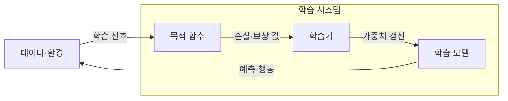

---
sidebar:
  order: 48
  label: "048. 지도 학습·비지도 학습·강화 학습 (Learning Paradigms)"
  badge:
    text: "기출 · 50%"
    variant: note
title: "지도 학습·비지도 학습·강화 학습 (Learning Paradigms)"
date: "2026-07-26T22:16:20+09:00"
tags:
  - "notes-basic-theory"
weight: 48
extra:
  question_no: "048"
  source_status: "기출"
  source_history: "120회"
  priority: 50
  priority_note: "학습 신호 기반 상위 분류와 선택 기준"
---

## 미리 알고가기

- **학습 패러다임(Learning Paradigm)**: 같은 데이터 더미를 앞에 두고도 정답 딱지를 함께 주는지, 아무것도 안 주는지, 잘했다는 점수만 주는지에 따라 배우는 방법이 갈리는데 그 학습 신호의 형태로 학습 방식을 나눈 상위 분류다
- **학습 신호(Learning Signal)**: 모델에게 무엇을 잘한 것으로 볼지 알려 주는 재료로, 정답 라벨·입력 데이터 구조·환경 보상 중 무엇이 주어지느냐가 패러다임을 가른다
- **지도 학습(Supervised Learning)**: 입력과 정답 라벨의 대응 관계를 학습해 새 입력의 결과를 예측하는 방식
- **비지도 학습(Unsupervised Learning)**: 정답 라벨 없이 데이터 안의 군집이나 표현 같은 잠재 구조를 스스로 찾는 방식
- **강화 학습(Reinforcement Learning)**: 환경에 행동을 해 보고 돌아오는 보상을 근거로 누적 보상이 커지는 행동 정책을 학습하는 방식
- **라벨(Label)**: $x$는 ‘엑스’, $y$는 ‘와이’로 읽고 각각 입력과 출력·정답을 나타내는 표기 관례로, 지도 학습에서 입력 $x$에 대응하는 정답 $y$가 라벨이며 사람이 직접 달아야 해서 확보 비용이 든다
- **잠재 구조(Latent Structure)**: 데이터에 정답으로 적혀 있지는 않지만 표본들이 실제로 모여 있는 덩어리나 축 같은 숨은 규칙성으로, 비지도 학습이 찾아내려는 대상이다
- **군집·이상치(Cluster·Outlier)**: 군집은 서로 가까운 표본들이 이루는 덩어리이고 이상치는 어느 덩어리에도 속하지 않고 홀로 떨어진 표본으로, 라벨 없이도 판별할 수 있어 비지도 학습의 대표 산출물이다
- **상태·환경·보상(State·Environment·Reward)**: 상태는 지금 처한 상황, 환경은 행동을 받아 다음 상황과 결과를 만들어 내는 대상, 보상은 그 결과가 얼마나 좋았는지를 숫자로 돌려주는 점수다
- **정책(Policy, $\pi$)**: $\pi$는 그리스 문자 ‘파이’로 읽고 정책(Policy)의 머리글자에 대응시킨 표기 관례로, 어떤 상태에서 어떤 행동을 고를지 정해 둔 강화 학습의 규칙이다
- **기대 누적 보상(Expected Cumulative Reward)**: 지금 한 번의 점수가 아니라 앞으로 받을 보상을 모두 더한 값의 평균으로, 당장 손해라도 나중에 크게 이득인 행동을 고를 수 있게 하는 강화 학습의 목표값이다
- **목적 함수(Objective Function)**: 학습 신호를 받아 지금 모델이 얼마나 잘하고 있는지를 하나의 숫자로 환산하는 함수로, 지도 학습에서는 예측 오차, 강화 학습에서는 기대 누적 보상이 그 숫자다
- **학습기(Learner)**: 목적 함수가 매긴 값을 보고 모델의 가중치를 실제로 고쳐 나가는 갱신 주체
- **목표 우회(Reward Hacking)**: 보상 설계의 빈틈을 파고들어 의도한 목표는 달성하지 않으면서 점수만 높게 받는 행동으로, 강화 학습의 대표 실패다
- **오토스케일링(Autoscaling)**: 부하에 따라 실행 자원을 자동으로 늘리거나 줄이는 운영 방식

## Ⅰ. 개요

- **정의/개념**: **학습 신호** 형태로 학습 방식을 구분한 기계학습 분류
- **기존 한계**: 정답·구조·보상 중 무엇이 있는지 모르면 **학습 목표** 설정 불가

### 쉽게 이해하기 (학습용)
- 답이 달린 문제집을 채점하며 푸는 학생, 답 없이 카드를 비슷한 것끼리 모아 보는 학생, 매번 점수만 통보받고 다음 수를 바꾸는 학생이 나란히 앉은 교실 장면인데, 손에 쥔 것이 정답인지 데이터뿐인지 점수인지가 곧 학습 신호이고 그 신호가 무엇을 목표로 삼을지까지 정해 버린다

## Ⅱ. 특징

- 정답·데이터 구조·**보상**에 따른 지도·비지도·**강화 학습** 구분
- **학습 신호**에 따라 달라지는 목적 함수·**평가 지표**

### 쉽게 이해하기 (학습용)
- 같은 서버 로그 더미라도 장애 유형 딱지를 함께 주면 그 딱지를 맞히는 것이 목표가 되고, 딱지를 떼고 주면 비슷한 로그끼리 묶는 것이 목표가 되며, 조치 뒤 만족도 점수만 주면 다음 조치를 고르는 것이 목표가 되어 채점 방식까지 함께 바뀐다

## Ⅲ. 아키텍처 및 구성요소

| 설계 요소 | 설명 |
|:---|:---|
| 목적 함수 | 학습 신호로 예측 오차·**기대 누적 보상** 산출 |
| 학습기 | 목적 함수 값으로 모델 **가중치 갱신** |
| 학습 모델 | 예측 함수·데이터 표현·**정책** 보유 |

> 요약: **학습 신호**에 따라 목적 함수와 **학습 결과**의 형태 결정

### 쉽게 이해하기 (학습용)
- 바깥에서 들어온 정답이나 보상을 받아 점수를 매기는 채점기가 목적 함수이고, 그 점수를 보며 모델의 손잡이를 돌려 조이는 사람이 학습기이며, 조여진 상태 그대로 다음 입력에 답을 내놓는 것이 학습 모델이다

## Ⅳ. 원리 및 절차 흐름도

- **학습 신호**가 목적 함수를 정해 **가중치 갱신** 방향 결정
- 지도·비지도는 표본 단위 **즉시 오차** 산출
- 강화는 **지연 보상** 누적 후 정책 갱신

### 쉽게 이해하기 (학습용)
- 시험지를 내자마자 빨간 펜으로 틀린 자리가 표시되는 쪽이 지도·비지도의 즉시 오차라면, 강화 학습은 바둑 한 판을 다 두고 나서야 승패를 듣는 쪽이라 어느 수가 좋았는지를 거슬러 되짚어야 정책을 고칠 수 있다

## Ⅴ. 종류 및 비교

| 학습 패러다임 | 지도 학습 | 비지도 학습 | 강화 학습 |
|:---|:---|:---|:---|
| 적용 기준 | 입력마다 **정답 라벨** 확보 가능 | 라벨 없이 **군집·이상치** 파악 필요 | 행동 결과가 **보상**으로 관측 가능 |
| 핵심 특징 | 정답 라벨과 **예측 오차**로 모델 갱신 | **잠재 구조** 탐색으로 표현 산출 | 기대 누적 보상으로 **행동 정책** 갱신 |
| 한계 | 라벨 **편향**과 잡음의 모델 전파 | 정답 부재에 따른 **평가 기준** 미비 | 보상 오설계에 따른 **목표 우회** |

> 요약: **학습 신호**가 라벨·구조·보상 중 무엇인지에 따라 학습 방식 선택

### 쉽게 이해하기 (학습용)
- 정답지 자체가 틀려 있으면 아무리 열심히 풀어도 틀린 답을 외우게 되고, 답이 아예 없으면 잘 묶었는지 확인해 줄 사람이 없으며, 점수 규칙에 빈틈이 있으면 학생이 문제를 푸는 대신 점수만 따는 편법을 찾아내는 것이 세 방식이 각각 무너지는 지점이다

## Ⅵ. 실무 사례

1. 장애 티켓 분류기는 담당자 **라벨**로 **지도 학습**
2. **오토스케일링**은 비용·위반 보상으로 **강화 학습**

### 쉽게 이해하기 (학습용)
- 담당자가 그동안 티켓마다 달아 둔 장애 유형이 그대로 정답지가 되므로, 새 티켓의 문구를 보고 그 유형을 맞히도록 학습시키면 분류기가 선다
- 인스턴스를 몇 대 띄우는 것이 정답인지는 아무도 모르지만 비용이 얼마 들었고 응답 목표를 어겼는지는 사후에 점수로 매길 수 있으므로, 그 점수를 높이는 확장 규칙을 시행착오로 익힌다

## Ⅶ. 결론

- **라벨** 확보 비용과 **보상 설계** 난이도로 패러다임 선택

### 쉽게 이해하기 (학습용)
- 사람 손으로 정답 딱지를 몇만 건 달 수 있으면 지도 학습이 가장 빠르고, 그건 어렵지만 잘한 행동에 점수를 매길 규칙은 짤 수 있으면 강화 학습으로 가며, 둘 다 안 되면 데이터만으로 묶어 보는 비지도부터 시작한다
