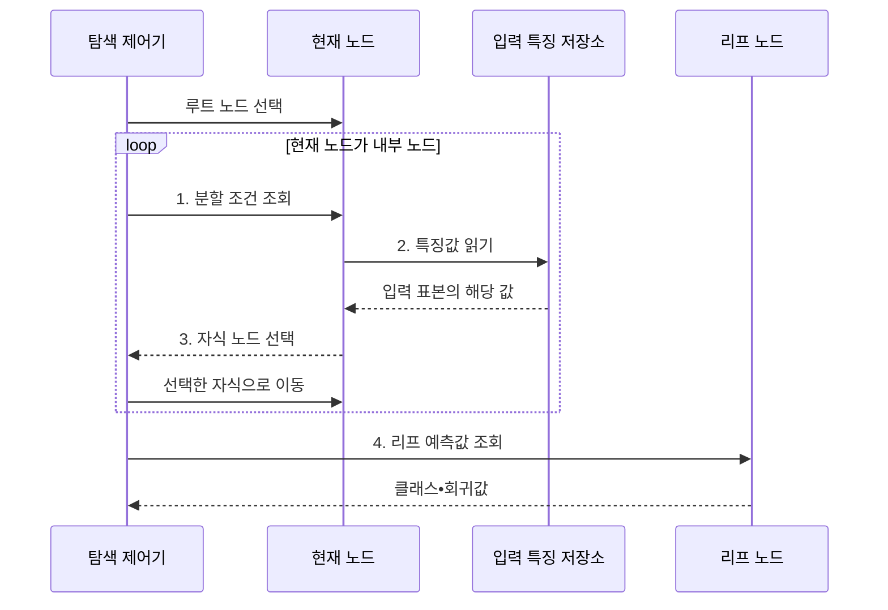

---
sidebar:
  order: 49
  label: "049. 결정 트리 (Decision Tree)"
  badge:
    text: "미출 • 50%"
    variant: note
title: "결정 트리 (Decision Tree)"
date: "2026-07-29T00:00:00+09:00"
tags:
  - "notes-basic-theory"
weight: 49
extra:
  question_no: "049"
  source_status: "미출"
  source_history: ""
  priority: 50
  priority_note: "분할 기준•가지치기•설명성"
---

## 미리 알고가기

- **결정 트리(Decision Tree)**: 특징 조건을 따라 분할해 리프에서 예측하는 모델
- **루트•내부•리프 노드(Root•Internal•Leaf Node)**: 시작점•분할점•최종 예측점
- **불순도(Impurity)**: 한 노드에 서로 다른 클래스가 섞인 정도
- **지니 불순도(Gini Impurity)**: 클래스 비율로 계산한 무작위 오분류 확률
- **엔트로피(Entropy)**: 클래스 분포의 불확실성
- **정보 이득(Information Gain)**: 분할로 감소한 가중 평균 엔트로피
- **가지치기(Pruning)**: 기여가 작은 하위 트리를 제거하는 과적합 완화법
- **정지 조건(Stopping Criterion)**: 노드를 더 분할하지 않는 기준
- **임계값(Threshold)**: 수치형 특징을 두 구간으로 나누기 위해 비교하는 기준값
- **과적합•고분산(Overfitting•High Variance)**: 학습 표본 변화에 예측이 크게 흔들리는 현상
- **평균제곱오차(Mean Squared Error, MSE)**: 실제값과 예측값 차이의 제곱 평균
- **불균형 클래스(Imbalanced Class)**: 클래스별 표본 수가 크게 달라 다수 클래스만 맞혀도 점수가 높게 나오는 데이터 상태
- **이상치(Outlier)**: 다른 관측값에서 크게 벗어난 값으로, 회귀 트리에서는 제곱 오차를 크게 부풀려 분할 위치를 끌어당긴다
- **스케일 변환 불변성(Scale Invariance)**: 값의 순서가 같으면 분할이 유지되는 성질
- **비선형 경계(Nonlinear Boundary)**: 하나의 직선•평면으로 나눌 수 없고 여러 조건이 굽거나 꺾여 결합된 예측 경계
- **재현율(Recall)**: 실제 양성 표본 가운데 모델이 양성으로 올바르게 찾아낸 비율

## Ⅰ. 개요

- 정의/개념: **특징 조건 분할•리프 예측** 모델
- 배경/필요성: **변수 상호작용•비선형 경계** 학습

### 쉽게 이해하기 (학습용)

- 내부 노드가 특징값 조건으로 데이터를 나누고 리프가 예측값을 출력해 분기 경로를 판정 근거로 제공한다.

## Ⅱ. 특징

- **불순도** 감소를 기준으로 한 재귀적 데이터 분할
- 루트부터 리프까지의 **규칙 경로**에 기반한 높은 설명력
- 특징값의 순서만 사용하는 **스케일 변환 불변성**

### 쉽게 이해하기 (학습용)

- 각 노드는 불순도를 가장 많이 줄이는 조건을 선택하며, 값의 순서가 같으면 단위가 바뀌어도 분할이 유지된다.

## Ⅲ. 구조 및 구성요소

| 구성요소 | 책임 |
|:---|:---|
| 루트 노드 | 전체 입력을 포함하는 **최초 분할** 대상 |
| 내부 노드 | 변수•**임계값** 조건으로 재귀 분할 |
| 리프 노드 | 최종 클래스•**회귀값** 저장 |

### 쉽게 이해하기 (학습용)
- 루트가 첫 조건을 적용하고 내부 노드가 분할을 반복하며 리프가 최종 예측값을 보관한다.

## Ⅳ. 흐름도

**동작 원리**

- **1. 분할 조건 조회**: 특징•임계값 확인
- **2. 특징값 읽기**: 입력 표본의 지정 변수 조회
- **3. 자식 노드 선택**: 임계값 비교 기반 이동
- **4. 리프 예측값 조회**: 클래스•회귀값 반환

### 쉽게 이해하기 (학습용)

- 루트에서 시작해 내부 노드의 임계값 조건을 차례로 적용하고, 더 분할하지 않는 리프에서 최종 예측값을 얻는다.

## Ⅴ. 종류 및 비교

| 결정 트리 | 분류 트리 | 회귀 트리 |
|:---|:---|:---|
| 적용 기준 | 목표가 합격•불합격 같은 **범주형 라벨** | 목표가 가격•수량 같은 **연속 수치** |
| 핵심 특징 | **지니 불순도**•엔트로피로 범주 분할 | **MSE** 감소량으로 수치 분할 |
| 한계 | **불균형 클래스**의 다수 쏠림 편향 | **이상치**에 따른 분할 위치 왜곡 |

> 요약: 목표 변수의 형태에 따라 **분할 기준** 결정

### 쉽게 이해하기 (학습용)

- 분류 트리는 지니 불순도나 엔트로피를, 회귀 트리는 MSE 감소량을 기준으로 분할한다.

## Ⅵ. 실무 고려사항 및 대책

| 고려사항 | 대책 | 효과 |
|:---|:---|:---|
| 학습 성능은 높고 **검증 성능은 낮음** | 최대 깊이•최소 표본 제한과 **가지치기** | **과적합•고분산** 완화 |
| 소수 클래스 **재현율 저하** | 클래스 가중치•균형 표본과 **클래스별 지표** 적용 | **다수 클래스 편향** 감소 |
| 회귀 분할이 **이상치에 끌림** | 이상치 검토•**강건한 손실 기준** 적용 | **분할 경계** 안정화 |
| 데이터 변화로 **규칙 경로 변동** | 분할 안정성•**특징 분포 모니터링**과 재학습 | 설명 규칙의 **일관성 관리** |

### 쉽게 이해하기 (학습용)

- 최대 깊이•최소 표본•가지치기로 우연한 장애 패턴이 규칙 경로가 되는 것을 제한한다.

## Ⅶ. 결론

- **성능 격차•규칙 수** 기반 가지치기 결정

### 쉽게 이해하기 (학습용)

- 사람이 검토할 수 있는 규칙 경로를 유지하도록 정지 조건과 가지치기로 트리 복잡도를 통제한다.
